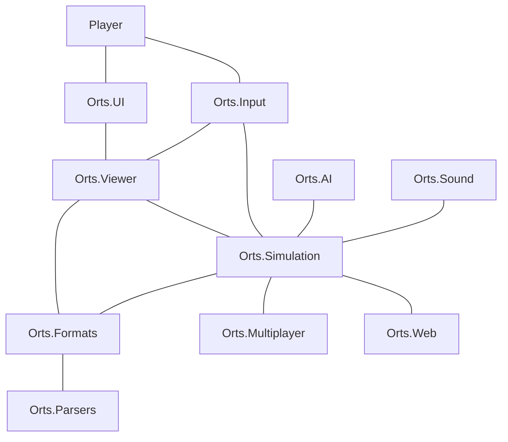

# Open Rails Architecture

This document will describe the overall structure of Open Rails and how we expect different areas of the program to work together.

## Player application model

The player model describes the desired application components used when playing Open Rails (vs. editing) and their relationships.

## Threading model

The threading in Open Rails has two key threads working together (Render and Updater) to simulate and render the world, with a number of auxiliary threads for other functions.

- Render process [main thread]
  - Read user input
  - Swap next/current frames
  - Resume Updater
  - Render current frame
  - Wait until Updater is finished
- Updater process
  - Suspended until restarted by Render
  - Every 250ms if Loader is suspended: check for anything to load and resume Loader
  - Run simulation
  - Prepare next frame for rendering
- Loader process
  - Suspended until restarted by Updater
  - Load content for simulation and rendering
- Sound process
  - Wait 50ms
  - Update all sound outputs (volumes, 3D position, etc.)
- Watchdog process
  - Every 1s: checks above processes are making forward progress
  - If a process stops responding for more than 10s (60s for Loader), the whole application is terminated with an error containing the hung process' stack trace
- Web Server process
  - Handle all web and API requests

## Projects, assemblies, namespaces

Open Rails is made up of several component projects which are organised into subdirectories with the following naming pattern:

- `Orts.Component\Orts.Component.csproj` (project file)
- `Orts.Component.dll` (assembly name)
- `Orts.Component` (default namespace)

The namespaces used within code files should match the directory structure like this:

| *Filename* | *Namespace*
|---|---|
| `Orts.Component\File.cs` | `Orts.Component` |
| `Orts.Component\Section\File.cs` | `Orts.Component.Section` |
| `Orts.Component\Section\Subsection\File.cs` | `Orts.Component.Section.Subsection` |

## Simulator object relationships

This tree is a summary of the important object relationships (aggregation) inside the simulation. Each entry is a class whose instances can be accessed from the parent item.

- `Simulator`
  - `Activity`
  - `LevelCrossings`
  - `Signals`
  - `Train` (collection)
    - `TrainCar` (collection)
      - **Physics simulation**
      - `BrakeSystem`
      - `IPowerSupply` (interface)
      - `WheelAxle` (collection)
      - (child `MSTSWagon`) `MSTSCoupling`
      - (child `MSTSLocomotive`) `ScriptedBrakeController`
      - (child `MSTSLocomotive`) `ScriptedTrainControlSystem`
      - (child `MSTSDieselLocomotive`) `DieselEngines`
      - **Visual simulation**
      - `FreightAnimations`
      - `PassengerViewPoint` (collection)
      - `TrainCarPart` (collection)
      - `ViewPoint` (collection)
      - (child `MSTSWagon`) `IntakePoint` (collection)
      - (child `MSTSWagon`) `ParticleEmitterData` (collection)
      - (child `MSTSLocomotive`) `CabView` (collection)
      - (child `MSTSLocomotive`) `CabView3D`
  - `UserSettings`
  - `Weather`

## Simulator class relationships

This tree is a summary of the important class relationships (inheritance) inside the simulation. Each top-level entry is a separate hierarchy of classes.

- `BrakeSystem` (abstract)
  - `MSTSBrakeSystem` (abstract)
    - `AirSinglePipe`
      - `AirTwinPipe`
        - `EPBrakeSystem`
        - `SMEBrakeSystem`
      - `SingleTransferPipe`
    - `ManualBraking`
    - `VacuumSinglePipe`
      - `StraightVacuumSinglePipe`
- `IPowerSupply` (interface)
  - `ILocomotivePowerSupply` (interface)
    - `ScriptedLocomotivePowerSupply` (abstract)
      - `ScriptedControlCarPowerSupply`
      - `ScriptedDieselPowerSupply`
      - `ScriptedDualModePowerSupply`
      - `ScriptedElectricPowerSupply`
    - `SteamPowerSupply`
  - `IPassengerCarPowerSupply` (interface)
    - `ScriptedPassengerCarPowerSupply`
- `Train`
  - `AITrain`
    - `TTTrain`
- `TrainCar` (abstract)
  - `MSTSWagon`
    - `MSTSLocomotive`
      - `MSTSControlTrailerCar`
      - `MSTSDieselLocomotive`
      - `MSTSElectricLocomotive`
      - `MSTSSteamLocomotive`
