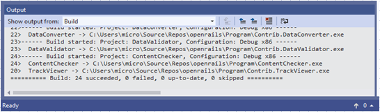
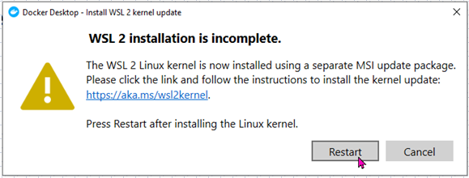
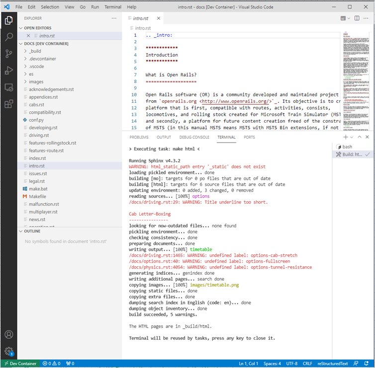

# Building Open Rails

This document (Feb 2022) will take you through the steps needed to build Open Rails from the source code and to run and start debugging it.

## Overview

To work with the code, you will need an installation of Microsoft Visual Studio and also content that is standalone (doesn't rely on sharing files from 3rd parties). 

Visual Studio provides the Git tools to clone the Open Rails repository and submit your changes as a pull request.

Any new features will also require matching changes to the Open Rails Manual, so a Docker container is provided that works with Visual Studio Code to build the manual in either HTML or PDF.

## Windows

64-bit Windows from version 7 with Service Pack 1 upwards. Open Rails can also be developed on a virtual machine. If you want to use 32-bit Windows, then Visual Studio Code will not be available to you for editing the manual, so please ask for help on [the Elvas Tower forum]([http://www.elvastower.com/forums/).

## Visual Studio

Download and install Visual Studio 2019 Community Edition from Microsoft. 
(Other editions will work but this one is free. Version 2022 will also work, but this is reported as significantly slower. Version 2017 is not recommended as in Feb 2022 we are moving towards .Net 5 which is incompatible.)
&nbsp;

### VS Installation

The only "workload" needed is .NET desktop development. Some optional tools which may be useful are also checked.
&nbsp;

You don't have to create an Microsoft account for 2019, but there is little downside.
&nbsp;

### Open Rails Repository

You will be prompted to "Get started" and should "Clone a repository" from 
[https://github.com/openrails/openrails.git](https://github.com/openrails/openrails.git)  
&nbsp;

On completion, the Solution Explorer view will list the solution ORTS.sln. 

Pick it to receive a prompt:

The purpose of the Launcher project is to check whether the user's PC has the software libraries installed to run Open Rails. It uses libraries which are installed on even old PCs, so that it can run on them without error and report any problems.

However the framework needed to build that project is not installed automatically, so choose the option highlighted by the cursor in the image above.  
&nbsp;

Finally we get to see a list of the projects in the Open Rails solution.

Note: There is no project called OpenRails. Instead, the Launcher project builds an executable called OpenRails.exe.

## Compiling

Use *Build > Rebuild Solution* to compile and link the source code into executable and DLL files.
&nbsp;

Initially, your local repository contrains an empty folder Programs. The executable files just created are saved in this folder.

## Executing

At this point you can switch to the Windows File Explorer or the command line and run OpenRails.exe. This will carry out some checks and then run Menu.exe.
&nbsp;

When debugging, it will be easier to start the program from within Visual Studio. First, set the desired project to be the Startup Project which will run when you press *Debug > Start Debugging*.
&nbsp;

Now pressing F5, Start or *Debug > Start Debugging* will launch the project Menu.exe in debugging mode.

## Content

Without content, all you can run is Menu.exe (or OpenRails.exe which runs Menu.exe) and some of the contributed tools.

The easiest content to install is [Demo Model 1](http://openrails.org/download/content/).
Another recommendation is the [test track from Coals To Newcastle](9https://www.coalstonewcastle.com.au/physics/route/) as its small size makes it quick to load and it is designed for testing.
&nbsp;

Unzip into a new folder.
&nbsp;

Using Open Rails Menu.exe and *Options > Content > Add*, add the folder "Demo Model 1" to the list of installation profiles.
&nbsp;

Select Demo model 1 as the Installation profile.
&nbsp;

Pressing Start will run the simulation program RunActivity.exe. You can also run this from the command line by providing appropriate arguments. If you hold down the Alt key while pressing the Start button, these arguments are copied into the Windows paste buffer.
&nbsp;

From Visual Studio, using *Project > Properties > Debug > Command line arguments*, these arguments can be pasted into the RunActivity project. If this is the set to be the Startup Project for the solution, pressing F5 will launch RunActivity.exe on the selected activity with debugging in place.
&nbsp;

## Installing Tools for Open Rails Manual

The Open Rails manual is written in [ReStructuredText](https://docutils.sourceforge.io/rst.html) which is processed into a [multi-page HTML document](https://open-rails.readthedocs.io/en/latest/) or a  [single-page PDF document](http://openrails.org/files/OpenRails-Testing-Manual.pdfvmw).

Note: This section is based on this [Pull Request](https://github.com/openrails/openrails/pull/557).
There are several components to  install but, after that, producing a revised manual is just a click away.

### Install Visual Studio Code

This interactive development environment (IDE) is not related to the Visual Studio IDE. 

### Download and install Visual Code

Download from [Download Visual Studio Code - Mac, Linux, Windows](https://code.visualstudio.com/download) and run the installer.

### Add Extension - Remote Containers

Use the icon to add a new extension.
&nbsp;

Search for the extension "Remote Containers".
&nbsp;

And install it into Visual Studio Code.

### Download and install Docker Desktop

Download from [https://docs.docker.com/desktop/windows/install/](https://docs.docker.com/desktop/windows/install/) and run the installer.

Docker provides a closed environment so that our script to build the manual can be run knowing that it will not be broken by any subsequent changes on the PC.
&nbsp;

Use the default settings.
&nbsp;

Installation takes a few minutes.

You will be prompted to close and restart your PC.
&nbsp;

You may receive a prompt to install WSL 2 separately. Click the link to the website.

The link takes you to Step 3 and 4.
&nbsp;

Run PowerShell as Administrator.
&nbsp;

Enter the command provided.
&nbsp;

Return to the webpage for Step 4 and download WSL 2 and install it. 
&nbsp;

Once this is installed, return to the Docker Desktop prompt and press Restart.
&nbsp;

This re-starts Docker Desktop, not your PC.

Now that Docker Desktop is running, start Visual Studio Code.

Note: Before using Visual Studio Code to edit the manual, you should always start Docker Desktop first.
&nbsp;

Press F1 to find the command list and search for Remote Containers: Open Folder in Container...
&nbsp;

Using Windows File Explorer, search your repository for Source\Documentation\Manual
&nbsp;

All the manual files will be listed. 
&nbsp;

To build the manual, enter a command in the Terminal pane of Visual Studio Code. The default command is _make html_ which builds the file Source\Documentation\Manual\\_build\html\index.html
&nbsp;

There is a shortcut for this command: Ctrl+Shift+B.
&nbsp;

The PDF at Source\Documentation\Manual\_build\latex\Manual.pdf can be built with the command: _make latexpdf_ 

## Git and Contributing to Open Rails

Open Rails uses Git for source code control. In addition to using Git from the command line, there are many programs that provide a graphical front-end. 

Visual Studio 2019 includes facilities for working with Git, see [https://docs.microsoft.com/en-gb/visualstudio/version-control/?view=vs-2019](https://docs.microsoft.com/en-gb/visualstudio/version-control/?view=vs-2019)

For guidance on contributing, see [https://github.com/openrails/openrails/blob/master/Docs/Contributing.md](https://github.com/openrails/openrails/blob/master/Docs/Contributing.md)
