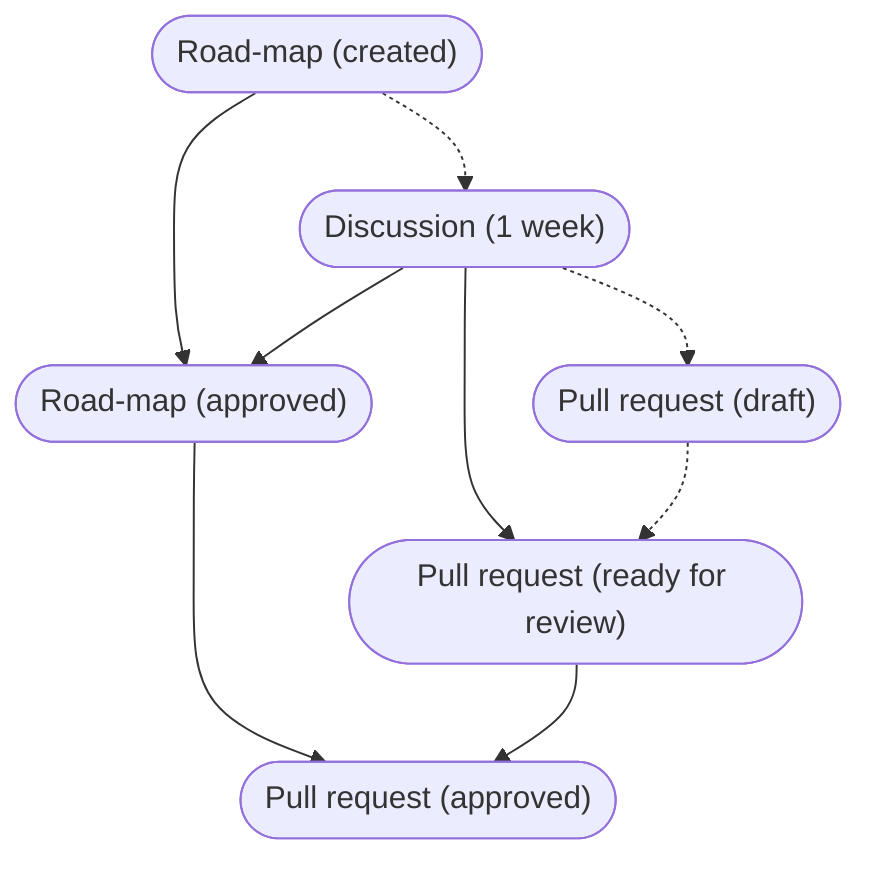

# Contributing to Open Rails

This document will introduce you to a number of ways you can contribute to Open Rails and how we expect the process to go - from your side and our side.

## Discussion

Please see the [Community](http://openrails.org/share/community/) page on our website for details of the forums where Open Rails discussion happens.

## Reporting a bug

If you've found a bug in Open Rails, please report it in [our bug tracker on Launchpad](https://bugs.launchpad.net/or).

## Suggesting a feature

If you've got a feature suggestion for Open Rails, please report it in [our road-map on Trello](https://trello.com/b/DS2h3Pxc/open-rails-roadmap).

## Making changes

You are free to make any modifications to the Open Rails code that you like; that's how open source works. However, if you'd like your feature to be included in the official version, there is a process to ensure that the community agrees and to review the code for potential issues prior to inclusion.

In most cases, you can get started immediately with making the changes and creating a pull request. We have _additional requirements_ for some bugs and all new features, but they can come before or after the pull request is created. Please feel free to share ideas and proposals as pull requests!

**Note:** You must fork the Open Rails repository before you start working on it. We do not allow you to push branches to the official repository.

**Note:** You should do your work on separate branches; they must be created from the "master" branch and pull requests must merge back into the "master" branch, unless we direct you otherwise.

### Documentation and translations

If you'd like to improve the [documentation](./), [manual](../Source/Documentation/Manual), or [translations](../Source/Locales) you can get started immediately.

There are no additional requirements for the pull request.

### Contributed projects

If you'd like to improve the [contributed projects](../Source/Contrib) you can get started immediately.

There are no additional requirements for the pull request.

### Refactoring process

If you'd like to refactor the existing code you can get started immediately, but please have a look at our [architecture requirements](#architecture-requirements). We welcome architectural discussions on our [forum](http://www.elvastower.com/forums/index.php?/forum/256-developing-features/).

There are no additional requirements for the pull request.

### Bug process

If you'd like to fix a bug you can get started immediately. If the fix turns out to be very small, you do not even need a bug report. Otherwise, you will need to make sure it has been reported on [our bug tracker on Launchpad](https://bugs.launchpad.net/or). If it has not, you can report the bug _and_ fix it!

There are no additional requirements for _creating_ the pull request.

These things must be done in the required order:

1. If the changes adds or removes more than 10 lines each, a bug report must be linked in the description before it can be approved

### Feature process

If you'd like to add a feature you can get started immediately. However, we would prefer you to to do some things first. These will ensure that people are aware you are working on a particular feature and give the community some time to resolve any potential issues.

The following diagram shows the required order (solid lines) and recommended order (dashed lines):

All new features must result in the following three things existing:

1. A road-map card in [Trello](https://trello.com/b/DS2h3Pxc/open-rails-roadmap)
2. A forum discussion in [Elvas Tower](http://www.elvastower.com/forums/index.php?/forum/299-open-rails-development-testing-and-support/) more than one week old with all issues resolved
3. A pull request

These things must be done in the required order:

1. The road-map card cannot be approved without the completed discussion
2. The pull request cannot be ready for review without the completed discussion
3. The pull request cannot be approved without the approved road-map card

Our recommended order is:

1. Create road-map card
2. Create forum discussion
3. Create draft pull request
4. When discussion is completed, pull request can be ready for review
5. When road-map card is approved, pull request can be approved (if code review is okay)

**Note:** A blueprint can be used by a seasoned Open Rails developer in place of a road-map card.

### Choosing what to work on

If you do not know what to work on, you can find bugs and features we are interested in fixed/adding here:

- [Confirmed bugs](https://bugs.launchpad.net/or/+bugs?orderby=-importance&field.status%3Alist=TRIAGED)
- [Accepted feature requests (anything in an N.M or N.x list)](https://trello.com/b/DS2h3Pxc/open-rails-roadmap)

If multiple things are interesting to you, we would prefer that you choose the item with the highest priority to us - a higher importance or heat in Launchpad bugs and lowest version number in Trello cards.

If you're unsure what you could contribute to in the code, and nothing looks interesting in the _confirmed bugs_ and _accepted feature requests_, please get in touch on the [Elvas Tower forums](http://www.elvastower.com/forums/index.php?/forum/299-open-rails-development-testing-and-support/), giving us some idea of your experience and interests, and we'll do our best to find something for you.

### General requirements

All of the main Open Rails code is C# and your contribution is expected to also be in C#. We're currently using [version 7.3 of C#](https://docs.microsoft.com/en-us/dotnet/csharp/whats-new/csharp-7-3), so please take advantage of these features.

Code is expected to follow the [Framework Design Guidelines](https://docs.microsoft.com/en-us/dotnet/standard/design-guidelines/) throughout, especially the [Naming Guidelines](https://docs.microsoft.com/en-us/dotnet/standard/design-guidelines/naming-guidelines), with few exceptions:

- Structures, fields, and enums defining file format components may be named exactly as in the file format
- Public and protected fields are allowed, although care must be taken with public fields

Code style (placement of braces, etc.) is expected to follow the default Visual Studio rules; the [C# Coding Conventions](https://docs.microsoft.com/en-us/dotnet/csharp/programming-guide/inside-a-program/coding-conventions) provides a good basis for many aspects of this.

### Architecture requirements

Code should be well structured, with small methods performing a single key task (indicated by their name), and larger complex operations formed through calls to multiple smaller methods.

Code architecture, especially for new features, should be consistent with the [Open Rails Architecture](Architecture.md).

### Physics requirements

All fields, parameters and local variables containing real world measurements (e.g. length, area) must have the unit as a suffix. Measurements must be in [SI units](https://en.wikipedia.org/wiki/International_System_of_Units) unless you have an exception granted by the Open Rails Management Team.

All physical formula used must be documented to identify the source of the formula, and ideally a one-line summary of what it does/is for.

All fixed values used in formula must be placed in a constant, with a name and unit suffix, for readability.

### Multi-threading requirements

Open Rails is a multi-threaded application, which presents some additional complexity. There are four key threads to be aware of:

- Loader
- Updater
- Render
- Sound

Data that is operated only on one thread for its lifetime does not need special attention. However, any data that is operated on by multiple threads - even if only one thread is writing - needs special care and attention.

For each object stored in a field or property that is accessed from multiple threads, the root, you must:

- Never modify the contents of the objects within the root (such as adding or removing items from a List<T>)
- Always copy the root object into a local variable before doing anything else with it
- Update the root object by (as above) copying into a local, cloning/making a new version from the old version, and finally storing into the root
- If multiple threads can update the root, the final store into root must be done using an interlocked compare-and-exchange with a loop in case of failure

If you are in any doubt about the use of data by multiple threads, or your implementation of the above rules, please ask in the [Elvas Tower](http://www.elvastower.com/) forums.

### Getting your code accepted

Your code should be fixing exactly one bug or adding a single new feature; mixing multiple bug fixes or new features makes it harder to review your changes and risks them not being accepted.

### Different versions of code

When your pull request is draft or ready for review, it will not be included in any version of Open Rails unless:

- You are a member of the core team
- A member of the core team adds a particular label

If your pull request satisfies the above criteria, it will be automatically included in the Unstable Version (unless there are merge conflicts).

After your pull request is merged, it will be included in the Testing Version and Unstable Version.

When we start preparing for a new Stable Version, all code in the Testing Version is used, but no further changes are included during the preparation time (typically 1 month).

### Submitting your code

When you're done writing code, you should make a pull request on GitHub from your fork's branch back to the official repository's "master" branch. The title and description of the requests should concisely indicate what bug or feature you've implemented and you will need to include links to whichever of the following are appropriate:

- Bug report
- Road-map card
- Blueprint

## How bugs and features are accepted

### Bug reports

A member of [our developer team](https://launchpad.net/~ordevs/+members) will mark the bug as "Triaged" once they have confirmed that the problem is real and needs fixing.

### Road-map cards

We require that a [forum thread is created](http://www.elvastower.com/forums/index.php?/forum/256-developing-features/) with each feature request, so that the community may discuss it and flag up any potential issues. We typically allow at least a week for discussion and identification of any issues.

A member of [our management team](https://launchpad.net/~orsupervisors/+members) will read the request and follow the forum discussion being had by the community, classify it by type (using labels), and place it into an appropriate list in Trello. In the rare event that we do not agree with the feature being added to Open Rails, it will be placed in the "Not planned at this time" list and a comment added explaining why.

### Blueprints

We require that a [forum thread is created](http://www.elvastower.com/forums/index.php?/forum/256-developing-features/) with each feature request, so that the community may discuss it and flag up any potential issues. We typically allow at least a week for discussion and identification of any issues.

A member of [our management team](https://launchpad.net/~orsupervisors/+members) will read the request and follow the forum discussion being had by the community, and approve its direction if appropriate.

## Reviewing pull requests

If you are reviewing someone else's code for Open Rails, you will need to ensure that they have met the above "Making changes" guidelines as best as possible. This will necessitate, at minimum:

- Check for linked bug report or feature request
- Check bug report is triaged, and feature request is approved
  - For a bug report, it should have status "Triaged"
  - For a road-map card, it should be in an N.M or N.x list
  - For a blueprint, it should have direction "Approved"
- Read through all of the changes to the code
- Check that all new code follows the requirements:
  - General (including naming)
  - Architecture
  - Physics
  - Multi-threading
- Be sure that all of the changes are necessary
- Be sure that no changes are missing
- Be on the lookout for data being access across threads

### Leeway when reviewing

Although we'd like all code written to exactly match the guidelines given in this document, that is not practical - not least because nobody is likely able to remember every single detail of the guidelines at any one time, whether writing or reviewing code. Therefore, there is always going to be some leeway between the guidelines and what is accepted into Open Rails.

You should take extra care when reviewing first-time and new contributors, to ensure that we accept their contribution even when it does not strictly conform to the guidelines, as this will encourage them to continue contributing.

For all contributions that deviate from the guidelines, there are a few approaches you can take:

- Politely and constructively suggest changes on the pull request (if possible, include the desired code)
- Make the changes yourself (GitHub provides instructions to push changes to other people's pull requests)
- Accept the code as-is, leaving a note for how to improve for the next pull request

It is expected that most contributors will quickly correct their code based on feedback, either in the same pull request or subsequent ones, depending on the path taken above. However, if a contributor continues to not meet the same part of the guidelines, you are free to become more strict with them - it's still helpful to suggest the corrected code, but do not feel obliged to spend time helping the same person with the same part of the guidelines repeatedly.
