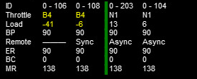
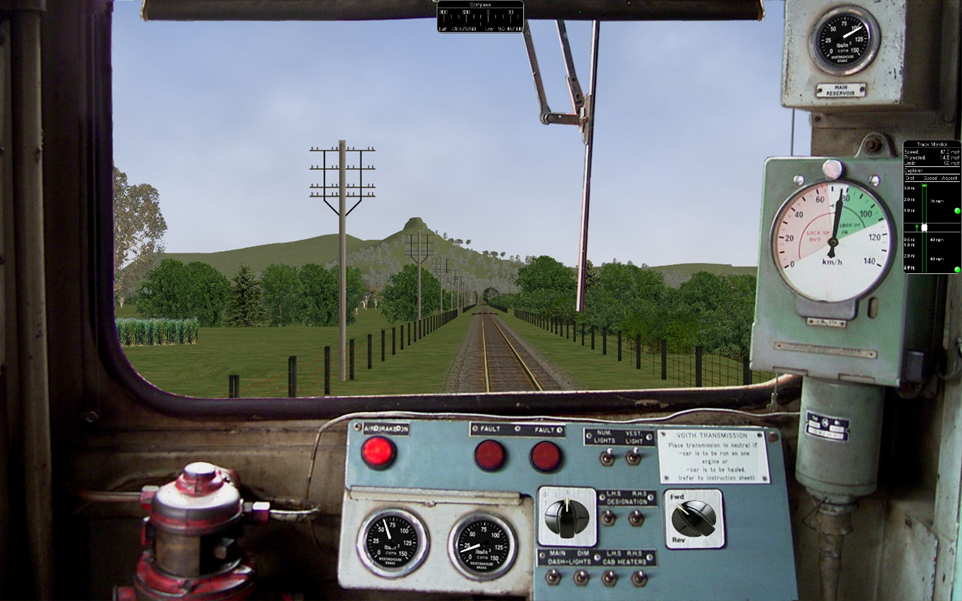
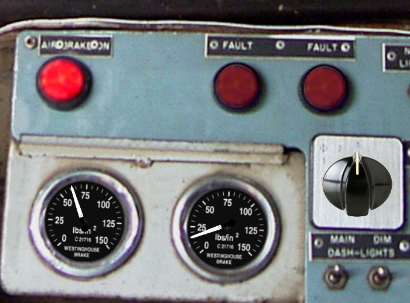
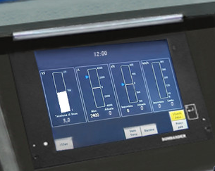
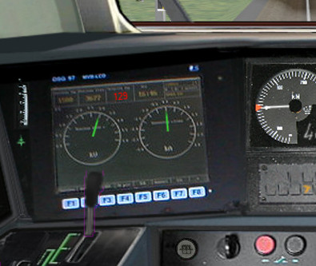
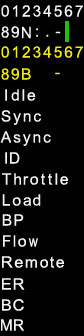

.. _cabs:

***************
Open Rails Cabs
***************

OR supports both MSTS-compatible 2D cabs as well as native 3D cabs, even on 
the same locomotive.

For a full list of parameters, see :ref:`Developing OR Content - Parameters and Tokens<parameters_and_tokens>`

2D Cabs
=======

OR supports with a high degree of compatibility all functions available in 
MSTS for 2D cabs, and provides some significant enhancements described in the 
next paragraphs.

ETCS circular speed gauge
-------------------------

A circular speed gauge accordingly to the standard European Train Control System 
(ETCS) can be added to the cabview. The information displayed in the Driver 
Machine Interface (DMI) is controlled via the TCS script. For more details,
see :ref:`C# engine scripting - Train Control System <features-scripting-tcs>`.

.. image:: images/options-etcs.png
   :scale: 60 %
   :align: center

The gauge is added by the insertion of a block like the following
into the .cvf file::

    Digital (
        Type ( SPEEDOMETER DIGITAL )
        Style ( NEEDLE )
        Position ( 160 255 56 56 )
        ScaleRange ( 0 250 )
        Units ( KM_PER_HOUR )
    )

It is also possible to display the full ETCS display using the following block
instead::

    ScreenDisplay (
        Type ( ORTS_ETCS SCREEN_DISPLAY )
        Graphic ( statictexture.ace ) Comment( 3D cab only, mandatory there )
        Position ( 280 272 320 240 )  Comment( 2D cab only )
        Units ( KM_PER_HOUR )
        Parameters (
            Mode FullSize
            MaxSpeed 180
            DisplayUnits 0
        )
    )

The following commonly used ``MaxSpeed`` or ``ScaleRange`` values can be set
* 140, 150, 180, 240, 250, 260, 280, 400 for ``KM_PER_HOUR`` unit
* 87, 111, 155, 248 for ``MILES_PER_HOUR`` unit
The default value is 400 with KM_PER_HOUR unit.

The following DMI size variants are available: 
``FullSize`` displays the whole DMI, 
``SpeedArea`` displays only the left part with information about distance and speed, 
``PlanningArea`` displays only the right side planning area and navigation buttons. 
The default value is FullSize

Use the ``MaxVisibleSpeed`` to set the highest speed displayed as a number, 
if literal numbering is undesirable above this number on the circular speed gauge. 
The default value is the MaxSpeed rounded to the highest tens below.

Use the ``DisplayUnits`` parameter to suppress diplaying the speed unit at the 
bottom of the circular speed gauge. The default is 1, displaying the units.

Use the ``Graphic`` parameter in 3D cabs to designate the static texture inside 
the .s file that will be replaced at runtime with the dynamic picture of the 
display. This parameter is mandatory. If omitted, or the named texture cannot 
be found in the model, no display will be shown.

.. _cabs-battery-switch:

Battery switch
--------------

.. index::
   single: ORTS_BATTERY_SWITCH_COMMAND_SWITCH
   single: ORTS_BATTERY_SWITCH_COMMAND_BUTTON_CLOSE
   single: ORTS_BATTERY_SWITCH_ON

The :ref:`battery switch <physics-battery-switch>` controls the low voltage power supply of the locomotive.

The following controls are available for the cabview:

- ``ORTS_BATTERY_SWITCH_COMMAND_SWITCH`` can be used if the switch is directly controlled from the cab
- ``ORTS_BATTERY_SWITCH_COMMAND_BUTTON_CLOSE`` and ``ORTS_BATTERY_SWITCH_COMMAND_BUTTON_OPEN`` can be used if the switch is controlled with two pushbuttons (one to close the switch and the other to open it)
- ``ORTS_BATTERY_SWITCH_ON`` can be used to control a light on the cab showing the state of the battery switch

Other controls can be disabled if the low voltage power supply is not available using the following parameter::

      TwoState (
         Type ( ORTS_CIRCUIT_BREAKER_CLOSED TWO_STATE )
         ...
         DisabledIfLowVoltagePowerSupplyOff ( 1 )
      )

By default, the cabview control will be completely hidden. You can also set a specific value for the control when it is disabled::

      TwoState (
         Type ( SPEEDOMETER DIAL )
         ...
         DisabledIfLowVoltagePowerSupplyOff ( 1 )
         HideIfDisabled ( 0 )
         ValueIfDisabled ( 0 )
      )

.. _cabs-master-key:

Master key
----------

.. index::
   single: ORTS_MASTER_KEY
   single: ORTS_CURRENT_CAB_IN_USE
   single: ORTS_OTHER_CAB_IN_USE

The :ref:`master key <physics-master-key>` controls the power supply of the cab.

The following controls are available for the cabview:

- ``ORTS_MASTER_KEY`` can be used in order to control the master key
- ``ORTS_CURRENT_CAB_IN_USE`` can be used to indicate that the current cab is active
- ``ORTS_OTHER_CAB_IN_USE`` can be used to indicate that another cab of the train is active

Other controls can be disabled if the cab power supply is not available using the following parameter::

      TwoState (
         Type ( ORTS_CIRCUIT_BREAKER_CLOSED TWO_STATE )
         ...
         DisabledIfCabPowerSupplyOff ( 1 )
      )

By default, the cabview control will be completely hidden. You can also set a specific value for the control when it is disabled::

      TwoState (
         Type ( SPEEDOMETER DIAL )
         ...
         DisabledIfCabPowerSupplyOff ( 1 )
         HideIfDisabled ( 0 )
         ValueIfDisabled ( 0 )
      )

.. _cabs-service-retention:

Service retention
-----------------

.. index::
   single: ORTS_SERVICE_RETENTION_BUTTON
   single: ORTS_SERVICE_RETENTION_CANCELLATION_BUTTON

The :ref:`service retention <physics-service-retention>` can be used to disable a cab without cutting the power on the train.
It can only be used with a power supply script that uses this functionality.

The following controls are available for the cabview:

- ``ORTS_SERVICE_RETENTION_BUTTON`` can be used in order to enable the service retention
- ``ORTS_SERVICE_RETENTION_CANCELLATION_BUTTON`` can be used in order to cancel the service retention

.. _cabs-electric-train-supply:

Electric train supply
---------------------

.. index::
   single: ORTS_ELECTRIC_TRAIN_SUPPLY_COMMAND_SWITCH
   single: ORTS_ELECTRIC_TRAIN_SUPPLY_ON

The :ref:`electric train supply <physics-electric-train-supply>` controls the power line that supplies the passenger cars with electricity.

The following controls are available for the cabview:

- ``ORTS_ELECTRIC_TRAIN_SUPPLY_COMMAND_SWITCH`` can be used to control the electric train supply switch
- ``ORTS_ELECTRIC_TRAIN_SUPPLY_ON`` can be used to indicate that the electric train supply line is powered on

.. _cabs-dieselenginesonoff:

Controls to switch on and off diesel engines
--------------------------------------------

The keyboard keys to switch on and off diesel engines are following ones:

  - Ctrl+Y switches on and off the first diesel engine of the player locomotive 
  - Shift+Y switches on and off the other diesel engines of the player locomotive, plus all diesel engines of the further locomotives in the train, if they are MUed, (that is under control of the player locomotive) which is the default.

  
Following cabview controls are available:

.. index::
   single: ORTS_PLAYER_DIESEL_ENGINE

ORTS_PLAYER_DIESEL_ENGINE: the first frame is displayed when the diesel engine 
of the player locomotive is in states stopped or stopping, while the second 
frame is displayed when it is in states running or started. The control may 
be used with the mouse and starts/stops the (first) diesel engine of the 
player locomotive, and is useful when a single two state lever is used to start/stop 
the engine.

Example::

                TwoState (
                        Type ( ORTS_PLAYER_DIESEL_ENGINE TWO_STATE)
                        Position ( 150 446 27 26 )
                        Graphic ( graphic1.ace )
                        NumFrames ( 2 2 1 )
                        Style ( ONOFF )
                        MouseControl ( 1 )
                )

.. index::
   single: ORTS_HELPERS_DIESEL_ENGINES

ORTS_HELPERS_DIESEL_ENGINES: the first frame is displayed when further diesel 
engines of the player locomotive and/or the diesel engines of the helper 
locomotives are in states stopped or stopping, while the second frame is 
displayed when they are in states running or started. The control may be used 
with the mouse and starts/stops further diesel engines of the player locomotive 
and the diesel engines of the helper locomotives, and is useful when a two 
state button or lever is used. Note therefore that this command can be used 
also for player locomotives with more than one engine.

Example::

                TwoState (
                        Type ( ORTS_HELPERS_DIESEL_ENGINES TWO_STATE)
                        Position ( 190 446 27 26 )
                        Graphic ( graphics2.ace )
                        NumFrames ( 2 2 1 )
                        Style ( ONOFF )
                        MouseControl ( 1 )
                )

.. index::
   single: ORTS_PLAYER_DIESEL_ENGINE_STATE

ORTS_PLAYER_DIESEL_ENGINE_STATE: this control respectively selects frames 0, 
1, 2, 3 for the player locomotive engine states Stopped, Starting, Running and 
Stopping. It is a display-only control.

Example::

                MultiState (
                        Type ( ORTS_PLAYER_DIESEL_ENGINE_STATE TRI_STATE)
                        Position ( 270 446 39 40 )
                        Graphic ( cd_363_zberace.ace )
                        NumFrames ( 4 4 1 )
                        Style ( NONE )
                        MouseControl ( 1 )
                        Orientation ( 0 )
                        DirIncrease ( 1 )
                )

.. index::
   single: ORTS_PLAYER_DIESEL_ENGINE_STARTER

ORTS_PLAYER_DIESEL_ENGINE_STARTER: it displays the second frame when the 
player diesel engine is in starting status, and the first one in all other 
cases. It may be used with the mouse and it can only start the engine, 
therefore it is useful in conjunction with ORTS_PLAYER_DIESEL_ENGINE_STOPPER 
when starting and stopping the engine is done with separate commands 
(e.g. 2 buttons).

Example::

                TwoState (
                        Type ( ORTS_PLAYER_DIESEL_ENGINE_STARTER TWO_STATE)
                        Position ( 310 446 27 26 )
                        Graphic ( graphics3.ace )
                        NumFrames ( 2 2 1 )
                        Style ( PRESSED )
                        MouseControl ( 1 )
                )

.. index::
   single: ORTS_PLAYER_DIESEL_ENGINE_STOPPER

ORTS_PLAYER_DIESEL_ENGINE_STOPPER: it displays the second frame when the 
player diesel engine is in stopping status, and the second one in all other 
cases. It may be used with the mouse and it can only stop the engine, 
therefore it is useful when starting and stopping the engine is done with 
separate commands (e.g. 2 buttons).

Example::

                TwoState (
                        Type ( ORTS_PLAYER_DIESEL_ENGINE_STOPPER TWO_STATE)
                        Position ( 350 446 27 26 )
                        Graphic ( Bell.ace )
                        NumFrames ( 2 2 1 )
                        Style ( PRESSED )
                        MouseControl ( 1 )
                )

.. _cabs-cabradio:

Cab radio
---------

.. index::
   single: CAB_RADIO

OR supports the cab radio cabview control.
Pressing keys Alt+R switches on and off the cab radio.
Switching on and off the cab radio enables discrete sound triggers 162 and 
163, as explained :ref:`here <sound-discrete>`.
Here is an example of a cab radio control block within the .cvf file::

			TwoState (
            Type ( CAB_RADIO TWO_STATE )
			      Position ( 150 425 30 21 )
			      Graphic ( Horn.ace )
			      NumFrames ( 2 2 1 )
			      Style ( ONOFF )
			      MouseControl ( 1 )
            )

Cab light
---------

.. index::
   single: ORTS_CABLIGHT

OR supports the cab light cabview control.
Pressing key L switches on and off the cab light under the same conditions 
applicable to MSTS.
Switching on and off the cab light enables discrete sound trigger 161, as 
explained :ref:`here <sound-discrete>`.
Here is an example of a cab light control block within the .cvf file::

			TwoState (
            Type ( ORTS_CABLIGHT TWO_STATE )
			      Position ( 120 425 30 21 )
			      Graphic ( Horn.ace )
			      NumFrames ( 2 2 1 )
			      Style ( ONOFF )
			      MouseControl ( 1 )
            )

Dedicated buttons for brake controllers
---------------------------------------

.. index::
    single: ORTS_BAILOFF

In addition to the BailOff keyboard command ``</>``, a cabview control named
ORTS_BAILOFF is available. It is used to release the brakes of the engine
while keeping the train brakes applied.

.. index::
    single: ORTS_QUICKRELEASE

In some brake controllers, there is a button that provides a full and quick
release of the train brake when pressed. OR supports this via the
ORTS_QUICKRELEASE cabview control, or alternatively, pressing ``<Ctrl+/>``.

.. index::
    single: ORTS_OVERCHARGE

Some brake controllers have a dedicated button to overcharge the brake pipe.
The ORTS_OVERCHARGE cabview control can be used for this purpose. Alternatively
the keyboard command ``<Ctrl+Shift+/>`` is available.

Here is an example of one of this controls within the .cvf file::

			TwoState (
            Type ( ORTS_BAILOFF TWO_STATE )
			      Position ( 120 425 30 21 )
			      Graphic ( BailOff.ace )
			      NumFrames ( 2 2 1 )
			      Style ( PRESSED )
			      MouseControl ( 1 )
            )

Signed Traction Braking control
-------------------------------

.. index::
   single: ORTS_SIGNED_TRACTION_BRAKING
   single: TRACTION_BRAKING

This cabview control shows the signed value of the force (+ve or -ve, that is 
tractive or due to dynamic braking) as displayed 
in many real loco cabs. The control is ORTS_SIGNED_TRACTION_BRAKING. 
For comparison, the MSTS-compatible TRACTION_BRAKING cabview control shows the 
absolute value of the force. 
Here is an example of a cab light control block within the .cvf file::

            Dial (
                Type ( ORTS_SIGNED_TRACTION_BRAKING DIAL )
                Position ( 319 223 3 32 )
                Graphic ( ../../Common.Cab/CabE464/AgoDin.ace )
                Style ( NEEDLE )
                ScaleRange ( -761 1600 )
                ScalePos ( 190 70 )
                Units ( AMPS )
                Pivot ( 36 )
                DirIncrease ( 0 )
                )

Signed Traction Total Braking control
-------------------------------------

.. index::
   single: ORTS_SIGNED_TRACTION_TOTAL_BRAKING

ORTS_SIGNED_TRACTION_TOTAL_BRAKING control behaves and is defined like 
ORTS_SIGNED_TRACTION_BRAKING, with the only difference that the braking 
force does include also the train brake force in addition to the dynamic 
brake force.

.. _cabs-odometer:

Odometer controls
-----------------

Following cabview controls are available:

- ORTS_ODOMETER: used to digitally display the odometer value
- ORTS_ODOMETER_RESET: used to reset the odometer
- ORTS_ODOMETER_DIRECTION_CHANGE: used to change direction (up/down) of the odometer.

Following units of measure are available for ORTS_ODOMETER:

- KILOMETRES
- METRES
- MILES
- FEET
- YARDS
  
The operation of the odometer is explained :ref:`here <driving-odometer>`.

Here is an example of use of the odometer control blocks within a .cvf file::

  TwoState (
    Type ( ORTS_ODOMETER_RESET TWO_STATE )
    Position ( 320 70 24 22 )
    Graphic ( OdoResetButton.ace )
    NumFrames ( 2 2 1 )
    Style ( WHILE_PRESSED )
    MouseControl ( 1 )
  )
  TwoState (
    Type ( ORTS_ODOMETER_DIRECTION TWO_STATE)
    Position ( 320 100 13 15 )
    Graphic ( OdoDirectionSwitch.ace )
    NumFrames ( 2 2 1 )
    Style ( ONOFF )
    MouseControl ( 1 )
  )
  Digital (
    Type ( ORTS_ODOMETER DIGITAL)
    Position ( 377 100 26 17 )
    ScaleRange ( 0 100000 )
    Accuracy ( 0 )
    AccuracySwitch ( 0 )
    LeadingZeros ( 0 )
    Justification ( 1 )
    PositiveColour ( 1
     ControlColour ( 255 255 255 )
    )
    NegativeColour ( 0 )
    DecreaseColour ( 0 )
    Units ( FEET )
  )

.. _cabs-distributed-power:

Distributed Power
-----------------

The principles of Distributed Power are described :ref:`here <distributed-power>` .

Distributed Power data can be displayed using control ORTS_DISTRIBUTED_POWER. Here 
an example of use::

	ScreenDisplay (
      Type ( ORTS_DISTRIBUTED_POWER SCREEN_DISPLAY )
      Position (  164.4 286.5 136 52 )
		Parameters (
         FullTable True
         LoadUnits AMPS
		)
      Units ( KM_PER_HOUR )
		ORTSDisplay ( 1 )
		ORTSScreenPage ( "2300-0" )
   )  

Here below an example of the output of the above control.

When parameter FullTable is set to False, only the first 6 lines 
are displayed.
Optional parameter LoadUnits defines which is the UoM used for the 
Load field. Default is AMPS in a metric environment and KILO_LBS in 
the other cases. Selectable LoadUnits are AMPS, NEWTONS, KILO_NEWTONS, 
LBS and KILO_KBS.

The screen display can be rotated in 2D cabs adding parameter 
ORTSAngle ( number ) in the ScreenDisplay block. The angle is in degrees.

Info specific for 3D cabs can be found :ref:`here <cabs-distributed-power-3d>` .

For every keyboard command related to Distributed Power, a cabview control 
is also available. Here's a list of the cabview controls::

   - ORTS_DP_MOVE_TO_FRONT
   - ORTS_DP_MOVE_TO_BACK
   - ORTS_DP_IDLE
   - ORTS_DP_TRACTION
   - ORTS_DP_BRAKE
   - ORTS_DP_MORE
   - ORTS_DP_LESS

Here an example of use of one of the controls::

   TwoState (
		Type ( ORTS_DP_MOVE_TO_FRONT TWO_STATE )
		Position ( 163.2 378.4 13.75 10 )
		Graphic ( "..\\..\\Common.Cab\\ES44v3\\softkey1trans.ace" )
		NumFrames ( 2 2 1 )
		Style ( WHILE_PRESSED )
		MouseControl ( 1 )
		ORTSDisplay ( 1 )
		ORTSScreenPage ( "2300-0" )
	)

.. _cabs-eot:

EOT (End of Train device)
-------------------------

See :ref:`here <physics-eot>` for full description of EOT features.

Following EOT controls are available for EOT management:

- ORTS_EOT_BRAKE_PIPE : displays the value of the brake pipe pressure at last wagon. 
  The display is always enabled (even if the EOT is disarmed), because this display 
  could be available also in other ways; however it is possible to mask the display 
  using a texture driven by the EOT state.
- ORTS_EOT_STATE_DISPLAY : may have values from 0 to 5, corresponding to the states listed :ref:`here <physics-eot-states>`  
- ORTS_EOT_ID : the EOT ID is generated as a 5-digit random number and can be displayed 
  in the cab using this control; entering the ID by the train driver is not supported, 
  as the .cvf files don't support as of now digital data entry
- ORTS_EOT_COMM_TEST : driver command that starts the communication test between locomotive and EOT
- ORTS_EOT_ARM_TWO_WAY : driver command passes the EOT from ArmNow to ArmedTwoWay
- ORTS_EOT_DISARM : passes the EOT to disarmed state
- ORTS_EOT_EMERGENCY_BRAKE (on-off): lets the EOT venting the brake pipe from the last train car.
  
These controls are available only using the mouse; only The last one can also be operated by the 
``<Ctrl+Backspace>`` key combination.

An example of implementation of the above controls can be seen
:ref:`in this picture <physics-eot-display>`

The ``ORTS_EOT_EMERGENCY_BRAKE`` control can be implemented in the cab by an ON-OFF switch.

An example of implementation of the above controls in a .cvf file follows::

   		TwoState (
			Type ( ORTS_EOT_COMM_TEST TWO_STATE )
			Position ( 474 385 16.25 10 )
			Graphic ( "..\\..\\Common.Cab\\ES44v3\\softkey5trans.ace" )
			NumFrames ( 2 2 1 )
			Style ( WHILE_PRESSED )
			MouseControl ( 1 )
			ORTSDisplay ( 0 )
			ORTSScreenPage ( "2100-0" )
		)
		TwoState (
			Type ( ORTS_EOT_DISARM TWO_STATE )
			Position ( 493 385 16.25 10 )
			Graphic ( "..\\..\\Common.Cab\\ES44v3\\softkey5trans.ace" )
			NumFrames ( 2 2 1 )
			Style ( WHILE_PRESSED )
			MouseControl ( 1 )
			ORTSDisplay ( 0 )
			ORTSScreenPage ( "2100-0" )
		)
		TwoState (
			Type ( ORTS_EOT_ARM_TWO_WAY TWO_STATE )
			Position ( 511.7 385.7 16.25 10 )
			Graphic ( "..\\..\\Common.Cab\\ES44v3\\softkey7trans.ace" )
			NumFrames ( 2 2 1 )
			Style ( WHILE_PRESSED )
			MouseControl ( 1 )
			ORTSDisplay ( 0 )
			ORTSScreenPage ( "2100-0" )
		)
		MultiStateDisplay (
			Type ( ORTS_EOT_STATE_DISPLAY MULTI_STATE_DISPLAY )
			Position ( 516 314.5 17 5.15 )
			Graphic ( "..\\..\\Common.Cab\\ES44v3\\CommTest.ace" )
			States ( 2 2 1
				State (
					Style ( 0 )
					SwitchVal ( 0 )
				)
				State (
					Style ( 0 )
					SwitchVal ( 2 )
				)
			)
			ORTSDisplay ( 0 )
			ORTSScreenPage ( "2100-0" )
		)
			Digital (
			Type ( ORTS_EOT_ID DIGITAL )
			Position ( 421 313 22 8 )
			ScaleRange ( 0 999999 )
			Accuracy ( 0 )
			AccuracySwitch ( 0 )
			LeadingZeros ( 0 )
			Justification ( 1 )
			PositiveColour ( 1
				ControlColour ( 255 255 255 )
			)
			NegativeColour ( 1
				ControlColour ( 255 255 0 )
			)
			DecreaseColour ( 0
				ControlColour ( 0 0 0 )
			)
			Units ( KILO_LBS )
			ORTSFont ( 6 0 "Arial" )
			ORTSDisplay ( 0 )
			ORTSScreenPage ( "2100-0" )
		)
		MultiStateDisplay (
			Type ( ORTS_EOT_STATE_DISPLAY MULTI_STATE_DISPLAY )
			Position ( 513.5 328 22.66 5.15 )
			Graphic ( "..\\..\\Common.Cab\\ES44v3\\EOTStatus2.ace" )
			States ( 4 4 1
				State (
					Style ( 0 )
					SwitchVal ( 0 )
				)
				State (
					Style ( 0 )
					SwitchVal ( 2 )
				)
				State (
					Style ( 0 )
					SwitchVal ( 4 )
				)
				State (
					Style ( 0 )
					SwitchVal ( 5 )
				)
			)
			ORTSDisplay ( 0 )
			ORTSScreenPage ( "2100-0" )
		)
		MultiStateDisplay (
			Type ( ORTS_EOT_STATE_DISPLAY MULTI_STATE_DISPLAY )
			Position (  431.4 292.1 9 5  )
			Graphic ( "..\\..\\Common.Cab\\ES44v3\\MaskEOT.ace" )
			States ( 2 2 1
				State (
					Style ( 0 )
					SwitchVal ( 0 )
				)
				State (
					Style ( 0 )
					SwitchVal ( 2 )
				)
			)
		)
		TwoState (
			Type ( ORTS_EOT_EMERGENCY_BRAKE TWO_STATE )
			Position ( 53.5 344.2 21.4 42.8 )
			Graphic ( ..\\..\\Common.Cab\\ES44v3\\EOTEmergency.ace )
			NumFrames ( 2 2 1 )
			Style ( ONOFF )
			MouseControl ( 1 )
		)

Air Flow Meter
--------------

.. index::
   single:  ORTS_AIR_FLOW_METER

This cabview control is used on some locomotives, particularly in North America, to show the
volumetric flow rate of air moving from the main res to the brake pipe during release/recharge.
Such an indication can be used to determine when brake pipe charging is complete,
measure the amount of brake pipe leakage, and so on.
The control will only function on locomotives with air brakes.

Here is an example implementation of ORTS_AIR_FLOW_METER as an analog dial::

		Dial (
			Type ( ORTS_AIR_FLOW_METER DIAL )
			Position ( 258 271 1 32 )
			Graphic ( "white_needle.ace" )
			Style ( NEEDLE )
			ScaleRange ( 0 150 )
			ScalePos ( 295 65 )
			Units ( CUBIC_FT_MIN )
			Pivot ( 24 )
			DirIncrease ( 0 )
		)

Applicable user-defined units are CUBIC_FT_MIN, LITERS_S, LITERS_MIN, and CUBIC_M_S. Cubic meters per
second will be used if no units are specified.

Animated 2D Wipers
------------------

.. index::
   single:  ORTS_2DEXTERNALWIPERS

This control animates the wipers as seen from a 2D cab.
Animation is triggered on/off through key V.

Here is an example of a 2D wipers control block within the .cvf file::

        ORTSAnimatedDisplay  (
			Type ( ORTS_2DEXTERNALWIPERS MULTI_STATE_DISPLAY )
			Position ( 155 0 331.875 236.25 )
			Graphic ( ..//..//Common.Cab//CabE464_DMI//e464Tergicristallo9.ace )
			ORTSCycleTime ( 1.35 )
			States ( 9 3 3
				State (
					Style ( 0 )
					SwitchVal ( 0 )
				)
				State (
					Style ( 0 )
					SwitchVal ( 0.11 )
				)
				State (
					Style ( 0 )
					SwitchVal ( 0.22 )
				)
				State (
					Style ( 0 )
					SwitchVal ( 0.33 )
				)
				State (
					Style ( 0 )
					SwitchVal ( 0.44 )
				)
				State (
					Style ( 0 )
					SwitchVal ( 0.55 )
				)
				State (
					Style ( 0 )
					SwitchVal ( 0.66 )
				)
				State (
					Style ( 0 )
					SwitchVal ( 0.77 )
				)
				State (
					Style ( 0 )
					SwitchVal ( 0.88 )
				)
			)
		)

ORTSCycleTime is expressed in seconds.
The .ace file must contain only the frames related to half cycle, that is 
if e.g. the wiper moves from left to right and back, only the frames related 
to the motion from left to right have to be included. For the reverse 
motion the same frames are used from last to first. SwitchVal can vary from 0 to 1.

Control Labels
--------------

The string appearing on the screen when the mouse browses over a command control 
can be customized with following line, to be added within the control block in the 
.cvf file::

   ORTSLabel ( "string" )
   
Multiple screen pages on displays
---------------------------------

Modern locomotives have one or more displays in their cabs, and often in such 
displays it is possible to switch among more screen pages. Fields and controls 
described in this paragraph enable the implementation of .cvf files with such 
functionality, for both 2D and 3D cabs.

In the .cvf control blocks following further fields may be optionally present::

  ORTSDisplay ( numeric ), indicating the display ID number (from 0 to 7) 
  to which the control is linked; if such field is missing, display ID number 
  zero is assumed;

  ORTSScreenPage ( alphanumeric-string ) indicating the screen ID string to 
  which the control is linked; that means that the control is displayed/may be 
  operated only if its screen is active in that moment; a missing entry 
  indicates that the control is displayed independently from the selected screen page; 
  at game start such controls are enabled, plus the ones with line 
  ORTSScreenPage ( "default" ); more ORTSScreenPage() entries in a single control 
  are possible.

A new on/off control, called ORTS_SCREEN_SELECT is available, which, in addition to the usual fields and to 
the optional fields ORTSDisplay and ORTSScreenPage contains one or more of following fields::

  ORTSNewScreenPage ( alphanumeric-string numeric ): when the control is clicked, 
  the controls with field ORTSScreenPage equal to the string of this field and 
  with field ORTSDisplay equal to the numeric will be displayed on such display 
  in place of the ones displayed up to that moment. if the numeric is missing within 
  ORTSNewScreenPage, the involved display is the one referenced in field ORTSDisplay 
  of ORTS_SCREEN_SELECT.

A further control is available, named ORTS_STATIC_DISPLAY, which is specially devoted to the loading of the 
background of screen pages (their static part). 
Here is an example of usage of it::

	MultiStateDisplay (
		Type ( ORTS_STATIC_DISPLAY MULTI_STATE_DISPLAY )
		Position ( 246 151 105 16 )
		Graphic ( semproniostatic.ace )
		States ( 1 1 1
			State (
				Style ( 0 )
				SwitchVal ( 0 )
			)
		)
			ORTSScreenPage ( "sempronio" )
		)

With this block, the static part of the "sempronio" screen page is loaded on display 0 when such screen 
becomes the active one.

.cvf files not using fields and controls listed in this paragraph work as usual, with no changes needed. 

Further OR cab controls
-----------------------

OR supports the cabview control to open/close the left doors, the right doors 
and the mirrors.

.. index::
   single: ORTS_LEFTDOOR
   single: ORTS_RIGHTDOOR
   single: ORTS_MIRRORS

The control blocks are like the one shown for the cab light. The Type strings 
are ORTS_LEFTDOOR, ORTS_RIGHTDOOR and ORTS_MIRRORS.

Animation for 2D cab windows is described :ref:`here <features-windows>` .

.. _cabs-generic-items:

Cab controls for generic items
------------------------------

OR supports the cabview controls for two generic two-state items. 
The cabview controls aree called ``<ORTS_GENERIC_ITEM1>`` and 
``<ORTS_GENERIC_ITEM2>``. Their state can be toggled also by respectively 
clicking keys ``<Shift+.>`` and ``<Shift+,>``.

Sound events are associated, that is::

   240: GenericItem1On
   241: GenericItem1Off
   242: GenericItem2On
   243: GenericItem2Off

Animations within the .s file of the locomotive, either stopped/moving or 
two-state can be associated to the item state. Linked stopped/moving (wiper type) 
animations are named ``<ORTSITEM1CONTINUOUS>`` and ``<ORTSITEM2CONTINUOUS>``. 
Linked two-state animations (doors type) are named ``<ORTSITEM1TWOSTATE>`` and
``<ORTSITEM2TWOSTATE>``. 
The default animation speed for stopped/moving type animations is 8 FPS. 
It may be modified with following parameter in the .sd file::

   ESD_CustomAnimationSpeed ( 8 )

Examples of use are fan control, open/close of aerodynamic coverages of couplers 
in high speed trains, menu pages switching.

Animations within the 3D cab .s file are also available, as follows::

        ORTS_ITEM1CONTINUOUS
        ORTS_ITEM2CONTINUOUS
        ORTS_ITEM1TWOSTATE
        ORTS_ITEM2TWOSTATE

in analogy to the four animations for the locomotive .s file.

High-resolution Cab Backgrounds and Controls
--------------------------------------------

In MSTS the resolution of the cab background image is limited to 1024x1024; 
this limitation does not apply in OR as a result of OR's better handling of 
large textures.

2D cab backgrounds can reach at least to 3072x3072; however very fine results 
can be obtained with a resolution of 2560x1600. The image does not have to be 
square.

2D cab animations have also been greatly improved; you are reminded here that 
there are two types of animated rotary gauges, i.e. normal gauges and general 
animations using multiple frames. In this second case in MSTS all of the 
frames had to be present in a single texture with a max resolution of 
640x480. In OR these frames can be as large as desired and OR will scale them 
to the correct size. In general it is not necessary to use a resolution 
greater than 200x200 for every frame. 

The syntax to be used in the .cvf file is the standard one as defined by MSTS.

To clarify this, the position parameters of a sample needle block are 
described here.

In the ``Position`` statement, the first 2 numbers are the position of the top 
left-hand side of the needle texture in cabview units with the needle in the 
vertical position. In the ``Dial`` type the last 2 numbers are the size of the 
needle texture. The last number (50 in the example) controls the scaling of 
the needle texture, i.e. changing this changes the size of the needle that OR 
displays.

.. index::
   single: SPEEDOMETER

::

    Dial (
        Type ( SPEEDOMETER DIAL )
        Position ( 549 156 10 50 )
        Graphic ( Speed_recorder_needle_2.01.ace )
        Style ( NEEDLE )
        ScaleRange ( 0 140 )
        ScalePos ( 243 115 )
        Units ( KM_PER_HOUR )
        Pivot ( 38 )
        DirIncrease ( 0 ) 
    )

Next is an example of a control animation, this one is a simple 3 frame 
animation. The examples shown in the following images are the two rotary 
switches to the right of the two lower brake gauges, both being 3 position. 
(The left most switch is for the headlights). For these animations the 
graphic was done at 1600x1600; when each frame was finished it was scaled 
down to 200x200 and placed into the animation texture. Note the extreme 
sharpness of these controls in the inset image.

Adding a slight amount of 2x2 pixel blur helps the animation blend into the 
background better ( this has been done to the gauge needles).

Below is the appropriate part of the CVF. The scaling is controlled by the 
last two digits of the ``Position`` statement::

    TriState (
        Type ( DIRECTION TRI_STATE )
        Position ( 445 397 35 35 )
        Graphic ( Switch_nob_3.0_Transmission.ace )
        NumFrames ( 3 3 1 )
        Style ( NONE )
        MouseControl ( 1 )
        Orientation ( 0 )
        DirIncrease ( 0 )
    )

Note that the "Airbrake On" light (on the panel upper left) has also been 
animated. This is a simple 2 frame animation. 

Shown above are two pictures of one hi-res 2D cabview, one showing the whole 
cab, and the other one showing the detail of some controls. In this example 
the cab background image used was cut down to 2560x1600. The texture for the 
Speed Recorder needle is 183x39 and for the brake gauge needles is 181x29, 
Note the odd number for the width. This is required as OR (and MSTS) assume 
the needle is in the center of the image. The Reversing and Headlight switch 
animation frames are 116x116.

There are as yet no specific tools to create these cabviews; a standard image 
manipulation program to do all textures is required, and to create any new 
items, e.g. the gauge faces, a standard drawing program can be used. To 
actual set up the cabview and to position the animations the .cvf file is 
modified with a standard text editor, and OR is used as a viewer, using a 
straight section of track on a quick loading route. Through successive 
iterations one arrives quite quickly at a satisfactory result. 

Configurable Fonts
------------------

OR supports a configurable font family, with font size selection, and a 
choice of regular or bold style. More than one font or size can be used in 
the same cabview. This does not affect the display in MSTS.

.. index::
   single: ORTSfont
   
An optional line of the form ``ORTSfont ( fontsize  fontstyle  "fontfamily" )`` 
must be inserted into the .cvf block of the digital control or digital clock, 
where *fontsize* is a float (default value 10), *fontstyle* an integer having 
the value 0 (default) for regular and 1 for bold, and *fontfamily* is a 
string with the font family name (ex. "Times New Roman"). The default is 
"Courier New". A convenient font, if available, is "Quartz MS" or "Quartz", 
which models a 7-segment display.

.. index::
   single: DIGITAL_CLOCK

Here is an example that displays the digital clock with a 12 pt. bold font 
using the Sans Serif font family::

    DigitalClock (
        Type ( CLOCK DIGITAL_CLOCK )
        Position ( 40 350 56 11 )
        Style ( 12HOUR )
        Accuracy ( 1 )
        ControlColour ( 255 255 255 )
        ORTSFont ( 12 1 "Sans Serif" )
    )

It is acceptable if only the first parameter of ORTSFont is present, or only 
the first two, or all three. 
Note that you cannot use the MS Cabview editor on the .cvf file after having 
inserted these optional lines, because the editor will delete these added 
lines when the file is saved.

Rotation of Gauges and Digital controls
---------------------------------------

.. index::
   single: ORTSAngle

One of the drawbacks of rendering a cabview in 2D is that some parts of it 
are not shown with a frontal, precisely vertical or horizontal, view. 
Displaying a vertical gauge or a horizontal digital control on it generates an
unrealistic effect. This is the rationale of following entry, to be added
within a Gauge or Digital cabview control block in the .cvf file::

  ORTSAngle ( 5 )

The number in parenthesis is the angle in degrees with respect to the horizontal 
(or to the vertical for vertical gauges). Positive values produce
counterclockwise rotation.

At the left of the picture an example of a white vertical gauge that has been rotated 
by 12 degrees

Here an example of a red max speed indication that has been rotated by 5 degrees

Gauges may have Style POINTER or SOLID.

Rotation may be applied, with the same syntax, also to DigitalClock cab controls.

Display and animation of cabview controls in side views of 2D cabs
------------------------------------------------------------------
.. _cabs-side-views:

This is possible adding after the CabViewControls ( ) compound block an 
ORTSCabviewControls ( ) compound block, that has the same format as the 
CabViewControls ( ) block. The selection of the CabviewPoint where the control 
is displayed/animated is performed by a line::

   ORTSCabviewPoint ( n )

where n is the ordinal position of the cabview point in the header of the .cvf file. 

Here an example::

   Tr_CabViewFile (

	CabViewType ( 1 )

	CabViewFile ( CV_Front.ace )
	CabViewWindow ( 0 0 1024 768 )
	CabViewWindowFile ( "" )
	Position ( -0.517699 2.78 8.63 )
	Direction ( 0 0 0 )

	CabViewFile ( CV_Left.ace )
	CabViewWindow ( 0 0 1024 768 )
	CabViewWindowFile ( "" )
	Position ( -0.517699 2.78 8.63 )
	Direction ( 0 -48 0 )

	CabViewFile ( CV_Right.ace )
	CabViewWindow ( 0 0 1024 768 )
	CabViewWindowFile ( "" )
	Position ( -0.517699 2.78 8.63 )
	Direction ( 0 71.5 0 )

	EngineData ( BStE-ET_169a_Jm )

	CabViewControls ( 10
		Dial (
			Type ( MAIN_RES DIAL )
			Position ( 163 32 8 30 )
			Graphic ( CV_Pointer.ace )
			Style ( POINTER )
			ScaleRange ( 0 10 )
			ScalePos ( 227 152 )
			Units ( BAR )
			Pivot ( 20 )
			DirIncrease ( 0 )
		)

		...

	)

	ORTSCabviewControls ( 12
		TwoState (	Comment( Wiperswitch in right cabviewpoint )
			Type ( WIPERS TWO_STATE )
			Position ( 500 165 13 24 )
			Graphic ( CV_WIPERSSwitch.ace )
			NumFrames ( 2 2 1 )
			Style ( ONOFF )
			MouseControl ( 1 )
			ORTSCabviewPoint ( 2 )
		)

      ...
	)

In this example ORTSCabviewPoint refers to the 3rd viewpoint ( 0 refers to the main-central viewpoint ) defined 
in the .cvf header, that is the right side viewpoint.

Note that in Open Rails you may have more than three cabviewpoints defined for 2D cabs.

3D cabs
=======

If the locomotive has a 3D cab, it will be selected by default by the simulator.
You can press key ``<1>`` to enter the cab. In case locomotive has both 2D and 3D cabs
provided, the key ``<Alt+1>`` can be used in order to switch between 2D and 3D cabs.

Development Rules
-----------------

.. index::
   single: CABVIEW3D
   single: SPEEDOMETER
   single: TRAIN_BRAKE

- The 3D cab is described by an .s file, the associated .ace or .dds files, 
  and a .cvf file having the same name as the .s file. All these files reside 
  in a folder named ``CABVIEW3D`` created within the main folder of the 
  locomotive.
- If the .cvf file cannot be found in the ``CABVIEW3D`` folder, the 3D cab is 
  associated with the .cvf file of the 2D cab.
- Instruments are named with the same conventions as 2D cabs, i.e. 
  ``FRONT_HLIGHT``, ``SPEEDOMETER``, etc.
- A cab can have multiple instances of the same instruments, for example 
  multiple clocks or speedometers.
- Instruments are sorted based on the order of their appearance in the .cvf 
  file, for example ``SPEEDOMETER:0`` corresponds to the first speedometer in 
  the .cvf file, ``SPEEDOMETER:1`` corresponds to the second one.
- An instrument can have multiple subgroups to make the animation realistic, 
  for example, ``TRAIN_BRAKE:0:0`` and ``TRAIN_BRAKE:0:1`` belong to the 
  instrument ``TRAIN_BRAKE:0``. However, if the instrument is a digital 
  device, the second number will be used to indicate the font size used, for 
  example ``SPEEDOMETER:1:14`` means the second speedometer (which is digital 
  as defined in .cvf) will be rendered with 14pt font. This may be changed 
  in future OR releases. The important information for a digital device is 
  its location, thus it can be defined as an object with a small single face 
  in the 3D model.

.. index::
   single: ORTS3DCab
   single: ORTS3DCabFile
   single: ORTS3DCabHeadPos
   single: RotationLimit
   single: StartDirection

- Animation ranges must be in agreement with the .cvf file 
- Within the Wagon section of the .eng file a block like the following one 
  has to be generated::
  
    ORTS3DCab(
        ORTS3DCabFile ( Cab.s )
        ORTS3DCabHeadPos ( -0.9 2.4 5.2 )
        RotationLimit ( 40 60 0 )
        StartDirection ( 12 0 0 )
    )

- If also a rear cab is present, a second ``ORTS3DCab`` has to be added, 
  as follows::

     ORTS3DCab(
        ORTS3DCabFile ( Cab.s )
        ORTS3DCabHeadPos ( 0.9 2.4 5.2 )
        RotationLimit ( 40 60 0 )
        StartDirection ( 12 180 0 )
    )

- Alternate 3D cab viewpoints may be added, as in the example here below::

      ORTSAlternate3DCabViewPoints
                         (
        ORTSAlternate3DCabViewPoint(
           ORTS3DCabFile ( Cab.s )
           ORTS3DCabHeadPos ( 0.9 2.4 5.2 )
           RotationLimit ( 40 60 0 )
           StartDirection ( 12 0 0 )
                        )
        ORTSAlternate3DCabViewPoint(
          ORTS3DCabFile ( Cab.s )
          ORTS3DCabHeadPos ( -0.8 2.4 5.2 )
          RotationLimit ( 40 60 0 )
          StartDirection ( 12 30 0 )
                        )
                        )

-  To switch between alternate cab viewpoints ``Ctrl-Shift-1`` must be pressed.
   If there aren't alternate viewpoints defined, and if there is no rear cab, 
   pressing ``Ctrl-Shift-1`` toggles between the base viewpoint and a symmetrical 
   one on the longitudinal axis.

.. index::
   single: EXTERNALWIPERS
   single: AMMETER
   single: CLOCK
   single: CABVIEW3D
   single: LEFTDOOR
   single: RIGHTDOOR
   single: MIRRORS
   single: NIGHT
   single: ESD_Alternative_Texture

- It is also possible to animate the wipers, by inserting into the .s file an 
  animation named ``EXTERNALWIPERS:0:0``
- Gauges of solid type have to be named ``AMMETER:1:10:100``; where the three 
  numbers indicate that this is the second ammeter, that it has a width 10 mm, 
  and a maximum length of 100 mm. The color and direction/orientation follow 
  those defined in .cvf files.
- Digits for 3D cabs can now use custom ACE files; e.g. name the part as 
  ``CLOCK:1:15:CLOCKS``. This will draw the second clock with 15mm font 
  dimension, with the ``CLOCKS.ACE`` file in ``CABVIEW3D`` containing the 
  font. If no ace is specified, the default will be used.
- Mirrors and doors can be operated from 3D cabs. The names used are 
  ``LEFTDOOR``, ``RIGHTDOOR`` and ``MIRRORS``.
- Animation for 3D cab windows is described :ref:`here <features-windows>` .  
- like the 2D cabs, also 3D cabs can have a night version. Night textures, named like the 
  corresponding day textures, must be located within a ``NIGHT`` subfolder of the 
  ``CABVIEW3D`` folder. To enable night cabs an ``.sd`` file with the same name as the 
  shape file of the 3D cab must be present in the ``CABVIEW3D`` folder. This ``.sd`` file 
  has a standard format and must contain following line::

    ESD_Alternative_Texture ( 256 )

- How to control the view in a 3D cab is described :ref:`here <driving-changing-view>`.

A demo trainset with a 3Dcab, that may be useful for developers, can be 
downloaded from: `http://www.tsimserver.com/Download/Df11G3DCab.zip`_

.. _http://www.tsimserver.com/Download/Df11G3DCab.zip: http://www.tsimserver.com/Download/Df11G3DCab.zip

A Practical Development Example For a Digital Speedometer
---------------------------------------------------------

Let's suppose you wish to create a digital speedometer using a size 14 font.

To explain it in *gmax* language, you must have an object called ``SPEEDOMETER`` 
in the cab view and it must be comprised of at least one face.

As the sample cab has only one digital speedometer, it can be named 
``SPEEDOMETER_0_14``.

The number 0 indicates that this is the first speedometer gauge in the cab 
and the number 14 indicates the size of the font to display. Note that an 
underscore is used to separate the numbers as the LOD export tool does not 
support the use of colons in object names when exporting. More on this later.

The speed does not display where the face for the ``SPEEDOMETER`` object is 
located but where the *pivot point* for the ``SPEEDOMETER`` object is located. 
Normally you would place the ``SPEEDOMETER`` object somewhere in the cab where 
it will not be seen. 

With the ``SPEEDOMETER_0_14`` object selected in gmax, go to the *Hierarchy* 
tab, select *Affect Pivot Only* and click *Align to World* to reset the 
orientation to world coordinates. Then use the *Select and Move* tool to move 
the pivot to where in the cab you wish the numerals to appear. As you have 
aligned the pivot point to World coordinates the numerals will display 
vertically. As most locomotive primary displays are normally angled you may 
have to rotate the pivot point so that it aligns with the angle of the 
*display screen*.

Export the .S file for the cab as usually.

You will then have to uncompress the .s file for the cab using Shape File 
Manager or the .S file decompression tool of your choice.

Then open the .S file with a text editor and search for the letters "speed" 
until you find the first instance of ``SPEEDOMETER_0_14`` and change it to be 
``SPEEDOMETER:0:14``. Search again and find the second instance of 
``SPEEDOMETER_0_14`` and change that also to ``SPEEDOMETER:0:14``. Save the 
.S file in the text editor.

Now just one more thing. Download the ``DF11G3DCab`` demo trainset. In the 
``CABVIEW3D`` folder of that download you will find an ace file called 
``SPEED.ACE``. Copy that file and paste it into the ``CABVIEW3D`` folder 
for your model.

Now, open OR and test your speedometer.

FUEL_GAUGE for steam locomotives
--------------------------------

.. index::
   single: FUEL_GAUGE

The FUEL_GAUGE dial is available also for steam locomotives. It may be used 
both to display a fuel level for oil burning steam locomotives (also in 2D cabs), 
and to animate the coal level in a tank loco. Default unit of measure is Kg; 
alternate unit of measure may be LBS.
Here below is an example of an entry for a 3D cab::

  Dial (
  Type ( FUEL_GAUGE DIAL )
  Style ( POINTER )
  ScaleRange ( 0 5000 )
  Units ( LBS )
  ) 

.. _cabs-distributed-power-3d:

Distributed power display
-------------------------

Following info applies to the creation of a distributed power display in 2D cabs, in 
addition to what is described :ref:`here <cabs-distributed-power>` for 2D cabs.

In the 3Dcab .s file an ORTS_DISTRIBUTED_POWER object must be defined, with the same 
syntax rules of the digitals, so e.g. ORTS_DISTRIBUTED_POWER:0:8:DPI , 
where 8 is the selected character font size and DPI is the DPI.ace texture associated.

In the folder where the 3D cab files are located (usually CABVIEW3D) such file DPI.ace 
must be present. A sample file for that can be found in 
``Documentation\SampleFiles\Manual\DPI.zip`` . Here is how such file looks like

Customizations for such file are possible following these rules:

1. Horizontal/vertical ratio must be kept
2. The first four lines must have the characters centered in their rectangle.
3. From the 5th line on characters may be also spaced in a thicker way (as is for 
   the ``Idle`` string in the above picture)
4. From the 5th line on strings may be replaced bo strings in other national languages, 
   provided that the new strings aren't wider than the original ones.
5. It should be possible to have a transparent background if preferred.

Except for the first column, fields 
in the 3D distributed power display are always with center alignment.

Alignment for digital controls
------------------------------

For backwards compatibility reasons, ``Justification ( 1 )``, ``Justification ( 2 )`` and 
``Justification ( 3 )`` all lead to a left alignment of the digital in 3Dcabs.

``Justification ( 5 )`` must be used for center alignment, and ``Justification ( 6 )`` 
must be used for right alignment. ``Justification ( 4 )`` leads to left alignment. 

