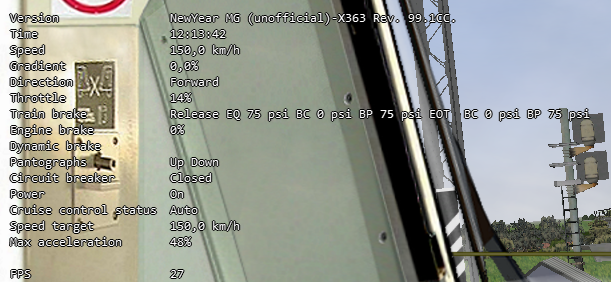
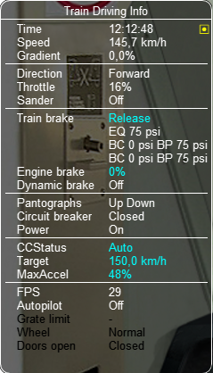
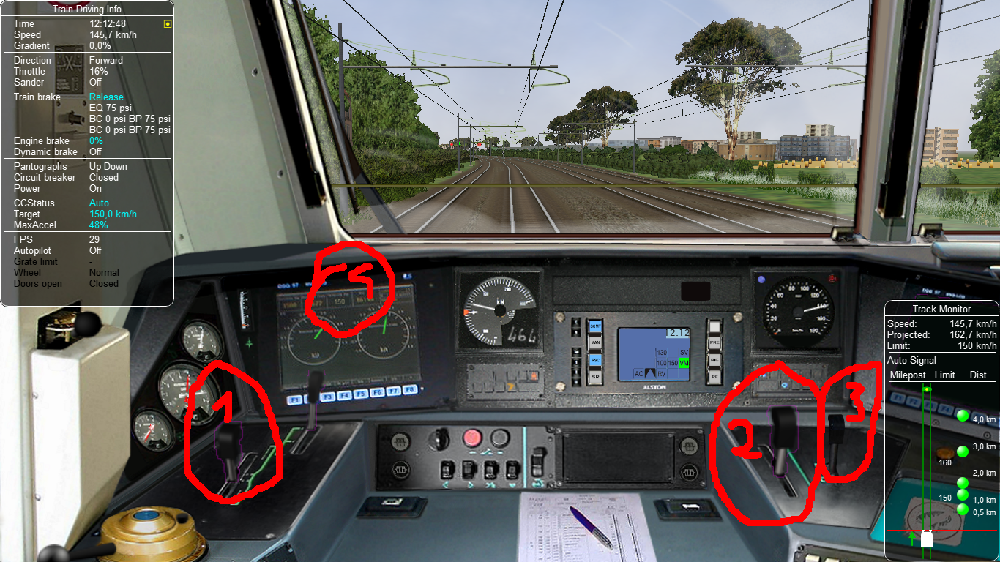

.. _cruisecontrol:

**************
Cruise Control
**************

General
=======

With Cruise Control the train driver sets a speed, that is then reached and 
maintained by the train.

To equip an electric or diesel locomotive with CC, following steps 
must be performed:

  1) In the .eng file the required entries must be provided
  2) in the .cvf file the required cab controls must be added
  3) in the .sms files the required sound stream entries must be added.

To drive a locomotive that has been equipped with CC following 
driver interfaces are available:

  1) Keyboard commands
  2) Mouse
  3) HUD and Train Driving window.

The CC feature includes also the management of a very versatile specific controller,
called Multi Position Controller (MPC). 

A paragraph is devoted to each of the above topics.

Operation Modes
===============

The CC Speed Regulator can be in 4 different states (or modes), that is:

1) *Manual*, when the automatic cruise control is disabled and the driver 
   controls the speed through throttle and brakes as if there were no CC.
2) *Auto*, when the automatic cruise control is enabled, and therefore 
   the speed is automatically controlled
3) *Testing*, not implemented at the moment
4) *AVV*, not implemented at the moment.

Switching between Manual and Auto mode can be configured to occur either 
by a specific cabview control (*ORTS_SELECTED_SPEED_REGULATOR_MODE*) or 
when certain conditions, defined in the .eng file parameters, are met, 
or by keyboard commands.
One of such parameters is e.g. *ForceRegulatorAutoWhenNonZeroSpeedSelected*.

The CC Speed Selector can be in 4 different states (or modes), that is:

1) *Parking*
2) *Neutral*
3) *On*
4) *Start*.

Switching betwenn Speed Selector Modes can be configured to occur either 
by a specific cabview control (*ORTS_SELECTED_SPEED_MODE*) or through 
keyboard commands.

The Cruise Controller can be of three types:

1) *None*
2) *Full*
3) *SpeedOnly*

The type selection occurs through .eng parameter *ControllerCruiseControlLogic*.
Types *None* and *Full* work the same way. *None* is default, meaning the full 
Cruise Controller features are active. 

Parametrizing the .eng file
===========================

In the *Engine* section of the .eng file the CC parameters must be 
declared within an *ORTSCruiseControl* block, this way::

  ORTSCruiseControl(
    CCparameter1 (value)
    CCparameter2 (value)
    ...
    CCparametern (value)
    Options ("Option1", "Option2", ... "Optionn")
    ForceStepsThrottleTable ("IntValue1", "IntValue2",...,"IntValuen")
    AccelerationTable ("FloatValue1", "FloatValue2",...,"FloatValuen")
  )

A list of the available .eng file CC parameters follows here below.

.. csv-table:: .eng parameters
   :header: "Parameter", "Description", "Units", "Default"
   :widths: 30, 60, 12, 12

   "SpeedIsMpH", "KpH if missing", "Boolean", "FALSE"
   "MaxForceSteps", "Usually will be 100 meaning 100%, but some locos have limited force steps", "Integer", "0"
   "SpeedSelectorStepTimeSeconds", "How fast the selected speed lever adds speed", "Float", "0.1"
   "DynamicBrakeMaxForceAtSelectorStep", "The brake will reach 100% at this step, the lower the step, the lower the max brake percent", "Integer", "1"
   "NominalSpeedStep", "When pressing Shift+A or Shift+D how many speed units should the selected speed change ", "Integer", "0"
   "StartReducingSpeedDelta", "The lower number, the sooner the regulator will decrease power", "Float", "1"
   "StartReducingSpeedDeltaDownwards", "If present and different from zero, overrides the above parameter for dynamic braking", "Float", "0"
   "ForceRegulatorAutoWhenNonZeroSpeedSelected", "When a non zero speed is selected, the regulator is set to auto", "Boolean", "FALSE"
   "ForceRegulatorAutoWhenNonZeroSpeedSelectedAndThrottleAtZero", "Self explaining", "Boolean", "FALSE"
   "MaxForceKeepSelectedStepWhenManualModeSet", "Self explaining", "Boolean", "FALSE"
   "ForceResetRequiredAfterBraking", "After manual braking, to apply again force, the force must first be manually reset to zero", "Boolean", "FALSE"
   "DynamicBrakeIsSelectedForceDependant", "If true dynamic brake force applied depends from the position of the force selector, else always the maximum dynamic brake force is applied", "Boolean", "FALSE"
   "ThrottleFullRangeIncreaseTimeSeconds", "Time in seconds needed for the regulator to pass from 0 to 100% of power", "Seconds", "5"
   "ThrottleFullRangeDecreaseTimeSeconds", "Time in seconds needed for the regulator to pass from 100 to 0% of power", "Seconds", "5"
   "DynamicBrakeFullRangeIncreaseTimeSeconds", "Same as above, but for dynamic braking", "Seconds", "5"
   "DynamicBrakeFullRangeDecreaseTimeSeconds", "Same as above, but for dynamic braking", "Seconds", "5"
   "TrainBrakeFullRangeIncreaseTimeSeconds", "Same as above, but for train brakes", "Seconds", "10"
   "TrainBrakeFullRangeDecreaseTimeSeconds", "Same as above, but for train brakes", "Seconds", "5"
   "DefaultForceStep", "When OR is started, this will be the selected force step, usually set at 0", "Integer", "1"
   "DisableCruiseControlOnThrottleAndZeroSpeed", "If train is stationary and throttle is increased and CC is still in auto, this will revert the mode to manual", "Boolean", "FALSE"
   "DisableCruiseControlOnThrottleAndZeroForce", "If train is moving and throttle is increased and CC is still in auto and selected force is zero, this will revert the mode to manual", "Boolean", "FALSE"
   "DynamicBrakeCommandHasPriorityOverCruiseControl", "When cruise control is in Auto, manually activating the dynamic brake has priority", "Boolean", "TRUE"
   "HasIndependentThrottleDynamicBrakeLever", "The cabview is equipped with a combined Throttle-Dynamic brake lever independent from the CC controls", "Boolean", "FALSE"
   "DoComputeNumberOfAxles", "Number of train axles automatically computed at game start", "Boolean", "FALSE"
   "AntiWheelSpinEquipped", "Self explaining. Note: if there are multiple locos in the consist, the loco with most speed diff takes the decision to activate", "Boolean", "FALSE"
   "AntiWheelSpinSpeedDiffThreshold", "The speed difference (MpS) between wheel speed and train speed that activates the anti spin system and reduces power", "Boolean", "FALSE"
   "ParkingBrakeEngageSpeed", "The speed when automatic parking brake will be engaged if present", "Float (speed)", "0"
   "ParkingBrakePercent", "To what engine brake percent should the parking brake be set if engaged", "Float", "0"
   "MaxPowerThreshold", "At this speed, no matter what max force was selected by the driver, the regulator will lineary reach force to 100%", "Float (speed)", "0"
   "SafeSpeedForAutomaticOperationMpS", "Some locos/systems need the 'confirm to drive' button to be held until the safe speed is reached. This is the speed above which the loco will continue delivering power.", "Float (speed)", "0"
   "ContinuousSpeedIncreasing", " ", "Logical", "FALSE"
   "PowerBreakoutAmpers", "Some locos are unable to maintain power when current is lower than this value.  In that case, a breakout is generated and the power goes to 0", "Float(Amperes)", "100"
   "PowerBreakoutSpeedDelta", "Obsolete", "Float", "100"
   "PowerResumeSpeedDelta", "When breakout was activated, this is the speed hysteresis, when speed is reduced by this value the engine will resume power", "Float", "100"
   "PowerReductionDelayPaxTrain", "Time required for the loco to reach maximum percent of power set in PowerReductionValue until the whole train is in pull on its couplers for passenger trains", "Float (seconds)", "0"
   "PowerReductionDelayCargoTrain", "Time required for the loco to reach maximum percent of power set in PowerReductionValue until the whole train is in pull on its couplers for freight trains", "Float (seconds)", "0"
   "PowerReductionValue", "Maximum power in % to maintain until PowerReductionDelay is reached", "Float", "100"
   "DisableZeroForceStep", "Minimum force step is limited above zero", "Boolean", "FALSE"
   "UseThrottleAsSpeedSelector", "if ControllerCruiseControlLogic is set to SpeedOnly, throttle when in Auto mode will change the maximum CC speed", "Boolean", "FALSE"
   "UseThrottleAsForceSelector", "if ControllerCruiseControlLogic is set to None, throttle when in Auto mode will change the maximum CC Force", "Boolean", "FALSE"
   "UseThrottleInCombinedControl", "Throttle is used as force selector or speed selector even if in combined control, to be used in conjunction of one of the two above parameters", "Boolean", "FALSE"
   "ControllerCruiseControlLogic", "Can have values 'None', 'SpeedOnly', 'Full'", "Enum", "Full"
   "HasProportionalSpeedSelector", "Speed selector is performed by a lever ranging from 0 to max speed", "Boolean", "FALSE"
   "SpeedSelectorIsDiscrete", "Speed selected can have only values multiple of NominalSpeedStep, even if selection is through mouse", "Boolean", "FALSE"
   "ModeSwitchAllowedWithThrottleNotAtZero", "Switch from manual to auto and vice-versa can occur also when throttle lever is not at 0", "Boolean", "FALSE"
   "DisableManualSwitchToAutoWhenSetSpeedNotAtTop", "Manual Switch to Cruise Control Auto Mode can't occur when speed is not set at maximum value and at the same moment train speed is not 0", "Boolean", "FALSE"
   "UseTrainBrakeAndDynBrake", "CC uses train brake and dyn brake together", "Boolean", "FALSE"
   "UseDynBrake", "CC uses dyn brake", "Boolean", "TRUE"
   "TrainBrakeCommandHasPriorityOverCruiseControl", "A manual train braking inhibits Cruise Control to use both dynamic braking and tractive force", "Boolean", "TRUE"
   "TrainBrakeCommandHasPriorityOverAcceleratingCruiseControl", "A manual train braking inhibits Cruise Control to use tractive force", "Boolean", "TRUE"
   "SpeedDeltaToEnableTrainBrake", "This is the minimum speed delta between actual speed and desired speed for the CC to use also the train brake", "Float(speed)", "5m/s"
   "SpeedDeltaToEnableFullTrainBrake", "This is the minimum speed delta between actual speed and desired speed for the CC to use also the train brake with no reduced intensity", "Float(speed)", "10m/s"
   "TrainBrakeMinPercentValue", "This is the minimum train brake percent used by the CC. 0 means no braking, 100 means full service braking", "Float(percent)", "30"
   "TrainBrakeMaxPercentValue", "As above for maximum value. It must not be too high to avoid that the brake is not fully released timely", "Float(percent)", "85"
   "ThrottleNeutralPosition", "The zero throttle position is neutral in auto mode, that is in such position the CC does not intervene", "Boolean", "FALSE"
   "MinimumSpeedForCCEffect", "Below this speed CC has no effect", "Float(speed)", "0"
   "StartInAutoMode", "Game starts with CC in Auto mode", "Boolean", "FALSE"
   "KeepSelectedSpeedWhenManualModeSet", "When switching from auto to manual and back to auto using keyboard or cabview control, the previously selected speed is kept,if false the train speed when passing to manual to auto is used as selected speed", "Boolean", "FALSE"

The list of the available parameters for the Options() block may be
found in the table here below.

.. csv-table:: Options
   :header: "Name", "Description"
   :widths: 35, 65

   "RegulatorAuto", 
   "RegulatorManual", 
   "RegulatorTest", 
   "EngageForceOnNonZeroSpeed", 
   "StartFromZero", "No need to confirm you want to drive. If speed is set above zero, the train starts to move"
   "SelectorNeutral", 
   "SelectorOn", 
   "SelectorStart", 
   "SelectorParking", 

The presence of ForceStepsThrottleTable and AccelerationTable is 
optional.

Braking by CC can occur either using only the dynamic brake (default) or 
using only the train brake, when the locomotive has no dynamic brake, 
or using both the dynamic brake and the train brake. For this to occur 
parameter UseTrainBrakeAndDynBrake must be set to true in the CruiseControl 
block within the .eng file.

Train brake usage occurs when the delta between the actual train speed and 
the target speed is higher than parameter SpeedDeltaToEnableTrainBrake.
Between this delta and SpeedDeltaToEnableFullTrainBrake the train brake is 
set at TrainBrakeMinPercentValue. Above SpeedDeltaToEnableFullTrainBrake 
the train brake is continuously adjusted to achieve a constant deceleration.
In other words, when the speed delta is high, train braking is adjusted to
obtain a constant deceleration when dynamic braking is not enough; when train decelerates 
and delta reduces to SpeedDeltaToEnableFullTrainBrake the train brake is reduced to 
TrainBrakeMinPercentValue. When train decelerates further and delta reduces to 
SpeedDeltaToEnableTrainBrake the train brake is released. By adjusting these 
parameters to the locomotive and a typical train it pulls, it can be made sure that 
the brake pipe is fully recharged when the target speed is reached. Else the 
train speed could be significantly reduced below the target speed.

An example of the relevant lines in the CruiseControl 
block within the .eng file follows here::

  	UseTrainBrakeAndDynBrake ( True ) comment (** CC uses train brake and dyn brake together **)
		SpeedDeltaToEnableTrainBrake ( 15km/h ) comment (** This is the minimum speed delta between actual speed and desired speed for the CC to use also the train brake **)
		SpeedDeltaToEnableFullTrainBrake ( 30km/h ) comment (** This is the minimum speed delta between actual speed and desired speed for the CC to use also the train brake with no reduced intensity **)		
		TrainBrakeMinPercentValue ( 10 ) comment (** This is the minimum train brake percent used by the CC, where 0 means no braking and 100 full braking **)
		TrainBrakeMaxPercentValue ( 60 ) comment (** As above for maximum value. It must not be too high to avoid that the brake is not fully released timely **)

Multi Position Controller (MPC)
-------------------------------

It is possible to manage a CC also without a MPC, in case the throttle 
controller is used for CC, or a proportional speed selector is available. 
In the other cases in general a MPC is needed.

The Multi Position Controller(s) (more than one can be defined) is 
defined in the .eng file too with an *ORTSMultiPositionController* block, 
this way::

  ORTSMultiPositionController (
    Positions (
      Position ( PositionType1 PositionFlag1 "PositionName1" )
      Position ( PositionType2 PositionFlag2 "PositionName2" )
      ...
      Position ( PositionTypen PositionFlagn "PositionNamen" )
    )
    ControllerID ( ID )
    ControllerBinding ( "Controller Linked" )
    CanControlTrainBrake ( Boolean )
  )

The list of the available PositionTypes may be found in the table 
here below.

.. csv-table:: MPC Position Types
   :header: "Position type", "Description"
   :widths: 35, 65

   "Neutral", 
   "Drive", "If MPC is throttle type, it will drive on selected force. If its bound to CC, will drive until speed was reached"
   "ThrottleIncrease", "Will increase throttle or speed of CC"
   "ThrottleDecrease", 
   "ThrottleIncreaseFast", "Will increase throttle or speed of CC twice faster"
   "ThrottleDecreaseFast", 
   "DynamicBrakeIncrease", 
   "DynamicBrakeDecrease", 
   "DynamicBrakeIncreaseFast", 
   "TrainBrakeIncrease", 
   "TrainBrakeDecrease", 
   "EmergencyBrake", 
   "ThrottleHold", 
   "DynamicBrakeHold", 
   "ThrottleIncreaseOrDynamicBrakeDecreaseFast", "This is for e.g. CP handle, will increase throttle or decrease dyn brake"
   "ThrottleIncreaseOrDynamicBrakeDecrease", 
   "DynamicBrakeIncreaseOrThrottleDecreaseFast", 
   "DynamicBrakeIncreaseOrThrottleDecrease", 
   "KeepCurrent", "Will keep throttle or dynanmic brake"
   "SelectedSpeedIncrease", 
   "SelectedSpeedDecrease", 
   "SelectSpeedZero", 

The list of the available PositionFlags may be found in rhe 
table here below.

.. csv-table:: MPC Position Flags
   :header: "Position flag", "Description"
   :widths: 35, 65

   "SpringLoadedForwards", "if moved aft, will wait 300 miliseconds, the return to previous position forwards"
   "SpringLoadedBackwards", "same but backwards"
   "SpringLoadedForwardsImmediately", "if moved aft, will return to previous position forwards immediately"
   "SpringLoadedBackwardsImmediately", "same but backwards"
   "Default", "The position set when game is loaded"

PositionNames are arbitrary strings.

The ControllerID is an integer, which must be unique for every 
defined MPC.

The ControllerBinding parameter defines to which function the 
MPC is connected. Controllers linked may be either "Throttle" or 
"SelectedSpeed".

The boolean parameter *CanControlTrainBrake*, which is false by 
default, is optional.

.. _cruisecontrol-cabviewcontrolstable:

Cruise Control Cabview Controls
===============================

The list of the available cabview controls may be found in the 
table here below. Please note that spaces within cabview control 
names are there only for table display purposes, and must not be 
entered in the .cvf files.

.. csv-table:: Cabview Controls
   :header: "Control Name", "Description", "UoM", "Mouse activated"
   :widths: 58, 38, 9, 9

   "ORTS_SELECTED_SPEED", "Used to display the selected speed, e.g. as a digital value", "km/h or MpH", 
   "ORTS_SELECTED_SPEED_DISPLAY", "As above, but displays the speed in km/h divided by 10", "km/h", 
   "ORTS_SELECTED_SPEED_MODE", "Displays and/or changes the Speed Selector Mode", " ", "Y"
   "ORTS_SELECTED_SPEED_REGULATOR_MODE", "Displays and/or changes the Speed Regulator Mode. Control can be used as ON/OFF (if only Manual and Auto mode are available) or as MULTISTATE (in case of more than two modes)", "", "Y"
   "ORTS_SELECTED_SPEED_MAXIMUM_ACCELERATION", "Displays and/or changes the maximum acceleration(force) applied by the CC; MaxValue in Range line must be equal to number of frames of the .ace file", "", "Y"
   "ORTS_RESTRICTED_SPEED_ZONE_ACTIVE", "Used to display and to set the restricted speed zone flag. See paragraph 'Restricted Speed Zone' in manual.", "", "Y"
   "ORTS_NUMBER_OF_AXES_DISPLAY_UNITS", "This display control is usually used together with the following two. Together they display the number of axles of the train, as set by the driver or automatically by OR.", "", 
   "ORTS_NUMBER_OF_AXES_DISPLAY_TENS", "See above", "", 
   "ORTS_NUMBER_OF_AXES_DISPLAY_HUNDREDS", "See above", "", 
   "ORTS_TRAIN_LENGTH_METERS", "Displays the train length", "meters", 
   "ORTS_REMAINING_TRAIN_LENGTH_SPEED _RESTRICTED", "When the restricted speed zone flag is activated, displays the remaining train lenght that hasn't yet arrived at the end of the restricted speed zone. Else shows 0", "meters", 
   "ORTS_REMAINING_TRAIN_LENGTH_PERCENT", "When the restricted speed zone flag is activated, displays the remaining train lenght percent that hasn't yet arrived at the end of the restricted speed zone. Else shows 0", "", 
   "ORTS_ACCELERATION_IN_TIME", "Value of AccelerationBits; some cabs can show 'Arrows' pointing up or down according to speed change", "", 
 

.. csv-table:: Cabview Controls (continued)
   :header: "Control Name", "Description", "UoM", "Mouse activated"
   :widths: 58, 38, 9, 9

   "ORTS_ODOMETER", "Displays the odometer value since last odometer reset", "meters or Km", 
   "ORTS_FORCE_IN_PERCENT_THROTTLE_AN D_DYNAMIC_BRAKE", "Displays the actual throttle percent or the negated dynamic brake percent when in manual mode; displays the actual CC force percent or the negated dynamic brake percent when in auto mode", "",
   "ORTS_MAXIMUM_FORCE", "Displays the preset maximum force of the locomotive", "Newton",
   "ORTS_MOTIVE_FORCE", "Displays the actual motive force of the locomotive", "Newton", 
   "ORTS_MOTIVE_FORCE_KILONEWTON", "Displays the actual tractive or electric braking force of the locomotive", "KN", 
   "ORTS_TRAIN_TYPE_PAX_OR_CARGO", "Displays whether the selected tran type is passenger or freight. Can be toggled with a keyboard command", "", 
   "ORTS_CONTROLLER_VOLTAGE", "Displays the controller volts as set by the CC (may vary from 0 to 100).. Controller volts  control the motive force of the locomotive", "", 
   "ORTS_AMPERS_BY_CONTROLLER_VOLTAGE", "Displays the current used for the motive force of the locomotive", "Amperes", 
   "ORTS_CC_SELECTED_SPEED", "Sets speed to value of ORTSParameter1 (KpH or MpH depending from eng parameter SpeedIsMpH)", "", "Y" 
   "ORTS_NUMBER_OF_AXES_INCREASE", "Increases the number of axles of the train, when mouse pressed", "", "Y"
   "ORTS_NUMBER_OF_AXES_DECREASE", "Decreases the number of axles of the train, when mouse pressed", "", "Y"
   "ORTS_MULTI_POSITION_CONTROLLER", "Displays and sets the position of the MPC", "", "Y"
   "ORTS_CC_SPEED_0", "Displays and sets the selected speed at 0", "", "Y"
   "ORTS_CC_SPEED_DELTA", "Increases or decreases the selected speed by the value of ORTSParameter1 (KpH or MpH depending from eng parameter SpeedIsMpH)", "", "Y"
   "ORTS_SELECTED_SPEED_SELECTOR", "Speed selection done by independent lever ranging from 0 to max speed; UoM may be KpH or MpH.", "", "Y"

Restricted Speed Zone
---------------------

Strictly this is not a Cruise Control function.
When the driver sets the cabview control ORTS_RESTRICTED_SPEED_ZONE_ACTIVE, 
the Cruise Control sets to true and displays a boolean variable.
This boolean variable remains true until the full length of the train has 
passed the point where the driver set the cabview control. When the variable 
returns false, also a sound trigger is activated.

This feature helps the train driver to identify when the full length of the train 
has passed a restricted speed zone, so that he can again increase speed of the train.

Cruise Control Sound Triggers
=============================

The list of the available sound triggers may be found in the 
table here below.

.. csv-table:: Sound Triggers
   :header: "Trigger #", "Trigger name", "Description"
   :widths: 5, 20, 67

   "298", "LeverFromZero", "Triggered when ORTS_SELECTED_SPEED_MAXIMUM_ACCELERATION and ORTS_SELECTED_SPEED_SELECTOR are moved from zero position"
   "299", "LeverToZero", "Triggered when ORTS_SELECTED_SPEED_MAXIMUM_ACCELERATION and ORTS_SELECTED_SPEED_SELECTOR are moved to zero position"
   "300", "CruiseControlSpeedRegulator", "Triggered when the Speed Regulator changes mode"
   "301", "CruiseControlSpeedSelector", "Triggered when the Speed Selector changes mode"
   "302", "CruiseControlMaxForce", "Triggered when the Max force selector lever is moved"
   "303", "CruiseControlAlert", "Triggered when the tail of the train has passed a restricted zone, if the restricted zone control had been activated"
   "304", "CruiseControlAlert1", "Triggered when a new speed has been set"
   "310", "MPCChangePosition", "Triggered when a MPC changes position"

Cruise Control Keyboard commands
================================

The list of the available keyboard commands may be found in the 
table here below.

.. csv-table:: Keyboard commands
   :header: Command name", "Keystroke", "Description"
   :widths: 42, 28, 30

   "ControlSpeedRegulatorModeIncrease", "Shift+W", "Changes the speed regulator mode in ascending sequence"
   "ControlSpeedRegulatorModeDecrease", "Shift+S", "Changes the speed regulator mode in descending sequence"
   "ControlSpeedRegulatorMaxAccelerationIncrease", "Ctrl+Shift+D", "Increases the max acceleration (max force) allowed for the CC"
   "ControlSpeedRegulatorMaxAccelerationDecrease", "Ctrl+Shift+A", "Decreases the max acceleration (max force) allowed for the CC"
   "ControlSpeedRegulatorSelectedSpeedIncrease", "Shift+D", "Increases the selected speed"
   "ControlSpeedRegulatorSelectedSpeedDecrease", "Shift+A", "Decreases the selected speed"
   "ControlNumberOfAxlesIncrease", "Ctrl+Shift+7(NumKey)", "Increases the number of axles"
   "ControlNumberOfAxlesDecrease", "Ctrl+Shift+1(NumKey)", "Decreases the number of axles"
   "ControlRestrictedSpeedZoneActive", "Ctrl+Shift+R", "Starts checking when tail of train has passed restricted speed zone"
   "ControlCruiseControlModeDecrease", "Ctrl+Shift+S", "Changes the speed selector mode in descending sequence"
   "ControlCruiseControlModeIncrease", "Ctrl+Shift+W", "Changes the speed selector mode in ascending sequence"
   "ControlTrainTypePaxCargo", "Ctrl+Shift+N", "Toggles between setting train as passenger or freight"
   "ControlSpeedRegulatorSelectedSpeedToZero", "Alt+Shift+A", "Sets selected speed at 0"

Keys listed in the table are valid for English keyboard.

Cruise Control commands through Mouse
=====================================

The Cabview Controls that may be activated by mouse are flagged with a *Y* 
in :ref:`this table <cruisecontrol-cabviewcontrolstable>`.

HUD and Train Driving window info about CC
==========================================

Following info is displayed both in the main 
HUD and in the Train Driving window:

1) Speed regulator mode (*Manual* or *Auto*). 
   If the mode is *Auto*, the following further info is displayed:
2) Target speed (speed set)
3) Max Acceleration in percentage

Here below a picture of the HUD with CC info is shown

Here a picture of the Train Driving window with CC 
info is shown:

Sample files of a CC equipped electric locomotive
=================================================

The E464 is the Italian electric locomotive that has 
been built in the highest number of exemplars.

Here below is a picture of the E464 cabview:

Following relevant items are circled in the picture:

1) Manual throttle-dynamic brake combined control lever 
   (CP_HANDLE COMBINED_CONTROL in cvf file)
2) CC maximum acceleration lever (ORTS_SELECTED_SPEED_MAXIMUM_ACCELERATION LEVER 
   in cvf file)
3) Multi position controller lever used to set the target speed 
   (ORTS_MULTI_POSITION_CONTROLLER TWO_STATE in cvf file); it has 
   four positions: unstable target speed increase position, stable 
   neutral position, unstable target speed decrease position, and 
   unstable target speed to zero position
4) Target speed digital display (ORTS_SELECTED_SPEED DIGITAL in 
   cvf file)

Switching from manual to auto mode and vice-versa occurs only when levers 1 
and 2 are in the zero position and lever 3 is in the neutral position. If 
at that point lever 1 is moved, CC switches to (or remains in) manual mode. 
If at that point lever 2 is moved, CC switches to (or remains in) auto mode.

The cvf file for the E464 equipped with CC (and also with customized TCS) can be 
found in the Open Rails folder in 
Documentation\SampleFiles\Manual\e464_V2SCMT_SCMTscript_alias_CC.zip.

The eng file for the E464 can be found in the Open Rails folder 
in Documentation\SampleFiles\Manual\Fs-E464-390.zip.

Sample files of a CC equipped locomotive with proportional speed selector
=========================================================================

The E652 is one of the first Italian electric locomotives which was 
equipped with power electronics.
Differently from the E464, the preset speed is not set by a multiposition 
controller, but by a proportional lever, situated at the right of the cabview. 
"Proportional" means that at every position of the lever a different preset speed 
corresponds. Zero speed is set when the lever is at the "lowest" position, and the 
maximum speed is set when the lever is at the "highest" position. 
The lever is named "ORTS_SELECTED_SPEED_SELECTOR" in the cvf file.

The cvf file for the E652 equipped with CC (and also with customized TCS) can be 
found in in the Open Rails folder in Documentation\SampleFiles\Manual\652_CC.zip.

The eng file for the E652 can be found in the Open Rails folder in 
Documentation\SampleFiles\Manual\652_CC.zip.

