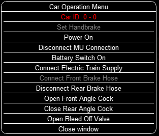
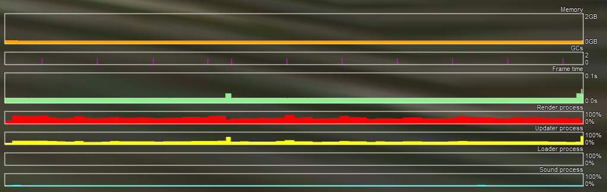

.. _driving:

*******************
Driving a Train
*******************

Game Loading
============

Once you have pressed ``Start``, Open Rails loads and processes all the 
data needed to run the game. During this phase, the route's splash screen 
is shown. If the same session was loaded previously, a bar showing loading 
progress is shown at the bottom of the display. During loading, if logging 
is selected, the log file ``OpenRailsLog.txt`` will already begin storing 
data.

Entering the Simulation
=======================

At the end of the loading phase, you are in the cab of the train you will 
drive.(Note: some newer locomotives have experimental 3D cabs - if no cab 
interior display appears, then type ``<Alt+1>`` to display the cab interior.) 
Depending on the configuration of the activity (in case of activity mode), 
your train will be in motion or stopped. To look around in the simulation, you 
can select different views using the keyboard, as described in 
:ref:`Changing the View <driving-changing-view>`.

Open Rails Driving Controls
===========================

Open Rails follows MSTS very closely, providing controls to drive steam, 
electric and diesel locomotives, both on their own or working together, but 
also offers additional capabilities.

A very wide range of systems and instruments specified in the ``ENG`` and 
``CVF`` files is supported.

To control the train, you have at your disposal a set of keyboard commands 
that is equivalent to those of MSTS, plus some new ones. You can get a 
printable version of the command set as described in paragraph 
:ref:`Keyboard options <options-keyboard>`, or you can press ``<F1>`` to 
immediately get the scrollable F1 Information Window as shown and 
described :ref:`below <driving-help>`.

Alternatively, you can operate the cabview controls by mouse click 
(buttons) and mouse drag (levers and rotary switches).

Throttle Control
----------------

Steam locomotives have a continuous throttle or regulator, but many diesel 
and electric locomotives have a notched throttle which moves only in steps. 
To avoid jerks, some of these steps may be *smooth*, where the power is 
gradually and automatically adjusted to achieve the setting.

Dynamic Braking
---------------

Dynamic braking is the use of the traction motors of a locomotive (electric 
or diesel-electric) as generators to slow the train. Initially, dynamic 
braking was applied in mountainous territory where conventional freight-car 
brakes were prone to overheating on long downgrades. It was also limited to 
speeds above 10mph. Dynamic braking controls are usually notched.

In OR, the dynamic brake (controlled by the keys ``<,>`` and ``<.>``) is 
not available unless the throttle is fully closed; similarly the throttle 
is not available unless the dynamic brake is fully released (off).

As defined in the ``CVF`` file, the tractive and braking forces may be 
shown on two different instruments, on one instrument with two needles or 
on a single instrument where the braking is shown as a negative value.

Combined Control
----------------

Some locomotives are fitted with a *combined control* where a single lever 
is used to provide throttle and brake control together, with negative 
throttle positions used to apply the brake. The brake element may be either 
dynamic or conventional train brakes.

There may be a delay changing between throttle and brake operation, 
representing the time required to change the operation of the traction 
motors from motors to generators. 

Blended Dynamic Brake
---------------------

Some locomotives have blended dynamic brake, which means that the 
trainbrake lever also controls the dynamic brake. Currently this is 
implemented to be MSTS compatible, the dynamic brake force percentage 
follows the train brake pipe pressure (full service/suppression will set 
100% dynamic brake). The blending percentage run up/ run down follows the 
airbrake application ``MaxApplicationRate()``, and release 
rates ``MaxReleaseRate()``, and also respects the dynamic brake delay 
setting ``DynamicBrakesDelayTimeBeforeEngaging()`` .eng parameters.

Blending can also work if there is no dynamic brake lever configured for 
the locomotive. If there is dynamic brake lever defined, then the higher 
command will be applied, except if ``OrtsDynamicBlendingOverride( 1 )`` is 
added to the ``Engine()`` block, which makes the lever override the blending 
command, if the dynamic brake lever is not at full release position.

``OrtsDynamicBlendingForceMatch( 1 )`` parameter can be added to 
``Engine()`` block, which makes the dynamic brake system to try to achieve 
the same brake force as the airbrake would have (even if the airbrake is 
bailed off), in the current train brake lever position. Example: if the 
trainbrake has 22 kN brake force at 40% trainbrake setting, then the 
dynamic brake will try to achieve, and maintain 22 kN braking force, instead 
of just setting 40% dynamic brake percentage.

Refill
------

Diesel and steam locomotives must refill their supplies of fuel 
occasionally, perhaps daily, but steam locomotives need water more 
frequently and have a range of little more than 100 miles. Use the ``<T>`` key 
to refill with fuel or water at a fuel or water supply location. Use the 
``<Y>`` key to pick up water from a water trough under a moving locomotive. 

If the locomotive or tender is alongside the pickup point, e.g. a water 
tank, then the refilling takes place as the key is held down. If the 
locomotive is further away, then the distance to the nearest pickup is 
shown instead.

Note also that the key ``<Shift+T>`` will provide immediate refill 
at any time.

Specific Features to Optimize Locomotive Driving
------------------------------------------------

You are encouraged to read the chapter on :ref:`Open Rails Physics <physics>` to optimize 
your driving capabilities and to achieve a realistic feeling of what 
happens in a real moving train.

Examples of Driving Controls
----------------------------

.. admonition:: For content developers

    - For continuous throttle, see MSTS model ``TRAINS\TRAINSET\ACELA\acela.eng``
    - For a notched non-smooth throttle, see ``TRAINS\TRAINSET\GP38\gp38.eng``
    - For a combined throttle and dynamic brake, see ``TRAINS\TRAINSET\DASH9\dash9.eng``
    - For a combined throttle and train brake, see ``TRAINS\TRAINSET\SERIES7000\series7000.eng``

Driving aids
============

Open Rails provides a large number of driving aids, which support the 
player during train operation.

.. _driving-hud:

Basic Head Up Display (HUD)
---------------------------

By pressing ``<F5>`` you get some important data displayed at the top left 
of the display in the so-called Head Up Display (HUD). If you want the HUD 
to disappear, press ``<F5>`` again.

The HUD has 6 different pages. The basic page is shown at game start. To 
sequentially switch to the other pages press ``<Shift+F5>``. After having 
cycled through all of the extended HUD pages, the basic page is displayed 
again. 

To hide or redisplay the current extended HUD data while continuing to show 
the basic HUD, press ``<Alt+F5>``.

The basic page shows fundamental information. The other pages go into more 
detail, and are used mainly for debugging or to get deeper information on 
how OR behaves. They are listed in the 
:ref:`Analysis tools <driving-analysis>` subchapter.

The following information is displayed in the basic display:

- Version = The version of the Open Rails software you are running
- Time = Game time of the Activity
- Speed = the speed in Miles/Hr. or Kilometers/Hr.
- Gradient = Route gradient in % in that point
- Direction = Position of the Reverser - Electric, Diesel and Steam. 
- Throttle = Displays the current position of the throttle, expressed as a 
  percentage of full throttle. Throttle correctly uses Notches and configured 
  % of power for Diesel engines or % of throttle for steam engines.
- Train Brake = Shows the current position of the train brake system and 
  the pressure value of the train brakes. Braking correctly reflects the 
  braking system used; hold/release, self-lapping or graduated release. The 
  Train brake HUD line has two Brake Reservoir pressure numbers: the first is 
  the Equalization Reservoir (EQ) and the second is the Brake Cylinder (BC) 
  pressure. The two BP numbers report the brake pressure in the lead engine 
  and in the last car of the train. The unit of measure used for brake 
  pressure is defined by the option :ref:`Pressure unit <options-pressure>`.
- Engine Brake = percentage of independent engine brake. Not fully 
  releasing the engine brake will affect train brake pressures.
- Dynamic brake = if engaged, shows % of dynamic brake
- Engine = shows the running status of the engine. 
  In case of a gear-based engine, after the ``Engine`` line a ``Gear`` line 
  appears displaying the actual gear. ``N`` means no gear inserted.
- FPS = Number of Frames rendered per second

If the :ref:`Autopilot <options-autopilot>` is active, an additional line 
will be shown.

An example of the basic HUD for Diesel locomotives:

.. image:: images/driving-hud-diesel.png
  :align: center
  :scale: 80%

Electric Locomotives -- Additional information
----------------------------------------------

For electric locomotives information about the pantograph state is also 
shown, as well as info about the circuit breaker state and whether the 
locomotive has power (at least one pantograph raised and circuit breaker closed) 
or not.

.. image:: images/driving-hud-electric.png
    :align: center
    :scale: 80%

Steam Engine -- Additional Information
--------------------------------------

When using a steam engine the following additional information is displayed 
in the HUD:

- Steam Usage in lbs/h, based on entirely new physics code developed by the 
  Open Rails team. It is calculated by parsing the .eng file for the 
  following parameters: number of cylinders; cylinder stroke; cylinder 
  diameter; boiler volume; maximum boiler pressure; maximum boiler output; 
  exhaust limit; and basic steam usage.
- Boiler pressure. 
- Water level.
- Levels of coal and water in %.

An example of the basic HUD for Steam locomotives:

.. image:: images/driving-hud-steam.png
    :align: center
    :scale: 80%

The default :ref:`firing <physics-steam-firing>` setting is automatic fireman. 
If manual firing is engaged with ``<Ctrl+F>``, then additional information 
is included:

.. image:: images/driving-hud-steam-manual-firing.png
    :align: center
    :scale: 80%

Multiplayer -- Additional Information
-------------------------------------

If a multiplayer session is active, the following additional information is 
shown: the actual status of the player (dispatcher, helper or client), the 
number of players connected and the list of trains with their distances 
from the train of the player viewing the computer.

Compass Window
--------------

Open Rails software displays a compass that provides a heading based on the 
camera's direction together with its latitude and longitude. 

.. image:: images/driving-compass.png
    :align: center
    :scale: 60%

To activate the compass window press the ``<0>`` key. To deactivate the 
compass window, press the ``<0>`` key a second time.

.. _driving-help:

F1 Information Monitor
----------------------

The F1 key displays the following set of panels in a tabbed format, 
selected by clicking with the mouse on the desired heading:

``Key Commands``: displays the actions of the keyboard keys

.. image:: images/driving-keys.png
  :align: center
  :scale: 80%

``Briefing``: displays what the activity creator has entered as information 
to be provided to the player about the activity:

.. image:: images/driving-briefing.png
  :align: center
  :scale: 80%

``Timetable``: shows the list of the station stops, if any, with scheduled 
and actual times of arrival and departure. During the activity the actual 
performance will be shown on the F10 :ref:`Activity Monitor <driving-activity>`.

``Work Orders``: if defined by the activity creator, lists the coupling and 
uncoupling operations to be performed. When an operation has been 
completed, the string ``Done`` appears in the last column:

.. image:: images/driving-workorders.png
  :align: center
  :scale: 80%

``Procedures``: basic instructions for driving trains in Open Rails.

.. _driving-track-monitor:

F4 Track Monitor
----------------

This window, which is displayed by pressing F4, has two different layouts 
according the the train's :ref:`control mode <operation-control-mode>`:
``Auto Signal`` mode, ``Manual`` mode or ``Explorer`` mode. 
(It is strongly suggested to follow the link and read the related paragraph.) 

``Auto Signal`` or ``Auto`` mode is the default mode when running 
activities or timetables. 

There are however two main cases where you must switch to ``Manual`` mode 
by pressing ``<Ctrl+M>``:

- when the activity requires shunting without a predefined path
- when the train runs out of control due to SPAD (*Signal Passed At 
  Danger* or passing a red signal) or exits the predefined path by error. 
  If such situations occur you will usually get an emergency stop. 
  To reset the emergency stop and then move to correct the error, you 
  must first switch to ``Manual`` mode.

To switch to manual mode press ``<Ctrl+M>``. In timetable mode you must
first stop the train to pass to manual mode.

You can return to auto mode by pressing ``<Ctrl+M>`` again when the 
head of the train is again on the correct path, with no SPAD situation. 
In standard situations you can also return to auto mode while the train 
is moving. Details are described in the paragraph of the link shown above.

Track Monitor display in Auto Signal mode:

.. image:: images/driving-auto-signal.png

Track Monitor display in Manual mode / Explorer mode:

.. image:: images/driving-explorer.png

Track Monitor: Displayed Symbols (common for Auto and Manual mode unless 
indicated otherwise) :

.. image:: images/driving-symbols.png
  :align: center
  :scale: 50%

Notes on the Track Monitor:

- Distance value is displayed for first object only, and only when within 
  distance of the first fixed marker. Distance is not shown for next station 
  stop.
- When no signal is within the normal display distance but a signal is 
  found at a further distance, the signal aspect is displayed in the advance 
  signal area. The distance to this signal is also shown.
  This only applies to signals, not to speedposts.
- For Auto mode:

    - If the train is moving forward, the line separating the Backward 
      information area is shown in red, and no Backward information is shown.
    - If the train is moving backward, the separation line is shown in white, 
      and Backward information is shown if available.
    - For reversal points, see :ref:`here <operation-reversal-points>`.

- For Manual mode:

    - If the train is on its defined path (and toggling back to Auto 
      control is possible), the own train symbol is shown in white, 
      otherwise it is shown in red.

- The colour of the track-lines is an indication of the train's speed 
  compared to the maximum allowed speed:

    - Dark green: low speed, well below allowed maximum
    - Light green: optimal speed, just below maximum
    - Orange: slight overspeed but within safety margin
    - Dark red: serious overspeed, danger of derailment or crashing

Note that the placement of the display objects with respect to the distance 
offset is indicative only. If multiple objects are placed at short 
intermediate distances, the offset in the display is increased such that 
the texts do not overlap. As a result, only the first object is always 
shown at the correct position, all other objects are as close to their 
position as allowed by other objects closer to the train.

F6 Siding and Platform Names
----------------------------

Hit the ``<F6>`` key to bring up the siding and platform names within a 
region. These can be crowded so hitting ``<Shift+F6>`` will cycle 
through showing platforms only, sidings only, and both.

Hitting ``<F6>`` again removes both siding and platform names.

.. image:: images/driving-siding-names.png

F7 Train Names
--------------

Hitting the ``<F7>`` key displays train service names (player train always 
has ``Player`` as identification).

Hitting ``<Shift+F7>`` displays the rolling stock IDs.

.. image:: images/driving-train-names-service.png
  :align: center
  :scale: 80%

.. image:: images/driving-train-names-id.png
  :align: center
  :scale: 80%

In a multiplayer session, player-controlled trains will have the id 
specified by the player:

.. image:: images/driving-train-names-multiplayer.png

F8 Switch Monitor
-----------------

Use the Switch Monitor, enabled by the F8 key, to see the direction of the 
turnout directly in front and behind the train.

.. image:: images/driving-switch.png

There are 4 ways to change the direction:

- Click on the turnout icon in the Switch Monitor;
- Press the G key (or, for the turnout behind the train, the 
  ``<Shift+G>`` key);
- Hold down the Alt key and use the left mouse button to click on the 
  switch in the Main Window;
- Use the :ref:`dispatcher window <driving-dispatcher>`.

Please note that with the last two methods you can throw any switch, not 
only the one in front but also the one behind the train.

However, note also that not all switches can be thrown: in some cases the 
built-in AI dispatcher holds the switch in a state to allow trains 
(especially AI trains) to follow their predefined path.

The arrow and eye symbols have the same meaning as in the track monitor. 
The switch is red when it is reserved or occupied by the train, and green 
when it is free.

A switch shown in green can be operated, a switch shown in red is locked.

.. _driving-train-operations:

F9 Train Operations Monitor
---------------------------

The Open Rails Train Operations window is similar in function to the F9 
window in MSTS, but includes additional features to control the air brake 
connections of individual cars. For example, it is possible to control the 
connection of the air brake hoses between individual cars, to uncouple cars 
without losing the air pressure in the train's air brake hose, or uncouple 
cars with their air brakes released so that they will coast.

The unit which the player has selected as the unit from which to control 
the train, i.e. the lead unit, is shown in red.

Cars are numbered according to their UiD in the Consist file (.con) or UiD 
in the Activity file (.act). Scrolling is accomplished by clicking on the 
arrows at the left or right bottom corners of the window.

.. image:: images/driving-train-operations.png
  :align: center
  :scale: 80%

Clicking on the coupler icon between any two cars uncouples the consist at 
that point. 

You can also uncouple cars from your player train by pressing the 
``<U>`` key and clicking with the mouse on the couplers in the main window. 

.. _driving-car-operations:

By clicking on any car in the above window, the Car Operation Menu appears. 
By clicking in this menu it is possible:

- to apply and release the handbrake of the car;
- to power on or power off the car (if it is a locomotive). This applies 
  for both electric and diesel locomotives;
- to connect or disconnect locomotive operation with that of the player 
  locomotive;
- to connect or disconnect the car's air hoses from the rest of the consist;
- to toggle the angle cocks on the air hoses at either end of the car 
  between open and closed;
- to toggle the bleed valve on the car to vent the air pressure from the 
  car's reservoir and release the air brakes to move the car without brakes 
  (e.g. humping, etc.).

By toggling the angle cocks on individual cars it is possible to close 
selected angle cocks of the air hoses so that when the cars are uncoupled, 
the air pressure in the remaining consist (and optionally in the uncoupled 
consist) is maintained. The remaining consist will then not go into 
``Emergency`` state.

When working with cars in a switch yard, cars can be coupled, moved and 
uncoupled without connecting them to the train's air braking system (see 
the :ref:`F5 HUD for Braking <driving-hud-brake>`). Braking must then be 
provided by the locomotive's independent brakes. A car or group of cars 
can be uncoupled with air brakes active so that they can be recoupled 
after a short time without recharging the entire brake line (``Bottling 
the Air``). To do this, close the angle cocks on both ends of the car or 
group before uncoupling. Cars uncoupled while the consist is moving, that 
have had their air pressure reduced to zero before uncoupling, will coast 
freely.

In Open Rails, opening the bleed valve on a car or group of cars performs 
two functions: it vents the air pressure from the brake system of the 
selected cars, and also bypasses the air system around the cars if they are 
not at the end of the consist so that the rest of the consist remains 
connected to the main system. In real systems the bypass action is 
performed by a separate valve in each car. In the 
:ref:`F5 HUD for Braking <driving-hud-brake>` display, the text ``Bleed`` 
appears on the car's display line until the air pressure has fallen to zero.

More information about manipulating the brakes during coupling and 
uncoupling can also be found :ref:`here <driving-hud-brake>`.

.. _driving-activity:

F10 Activity Monitor
--------------------

The Activity Monitor is similar in function to MSTS. It records the 
required ``Arrival`` time of your train and the actual arrival time as well 
as the required ``Depart`` time and the actual departure time.

A text message alerts the engineer as to the proper departure time along 
with a whistle or other departure sound.

.. image:: images/driving-next-station.png
  :align: center
  :scale: 80%

Odometer
--------

The odometer display appears in the centre of the main window, toggled on 
or off by the keys ``<Shift+Z>``. The direction of the count is toggled 
by the keys ``<Shift+Ctrl+Z>``, and the odometer is reset or 
initialized by ``<Ctrl+Z>``. 

When set for counting down, it initializes to the total length of the 
train. As the train moves, the odometer counts down, reaching zero when the 
train has moved its length. When set for counting up, it resets to zero, 
and measures the train's total movement. 

For example, if the odometer is set for counting down and you click Ctrl+Z 
as the front of the train passes a location, then when it reaches zero you 
will know, without switching views, that the other end of the train has 
just reached the same point, e.g. the entrance to a siding, etc. 

.. |uarr|   unicode:: U+02191 .. UPWARDS ARROW
.. |darr|   unicode:: U+02193 .. DOWNWARDS ARROW

.. _debriefeval:

Debrief Evaluation
------------------

``Description``
'''''''''''''''

This feature displays a real-time evaluation of the player's performance 
during the activity run and a final report at the end of an activity.
The evaluation reports various parameters to provide to the player info in order 
to improve his train driving ability.
While the activity is running relevant data are stored and displayed.
The stored data are used to generate a report at the end of the activity.

``How it does work``
''''''''''''''''''''

Activity evaluation is enabled only for Activity mode, and requires the 
"Debrief evaluation" checkbox in the main menu window to be enabled.
Checking some checkboxes within the various option tabs of the main menu 
provides additional parameters for the activity evaluation. 

Here an example about the Options/General tab:

.. image:: images/dbfeval-options-general.png

and here an example about the Options/Simulation tab:

.. image:: images/dbfeval-options-simulation.png

Checkboxes shown as unchecked in the two above pictures may be checked or 
unchecked, but don't have effect to activity evaluation.

A tab named "Evaluation" is present on the F1 Help Information Monitor.
Once the activity is running it displays dynamic information about the player 
train performance up to that moment.

If the "Debrief evaluation" checkbox is unchecked, a message reminds this.

   

.. image:: images/dbfeval-evaluation-unchecked.png
   :scale: 100%
   :align: center

In case that Debrief evaluation was checked, **Actual status: (**\ |darr| **)**\ , is displayed.

   

.. image:: images/dbfeval-evaluation-ini.png
   :scale: 100%
   :align: center

.. raw:: latex

   \newpage
   
Cliking **Actual status: (**\ |darr| **)**\  expanded real-time display appears.

.. image:: images/dbfeval-evaluation-expanded.png
   :scale: 100%
   :align: center

   

Cliking **Actual status: (**\ |uarr| **)**\  collapses all items.

Once the activity has ended, the report file is created and a new window displays it.

.. image:: images/dbfeval-evaluation-ended.png
   :scale: 100%
   :align: center

.. raw:: latex

   \newpage

This report is made up of several sections.

.. image:: images/dbfeval-report.png
   :scale: 80%
   :align: center

.. raw:: latex

    \newpage

Activity saves (F2) will save also the evaluation data, if the "Debrief evaluation" 
checkbox was checked.
In such case the activity saves will have the "Eval" checkbox checked in the resume window.

.. image:: images/dbfeval-resume.png
   :scale: 100%
   :align: center

.. _driving-dispatcher:

Dispatcher Window
=================

The dispatcher window is a very useful tool to monitor and control train 
operation. The :ref:`Dispatcher window <options-dispatcher>` option 
must be selected.

The dispatcher window is actually created by pressing ``<Ctrl+9>``. The 
window is created in a minimized state, so to display it in front of the OR 
window you must click on ``<Alt+Tab>`` and select the dispatcher window 
icon, or click on one of the OR icons in the taskbar. If you are running OR 
in full-screen mode, you must also have the :ref:`Fast full screen Alt+Tab 
<options-fullscreen>` option selected to have both the OR and the 
dispatcher windows displayed at the same time. After the dispatcher window 
has been selected with ``<Alt+Tab>``, successive Alt_Tabs will toggle 
between the OR window and the dispatcher window.
 
The dispatcher window is resizable and can also be maximized, e.g. on a 
second display. You can define the level of zoom either by changing the 
value within the ``Res`` box or by using the mouse wheel. You can pan 
through the route by moving the mouse while pressing the left button. You 
can hold the shift key while clicking the mouse in a place in the map; this 
will quickly zoom in with that place in focus. You can hold Ctrl while 
clicking the mouse in a place in the map, which will zoom out to show the 
whole route. Holding Alt and clicking will zoom out to show part of the 
route.

.. image:: images/driving-dispatcher.png

The dispatcher window shows the route layout and monitors the movement of 
all trains. While the player train is identified by the ``PLAYER`` string 
(or by a ``0`` if autopilot mode is enabled), AI trains are identified by 
their OR number (that is also shown in the :ref:`Extended HUD for Dispatcher 
Information <driving-hud-dispatcher>`), followed by the service name. 
Static consists are identified as in MSTS.

The state of the signals is shown (only three states are drawn), that is

- ``Stop`` -- drawn in red
- ``Clear_2`` -- drawn in green 
- while all signals with restricting aspect are drawn in yellow. 

The state of the switches is also shown. A switch shown with a black dot 
indicates the main route, while a grey dot indicates a side route.

When the ``Draw path`` is checked, the first part of the path that the 
train will follow is drawn in red. If a trailing switch in the path is not 
in the correct position for the path, a red X is shown on it.

When left- or right-clicking on a signal, a pop-up menu appears:

.. image:: images/driving-dispatcher-signal-menu.png
  :align: center
  :scale: 80%

Using the mouse, you can force the signal to Stop, Approach or Proceed. 
Later you can return it to System Controlled mode.

By left- or right-clicking on a switch, a small pop-up menu with the two 
selections ``Main route`` and ``Side route`` appears. By clicking on them 
you can throw the switch, provided the OR AI dispatcher allows it.

Using the dispatcher window for AI trains is described 
:ref:`here below<driving-dispatcher-for-ai-trains>`.

The two checkboxes ``Pick Signals`` and ``Pick Switches`` are checked as 
default. You can uncheck one of them when a signal and a switch are 
superimposed in a way that it is difficult to select the desired item.

You can click a switch (or signal) in the dispatcher window and press 
``<Ctrl+Alt+G>`` to jump to that switch with the free-roam (8-key) 
camera. 

If you click on ``View Self`` the dispatcher window will center on the 
player train. However, if the train moves, centering will be lost.

You can select a train by left-clicking with the mouse its green 
reproduction in the dispatcher window, approximately half way between the 
train's head and its name string. The train body becomes red. Then if you 
click on the button ``See in game`` the main Open Rails window will show 
this train in the views for the 2, 3, 4 or 6 keys, (and the 5-key view if 
available for this train). Display of the new train may require some time 
for OR to compute the new image if the train is far away from the previous 
camera view.

Take into account that continuous switching from train to train, especially 
if the trains are far away, can lead to memory overflows.

If after a train selection you click on ``Follow`` the dispatcher window 
will remain centered on that train.

.. _driving-dispatcher-for-ai-trains:

Using dispatcher window for AI trains
-------------------------------------

What is described here is valid only for activity mode and explore in 
activity mode.

There are cases where it would be advisable to re-route an AI train to manage standoffs, 
train passings, train priorities.
In this case, using the dispatcher window it is possible to re-route an AI train (e.g. on a siding) 
and then to get it back on the original route. The feature anyhow also allows to 
re-route it without getting it back on the original route.

It is suggested to look at this video which explains some practical case 
https://youtu.be/-f0XVg7bSgU before continuing reading.

To perform this correctly and in a way more similar to reality, some rules have to 
be followed.
The concept is that switches must be manually thrown only if they aren't reserved by a train. 
To be sure of this it is necessary to force to stop the last signal(s) between train(s) 
and switch, in case such signal is not already at stop. Once the switch is manually 
thrown, the signal in front of the train that has to be re-routed must be set to the 
"System controlled" state if it had been forced to stop before.
At that point OR breaks down the old train's route and re-computes a new one, taking 
into account the moved switch. 
More switches may be forced on the route (e.g. both the switches to enter the siding 
and the ones to re-enter the main line).

Signals must never be forced to clear or approach. 

If an AI train is re-routed on a route which isn't at the moment re-entering the 
original route, its path information in the dispatcher info HUD is displayed in yellow.

Station platform stops are re-assigned to adjacent platforms, if available. Events and 
waiting points in the abandoned part of route will be lost.

The re-routed train may be also the player train (be it autopiloted or not), provided the
Autopilot option is checked.

Additional Train Operation Commands
===================================

OR supports an interesting range of additional train operation commands. 
Some significant ones are described here.

Diesel Power On/Off
-------------------

With the key ``<Shift+Y>`` the player diesel engine is alternately 
powered on or off. At game start the engine is powered on.

With the key ``<Ctrl+Y>`` the helper diesel locomotives are alternately 
powered on or off. At game start the engines are powered on.

Note that by using the Car Operation Menu you can also power on or off the 
helper locomotives individually.

.. _driving-brakes-init:

Initialize Brakes
-----------------

Entering this command fully releases the train brakes. Usually the train 
must be fully stopped for this to be allowed. This action is usually not 
prototypical. Check the keyboard assignment for the keys to be pressed. The 
command can be useful in three cases:

- A good number of locomotives do not have correct values for some brake 
  parameters in the .eng file; MSTS ignores these; however OR uses all these 
  parameters, and it may not allow the brakes to release fully. Of course, it 
  would be more advisable to correct these parameters.
- It may happen that the player does not want to wait for the time needed 
  to recharge the brakes; however the use of the command in this case is not 
  prototypical of course.
- The player may wish to immediately connect brake lines and recharge 
  brakes after a coupling operation; again, the use of the command is not 
  prototypical.

Note that this command does not work if the :ref:`Emergency Brake <physics-emergency>`
button has 
been pressed -- the button must be pressed again to cancel the emergency 
brake condition.

Connect/Disconnect Brake Hoses
------------------------------

This command should be used after coupling or decoupling. As the code used 
depends on keyboard layout, check the keys to be pressed as described in 
:ref:`keyboard options <options-keyboard>` or by pressing F1 at runtime. 
More information on connecting brakes and manipulating the brake hose 
connections can be found :ref:`here <physics-hud-brake>` and 
:ref:`here <driving-car-operations>`.

Doors and Mirror Commands
-------------------------

Note that the standard keys in OR for these commands are different from 
those of MSTS.

Wheelslip Reset
---------------

With the keys ``<Ctrl+X>`` you get an immediate wheelslip reset.

Toggle Advanced Adhesion
------------------------

Advanced adhesion can be enabled or disabled by pressing ``<Ctrl+Alt+X>``.

Request to Clear Signal
-----------------------

When the player train has a red signal in front or behind it, it is 
sometimes necessary to ask for authorization to pass the signal. This can 
be done by pressing ``<Tab>`` for a signal in front and ``<Shift+Tab>`` 
for a signal behind. You will receive a voice message reporting if you 
received authorization or not. On the Track monitor window the signal 
colours will change from red to red/white if permission is granted.

Change Cab
----------

All locomotives and some passenger cars have a forward-facing cab which is 
configured through an entry in the ENG file. For example, the MSTS Dash9 
file ``TRAINSET\DASH9\dash9.eng`` contains the entry::

    CabView ( dash9.cvf )

Where a vehicle has a cab at both ends, the ENG file may also contain an 
entry for a reversed cab::

    CabView ( dash9_rv.cvf )

OR will recognise the suffix ``_rv`` as a rear-facing cab and make it 
available as follows.

When double-heading, banking or driving multiple passenger units (DMUs and 
EMUs), your train will contain more than one cab and OR allows you to move 
between cabs to drive the train from a different position. If you change to 
a rear-facing cab, then you will be driving the train in the opposite 
direction.

If there are many cabs in your train, pressing ``<Ctrl+E>`` moves you 
through all forward and rear-facing cabs in order up to the last cab in 
the train. If you end up in a rear-facing cab, your new *forward* direction 
will be your old *backward* direction. So you will now drive the train 
in the opposite direction. 

A safety interlock prevents you from changing cabs unless the train is 
stationary and the direction lever is in neutral with the throttle closed.

Train Oscillation
-----------------

You can have train cars oscillating (swaying) by hitting ``<Ctrl+V>``; if 
you want more oscillation, click ``<Ctrl+V>`` again. Four levels, 
including the no-oscillation level, are available by repeating ``<Ctrl+V>``.

.. _driving-turntable:

Engaging a turntable or a transfertable
=======================================

Turntable and transfertable operation is possible in explore mode, activity mode and 
timetable mode.

.. image:: images/driving-turntable.png
  :align: center
  
A turntable or transfertable can be moved by the player only if it is viewed by him on the screen.
If more than one turntable or transfertable is on view, the nearest one can be moved.
The trainset (or trainsets) to be rotated or translated  must be completely on the turntable 
or transfertable to start 
rotation. Messages of type "Train front on turntable" and "train rear on turntable" 
help stating that the train is fully on the rotating or transferring bridge.
Before starting rotating or translating the train must be fully stopped, with reverser in neutral 
position and zeroed throttle. Moreover, if in activity or timetable mode, the player 
must first pass to :ref:`manual mode <operation-manual-mode>` pressing ``<Ctrl+M>``.
At this point you can rotate the turntable clockwise (or move the trasfertable to the right of 
its origin) with keys ``<Alt+C>``, and counterclockwise (or move the trasfertable to the 
left of 
its origin) with keys ``<Ctrl+C>``. You must keep the keys pressed to continue 
rotation or translation . When the first of the two rails of the rotating or translating 
bridge is between the two 
rails where you want to stop, release the keys. Rotation or translation will continue up to 
perfect 
alignment. If necessary exit from manual mode (if you are again on a path in activity 
mode) and move the loco out of the turntable or transfertable.
During rotation the train is in *Turntable* state (this can be seen in the 
:ref:`Track Monitor <driving-track-monitor>`).

.. image:: images/driving-transfertable.png
  :align: center

It is also possible to rotate or translate standalone wagons. They have to be pushed or pulled 
to the turntable or transfertable, the locomotive must exit the turntable or transfertable 
and the wagon can be rotated or translated.
It is suggested to read also :ref:`this paragraph <features-route-turntable-operation>` 
to better understand what is possible with turntables and transfertables.

.. _driving-autopilot:

Autopilot Mode
==============

Autopilot mode is not a simulation of a train running with cruise control; 
instead, it is primarily a way to test activities more easily and quickly; 
but it can also be used to run an activity (or part of it, as it is 
possible to turn autopilot mode on or off at runtime) as a trainspotter or 
a visitor within the cab.

Autopilot mode is enabled with the related checkbox in the Simulation 
Options. It is active only in activity mode (i.e. not in explorer or 
timetable modes).

When starting the game with any activity, you are in player driving mode. 
If you press Alt+A, you enter the autopilot mode: you are in the loco's 
cabview with the train moving autonomously accordingly to path and station 
stops and of course respecting speed limits and signals. You still have 
control over the horn, bell, lights, doors, and some other controls that do 
not affect train movement. The main levers are controlled by the autopilot 
mode, and indications are correct.

You can at any moment switch back to player driven mode by pressing 
``<Alt+A>``, and can again switch to autopilot mode by again pressing 
``<Alt+A>``.

When in player driven mode you can also change cab or direction. However, 
if you return to autopilot mode, you must be on the train's path; other 
cases are not managed. When in player driven mode you can also switch to 
manual, but before returning to autopilot mode you must first return to 
auto mode.

Station stops, waiting points and reverse points are synchronized as far as 
possible in the two modes.

Cars can also be uncoupled in autopilot mode (but check that the train will 
stop in enough time, otherwise it is better to change to player driven 
mode). A static consist can also be coupled in autopilot mode.

The Request to Clear signal (``<Tab>`` key) works in the sense that the 
signal opens. However in autopilot mode at the moment that the train stops 
you must switch to player driven mode to pass the signal and then you can 
return to autopilot mode.

Note that if you run with Advanced Adhesion enabled, you may have wheelslip 
when switching from autopilot mode to player driven mode. 

The jerky movements of the levers in autopilot mode are the result of the 
way that OR pilots the train.

.. _driving-trainlist:

Changing the Train Driven by the Player
=======================================

General
-------

This function only works in activity mode, and allows the player to select 
another (existing) train from a list and to start driving it. It requires 
that the Experimental Options ``Autopilot`` and ``Extended AI Shunting`` be 
checked. 

This function can be called more than once. A new information window has 
been created to support this function: the ``Train List`` window (opened 
with Alt+F9). It contains a list of all of the AI trains and of the static 
trains equipped with a locomotive with cab, plus the player train. 

Here an example of an initial situation:

.. image:: images/driving-train-list-1.png
    :align: center
    :scale: 80%

The current player train is shown in red. The star at the end of the line 
indicates that the cameras (cab camera is managed differently) are currently 
linked to that train.

AI trains whose loco(s) have at least a cab are shown in green. They are 
eligible for player train switching.

Static trains with loco and cab are shown in yellow.

Other AI trains are shown in white.

By left-clicking in the list for the first time on an AI train, the cameras 
become linked to that train. A red star appears at the end of the line. 
This is partially equivalent to clicking on ``<Alt+9>``, but in this 
method the desired train is immediately selected and may become the player 
train.

Here is the intermediate situation: 

.. image:: images/driving-train-list-2.png
    :align: center
    :scale: 80%

By left-clicking a second time on the AI train (usually when it has 
completely appeared on the screen - if it is far away from the player train 
this can require several seconds to load the *world* around the train) the 
switch of control occurs. 

The AI train string now becomes red and is moved to the first position.The 
train can be driven, or set to autopilot mode. The former player train 
becomes an AI train.

Here is the final situation:

.. image:: images/driving-train-list-3.png
    :align: center
    :scale: 80%

If the second left-click was performed with the Shift key down, the former 
player train still becomes an AI train, but it is put in a suspended mode 
(only if its speed is 0). It won't move until it becomes a player train 
again. A suspended train is shown in orange color on the Train List window.

The new player train can can be switched to manual mode, can also request to 
pass signals at danger with the ``<Tab>`` command, and can be moved outside 
of its original path. However before switching control to still another train, 
the new player train must be returned to the original path or put in suspend 
mode; or else it will disappear, as occurs for AI trains running outside their 
path.

The sequence may be restarted to switch to a new train or to switch back to 
the initial player train.

Train switching also works in activity mode together with multiplayer mode, 
in the sense that the dispatcher player can switch its played train, and 
the related information is sent to the client players.

The Train List window is also available in 
:ref:`Timetable mode <start-timetable>`. In this case the 
names of all trains except the player train are shown in white (they can't 
be driven), however with a single click on a train in the window the 
external view cameras become linked to that train, as occurs with the Alt-9 
command described :ref:`further below <driving-changing-view>`.

Switching to a static train
---------------------------

In the Train List window the drivable static consists (that is the ones 
that have at least an engine provided with a cab) are also listed (in 
yellow color).

To ease recognition static consists are named STATIC plus the ID number 
as present in the .act file (e.g. STATIC - 32768).

The procedure to select a static consist in order to drive it is similar to 
that used to drive another non-static train train: with the first click on 
the static consist line in the Train List window the camera (if there 
wasn't the Cab camera active) moves to the static consist. With the second 
click the game enters into the cab of the static consist. If the second 
click occurs with the Shift key pressed, the old player train goes into a 
suspended state (else it enters autopilot mode, autonomously moving itself 
along its path).

The static consist becomes a standard train without a path - a pathless 
train. It runs in manual mode, and so it can be managed with all the 
thrills and frills available for manual mode. Signals can be cleared 
in the dispatcher window or 
alternatively requests for permission can be issued, switches can be moved, 
direction can be changed, cars can be coupled and uncoupled. If the train 
goes out of control (e.g. because of SPAD), CTRL+M has to be pressed first 
to exit emergency braking.

With stopped pathless train, if a new player train is selected in the 
Train List window, the pathless train returns to being a STATIC consist.

The pathless train can also couple to another train (e.g. an AI train or 
the initial player train). The coupled train becomes incorporated into the 
pathless train, but now more possibilities are available:

- The pathless train incorporating the AI train continues to be driven as a 
  pathless train; later on the run it could uncouple the incorporated train, 
  which would continue autonomously if it is still on its path.
- By clicking once on the incorporated AI train line in the Train List 
  window it is the pathless train that becomes absorbed into the AI train, 
  which now can operate on its path in autopilot mode or in player driven mode.
- Once the pathless train has coupled to the AI train, an uncouple 
  operation can be performed with the F9 window (between any couple of cars). 
  The pathless train can be driven further (with modified composition) and 
  also the AI train can run further, provided both retain at least one 
  locomotive.

Waiting point considerations
----------------------------

A waiting point icon showing a hand has been added for the :ref:`Track Monitor 
<driving-track-monitor>`, that is shown when WPs (waiting points) for new 
player trains are met in the path. This because the player should know that 
his train (when run as AI train) would stop at a point for a certain time. 
The WP is red when approaching it. When the train stops at it, it becomes 
yellow, and disappears when the time to depart is reached. When the new 
player train is run in autopilot mode, the train automatically stops for 
the required time at the WP. 

If the activity foresees that the new player train has to execute an 
Extended AI Shunting function, OR allows this function to be executed. When 
the train runs in autopilot mode such functions are executed automatically; 
when it runs in player driven mode, the player must act to uncouple cars; 
in this case pop-up messages based on the activity events window appear to 
help the player.

Care has been taken when the player is driving a train that was foreseen to 
disappear due to an Extended AI Shunting function, as e.g. when it merges 
into another train or when it is part of a join-and-split function and is 
incorporated within another train. In these cases, when the coupling 
occurs, the player is automatically moved to the train that remains alive.

.. _driving-changing-view:

Changing the View
=================

Open Rails provides all of the MSTS views plus additional view options:

- A 3D interior cabview option (where a 3D cabview file is available);
- Control of the view direction using the mouse (with the right-hand button 
  pressed);
- The exterior views (keys 2,3,4,6) and the interior view (key 5) can be 
  attached to any train in the simulation by the Alt+9 key as described
  below;
- The ``<Alt+F9>`` key shows the :ref:`Train List <driving-trainlist>` 
  window, which not only allows attaching the exterior views to any train, 
  but also, in Activity mode, to move to the Cab and :ref:`drive any train 
  in the simulation <driving-trainlist>`;
- when in passenger view (key 5) it is possible to toggle the viewpoint from 
  one side to the other of the wagon, and to jump to other viewpoints if defined, 
  as described below;
- a "special viewpoint" trackside view camera is available, as described below.  

All of the required key presses are shown by the ``F1 Help`` key in the game. 
Note that some of the key combinations are different in Open Rails than in 
MSTS. For instance, in Open Rails the cab ``Headout`` views from the cab view 
are selected by the ``Home`` and ``End`` keys, and the view direction is 
manipulated by the four arrow keys, or the mouse with the right-hand button 
depressed. 

The commands for each of the views are described below.

- Key ``<1>`` opens the 2D driver's view from the interior of the controlling 
  cab of the player locomotive. The 2D view can be cycled between the fixed 
  left, front, and right views with the ``<Left>`` and ``<Right>`` arrow keys. 
  The cab itself can be hidden with the ``<Shift+1>`` key. (The 2D view is 
  constructed from three 2D images, so the actual camera position can only be 
  modified by editing the contents of the .cvf file.) If there is a mismatch 
  between the aspect ratio of the (optionally stretched) cab and the aspect 
  ratio of the monitor, OR will clip the cab and show only the portion that fits 
  within the display, as described in 
  :ref:`2D cab stretching <options-cab-stretch>`. This clip can be panned around 
  to reveal the rest of the cab with the ``<Up>``, ``<Down>``, ``<Alt+Left>``, 
  and ``<Alt+Right>`` keys. Alternatively, if placed into letterboxing mode, 
  which activates with the ``<Ctrl+1>`` key, OR will render the full cab 
  without a clip and cover the remaining space with black bars.
- Key ``<Alt+1>`` opens the 3D driver's view (if the locomotive has a 3D 
  cabview file) from the interior of the controlling cab of the player 
  locomotive. The camera position and view direction are fully player 
  controllable.
- The entire cab view can be moved to other cabs (if available) in the player 
  train by successive presses of ``<Ctrl+E>``; the train must be stopped and the 
  direction switch in Neutral.
- The headout views (if available) are selected by ``<Home>`` (right hand side, 
  looking forward) or ``<End>`` (left hand side, looking back) and the headout 
  view direction is controlled by the mouse with the right button depressed. If 
  there are multiple locomotives, ``<Alt+PgUp>`` and ``<Alt+PgDn>`` move the 
  headout views.

Rotation of the camera view in any direction is controlled by the mouse 
with the right-hand button depressed (or alternatively by the four arrow 
keys). The camera's position is moved forward or backward along the train 
axis with the PageUp and PageDown keys, and moved left or right or up or 
down with ``<Alt>`` + the four arrow keys. The headout views (if available) 
are selected by ``<Home>`` (right hand side, looking forward) or ``<End>`` 
(left hand side, looking back) and the outside view direction is 
controlled by the mouse with the right button depressed.

- Keys ``<2>`` and ``<3>`` open exterior views that move with the active 
  train; these views are centered on a particular *target* car in the 
  train. The target car or locomotive can be changed by pressing ``<Alt+PgUp>`` 
  to select a target closer to the head of the train and ``<Alt+PgDn>`` 
  to select a target toward the rear. The 2-View selects the train's head 
  end as the initial target, the 3-View the last car. Alt+Home resets the 
  target to the front, ``<Alt+End>`` to the rear of the train. 
  With commands ``<Shift+Alt+7(Numpad)>`` and ``<Shift+Alt+1(Numpad)>`` 
  cameras 2 or 3 move gently forward or backward along a stopped or moving 
  train. By pressing a second time the key sequence the motion stops. 
  
The camera's position with respect to the target car is manipulated by the 
four arrow keys -- left or right arrows rotate the camera's position left or 
right, up or down arrows rotate the camera's position up or down while 
remaining at a constant distance from  the target. The distance from the 
camera to the target is changed by zooming with the ``<PgUp>`` and 
``<PgDn>`` keys. Rotation of the camera view direction about the camera's 
position is controlled by holding down the ``<Alt>`` key while using the 
arrow buttons, or by moving the mouse with the right mouse button 
depressed. The scroll wheel on the mouse zooms the screen image; the field 
of view is shown briefly. ``<Ctrl+8>`` resets the view angles to their 
default position relative to the current target car.

- Key ``<4>`` is a trackside view from a fixed camera position with 
  limited player control - the height of the camera can be adjusted with 
  the up and down arrow keys. Repeated pressing of the 4-key may change the 
  position along the track. 
- Key ``<Shift+4>`` is a special viewpoint trackside view: the camera locates 
  itself at platforms, or looks at the train following a spawned road car 
  along the road, or at a level crossing, 
  when such special viewpoints are near to the train; else it behaves like the 
  standard trackside view camera. When the camera follows a spawned road car, 
  speed of the road car can be increased and decreased within certain limits 
  with keys ``<9(NumKey)>`` and ``<3(NumKey)>`` to adjust the speed of the 
  camera with that of the train. By pressing key ``<Shift+4>`` when the camera 
  is on a special viewpoint, another one, if available, is selected.  
- Key ``<5>`` is an interior view that is active if the active train has a 
  *passenger view* declaration in any of its cars (or in the caboose). The 
  view direction can be rotated by the arrow keys or the mouse with right 
  button pressed. The camera position is moved forward or backward along the 
  train axis with the PageUp and PageDown keys, and moved left or right or 
  up or down with ``<Alt>`` + the four arrow keys. Successive presses of the 
  ``<5>`` key will move the view to successive views (if they exist) within 
  the active train. Note that the *active train* may be an AI train selected 
  by ``<Ctrl+9>``. By pressing ``<Shift+5>`` the viewpoint can be toggled to 
  the other 
  side of the wagon (if it was right side, it moves to left side and vice-versa). 
  If more viewpoints are defined for such wagon as explained 
  :ref:`here <features-passengerviewpoints>`, pressing ``<Shift+5>`` moves 
  through the various viewpoints.
- Key ``<6>`` is the brakeman's view -- the camera is assumed to be at 
  either end of the train, selected by ``<Alt+Home>`` and ``<Alt+End>``.
  Rotation is controlled by the arrow keys or mouse with right button 
  depressed. There is no brakeman's view for a single locomotive.
- Key ``<8>`` is the free camera view; the camera starts from the current 
  Key-2 or Key-3 view position, and moves forward (``<PgUp>`` key) or back 
  (``<PgDn>`` key) along the view direction. The direction is controlled by 
  the arrow keys or the mouse with right button depressed. The speed of 
  motion is controlled by the ``<Shift>`` (increase) or ``<Ctrl>`` (decrease)
  keys. Open Rails saves the position of previous Key 8 views and can 
  recall them by repeatedly pressing ``<Shift+8>``.
- ``<Alt+9>`` is an ORTS feature: it controls the target train for the 
  Key 2, 3, 4, 5 and 6 views during activities or timetable operations. If 
  there is more than one active train or there are consists declared in the 
  activity for pickup, pressing this key combination will set the view to 
  display each train or consist in turn. To return to the player train, 
  press the ``<9>`` key. There may be a delay for each change of view as Open 
  Rails calculates the new image. The cab view and data values in the F4 
  window always remain with the Player train. To directly select which train 
  is to be shown either use the :ref:`Dispatcher Window <driving-dispatcher>`
  or the ``<Alt+F9>`` option 
  described below. In the Dispatcher Window, locate the train that you wish 
  to view, and click the mouse on it until the block representing it turns 
  red; then click on the button ``Show in game`` in the Dispatcher Window 
  and then return to the Open Rails window.
- ``<Alt+F9>`` is an enhancement of the ``<Alt+9>`` feature that 
  displays the :ref:`Train List window <driving-trainlist>` showing the names
  of all of the currently 
  active trains. Click on the name of the desired train to move the exterior 
  views to the selected train. In Activity mode, double-clicking on a 
  train's name in this window transfers the Cabview and control of the 
  selected train to the player. In Timetable mode, only the exterior views 
  are selected.
- Key ``<9>`` resets the target train for the Key 2,3,4,5 and 6 views to 
  the Player train.

Holding the ``<Shift>`` key with any motion command speeds up the 
movement, while holding the ``<Ctrl>`` key slows it.

Note that view direction control using the mouse with right button pressed 
differs slightly from using ``<Alt>`` + the arrow keys -- the view direction 
can pass through the zenith or nadir, and the direction of vertical motion 
is then reversed. Passing back through the zenith or nadir restores normal 
behavior.

Whenever frame rates fall to unacceptable levels players are advised to 
adjust camera positions to cull some models from being in view and to 
adjust the camera again to include more models when frame rates are high.

Some camera views (among them 2Dcabview, 3Dcabview and passenger view) feature 
the ``<Ctrl+8>`` command, that resets the view position to the default one.

Toggling Between Windowed Mode and Full-screen
==============================================

You can toggle at any time between windowed mode and full-screen by 
pressing ``<Alt+Enter>``.

Modifying the Game Environment
==============================

Time of Day
-----------

In activity mode Open Rails software reads the StartTime from the MSTS 
.act file to determine what the game time is for the activity. In 
combination with the longitude and latitude of the route and the season, 
Open Rails computes the actual sun position in the sky. This provides an 
extremely realistic representation of the time of day selected for the 
activity. For example, 12 noon in the winter will have a lower sun 
position in the northern hemisphere than 12 noon in the summer. Open Rails 
game environment will accurately represent these differences.

Once the activity is started, Open Rails software allows the player to 
advance or reverse the environment *time of day* independently of the 
movement of trains. Thus, the player train may sit stationary while the 
time of day is moved ahead or backward. The keys to command this depend 
from the national settings of the keyboard, and can be derived from the 
key assignment list shown by pressing ``<F1>``.

In addition, Open Rails offers functionality similar to the time 
acceleration switch for MSTS. 

Use ``<Alt+PgUp>`` or ``<Alt+PgDn>`` keys to increase or decrease the 
speed of the game clock.

In a multiplayer session, all clients' time, weather and season selections 
are overridden by those set by the server.

Weather
-------

When in activity mode Open Rails software determines the type of weather 
to display from the Weather parameter in the MSTS Activity file. In the 
other modes the weather can be selected in the start menu. A :ref:`Weather 
Change Activity Event <operation-activity-weather-change>` can be included 
in an activity that will modify the weather during the activity.

Modifying Weather at Runtime
----------------------------

The following commands are available at runtime (keys not shown here can be found in the key assignment list obtained pressing F1):

- Overcast increase/decrease: increases and decreases the amount of clouds
- fog increase/decrease
- precipitation increase/decrease
- Precipitation "liquidity" (that is selection between rain and snow with intermediate states) increase/decrease.

These commands are active starting from any initial weather state (clear, rain, snow).

By selecting the desired precipitation liquidity before increasing precipitation, it 
is possible to decide whether to pass from clear to rain or from clear to snow weather.

Moreover, pressing ``<Alt+P>`` can abruptly change the weather from clear to raining to 
snowing and back to clear.

Randomized Weather in activities
--------------------------------

By activating the related experimental option as described :ref:`here 
<options-actweather-randomization>` the player may experience an initial weather 
that varies every time the activity is executed, and that varies in a random way 
during activity execution.

Season
------

In activity mode Open Rails software determines the season, and its 
related alternative textures to display from the Season parameter in the 
MSTS Activity file. In other modes the player can select the season in the 
start menu.

.. _driving-act-randomization:

Activity randomization
======================

By activating the related experimental option as described :ref:`here 
<options-act-randomization>` the player may experience slightly or 
significantly different activity behaviours in every different activity 
run.
It must be stated that it is not guaranteed that every randomization 
leads to a realistic and/or manageable activity. However it must be 
considered that using features like :ref:`player train switching 
<driving-trainlist>` and :ref:`manually setting switches and signals 
<driving-dispatcher>` many situations can be solved. This even 
contributes to generate a pleasant activity run.

Following activity features are randomized:

- diesel locomotive compressor blowdown: when this occurs a message is 
  displayed, output power and force go to zero, and the smoke gets white 
  (to have a diesel smoke colour change dieselsmoke.ace must be replaced 
  with a better one; there is some freely available from the website of 
  some payware trainset providers. Moreover 
  the parameter of the third parameter line in the Exhaust1 block within 
  the .eng file of the diesel loco should have at least the value of 0.3, 
  which by the way improves in general the lookout of the smoke). Wheh 
  this event occurs, the train should be stopped as soon as possible, 
  the defect loco should be put out of the MU chain and then switched off 
  (these two operations can be done with the Car operations window). 
  The defect loco is evidenced in red in the train operations window.

- diesel or electric locomotive bogie unpowered; when this occurs a message 
  is displayed, and output power and force are halved. The defect loco is again 
  evidenced in red in the train operations window. The total traction time is 
  accumulated. In the first 30, 15, 10 traction minutes (for randomization 
  levels 1, 2, 3) no locomotive failures occur. After that for each loco and 
  at every simulator update (which has the same frequency as the FPS) a 
  random number between 0 and 199999 is generated. If it is higher than 
  199998, 199992, 199899 for the three randomization levels the failure is 
  generated. The failure may also occur on the player loco. No more than a 
  faulty loco is possible on a train.

- freight car with brakes stuck: in this case the total braking time and 
  the total countinuous braking time are accumulated. In this case the time 
  with surely no failures varies from 20 to about 7 minutes for the total 
  braking time and from 10 to about 3.5 minutes for the total continuous 
  braking time. After such time for each car a random number between 0 
  and 199999 is generated at every simulator update. If the number is 
  higher than 199996, 199992, and 199969 for the three randomization 
  levels the failure is generated. The car will brake continuously, 
  will be shown in red in the train operations window and will squeal 
  if an .sms file named BrakesStuck.sms is present in the 
  ``<Train Simulator\Sound>`` directory. `Here 
  <http://www.interazioni-educative.it/Varie/BrakesStuckSound.zip>`_ 
  an example of such file. 
  Of course when this event occurs it is advisable to uncouple the 
  wagon as soon as possible from the train. No more than a car will 
  fail.

All these train failures occur only on the player train.

- AI train efficiency: the initial AI train efficiency (which 
  determines max accelerations and decelerations and in some cases 
  also max speed) is randomized, that is it may be increased or 
  decreased around its preset value for a maximum of 20%, only 
  in respectively 70% , 60% and 50% of cases when randomization level 
  is 3, 2 or 1, and the increase and decrease is 
  computed with a pseudonormal distribution curve, that is smaller 
  changes are more likely than bigger changes.
  The same AI train efficiency randomization occurs after every station stop.

- station depart time: in the same 70% , 60% and 50% of cases the number of 
  passengers boarding at a station are increased or decreased of a random 
  amount that depends also from randomization level. Departure time therefore 
  may be anticipated or, more often, delayed.

- waiting point delay: in the same 70% , 60% and 50% of cases a 
  waiting point delay is introduced, that can have a maximum value of 25 seconds 
  for the standard WPs and 5 minutes for the absolute WPs. Such maximum 
  values depend also from randomization level.

Screenshot - Print Screen
=========================

Press the keyboard ``<PrintScreen>`` key to capture an image of the game 
window. This will be saved by default in the file 
``C:\Users\<username>\Pictures\Open Rails\Open Rails <date and time>.png`` 

Although the image is taken immediately, there may be a short pause before 
the confirmation appears. If you hold down the Print Screen key, then OR 
takes multiple images as fast as it can.  

The key to capture the current window -- ``<Alt+PrintScreen>`` -- is not 
intercepted by OR.

Suspending or Exiting the Game
==============================

You can suspend or exit the game by pressing the ESC key at any time. The 
window shown at the right will appear.

.. image:: images/driving-pause.png
    :align: center
    :scale: 80%

The window is self-explanatory.

If you are running OR in a Window, you can also exit OR by simply clicking 
on the x on the right top of the OR window.

.. _driving-saveresume:

Save and Resume
===============

Open Rails provides Save and Resume facilities and keeps every save until 
you choose to delete it. 

During the game you can save your session at any time by pressing ``<F2>``.

You can view the saved sessions by choosing an activity and then pressing 
the ``Resume/Replay...`` button.

.. image:: images/start-activity.png

This will display the list of any Saves you made for this activity:

.. image:: images/driving-resume.png

To help you identify a Save, the list provides a screenshot and date and 
also distance travelled in meters and the time and position of the 
player's train. This window can be widened to show the full width of the 
strings in the left panel.

Saves from Previous OR Versions
-------------------------------

You should be aware that these Saves will only be useful in the short term 
as each new version of Open Rails will mark Saves from previous versions 
as potentially invalid (e.g. the second entry in the list below).

.. image:: images/driving-save-invalid.png
    :align: center
    :scale: 80%

When you resume from such a Save, there will be a warning prompt.

.. image:: images/driving-save-warning.png
    :align: center
    :scale: 70%

The Save will be tested during the loading process. If a problem is 
detected, then you will be notified.

.. image:: images/driving-save-error.png
    :align: center
    :scale: 70%

This Save and any Saves of the same age or older will be of no further 
value and will be marked as invalid automatically (e.g. the 3rd entry in 
the list). The button in the bottom left corner of the menu deletes all 
the invalid Saves for all activities in Open Rails.

.. _driving-save-and-replay:

Save and Replay
===============

As well as resuming from a Save, you can also replay it just like a video. 
All the adjustments you made to the controls (e.g. opening the throttle) 
are repeated at the right moment to re-create the activity. As well as 
train controls, changes to the cameras are also repeated.

Just like a *black box flight recorder*, Open Rails is permanently in 
recording mode, so you can save a recording at any time just by pressing 
``<F2>`` Save.

Normally, you would choose the replay option by ``Menu`` > ``Resume`` > 
``Replay`` from start.

.. image:: images/driving-replay.png

A second option ``Menu`` > ``Resume`` > ``Replay`` from previous save lets 
you play back a shortened recording. It resumes from the most recent Save 
it can find and replays from that point onwards. You might use it to play 
back a 5 minute segment which starts an hour into an activity.

A warning is given when the replay starts and a replay countdown appears 
in the F5 Head Up Display.

.. figure:: images/driving-replay-warning.png
    :align: left
    :scale: 80%
    
    Warning
    
.. figure:: images/driving-replay-countdown.png
    :align: right
    :scale: 80%
    
    Countdown

By default, the simulation pauses when the replay is exhausted. Use Pause 
replay at end on the Saved Games window to change this.

Little can usefully be achieved by adjusting the train controls during 
replay, but the camera controls can be freely adjusted. If changes are 
made (e.g. switching to a different camera view or zooming out), then 
replay of the camera controls is suspended while replay of the train 
controls continues. The result is a bit like editing a video. To resume 
the replay of the camera controls, just press Esc to open the Pause Menu 
and then choose Continue playing.

A possible future development may be to edit the replay file to adjust 
times or to add messages to provide a commentary. This would allow you to 
build demonstrations and tutorials.

Replay is a feature which is unique to Open Rails. You can use it to make 
your own recordings and Open Rails provides a way to exchange them with 
other players.

Exporting and Importing Save Files
----------------------------------

To export a Save file, use the command: ``Menu`` > ``Options`` > 
``Resume`` > ``Import/export saves`` > ``Export to Save Pack``

.. image:: images/driving-save-impex.png
    :align: center
    :scale: 80%

OR will pack the necessary files into a single archive file with the 
extension ``ORSavePack`` and place it in the folder ``Open Rails\Save Packs``. 

This ``ORSavePack`` file is a zip archive which contains the replay commands, 
a screenshot at the moment of saving, a Save file (so that Open Rails can 
offer its Resume option) and a log file. This arrangement means that the 
``ORSavePack`` archive is ideal for attaching to a bug report.

You can use the ``Import Save Pack`` button on the same window to import 
and unpack a set of files from an ORSavePack archive. They will then 
appear in your ``Saved Games`` window.

.. _driving-analysis:

Analysis Tools
==============

The extended HUDs provide a rich amount of information for analysis, 
evaluation and to assist in troubleshooting.

You can move through the sequence of HUD displays by repeatedly pressing 
``<Shift+F5>``.

You can turn off any extended HUD, while continuing to show the basic HUD, 
by pressing ``<Alt+F5>``. Pressing ``<Alt+F5>`` again returns the 
display of the currently active extended HUD.

In the extended HUDs the trainsets (locos and cars) are identified by the 
trainset UiD as defined in the consist file, preceded by a train identification.

Extended HUD for Consist Information
------------------------------------

This page shows in the first line data about the whole train. Under 
``Player`` you will find the player locomotive UiD followed by an 
``F`` if the forward cab is selected, and an ``R`` if the rear cab is 
selected.

.. image:: images/driving-hud-consist.png
    :align: center
    :scale: 80%

``Tilted`` is set at YES in case the consist name ends with ``tilted`` (e.g. 
``ETR460_tilted.con``), in which case it means that it is a tilting train.

``Control mode`` shows the actual control mode. Read more about this here.

Cab aspect shows the aspect of next signal.

In the other lines data about the train cars are shown. Data are mostly 
self-explanatory. Under ``Drv/Cabs`` a ``D`` appears if the car is 
drivable, and an ``F`` and/or a ``R`` appear if the car has a front 
and/or a rear cab.

Extended HUD for Locomotive Information
---------------------------------------

The next extended HUD display shows locomotive information.

.. image:: images/driving-hud-locomotive.png

As can be seen from this screenshot related to a fictitious train with a 
diesel, an electric and a steam loco, information about diesel and 
electric locomotives is contained on a single line, while information 
about steam locomotives includes a large set of parameters, which shows 
the sophistication of OR's steam physics.

In the bottom part of this HUD two moving graphs show the evolution in 
time of the throttle value and of the power of the player locomotive (the 
one where the active cab resides).

.. image:: images/driving-hud-locomotive-graphs.png
    :align: center
    :scale: 80%

.. _driving-hud-brake:

Extended HUD for Brake Information
----------------------------------

.. image:: images/physics-hud-brake-connecting.png

This extended HUD display includes all the information of the basic HUD 
plus Brake status information. In the first part specific information for 
locomotives is shown, while in the second one general information is shown for 
all cars. After the car UiD the following alphanumeric string shows the brake 
system (``1P``: single-pipe system, ``V``: vacuum etc.) and the current 
state of the air brakes on the unit. More information on this display 
can be found in :ref:`Open Rails Braking <physics-braking>` and 
:ref:`F9 Train Operations Monitor <driving-train-operations>`.

.. _driving-hud-force:

Extended HUD for Train Force Information
----------------------------------------

In the top part of this display some information related to the player 
locomotive is shown. The information format differs if :ref:`advanced 
adhesion <options-advanced-adhesion>` has been selected or not in the 
:ref:`Simulation Options <options-simulation>`.

The middle line of information shown (provided that Wind Dependent 
Resistance is selected in the Options Menu) shows the wind speed and 
direction, the train direction, and the resulting train/wind vectors 
for speed and direction.

The table part below the above information, shows the relevant forces 
acting upon the locos/cars in the train.

The columns are as follows:

**Car**  - the UiD of the car as defined in the car consist file.

**Total**  - the total force acting on the car. This is the sum of the other 
forces after the signs are properly adjusted.
 
**Motive**  - the motive force which should only be non-zero for locomotives,
 and that becomes negative during dynamic braking.
  
**Brake**  - the brake force.
 
**Friction**  - the friction (or resistance) force calculated from the Davis equation. 
This is in STILL air only.

**Gravity**  - the force due to gravity.
 
**Curve**  - the resistance forces due to the car being on a curve.

**Tunnel**  -  the resistance forces due to the car being in a tunnel.
 
**Wind**   - the resistance forces due to the car being impacted by wind.
 
**Coupler**   - the coupler force between this car and the next (negative is pull and 
positive is push). The **F** or **R** symbols indicate whether the coupler is a flexible or 
rigid coupler respectively.

**Slack**  - indicates the amount of slack (distance due to coupler movement between the cars).

**Mass**  - car mass in kg.

**Gradient**  - gradient of the track underneath the car.

**Curve**  - the radius of the curve.

**Brk Frict**  - friction of the brakes on the car.

**Brk Slide**  - indicates whether the car is skidding due to excessive brake application.

All of the force values will be in Newtons, or the UoM selected by the player. 

Many of these values are relative to the orientation of the car, but some are relative to the 
train. If applicable, two further fields appear: the first is "True" if 
the car is flipped with respect to the train or ``False`` otherwise, while 
the second field signals coupler overload.

.. image:: images/driving-hud-force.png

At the bottom of the picture two moving graphs are displayed.

.. image:: images/driving-hud-force-graphs.png
    :align: center
    :scale: 80%

The upper graph displays the motive force in % of the player locomotive. 
Green colour means tractive force, red colour means dynamic brake force.

The lower graph refers -- roughly speaking - to the level of refinement 
used to compute axle force. 

.. _driving-hud-dispatcher:

Extended HUD for Dispatcher Information
---------------------------------------

The next extended HUD displays Dispatcher Information. It is very useful 
to troubleshoot activities or timetables. The player train and any AI 
trains will show in the Dispatcher Information, a line for each train.

.. image:: images/driving-hud-dispatcher.png

A detailed explanation of the various columns follows:

- Train: Internal train number, with P=Passenger and F=Freight.
- Travelled: distance travelled.
  Gives an indication if all is well. If a train started an hour ago and 
  'travelled' is still 0.0, something's clearly wrong.
- Speed: present speed.
- Max: maximum allowed speed.
- AI Mode: gives an indication of what the AI train is 'doing'.
  Possible states:

    - INI: train is initializing. Normally you would not see this.
    - STP: train is stopped other than in a station. The reason for the 
      stop is shown in ``Authority``.
    - BRK: train is preparing to stop. Does not mean it is actually 
      braking, but it 'knows' it has to stop, or at least reduce speed,
      soon. Reason and distance to the related position, are shown in 
      ``Authority`` and ``Distance``.
    - ACC: train is accelerating, either away from a stop or because of a 
      raise in allowed speed.
    - RUN: train is running at allowed speed.
    - FOL: train is following another train in the same signal section.
      Its speed is now derived from the speed of the train ahead.
    - STA: train is stopped in station.
    - WTP: train is stopped at waiting point.
    - EOP: train is approaching end of path.
    - STC: train is Static train, or train is in Inactive mode if waiting 
      for next action.

- AI data : shows throttle (first three digits) and brake (last three 
  digits) positions when AI train is running, but shows departure time 
  (booked) when train is stopped at station or waiting point, or shows 
  activation time when train is in inactive mode (state STC).
- Mode: 

    - SIGN (signal)
    - NODE
    - MAN: train is in manual mode (only player train, see here)
    - OOC: train is out of control
    - EXPL: train is in explorer mode (only player train)
      When relevant, this field also shows delay (in minutes), e.g. S+05 
      mean Signal mode, 5 minutes delay.

- Auth: End of "authorization" info - that is, the reason why the train is 
  preparing to stop or slow down.
  Possible reasons are :

    - SPDL: speed limit imposed by speed sign.
    - SIGL: speed limit imposed by signal.
    - STOP: signal set at state "STOP".
    - REST: signal set at state "RESTRICTED" (train is to reduce speed at 
      approaching this signal).
    - EOA: end of authority - generally only occurs in non-signaled routes 
      or area, where authority is based on NODE mode and not SIGNAL mode.
    - STAT: station.
    - TRAH: train ahead.
    - EOR: end of train's route, or subroute in case the train approaches 
      a reversal point.
    - AUX: all other authorization types, including auxiliary action 
      authorizations (e.g. waiting points).

  When the control mode is ``NODE`` the column ``Auth`` can show following 
  strings:

    - EOT: end of track
    - EOP: end of path
    - RSW: switch reserved by another train
    - LP: train is in loop
    - TAH: train ahead
    - MXD: free run for at least 5000 meters
    - NOP: no path reserved.

  When the control mode is ``OOC`` the column ``Auth`` can show following 
  strings:

    - SPAD: passed signal at danger
    - RSPD: passed signal at danger running backwards
    - OOAU: passed authority limit
    - OOPA: out of path
    - SLPP:  slipped into path
    - SLPT: slipped to end of track
    - OOTR: out of track
    - MASW: misaligned switch.

- Distance: distance to the authority location.
- Signal: aspect of next signal (if any).
- Distance: distance to this signal.
  Note that if signal state is STOP, and it is the next authority limit, 
  there is a difference of about 30m between authority and signal 
  distance. This is the 'safety margin' that AI trains keep to avoid 
  accidentally passing a signal at danger.
- Consist: the first part of the train's service name. Only for the 
  player, always the ``PLAYER`` string is displayed.
- Path: the state of the train's path.
  The figure left of the "=" sign is the train's present subpath counter : 
  a train's path is split into subpaths when its path contains reversal 
  points. The details between { and } are the actual subpath. Following 
  the final } can be x<N>, this indicates that at the end of this subpath 
  the train will move on to the subpath number N.
  Path details :

    - The path shows all track circuit sections which build this train's 
      path. Track circuit sections are bounded by nodes, signals or 
      cross-overs, or end-of-track. Each section is indicated by its type:

        - ``-`` is plain train section.
        - ``>`` is switch (no distinction is made for facing or trailing 
          switch).
        - ``+`` is crossover.
        - ``[`` is end-of-track.

    - Following each section is the section state. Numbers in this state 
      refer to the train numbers as shown at the start of each row. Below, 
      <n> indicates such a number.

        - <n> section is occupied by train <n>.
        - (<n>) section is reserved for train <n>.
        - # (either with <n> or on its own) section is claimed by a train 
          which is waiting for a signal.
        - & (always in combination with <n>) section is occupied by more 
          than one train.
        - deadlock info (always linked to a switch node):
            - ``*`` possible deadlock location - start of a single track 
              section shared with a train running in opposite direction.
            - ``^`` active deadlock - train from opposite direction is 
              occupying or has reserved at least part of the common single 
              track section. Train will be stopped at this location -- 
              generally at the last signal ahead of this node.
            - ``~`` active deadlock at that location for other train - can be 
              significant as this other train can block this train's path.

The dispatcher works by reserving track vector nodes for each train. An AI 
train will be allowed to move (or start) only if all of the nodes up to 
the next potential passing location are not reserved for another train. If 
this condition cannot be met, in Timetable Mode the AI train will not spawn.

There are other reasons why an AI train might not appear in Timetable 
Mode. The current dispatcher assumes that all routes are unsignaled. The 
dispatcher issues a track authority (which is similar to a track warrant) 
to all trains. For an AI train to start, the tracks it needs must not be 
already reserved for another train. The dispatcher compares the paths of 
the trains to identify possible passing points and then reserves tracks 
for a train up until a passing point. When a train gets near the next 
passing point the reservation is extended to the next one. The end result 
is that in Timetable Mode an AI train cannot be placed on a track if that 
section of track is already occupied by or reserved for another train. A 
section of track is any track bounded by either a switch or a signal.

Also, a train is not created if it would be partly or fully superimposed 
on an already existing train, or if its path is not long enough for it. 
This applies to both Timetable Mode and Activity Mode.

Extended HUD for Debug Information
----------------------------------

The last extended HUD display shows Debug information.

The first line (``Logging enabled``) refers to logging as described in 
paragraphs 6.6 and 6.7.

A wide variety of parameters is shown, from frame wait and render speeds 
in milliseconds, to number of primitives, Process Thread resource 
utilization and number of Logical CPUs from the system's bios. They are 
very useful in case of OR stuttering, to find out where the bottleneck is.

The values in the ``Camera`` line refer to the two tile coordinates and to 
the three coordinates within the tile.

At the bottom of the picture, some moving graphs are displayed that show 
the actual load of the computer.

Referring to memory use, about at least 400 MB must remain free to 
avoid out-of-memory exceptions

Viewing Interactive Track Items
-------------------------------

By pressing ``<Ctrl+Alt+F6>`` at runtime you get a picture like this 
one that allows you to take note of the interactive IDs for debugging 
purposes.

.. image:: images/driving-interactive-track.png

Viewing Signal State and Switches
---------------------------------

By pressing ``<Ctrl+Alt+F11>`` you get a picture like the following 
that shows the state of the signals and switches on the path.

.. image:: images/driving-signal-state.png

.. _driving-sound-debug:

Sound Debug Window
------------------

By pressing ``<Alt+S>`` this window opens:

.. image:: images/driving-sound-debug.png
    :align: center
    :scale: 80%

It shows in the upper part the list of all active .sms files (track sound apart);
by expanding 
the detail of a specific .sms file, the list of all sound streams is 
displayed, as well as their state. On the left the value of the analog 
sound variables is displayed for the selected .sms file. The volume refers 
to the first stream of the selected sound file.

Active and inactive sounds toggle passing from internal to external views 
and vice-versa.

.. _driving-logfile:

OpenRailsLog.txt Log file
=========================

When the ``Logging`` option in the main window is checked, a log file 
named OpenRailsLog.txt file is generated. This file contains rich 
information about the execution of the game session, allowing 
identification of critical problems. This file should always be attached 
to requests of support in case of problems.

The contents of the file are often self-explanatory, and therefore can be 
evaluated by the same contents developer. It includes reports of various 
errors in the MSTS files which are ignored by OR, including missing sound 
files, unrecognized terms in some files, etc. Selecting the Experimental 
Option :ref:`Show shape warnings <options-shape-warnings>` allows OR to 
report errors found in shape files in the log file. It includes also 
reports about malfunctions in the gaming session, such as trains passing 
red signals, as well as OR malfunctions.

Code-embedded Logging Options
=============================

OR source code is freely downloadable; check the http://www.OpenRails.org 
website for this. Within the code there are some debug options that, when 
activated, generate specific extended log files, e.g. for analysis of 
signal and of AI train behavior. Short specific info on this can be 
provided to people with programming skills.

Testing in Autopilot Mode
=========================

:ref:`Autopilot mode <driving-autopilot>` is a powerful tool to help in 
testing activities.
