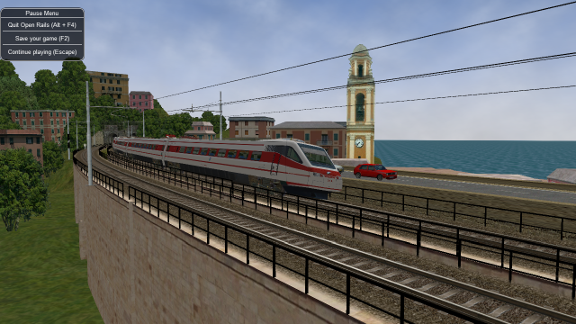
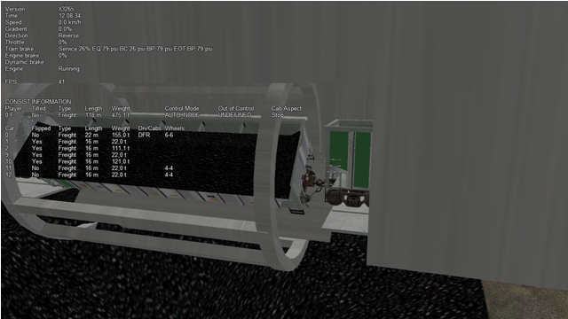
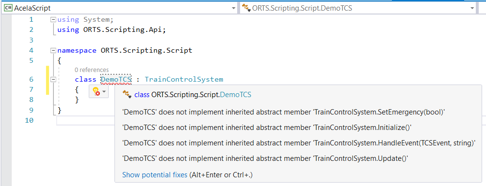

.. _features:

*****************************************
Further Open Rails Rolling Stock Features
*****************************************

For a full list of parameters, see :ref:`Developing OR Content - Parameters and Tokens<parameters_and_tokens>`

Train Engine Lights
===================

OR supports the whole set of lights accepted by MSTS.

Tilting trains
==============

OR supports tilting trains. A train tilts when its .con file name contains the 
*tilted* string: e.g. ``ETR460_tilted.con``.

Freight animations and pickups
==============================

OR implementation of MSTS freight animations and pickups
--------------------------------------------------------

OR supports the freight animations as MSTS does (refueling of water, coal and 
diesel); when refueling from a water column the animation of the column arm is 
supported; coal level in the tender of the player loco decreases with 
consumption and increases when refueling.

The following pickup parameters are taken into consideration by OR for the MSTS 
animations:

- Pickup type
- Speed range
- Anim length

The pickup animation frame rate is computed as the ratio between the number of 
frames defined in the .s file, divided by the Anim length.

As in MSTS, Freight Animations are treated differently for tenders than for 
other vehicles.

Tenders:

- First numeric parameter: shape vertical position when full, relative to its 
  origin, in meters
- Second numeric parameter: shape vertical position when empty, relative to its 
  origin, in meters.
- Third numeric parameter: set to any positive value, or omitted, causes the 
  shape to drop - see below.

  - As long as the second parameter is lower than the first and the third parameter is either omitted or has a non-zero value, the shape will drop, based  on fuel consumption.
  - If the second parameter is not lower than the first, no movement will take place irrespective of the 3rd parameter.

Other Vehicles:

- The numeric parameters are not used.

OR specific freight animations and pickups
------------------------------------------

General
'''''''

In addition to the support of the MSTS freight animations, Open Rails provides a 
large extension for freight animations (called *OR freightanims* below) and 
pickups.

.. index::
   single: ORTSFreightAnims

Following are the native features Open Rails offers:

- two types of OR freightanims: continuous and static
- continuous OR freightanims are related to commodity loads, like coal, or 
  stones: the load level in the trainset varies accordingly to the amount of load
- static OR freightanims are in fact additional shapes that can be attached to 
  the main trainset shape. Such shapes may also include an animation (independent 
  from train behaviour);
- both types of OR freightanims can be present in the same trainset, and can 
  coexist with original MSTS freight animations
- both types of OR freightanims can be related to locomotives or wagons
- more than one static OR freightanim can be present in a single trainset
- a wagon can be loaded with different commodities in different moments
- commodities can be loaded (in pickup stations) and unloaded (in unloading 
  stations).
- wagons supporting continuous OR freightanims may be provided with a physical 
  animation that is triggered when unloading the wagon (like opening its bottom or 
  fully rotating)
- OR freightanims are defined with an ``ORTSFreightAnims ()`` block within the .wag 
  or within the wagon section of an .eng file. It is suggested that this block 
  be defined within an include file as described :ref:`here <physics-inclusions>`.

Continuous OR Freightanims
''''''''''''''''''''''''''

A description of this feature is best achieved by showing an example of an 
include file, (in this case named ``AECX1636.wag`` and located in an Openrails 
subfolder within the wagon's folder). Note that the first line of the file must 
be blank.:: 

    include ( ../AECX1636.wag )

    Wagon (
        ORTSFreightAnims
        (
            MSTSFreightAnimEnabled (0)
            WagonEmptyWeight(22t)
            IsGondola(1)
            UnloadingStartDelay (7)
            FreightAnimContinuous
            (
                IntakePoint ( 0.0 6.0 FreightCoal )
                Shape(Coal.s)
                MaxHeight(0.3)
                MinHeight(-2.0)
                FreightWeightWhenFull(99t)
                FullAtStart(0)
            )
            FreightAnimContinuous
            (
                IntakePoint ( 0.0 6.0 FuelCoal )
                Shape(Coal.s)
                MaxHeight(0.3)
                MinHeight(-2.0)
                FreightWeightWhenFull(99t)
                FullAtStart(0)
            )
        )
    )

.. index::
   single: ORTSFreightAnims
   single: MSTSFreightAnimEnabled
   single: WagonEmptyWeight
   single: IsGondola
   single: UnloadingStartDelay
   single: FreightAnimContinuous

The ``ORTSFreightAnims`` block is composed by a set of general parameters 
followed by the description of the OR freightanims. Here below the general 
parameters are described:

- ``MSTSFreightAnimEnabled`` specifies if eventual MSTS freight animations within 
  the trainset are enabled (1) or not (0). This is useful if one wants to use a 
  wagon where the load is already shown with a (static) MSTS freight animation. In 
  such a case the MSTS freight animation must be disabled, to use the OR 
  freightanim, that allows to modify the vertical position of the freight shape. 
- ``WagonEmptyWeight`` defines the mass of the wagon when empty. If the parameter 
  is missing, the weight of the load is not considered and the weight of the 
  wagon is always the value present in the root .eng file.
- ``IsGondola`` specifies (in case it is set to 1) if the load has to be rotated 
  during unloading, as happens in a gondola wagon. If absent the parameter is set 
  to 0.
- ``UnloadingStartDelay`` specifies, if present, after how many seconds after 
  pressing of the T key the unloading starts. This is due to the fact that some 
  seconds may be needed before the wagon is set in a unloading layout. For 
  example, a gondola must rotate more than a certain number of degrees before the 
  load begins to fall down.

There may be more than one ``FreightAnimContinuous`` subblock, one for each 
possible load type. The parameters of the subblock are described below:

.. index::
   single: IntakePoint
   single: FreightGrain
   single: FreightCoal
   single: FreightGravel
   single: FreightSand
   single: FuelWater
   single: FuelCoal
   single: FuelDiesel
   single: FuelWood
   single: FuelSand
   single: FreightGeneral
   single: FreightLivestock
   single: FreightFuel
   single: FreightMilk
   single: SpecialMail
   single: Shape
   single: MaxHeight
   single: MinHeight
   single: FreightWeightWhenFull
   single: FullAtStart

- ``IntakePoint`` has the same format and the same meaning of the IntakePoint 
  line within the standard MSTS freight animations. Following types of loads are 
  accepted: FreightGrain, FreightCoal, FreightGravel, FreightSand, FuelWater, 
  FuelCoal, FuelDiesel, FuelWood, FuelSand, FreightGeneral, FreightLivestock, 
  FreightFuel, FreightMilk, SpecialMail. All these types of loads can be defined. 
  Some of the pickup types (to right of FuelDiesel) need to be coded in W text files. 
- ``Shape`` defines the path of the shape to be displayed for the load
- ``MaxHeight`` defines the height of the shape over its 0 position at full load
- ``MinHeight`` defines the height of the shape over its 0 position at zero load
- ``FreightWeightWhenFull`` defines the mass of the freight when the wagon is full; 
  the mass of the wagon is computed by adding the mass of the empty wagon to the 
  actual mass of the freight 
- ``FullAtStart`` defines wether the wagon is fully loaded (1) or is empty at game 
  start; if there are more continuous OR freightanims that have ``FullAtStart`` 
  set to 1, only the first one is considered.

As already outlined, the wagon may have a physical animation linked with the 
unload operation.

In a gondola this could be used to rotate the whole wagon, while in a hopper it 
could be used to open the bottom of the wagon.

.. index::
   single: UNLOADINGPARTS
   single: UNLOADINGPARTS1
   single: UNLOADINGPARTS2

The base matrix within the wagon shape that has to be animated must have a name 
that starts with ``UNLOADINGPARTS``. There may be more than one, like 
``UNLOADINGPARTS1``, ``UNLOADINGPARTS2`` and so on. Its frame rate is fixed, 
and is 1 frame per second as for the other types of OR trainset animations.

.. index::
   single: Pickup
   single: FileName
   single: DYNAMIC
   single: Class
   single: PickupType
   single: Description
   single: _FUEL_COAL_

To define a pickup point as an unload point, its shape must be inserted in the 
.ref file of the route as a pickup object . Here is an example of the .ref block::

    Pickup (
        FileName ( rotary_dump.s )
        Shadow ( DYNAMIC )
        Class ( "Track Objects" )
        PickupType ( _FUEL_COAL_ )
        Description ( "Rotary dumper" )
    )

When laying it down in the route with the MSTS Route Editor, its fill rate must 
be set to a negative value.

.. index::
   single: ANIMATED_PARTS
   single: ANIMATED_PARTS1
   single: ANIMATED_PARTS2

Such a pickup (which in reality is an unloader) may be animated too. The base matrix 
within the wagon shape that has to be animated must have a name 
that starts with ``ANIMATED_PARTS``. There may be more than one, like 
``ANIMATED_PARTS1``, ``ANIMATED_PARTS2`` and so on. As for the 
MSTS standard pickups, the pickup animation frame rate is computed as the ratio 
between the number of frames defined in the .s file, divided by the Anim length.

By combining a physical animation of the wagon with an unloader animation 
effects like that of a wagon within a rotary dumper may be achieved, as seen in 
the picture below.

Loading and unloading a trainset is triggered by pressing the ``<T>`` key when 
the trainset is at the pickup/unloader location.

Static OR Freightanims
''''''''''''''''''''''

.. index::
   single: MSTSFreightAnimEnabled
   single: WagonEmptyWeight
   single: ORTSFreightAnims
   single: FreightAnimStatic
   single: SubType
   single: Shape
   single: FreightWeight
   single: Flip
   single: Visibility

Only the two general parameters shown below are used for static OR freightanims::

    MSTSFreightAnimEnabled (0)
    WagonEmptyWeight(22t)

The subblock (to be inserted within the ``ORTSFreightAnims`` block) has the 
following format::

    FreightAnimStatic
    (
        SubType(Default)
        Shape(xxshape.s)
        Offset(XOffset, YOffset, ZOffset)
        FreightWeight(weight)
        Flip()
        Visibility ( "Outside,Cab2D,Cab3D" )
    )

Where:

- ``SubType`` is not currently used
- ``Shape`` is the path of the shape file.
- ``XOffset``, ``YOffset`` and ``ZOffset`` are the offsets of the shape with 
  respect to its zero position, and are useful to place the shape precisely. 
- ``FreightWeight`` is the weight of the specific load. This weight is added to 
  the ``WagonEmptyWeight`` value (if present) to provide the total weight of the 
  wagon. If more static OR freightanims are present, each of their weights is 
  added to define the total weight of the wagon.
- ``Flip()``, if present, flips the shape around its pivot point.
- ``Visibility``, if present, changes the default visibility of the static 
  freightanim. Default is visible only from outside cameras and from any inside 
  camera of locomotives different from the one hosting the static freightanim. 
  If substring ``Outside`` is present, the static freightanim is visible from outside 
  cameras and from any inside camera of locomotives different from the one 
  hosting the static freightanim; if ``Cab2D`` is present, the static freightanim 
  is visible from the 2D cabview camera of loco hosting the freightanim; 
  if ``Cab3D`` is present, the static freightanim is visible from the 3D cabview camera
  of loco hosting the freightanim. 1, 2 or 3 of such substrings 
  may be inserted in the ``Visibility`` line allowing for any combination of visibility.  

Because more static OR freightanims may be defined for a wagon, in the case of a 
container wagon that is able to carry more than one container, even as a double 
stack, it is possible to use a static OR freightanim for each 
container, defining its position within the wagon. 

Physics Variation with Loads
----------------------------

Variable Loads (Continuous Freight Animation)
'''''''''''''''''''''''''''''''''''''''''''''
Open Rails supports the variation of key physics parameters in the wagon as the 
load varies within the wagon. The parameters which can be changed are:

- Mass
- Brake and handbrake force
- Friction (general and wind)
- Centre of Gravity (impacts on curve performance)
- Drive wheel weight (impacts upon locomotive adhesve weight)

Locomotives and tenders that are also configured will have their loads, and the 
above physics parameters adjusted as coal and water is used. The adhesive weight 
(Drive wheel weight) will also be adjusted as the load changes.

To support the correct operation of this feature a known physics starting and 
finishing point is required, ie the state of these parameters under empty conditions, 
and the state of these parameters when the wagon or locomotive is full.

.. index::
   single: ORTSFreightAnims
   single: MSTSFreightAnimEnabled
   single: WagonEmptyWeight
   single: EmptyMaxBrakeForce
   single: EmptyMaxHandbrakeForce
   single: EmptyORTSDavis_A
   single: EmptyORTSDavis_B
   single: EmptyORTSDavis_C
   single: EmptyORTSWagonFrontalArea
   single: EmptyORTSDavisDragConstant
   single: EmptyCentreOfGravity_Y
   single: IsGondola
   single: UnloadingStartDelay
   single: FreightAnimContinuous
   single: IntakePoint
   single: Shape
   single: MaxHeight
   single: MinHeight
   single: FreightWeightWhenFull
   single: FullAtStart
   single: FullMaxBrakeForce
   single: FullMaxHandbrakeForce
   single: FullORTSDavis_A
   single: FullORTSDavis_B
   single: FullORTSDavis_C
   single: FullORTSWagonFrontalArea
   single: FullORTSDavisDragConstant
   single: FullCentreOfGravity_Y

To configure the stock correctly the following empty and full parameters need to be 
included in the ORTSFreightAnims file. Empty values are included in the first block, 
and full values are included in the second code block. A sample code block is shown 
below.::

    ORTSFreightAnims
    (
      MSTSFreightAnimEnabled (0)
      WagonEmptyWeight(10.0t-uk)
      EmptyMaxBrakeForce ( 29.892kN )
      EmptyMaxHandbrakeForce ( 9.964kN )
      EmptyORTSDavis_A ( 580.71 )
      EmptyORTSDavis_B ( 5.0148 )
      EmptyORTSDavis_C ( 0.694782 )
      EmptyORTSWagonFrontalArea ( 10.0m )
      EmptyORTSDavisDragConstant ( 0.0003 )
      EmptyCentreOfGravity_Y ( 1.41 )
      IsGondola(0)
      UnloadingStartDelay (5)
      
    FreightAnimContinuous
     (
      IntakePoint ( 0.0 6.0 FreightCoal )
      Shape(H_Coal.s) 
      MaxHeight(0.1)
      MinHeight(-0.85)
      FreightWeightWhenFull(26.0t-uk)
      FullAtStart( 0 )
      FullMaxBrakeForce ( 89.676kN )
      FullMaxHandbrakeForce ( 9.964kN )
      FullORTSDavis_A ( 748.61 )
      FullORTSDavis_B ( 18.0157 )
      FullORTSDavis_C ( 0.838530 )
      FullORTSWagonFrontalArea ( 15.0m )
      FullORTSDavisDragConstant ( 0.005 )
      FullCentreOfGravity_Y ( 1.8 ) 
     )
  )

.. index::
   single: Shape
   single: MaxHeight
   single: MinHeight
   single: IntakePoint

Note for enclosed wagons, such as covered vans, the freight animation shape may not be required, 
and therefore the parameters Shape, MaxHeight, and MinHeight can be left out of the file.
 
The ``IntakePoint`` statement is necessary to ensure satisfactory operation of the feature.

Open Rails supports the following freight or fuel load types:

- FreightGrain = 1,
- FreightCoal = 2,
- FreightGravel = 3,
- FreightSand = 4,
- FuelWater = 5,
- FuelCoal = 6,
- FuelDiesel = 7,
- FuelWood = 8, 
- FuelSand = 9, 
- FreightGeneral = 10, 
- FreightLivestock = 11, 
- FreightFuel = 12,  
- FreightMilk = 13,   
- SpecialMail = 14  

The key word, e.g. ``FreightMilk``, is used to define the freight type in the ``IntakePoint`` statement, 
whilst the number is used to define the pickup point in the route (Replaces the first number 
in the ``PickupType ( 1 0 )`` statement).

For load variation in a locomotive, a similar configuration is used in regard to the full and empty 
parameters, but as the ``IntakePoint`` statement is normally included elsewhere in the ENG file 
or tender (or auxiliary tender) WAG file these statements can be left out of the freight 
animation section.

For example, the following code block would apply to a steam locomotive (note the absence of the 
``IntakePoint`` statement)::

  ORTSFreightAnims
  (
      WagonEmptyWeight(76.35t-uk)
      EmptyMaxBrakeForce ( 29.892kN )
      EmptyMaxHandbrakeForce ( 9.964kN )
      EmptyORTSDavis_A ( 580.71 )
      EmptyORTSDavis_B ( 5.0148 )
      EmptyORTSDavis_C ( 0.694782 )
      EmptyCentreOfGravity_Y ( 1.41 )
      
    FreightAnimContinuous
     (
      FreightWeightWhenFull(10.34t-uk)
      FullMaxBrakeForce ( 89.676kN )
      FullMaxHandbrakeForce ( 9.964kN )
      FullORTSDavis_A ( 748.61 )
      FullORTSDavis_B ( 18.0157 )
      FullORTSDavis_C ( 0.838530 )
      
      FullCentreOfGravity_Y ( 1.8 ) 
     )
  )

.. index::
   single: FreightWeightWhenFull
   single: ORTSWagonFrontalArea
   single: ORTSDavisDragConstant

Notes:

- Intake points should be defined within the root WAG file
- Intake points, freight animations should not be defined within the INCLUDE file
- Empty weight of tender will be the full mass minus coal and water weight
- ``FreightWeightWhenFull`` will be the sum of the coal and water weight.
- Full physics values will be those values for the combined weight of the tender, water and coal.
- The parameters for wind resistance ( ORTSWagonFrontalArea and ORTSDavisDragConstant ) can be left 
  out if the area and drag does not change between the full and empty states.
   

Static wagons (Static Freight Animations)
'''''''''''''''''''''''''''''''''''''''''
Static wagons can be defined with a full and empty state, however only one freight animation should 
have full values assigned to it,as OR cannot then calculate the known full state.

.. index::
   single: ORTSFreightAnims
   single: MSTSFreightAnimEnabled
   single: WagonEmptyWeight
   single: FreightAnimStatic
   single: SubType
   single: Shape
   single: Offset
   single: FreightWeight
   single: FullMaxBrakeForce
   single: FullMaxHandbrakeForce
   single: FullORTSDavis_A
   single: FullORTSDavis_B
   single: FullORTSDavis_C
   single: FullORTSWagonFrontalArea
   single: FullORTSDavisDragConstant
   single: FullCentreOfGravity_Y

A typical configuration code block will be as follows::

  ORTSFreightAnims
  (
    MSTSFreightAnimEnabled (0)
    WagonEmptyWeight(6.5t-uk)

  FreightAnimStatic
  (
    SubType(Default)
    Shape( 15ft_3p_HumpSheet2.s )
    Offset( 0, 0, 0)
    FreightWeight( 9.0t-uk )
    FullMaxBrakeForce ( 19.43kN ) 
    FullMaxHandbrakeForce ( 6.477kN )
    FullORTSDavis_A ( 358.37 )
    FullORTSDavis_B ( 7.7739 )
    FullORTSDavis_C ( 0.718740 )
    FullORTSWagonFrontalArea ( 15.0m )
    FullORTSDavisDragConstant ( 0.005 )    
    FullCentreOfGravity_Y ( 1.8 ) 
   )
  )
 
The empty values for the wagon will be read from the normal base WAG file paramaters.

.. _features-passengerviewpoints:

Multiple passenger viewpoints
=============================

Additional passenger viewpoints may be added within a carriage that 
is provided with passenger viewpoint.

.. index::
   single: ORTSAlternatePassengerViewPoints
   single: ORTSAlternatePassengerViewPoint
   single: PassengerCabinHeadPos
   single: RotationLimit
   single: StartDirection

Such additional passenger viewpoints are defined within an include file 
with the format shown in 
following example for the legacy oebarcar.wag (located in the 380 folder) 
MSTS wagon::
     
  include ( ../oebarcar.wag )
  
  Wagon (
        ORTSAlternatePassengerViewPoints (
                ORTSAlternatePassengerViewPoint (
                        PassengerCabinHeadPos ( -0.0 2.85801 -6.091 )
                        RotationLimit ( 50 270 0 )
                        StartDirection ( 0 0 0 )      
                )  
                ORTSAlternatePassengerViewPoint (
                        PassengerCabinHeadPos ( -0.5 2.35801 -1.791 )
                        RotationLimit ( 50 270 0 )
                        StartDirection ( 0 0 0 )      
                ) 	
                ORTSAlternatePassengerViewPoint (
                        PassengerCabinHeadPos ( 0.9 2.35801 -1.791 )
                        RotationLimit ( 50 270 0 )
                        StartDirection ( -5 -90 0 )      
                ) 				
        )
  )

At runtime, when in passenger view, the player may pass from one viewpoint to 
the other by pressing Shift-5.

Bell animation
==============

.. index::
   single: ESD_ORTSBellAnimationFPS

Open Rails supports bell animation. The bell animation matrix must be named 
ORTSBELL within the engine's .s file. Its default frame rate is 8 frames per 
second. The default frame rate may be modified through the optional parameter 
ESD_ORTSBellAnimationFPS (n), to be inserted within the .sd file related to the 
.s file. n defines the animation FPS.
It is advisable that the related sound stream within the .sms file is synchronized 
with the visible animation. To accomplish this the .wav file should contain two 
bell strokes, which time interval is equal to the time interval of a bell swing 
from an oscillation end point to the opposite end point. As the first bell stroke 
should not start immediately, but when the bell is about at the maximum of the 
swing, the first stroke within the .wav file should be at the time distance equivalent 
to the oscillation from center point to an oscillation end point. The file should have 
one cue point at its beginning and one after the time interval of a complete bell swing 
forward and backward, and should have a final fadeoff for best result. 

Coupler and Airhose Animation
=============================

Open Rails supports animation of couplers and air hoses. Coupler animation will move the 
couplers and air hoses as the train moves and the coupler slack increases or decreases. 
Couplers will also rotate as the train travels around a curve.

To implement this separate models need to be provided for the couplers and air hoses. A 
separate model for the coupled and uncoupled state is suggested.

To enable coupler animation the following parameters need to be included in the coupler 
code section of the WAG file:

``FrontCouplerAnim`` - Coupler shape to be displayed at the front of the car when it is coupled.
``FrontCouplerOpenAnim`` - Coupler shape to be displayed at the front of the car when it is uncoupled.
``RearCouplerAnim`` - Coupler shape to be displayed at the rear of the car when it is coupled.
``RearCouplerOpenAnim`` - Coupler shape to be displayed at the rear of the car when it is uncoupled

All four of the above will have the following format:

CouplerAnimation ( couplershape.s, x, y, z ) where the coupler shape file name is included along with 
x, y, z values that offset the coupler in the three axis.

For the airhose animation the following parameters must be included in the coupler code section of 
the WAG file:

``FrontAirHoseAnim`` - Air hose shape to be displayed at the front of the car when it is coupled.
``FrontAirHoseDisconnectedAnim`` - Air hose shape to be displayed at the front of the car when it is uncoupled.
``RearAirHoseAnim`` - Air hose shape to be displayed at the rear of the car when it is coupled.
``RearAirHoseDisconnectedAnim`` - Air hose shape to be displayed at the rear of the car when it is uncoupled.

Each of these parameters will have the same format as indicated above for the coupler shapes.

Open rails uses some defaults to calculate the required movement and angles for coupler and air hose 
shape movement, however for greater accuracy the modeler can add specific values such as 
``ORTSLengthAirHose``. In addition the length values suggested in the Derailment Coefficient should 
also be added.

C# engine scripting
===================
.. _features-scripting-csharp:

To simulate especially complex behavior, Open Rails provides a C# scripting 
interface for a number of systems on the player locomotive. Like the Open Rails 
program itself, these scripts are written in .cs files containing C# classes, 
but they are compiled and linked at runtime, so they don't depend on changes 
in the core program itself and can be distributed with rolling stock content. 
Scripts will run if referenced by OR-specific fields in the .eng file.

.. index::
   single: ORTSTrainBrakeController
   single: ORTSEngineBrakeController
   single: ORTSCircuitBreaker
   single: ORTSTractionCutOffRelay
   single: ORTSPowerSupply
   single: ORTSTrainControlSystem

.. list-table:: Currently scriptable locomotive systems
   :widths: 25 37 38
   :header-rows: 1

   * - System
     - C# class
     - .eng block
   * - Train brake controller
     - ``ORTS.Scripting.Api.BrakeController``
     - ``Engine ( ORTSTrainBrakeController ( "DemoBrakes.cs" ) )``
   * - Engine brake controller
     - ``ORTS.Scripting.Api.BrakeController``
     - ``Engine ( ORTSEngineBrakeController ( "DemoBrakes.cs" ) )``
   * - Circuit breaker
     - ``ORTS.Scripting.Api.CircuitBreaker``
     - ``Engine ( ORTSCircuitBreaker ( "DemoBreaker.cs" ) )``
   * - Traction cut-off relay
     - ``ORTS.Scripting.Api.TractionCutOffRelay``
     - ``Engine ( ORTSTractionCutOffRelay ( "DemoRelay.cs" ) )``
   * - Diesel power supply
     - ``ORTS.Scripting.Api.DieselPowerSupply``
     - ``Engine ( ORTSPowerSupply ( "DemoPower.cs" ) )``
   * - Electric power supply
     - ``ORTS.Scripting.Api.ElectricPowerSupply``
     - ``Engine ( ORTSPowerSupply ( "DemoPower.cs" ) )``
   * - Passenger car power supply
     - ``ORTS.Scripting.Api.PassengerCarPowerSupply``
     - ``Wagon ( ORTSPowerSupply ( "DemoPower.cs" ) )``
   * - Train Control System
     - ``ORTS.Scripting.Api.TrainControlSystem``
     - ``Engine ( ORTSTrainControlSystem ( "DemoTCS.cs" ) )``

Scripts reside in a ``Script`` subfolder within the engine's folder and must 
contain a class named after the script's own filename. For example, if the 
script's filename is ``AmtrakTCS.cs``, OR will search for a single class named 
``AmtrakTCS``. (It is also possible to place the script in another location, 
such as a ``Common.Script`` folder in the ``TRAINSET`` folder, by prepending the 
appropriate amount of parent directory tokens ``..\`` relative to the engine's 
``Script`` folder.) The script's code runs on the UpdaterProcess thread. This 
example, which would need to be placed in a file named ``DemoTCS.cs``, 
illustrates the minimum code required for a Train Control System script::

  using System;
  using ORTS.Scripting.Api;

  namespace ORTS.Scripting.Script
  {
      class DemoTCS : TrainControlSystem
      {
          public override void HandleEvent(TCSEvent evt, string message) {}
          public override void Initialize()
          {
              Console.WriteLine("TCS activated!");
          }
          public override void SetEmergency(bool emergency) {}
          public override void Update() {}
      }
  }

Observe that the script's class *must* reside in the ``ORTS.Scripting.Script`` 
namespace and that it subclasses the abstract class of the desired system. It 
also references external assemblies with ``using`` directives. OR makes the 
following .NET assemblies available to scripts:

- System
- System.Core
- ORTS.Common
- Orts.Simulation

Scripts communicate with the simulator by invoking methods in the base class. 
For example, this script might invoke the ``TrainLengthM()`` method of the 
``TrainControlSystem`` class, which returns the length of the player train. More 
methods are available in the ``ORTS.Scripting.Api.AbstractScriptClass`` class, 
which ``TrainControlSystem`` is itself a subclass of.

Finally, if a script contains a syntax or typing error, OR will log an exception 
during the loading process and run the simulation without it.

Developing scripts with Visual Studio
-------------------------------------

While it is certainly possible to develop scripts with a plain text editor, the 
code completion and debugging aids available in an IDE like Visual Studio make 
for a vastly more comfortable programming experience. If you have a development 
environment set up to build Open Rails, you can use Visual Studio to edit your 
scripts with these creature comforts. What follows is a suggested workflow:

#. First, in your copy of the OR source code, make a copy of your 
   ``Source\ORTS.sln`` file. Keep it in the ``Source\`` folder, but give it a 
   novel name like ``ORTS_Scripts.sln``. (You could also modify the original 
   ORTS solution, but then you'd have to remember not to check it in to source 
   control.) Add a new project to the solution and select the empty .NET 
   project.

#. In the configuration dialog, set the new project to be added to the existing 
   solution, set its location to be the folder of the engine you're scripting, 
   and set its name to "Script". (For now, you must use "Script", but you can 
   rename the project after it's created.) You can leave the .NET 
   framework version set to its default. Then, create the project.

   .. image:: images/features-scripting1.png
     :width: 600

#. The new project folder becomes the very ``Script`` subfolder that OR will 
   search for scripts. Add references to the ORTS.Common and Orts.Simulation 
   assemblies, which will enable IntelliSense features inside your editor when 
   you edit scripts. You may now rename the project as you like (which will not 
   rename the folder) and delete the pregenerated App.config file.

   .. image:: images/features-scripting2.png
     :width: 300

#. Finally, open the Build Configuration Manager and set the new script project 
   not to build for both the Debug and Release configurations.

   .. image:: images/features-scripting3.png
     :width: 600

With this setup, Visual Studio will type-check your scripts and make suggestions 
when you use the Open Rails API. You can also set breakpoints within your 
script, which will be caught by RunActivity.exe if run inside Visual Studio.

Note that Visual Studio uses relative paths, so if you ever move any folders, 
you'll need to fix the references by hand.

Brake controller
----------------

The brake controller script customizes the behavior of the train's brakes, 
allowing for much greater systems fidelity compared to what is possible with 
the model inherited from MSTS. For this purpose, the script can read the state 
of the brake controls and set the air pressures of the brake reservoirs.

.. index::
   single: ORTSTrainBrakeController
   single: ORTSEngineBrakeController

Use the following .eng parameter to load a brake controller script::

  Engine (
      ORTSTrainBrakeController ( "YourBrakes.cs" )
  )

or::

  Engine (
      ORTSEngineBrakeController ( "YourBrakes.cs" )
  )

The .cs extension is optional. "MSTS" loads the default MSTS-compatible 
implementation, so do `not` use this name for your own script.

.. _features-scripting-cb:

Circuit breaker
---------------

Available for electric locomotives only. The circuit breaker script controls 
the behavior of the locomotive's 
:ref:`circuit breaker <physics-circuit-breaker>`.

.. index::
   single: ORTSCircuitBreaker

Use the following .eng parameter to load a circuit breaker script::

  Engine (
      ORTSCircuitBreaker ( "YourCB.cs" )
      ORTSCircuitBreakerClosingDelay ( 2s )
  )

``ORTSCircuitBreaker`` refers to the circuit breaker script in the engine's ``Script`` 
subfolder. For this field, the .cs extension is optional. "Automatic" and "Manual" load the generic OR 
circuit breaker implementation, so do `not` use these names for your own script.

``ORTSCircuitBreakerClosingDelay`` refers to the delay between the closing command of the circuit breaker
and the effective closing of the circuit breaker.

.. _features-scripting-tcor:

Traction cut-off relay
----------------------

Available for diesel locomotives only. The traction cut-off relay script controls 
the behavior of the locomotive's 
:ref:`traction cut-off relay <physics-traction-cut-off-relay>`.

.. index::
   single: ORTSTractionCutOffRelay

Use the following .eng parameter to load a traction cut-off relay script::

  Engine (
      ORTSTractionCutOffRelay ( "YourTCOR.cs" )
      ORTSTractionCutOffRelayClosingDelay ( 2s )
  )

``ORTSTractionCutOffRelay`` refers to the traction cut-off relay script in the engine's ``Script`` 
subfolder. For this field, the .cs extension is optional. "Automatic" and "Manual" load the generic OR 
traction cut-off relay implementation, so do `not` use these names for your own script.

``ORTSTractionCutOffRelayClosingDelay`` refers to the delay between the closing command of the traction cut-off relay
and the effective closing of the relay.

.. _features-scripting-powersupply:

Diesel and electric power supply
--------------------------------

Available for diesel and electric locomotives only. The power supply script determines 
whether or not the locomotive is serviceable (see also the description of :ref:`the diesel power supply <physics-diesel-power-supply>`
and :ref:`the electric power supply <physics-electric-power-supply>`) given 
the current line voltage, pantograph position, circuit breaker state, etc.
It is also capable of forbidding some operations related to the power supply if some conditions
are not met.

.. index::
   single: ORTSPowerSupply
   single: ORTSPowerOnDelay
   single: ORTSAuxPowerOnDelay

Use the following .eng parameter to load a power supply script::

  Engine (
      ORTSPowerSupply ( "YourEPS.cs" )
      ORTSPowerOnDelay ( 5s )
      ORTSAuxPowerOnDelay ( 10s )
  )

``ORTSPowerSupply`` refers to the power supply script in the engine's ``Script`` 
subfolder. For this field, the .cs extension is optional. "Default" will load the generic OR power supply 
implementation, so do `not` use this name for your own script.

``ORTSPowerOnDelay`` refers to the delay between the closing of the circuit breaker or the traction cut-off relay
and the availability of the power for traction.

``ORTSAuxPowerOnDelay`` refers to the delay between the closing of the circuit breaker or the traction cut-off relay
and the availability of the power for auxiliary systems.

.. _features-scripting-passenger-car-power-supply:

Passenger car power supply
--------------------------

Available for passenger cars using electric heating. The power supply script determines
whether or not the systems of the cars have power and calculates the power consumption
on the :ref:`Electric Train Supply <physics-electric-train-supply>`.

.. index::
   single: ORTSPowerSupply
   single: ORTSPowerOnDelay
   single: ORTSPowerSupplyContinuousPower
   single: ORTSPowerSupplyHeatingPower
   single: ORTSPowerSupplyAirConditioningPower
   single: ORTSPowerSupplyAirConditioningYield
   single: ORTSHeatingCompartmentTemperatureSet

If the locomotive is a diesel locomotive, the power consumed by the cars is no longer available for traction.

Use the following .wag parameter to load a power supply script::

  Wagon (
      ORTSPowerSupply ( "YourEPS.cs" )
      ORTSPowerOnDelay ( 5s )
      ORTSPowerSupplyContinuousPower ( 500W )
      ORTSPowerSupplyHeatingPower ( 2kW )
      ORTSPowerSupplyAirConditioningPower ( 3kW )
      ORTSPowerSupplyAirConditioningYield ( 0.9 )
      ORTSHeatingCompartmentTemperatureSet ( 20degC )
  )

``ORTSPowerSupply`` refers to the power supply script in the wagon's ``Script`` 
subfolder. For this field, the .cs extension is optional. "Default" will load the generic OR power supply 
implementation, so do `not` use this name for your own script.

``ORTSPowerOnDelay`` refers to the delay between the availability of the power on the Electric Train Supply
cable and the availability of the power for the systems (for example, start-up of the static power converter).

``ORTSPowerSupplyContinuousPower`` refers to the power which is consumed continuously (for example, battery chargers, lights, etc.).

``ORTSPowerSupplyHeatingPower`` refers to the power which is consumed when the heating is active.

``ORTSPowerSupplyAirConditioningPower`` refers to the power which is consumed when the air conditioning (cooling) is active.

``ORTSPowerSupplyAirConditioningYield`` refers to the yield of the air conditioning (ratio of the heat flow rate
by the electric power of the air conditioning system).

``ORTSHeatingCompartmentTemperatureSet`` refers to the desired temperature inside the car.

.. _features-scripting-tcs:

Train Control System
--------------------

General
'''''''

The Train Control System, or TCS, script is intended to model train safety and 
cab signalling systems. It can manipulate the locomotive's controls and speed 
limit displays, impose penalty brake applications, read upcoming signal aspects 
and speed limits, and play warning sounds.

.. index::
   single: ORTSTrainControlSystem
   single: ORTSTrainControlSystemParameters
   single: ORTSTrainControlSystemSound

Use the following .eng parameters to load a TCS script::

  Engine (
      ORTSTrainControlSystem ( "YourTCS.cs" )
      ORTSTrainControlSystemParameters ( "YourTCS.ini" )
      ORTSTrainControlSystemSound ( "YourTCSSounds.sms" )
  )

``ORTSTrainControlSystem`` refers to the TCS script in the engine's ``Script`` 
subfolder. For this field, the .cs extension is optional.

``ORTSTrainControlSystemParameters``, an optional field, refers to an .ini file, 
also in the ``Script`` subfolder, whose parameters will be made available to the 
TCS script through the ``GetBoolParameter()``, ``GetIntParameter()``, 
``GetFloatParameter()``, and ``GetStringParameter()`` methods of the 
``TrainControlSystem`` class. This .ini file provides for easy customization of 
the behavior of the TCS script by end users.

This is an excerpt from an .ini file:

.. code-block:: ini

  [General]
  AWSMonitor=true
  EmergencyStopMonitor=false
  VigilanceMonitor=true
  OverspeedMonitor=false
  DoesBrakeCutPower=true
  BrakeCutsPowerAtBrakeCylinderPressureBar=
  [AWS]
  Inhibited=false
  WarningTimerDelayS=3
  BrakeImmediately=false
  TrainStopBeforeRelease=false
  ActivationOnSpeedLimitReduction=true
  SpeedLimitReductionForActivationMpS=11.176
  BeaconDistanceToPostM=1186
  AppliesCutsPower=true

As can be seen, the .ini file is divided in subgroups. As an example, parameter 
[AWS]Inhibited would be read by following line of code in the script :

.. code-block:: csharp

  AWSInhibited = GetBoolParameter("AWS", "Inhibited", false);

where the final ``false`` is the default value, if the parameter can't be found.

.. index::
   single: ORTSTrainControlSystemSound

``ORTSTrainControlSystemSound``, an optional field, refers to a .sms file either 
in the engine's ``SOUND`` folder or in the global ``SOUND`` folder. If provided, 
OR will load this sound library alongside the locomotive's standard cab sounds. 
The TCS script can play back sounds using any of the ``TriggerSound...`` methods 
of the base class, which in turn activate the TCS-related 
:ref:`discrete triggers <sound-discrete>` numbered from 109 through 118.

8 further generic discrete sound triggers are available, named GenericEvent1 to 
GenericEvent8 and accessible to the script by lines like following one:

.. code-block:: csharp

  SignalEvent(Event.GenericEvent1);

Access to the Simulation methods and variables
''''''''''''''''''''''''''''''''''''''''''''''
The abstract class for the TCS scripts provides a significant amount of 
methods to access variables of interest for the TCS: as an example:

.. code-block:: csharp

        public Func<int, Aspect> NextSignalAspect;

might be called within the script as follows:

.. code-block:: csharp

        var nextSignalAspect = NextSignalAspect(1);

which would return the aspect of the second normal signal in front of 
the player train.

However it is quite impossible to foresee all needs that a TCS script has 
and to provide a method for everyone of these needs. For this reason 
following method is available:

.. code-block:: csharp

    public Func<MSTSLocomotive> Locomotive;

which returns a handle for the player locomotive instance of the MSTSLocomotive 
class. Through such handle all public classes, methods and variables of 
the OR Simulation environment can be accessed within the script. 

The Train Control System class provides the ETCSStatus field, which controls the information
to be displayed in the ETCS DMI. For example, the following block orders the DMI to show the circular speed gauge in yellow colour as the train approaches a speed restriction:

.. code-block:: csharp
    
    ETCSStatus.CurrentMonitor = Monitor.TargetSpeed;
    ETCSStatus.CurrentSupervisionStatus = SupervisionStatus.Indication;
    ETCSStatus.TargetDistanceM = 1234.5f;
    ETCSStatus.AllowedSpeedMpS = 50;
    ETCSStatus.InterventionSpeedMpS = 52.5f;
    ETCSStatus.TargetSpeedMpS = 25;

.. index::
   single: MultiStateDisplay
   single: Type
   single: Position
   single: Graphic
   single: States
   single: State
   single: Style
   single: SwitchVal

Emergency braking triggered by the simulator
''''''''''''''''''''''''''''''''''''''''''''

The emergency brakings triggered by the simulator are always sent to the TCS script.

Two functions are used to transmit this information:

.. code-block:: csharp

    public override void HandleEvent(TCSEvent evt, string message)

The events sent are ``EmergencyBrakingRequestedBySimulator``, ``EmergencyBrakingReleasedBySimulator`` and ``ManualResetOutOfControlMode``.
For the first event, the reason of the emergency braking is also sent:

- ``SPAD``: The train has passed a signal at danger at the front of the train
- ``SPAD_REAR``: The train has passed a signal at danger at the rear of the train
- ``MISALIGNED_SWITCH``: The train has trailed a misaligned switch
- ``OUT_OF_AUTHORITY``: The train has passed the limit of authority
- ``OUT_OF_PATH``: The train has ran off its allocated path
- ``SLIPPED_INTO_PATH``: The train has slipped back into the path of another train
- ``SLIPPED_TO_ENDOFTRACK``: The train has slipped off the end of the track
- ``OUT_OF_TRACK``: The train has moved off the track
- ``OTHER_TRAIN_IN_PATH``: Another train has entered the train's path
- ``SLIPPED_INTO_TURNTABLE``: The train has entered a misaligned turntable
- ``TRAIN_ON_MOVING_TURNTABLE``: The train has started moving on a moving turntable

.. code-block:: csharp

    public override void SetEmergency(bool emergency)

This function is deprecated and will be deleted in a future version. The parameter indicates if the emergency braking is requested (true) or released (false).

Generic cabview controls
''''''''''''''''''''''''
Often Train Control Systems have a quite sophisticated DMI (driver-machine 
interface), which can include a (touch screen) display and buttons.
Being the display fields and icons and the buttons specific of every TCS, 
a set of generic cabview controls are available, which can be customized 
within the TCS script.
More precisely 48 generic cabview controls, named from ORTS_TCS1 to ORTS_TCS48 
are available. All 48 may be used as two state or multistate controls,  
like e.g.::

    MultiStateDisplay (
			Type ( ORTS_TCS13 MULTI_STATE_DISPLAY )
			Position ( 405 282.3 36.3 20.8 )
			Graphic ( ../../Common.Cab/Cruscotto_SCMT/Ripetizioni_estese.ace )
			States ( 6 3 2
				State (
					Style ( 0 )
					SwitchVal ( 0 )
				)
				State (
					Style ( 0 )
					SwitchVal ( 1 )
				)
				State (
					Style ( 0 )
					SwitchVal ( 2 )
				)
				State (
					Style ( 0 )
					SwitchVal ( 3 )
				)
				State (
					Style ( 0 )
					SwitchVal ( 4 )
				)
				State (
					Style ( 0 )
					SwitchVal ( 5 )
				)
      )
    )

.. index::
   single: TwoState
   single: Type
   single: Graphic
   single: NumFrames
   single: Style
   single: MouseControl

Each one of the first 32 can be also used as Two-state commands/displays, like e.g.::

		TwoState (
			Type ( ORTS_TCS7 TWO_STATE )
			Position ( 377 298 9 7.8 )
			Graphic ( ../../Common.Cab/Cruscotto_SCMT/Button_SR.ace )
			NumFrames ( 2 2 1 )
			Style ( PRESSED )
			MouseControl ( 1 )
		)

The commands are received asynchronously by the script through this method:

.. code-block:: csharp

    public override void HandleEvent(TCSEvent evt, string message)

Where evt may be TCSEvent.GenericTCSButtonPressed or TCSEvent.GenericTCSButtonReleased 
and message is a string ranging from "0" to "31", which correspond to controls from 
ORTS_TCS1 to ORTS_TCS32.
The commands may only be triggered by the mouse, except the first two which may also be 
triggered by key combinations ``Ctrl,`` (comma) and ``Ctrl.`` (period).
Here's a code excerpt from the script which manages the commands:

.. code-block:: csharp

        public override void HandleEvent(TCSEvent evt, string message)
        {
            if (message == String.Empty)
            {
                switch (evt)
                {
                    case ...
						...
                        break;

                    case ...
						...
                        break;
                 }
            }
            else
            {
                var commandEvent = TCSCommandEvent.None;
                var messageIndex = 0;
                if (Int32.TryParse(message, out messageIndex))
                {
                    commandEvent = (TCSCommandEvent)(messageIndex + 1);
                    switch (evt)
                    {
                        case TCSEvent.GenericTCSButtonPressed:
                            TCSButtonPressed[(int)commandEvent] = true;
                            break;
                        case TCSEvent.GenericTCSButtonReleased:
                            TCSButtonPressed[(int)commandEvent] = false;
                            TCSButtonReleased[(int)commandEvent] = true;
                            break;
                    }
                }
            }
        }

Within the Update method of the script TCSButtonPressed and 
TCSButtonReleased may be tested, e.g.:

.. code-block:: csharp

    if (TCSButtonPressed[(int)(TCSCommandEvent.Button_Ric)])

After having tested it, TCSButtonPressed should be set to false by the 
script code.

You can also use ``TCSEvent.GenericTCSSwitchOff`` and ``TCSEvent.GenericTCSSwitchOn`` for a cabview control representing a switch (style ONOFF instead of PRESSED in the CVF file).

To request a display of a cabview control, method:

.. code-block:: csharp

    public Action<int, float> SetCabDisplayControl; 

has to be used, where ``int`` is the index of the cab control (from 0 to 47 
corresponding from ORTS_TCS1 to ORTS_TCS48), and ``float`` is the value to be 
used to select among frames.

When the player moves the mouse over the cabview controls linked to commands, 
the name of such control shortly appears on the display, like e.g. "speedometer", 
as a reminder to the player. 
In case of these generic commands, strings from "ORTS_TCS1" to "ORTS_TCS32" would 
appear, which aren't mnemonic at all. Therefore following method is available:

.. code-block:: csharp

    public Action<int, string> SetCustomizedCabviewControlName; 

which may be used this way within the script:

.. code-block:: csharp

    // Initialize customized TCS cabview control names
    SetCustomizedCabviewControlName(0, "AWS acknowledge"); // Sets the name "AWS acknowledge" for the cabview control ORTS_TCS1

so that, instead of ORTS_TCSnn the related mnemonic string is displayed.

Helper classes
--------------
3 helper classes are available in the ``Orts.Scripting.Api`` namespace:
  * A timer class
  * An odometer class
  * A blinker class

Timer
'''''
The timer can be used to execute some code after a time has elapsed.
In order to use the timer, you have to create a property in your script class in order to store the object.

.. code-block:: csharp

    public Timer MyTimer;

In the constructor of your script class, you have to instanciate the object and set the delay of the timer.

.. code-block:: csharp

    MyTimer = new Timer(this);
    MyTimer.Setup(5f); // Sets the timer's delay to 5 seconds

Then, when you want to start the timer, use the ``Start`` function.

.. code-block:: csharp

    MyTimer.Start();

If you want to reset the timer, use the ``Stop`` function.

.. code-block:: csharp

    MyTimer.Stop();

When the delay has been reached, the ``Triggered`` property of the timer will become ``true``.

.. code-block:: csharp

    if (MyTimer.Triggered)
    {
        // Do something
    }

Please note that, when the timer is stopped, the ``Triggered`` property is ``false``.

Odometer
''''''''
The odometer can be used to execute some code after a distance has been traveled by the train.
In order to use the odometer, you have to create a property in your script class in order to store the object.

.. code-block:: csharp

    public Odometer MyOdometer;

In the constructor of your script class, you have to instanciate the object and set the distance at which the odometer will be triggered.

.. code-block:: csharp

    MyOdometer = new Odometer(this);
    MyOdometer.Setup(200f); // Sets the odometer's trigger value at 200 meters

Then, when you want to start the odometer, use the ``Start`` function.

.. code-block:: csharp

    MyOdometer.Start();

If you want to reset the odometer, use the ``Stop`` function.

.. code-block:: csharp

    MyOdometer.Stop();

When the distance has been reached, the ``Triggered`` property of the odometer will become ``true``.

.. code-block:: csharp

    if (MyOdometer.Triggered)
    {
        // Do something
    }

Please note that, when the odometer is stopped, the ``Triggered`` property is ``false``.

Blinker
'''''''
The blinker can be used to make a cabview control blink.
In order to use the blinker, you have to create a property in your script class in order to store the object.

.. code-block:: csharp

    public Blinker MyBlinker;

In the constructor of your script class, you have to instanciate the object and set the frequency at which the cabview control will blink.

.. code-block:: csharp

    MyBlinker = new Blinker(this);
    MyBlinker.Setup(6f); // Sets the blinker frequency to 6 Hz

Then, when you want to start the blinker, use the ``Start`` function.

.. code-block:: csharp

    MyBlinker.Start();

If you want to reset the blinker, use the ``Stop`` function.

.. code-block:: csharp

    MyBlinker.Stop();

The blinker ``On`` property will alternate between ``true`` and ``false`` at the set frequency.

.. code-block:: csharp

    SetCabDisplayControl(0, MyBlinker.On ? 1 : 0);

Please note that, when the blinker is stopped, the ``On`` property is ``false``.

