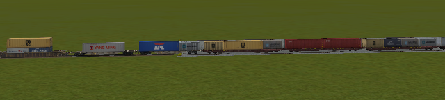

.. _features:

*****************************************
Further Open Rails Rolling Stock Features
*****************************************

For a full list of parameters, see :ref:`Developing OR Content - Parameters and Tokens<parameters_and_tokens>`

Train Engine Lights
===================

OR supports the whole set of lights accepted by MSTS, MSTS-bin, and adds many new
options to enhance the variety and complexity of lighting systems that can be recreated.

Lights with multiple conditions
-------------------------------

In the original MSTS light implementation, each light could only have one set of
activation conditions. If the same light were to be activated in multiple situations,
(for example, a light which should turn on for both the front and rear units)
the entire light would need to be included twice, just with different conditions.

.. index::
   single: Conditions

Open Rails now allows for a single light to have multiple ``Conditions ()`` blocks.
If *any* one set of conditions is fulfilled, the light will be enabled. If no conditions
are specified, the light will be assumed to be on always. An example of how this can
be used to simplify ``Lights`` implementation is included below::

		Light	(
			comment( Nose light bright )
			Conditions	(
				Headlight ( 3 )
				Unit ( 2 )
			)
			FadeIn	( 0.5 )
			FadeOut	( 0.5 )
			States	(	1
				State	(
					LightColour ( FFffffe6 )
					Radius ( 0.6 )
					Position ( 0.0 4.12 6.55 )
				)
			)
		)
		Light	(
			comment( Nose light bright DPU )
			Conditions	(
				Headlight ( 3 )
				Unit ( 4 )
			)
			FadeIn	( 0.5 )
			FadeOut	( 0.5 )
			States	(	1
				State	(
					LightColour ( FFffffe6 )
					Radius ( 0.6 )
					Position ( 0.0 4.12 6.55 )
				)
			)
		)

This set of two lights can be simplified to one light like this::
        
		Light	(
			comment( Nose light bright )
			Conditions	(
				Headlight ( 3 )
				Unit ( 2 )
			)
			Conditions	(
				Headlight ( 3 )
				Unit ( 4 )
			)
			FadeIn	( 0.5 )
			FadeOut	( 0.5 )
			States	(	1
				State	(
					LightColour ( FFffffe6 )
					Radius ( 0.6 )
					Position ( 0.0 4.12 6.55 )
				)
			)
		)

Both of these snippets produce the same result: a light that turns on when the 
headlights are bright and the unit is first, or the last unit reversed (ie:
distributed power). However, by specifying multiple conditions, the second
implementation takes up much less space and guarentees that both modes of the
light have the exact same ``States``. There is no hard limit on the number
of conditions a light can have.

Lights attached to shape sub-objects
------------------------------------

The standard lighting configuration attaches all lights to the main body of the
locomotive or wagon. While this allows lights to move and rotate as the vehicle
itself moves, the approach has proven insufficient for more complicated rail
vehicles such as articulated steam locomotives.

.. index::
   single: ShapeHierarchy

To facilitate lighting on such locomotives and wagons, Open Rails now allows
for attachment of lights to any sub-object of the shape file. With the
``ShapeHierarchy`` token placed in a ``Light ()`` block, the object the light
will rotate and translate with can be defined using the hierarchy name of said
object. Tools such as Shape Viewer can be used to determine the hierarchy name
of a particular object in the shape file. For example, *"BOGIE1"* is the standard
name for the frontmost bogie. A light attached to this bogie could be created
like so::

	Light	(
		comment( CNDR Side Front Truck Light )
		ShapeHierarchy ( "BOGIE1" )
		States	(	1
			State	(
				LightColour ( 91fedf91 )
				Position ( -1.427 0.583 -0.330 )
				Azimuth ( -90 -90 -90 )
				Radius ( 0.2 )
			)
		)
	)

Be aware that the ``Position`` of a light is measured relative to the center of
the object to which the light is attached, not to the center of the locomotive
itself. Furthermore, the naming of shape parts is not consistent between all
shape files. If the shape name entered in ``ShapeHierarchy`` is invalid, a
warning will be produced in the log file and the light will attach to the
main body of the locomotive or wagon.

If ``ShapeHierarchy`` is not specified in a light, the light will attach
to the main body of the locomotive or wagon by default.

.. _features-light-conditions:

Open Rails specific lighting conditions
---------------------------------------

Open Rails also adds a set of new lighting conditions which offer additional
flexibility in creating detailed light behaviors. Note that each of these
must be inside the ``Conditions ()`` block of a ``Light ()`` in the .eng/.wag
file to function. All conditions are optional and can be mixed and matched
as needed, though only one of each condition can be included per conditions
block!

.. index::
   single: Conditions(ORTSBattery

Battery
'''''''

The light condition ``ORTSBattery`` allows a light to respond to the state of
the :ref:`battery subsystem <physics-battery>`. The valid settings
and associated conditions for the light to turn *on* are as follows:

- ``ORTSBattery ( 0 )`` Battery state is ignored (default)
- ``ORTSBattery ( 1 )`` Battery switch must be on
- ``ORTSBattery ( 2 )`` Battery switch must be off

.. index::
   single: Conditions(Brake

Friction Brakes
'''''''''''''''

The ``Brake`` condition can be used to create brake indicator lights
which turn on or off when the friction brakes are applied. Dynamic brakes
have no effect.

- ``Brake ( 0 )`` Brake application/release is ignored (default)
- ``Brake ( 1 )`` Brakes must be released
- ``Brake ( 2 )`` Brakes must be applied

.. index::
   single: Conditions(Reverser

Reverser
''''''''

``Reverser`` is a very powerful condition that gives lights the ability
to be enabled by the selected direction of travel. Note that a flipped
locomotive or wagon will automatically flip the sensed reverser setting
to ensure lights shine in the correct direction. Also, steam locomotive
cutoff values between -10% and 10% will be detected as 'neutral'.

- ``Reverser ( 0 )`` Reverser direction is ignored (default)
- ``Reverser ( 1 )`` Reverser direction must be forward
- ``Reverser ( 2 )`` Reverser direction must be reverse
- ``Reverser ( 3 )`` Reverser direction must be neutral
- ``Reverser ( 4 )`` Reverser direction must be forward or reverse
- ``Reverser ( 5 )`` Reverser direction must be forward or neutral
- ``Reverser ( 6 )`` Reverser direction must be reverse or neutral

.. index::
   single: Conditions(Doors

Passenger Doors
'''''''''''''''

Many pieces of passenger rolling stock have indicator lights to inform
the crew :ref:`passenger doors <features-passenger-doors>` are open. The
``Doors`` condition is suited to this type of lighting.

- ``Doors ( 0 )`` Passenger doors are ignored (default)
- ``Doors ( 1 )`` Passenger doors must all be closed
- ``Doors ( 2 )`` Passenger doors on the left must be open
- ``Doors ( 3 )`` Passenger doors on the right must be open
- ``Doors ( 4 )`` Passenger doors on both sides must be open
- ``Doors ( 5 )`` Passenger doors on either the left or right must be open

.. index::
   single: Conditions(Horn
   single: ORTSHornLightsTimer

Horn (Automatic Flashing Ditch Lights)
''''''''''''''''''''''''''''''''''''''

Open Rails now supports the ability to configure flashing ditch lights
(or any other type of horn activated auxiliary lighting)
with the ``Horn`` light condition. When the horn is sounded, lights
with the horn condition will (de)activate, and remain (de)activated
for a time after the horn stops sounding. The standard timer is 30
seconds, but can be changed by placing a ``ORTSHornLightsTimer``
token in the ``engine()`` section of the locomotive with flashing lights.
If ``ORTSHornLightsTimer( 0s )`` is set, the lights will only activate
while the horn is sounding and immediately stop afterward.

- ``Horn ( 0 )`` Horn state is ignored (default)
- ``Horn ( 1 )`` Horn must not have been sounded recently
- ``Horn ( 2 )`` Horn must have been sounded recently

Note that the solid ditch lights state should use ``Horn(1)`` to
prevent these lights overlapping the flashing state. An example
implementation of a flashing ditch light's conditions (many other
details removed for clarity) is provided below::

		Light	(
			comment( Right ditch light )
			Conditions	(
				Headlight ( 3 )
				Unit ( 2 )
				Horn ( 1 )
			)
			States	(	1
				State	(
					LightColour ( FFFFFFFF )
					Radius ( r )
					Position ( x y z )
				)
			)
		)
		Light	(
			comment( Right ditch light Flashing )
			Conditions	(
				Headlight ( 3 )
				Unit ( 2 )
				Horn ( 2 )
			)
			States	(	2
				State	(
					LightColour ( FFFFFFFF )
					Radius ( r )
					Transition ( 1 )
					Duration ( 0.5 )
					Position ( x y z )
				)
				State	(
					LightColour ( FFFFFFFF )
					Radius ( r )
					Transition ( 1 )
					Duration ( 0.5 )
					Position ( x y z )
				)
			)
		)

.. index::
   single: Conditions(Bell
   single: ORTSBellLightsTimer

Bell (Automatic Flashing Ditch Lights)
''''''''''''''''''''''''''''''''''''''

Similar to ``Horn``, the ``Bell`` condition is useful for replicating
systems with flashing lights activated by the bell, though this is
less common than using the horn. Like with the horn, a timer can be
set to keep the lights activated for a time after the bell starts ringing.
Unlike with the horn, this timer is set to 0 seconds by default, meaning
the lights will only remain (de)activated while the bell is currently ringing.
If a timer is desired, ``engine(ORTSBellLightsTimer`` can be used in
the locomotive's .eng file.

- ``Bell ( 0 )`` Bell state is ignored (default)
- ``Bell ( 1 )`` Bell must not have been ringing recently
- ``Bell ( 2 )`` Bell must have been ringing recently or is ringing now

.. index::
   single: Conditions(Brake

Multiple Unit Configuration (Locomotives Only)
''''''''''''''''''''''''''''''''''''''''''''''

Some MU systems send headlight signals through the wires connecting locomotives,
but do not or cannot send these signals through wagons/coaches to remote
locomotives (eg: distributed power, banking locomotives, etc.). The ``MU``
light condition allows for some flexibility in adjusting light behavior depending
on a locomotive's physical connection to the lead locomotive (or lack thereof).
While meant for locomotives only, wagons are always treated as remote locomotives
for the purposes of calculation.

- ``MU ( 0 )`` Locomotives's connection to the lead locomotive is ignored (default)
- ``MU ( 1 )`` Locomotive must be the lead locomotive itself
- ``MU ( 2 )`` Locomotive must be in the same group of locomotives as the lead locomotive
    - This condition will also be fulfilled for the lead locomotive itself.
- ``MU ( 3 )`` Locomotive must be in a different group to the lead locomotive

Multiple type locomotive light glows
------------------------------------

Introduction
''''''''''''

As a default all OR (and MSTS) locomotives use the same texture to reproduce 
the glow of their lights. This however doesn't allow to easily implement non-round 
or LED array lights, neither to provide special glowing effects.

This feature allows to specifiy customized light glow textures for the locomotives. 
If nothing is specified, the standard light glow texture is used. Moreover in the ``Content`` 
folder, two light glow textures are present: the "historical" one, and a new one, 
more realistic. As a default the "historical" light glow texture is used, for backwards 
compatibility; however adding a line to the Lights block in the .eng file the "new" light 
glow texture is taken. Customized light glow textures can be either used for all lights 
of a loco, or only for a subset of them. Different lights in the same locomotive 
may have different customized light glow textures.

Detailed spec
'''''''''''''

1) In the ``Content`` folder there is the default ``LightGlow.png``, which is displayed if 
   no changes are done to the .eng file.
2) In such folder there is also an ``ORTSLightGlow.png``, which is maybe more realistic.
3) adding a line within the .eng file it is possible to select either ORTSLightGlow.png or any other picture
   with extension ``.png, .jpg, bmp, .gif, .ace, or .dds``.
   

   Here an example for the legacy Acela loco::

    	Lights	( 17
	        ORTSGraphic ( "ORTSLightGlow.png" )
		      Light	(
			      comment( Sphere of light )
			      Type	( 1 )
			      Conditions	(...

  The code first searches for the .png file by building its directory starting from the directory of 
  the .eng file; in this case the line could be e.g.::

           ORTSGraphic ( "ORTSAcelaLightGlow.png" )

4) The ``ORTSGraphic`` line can be added also for one or more ``Light()`` blocks. In that case the 
   .png file is used only for the related Light block. Here an example::

    Light	(
			comment( Head light outer right bright )
			Type		( 0 )
			Conditions	(
				Headlight ( 3 )
				Unit ( 2 )
				)
			FadeIn	( 0.5 )
			FadeOut	( 0.5 )
			Cycle	( 0 )
			States	(	1
				State	(
					Duration ( 0.0 )
					LightColour ( ffffffff )
					Position ( -0.5922 2.4037 9.63208 )
					Azimuth ( 0.0 0.0 0.0 )
					Transition ( 0 )
					Radius ( 0.60 )
					Elevation ( -50 -50 -50 )
					)
				)
			ORTSGraphic (BigLightGlow.png)
    )

  OR searches for the file as it does for the general file for all lights, as explained above.
  If the ``ORTSGraphic`` line is present both at the top of the ``Lights()`` and also in some 
  ``Light()`` subblock, the line present in the subblock prevails. So it is possible to have an 
  .eng-specific graphic for all the lights, except the ones that have an own ``ORTSGraphic`` line.

Tilting trains
==============

OR supports tilting trains. A train tilts when its .con file name contains the 
*tilted* string: e.g. ``ETR460_tilted.con``.

.. image:: images/features-tilting.png

Features to assist content creation
===================================

OR now includes some features that don't change the functionality of rolling stock, but simplify
some steps of the content creation process or allow more control over content than was previously
possible. The goal of these features is to save content creators' time, give additional power to
creators, and to simplify the installation process for end users.

Runtime shape manipulation
--------------------------

.. _features-shape-manipulation:

MSTS shape files can be clunky to work with due to the proprietary nature of the file format
and the limitations of the tools available to manipulate them. Even when a shape has been
manipulated, it's often not appropriate to redistribute those changes (unless the end user
is to replicate the manipulation themselves) to avoid plagarism. To improve this, OR now
supports additional ways to manipulate shape file data in memory without editing the original
shape.

These features use the shape descriptor (.sd) file to provide the information needed to change
the shape file data at runtime. The .sd file can be edited in plain text in standard text editors,
and there is no risk of plagarism when including .sd files in a download, so changes can be
made and distributed easily. However, it may be desired to use a different .sd file than the
default one (the .sd default file has the same name as the .s file) out of a desire to not overwrite
the original, or to re-use the same shape file repeatedly with different data, saving file space.
To facilitate this, most places in wagons and engines where a .s file can be specified now accept 
an additional input to *specify a different .sd file than the default*.

For example, ``WagonShape ( "dash9.s" "dash9_reskin.sd" )`` would load the dash9 shape, but
instead of loading dash9.sd, would load dash9_reskin.sd and apply any settings in that alternate .sd file.
Similar can be applied to ORTS freight animations (not MSTS freight animations), passenger views,
3D cabs, and animated couplers. Note that both the .s and .sd file specified can be
in a different folder from the .eng or .wag by using relative file paths. If only the .s file is
given, OR will assume the .sd file has the same name as the given .s file, just like MSTS. OR does
not require .sd files to function, so if the .sd file is missing OR will continue with default settings.

While .sd file replacement is currently unique to engines and wagons, the new features inside .sd files
can be applied to any .sd file, including scenery.

.. index::
   single: ESD_ORTSTextureReplacement

Texture Replacement
^^^^^^^^^^^^^^^^^^^

Perhaps one of the most useful additional shape descriptor features is the ability to replace the
textures used by a shape without editing, copying, or even moving the shape file. To achieve this,
add the ``ESD_ORTSTextureReplacement`` parameter to the .sd file, and enter texture names in the
format ``ESD_ORTSTextureReplacement ( OriginalTexture.ace ReplacementTexture.ace )``. Any
OriginalTexture not specified won't be changed, and if the shape doesn't have a texture specified,
then a warning message is produced. This works with both .ace and .dds textures. Multiple
textures can be replaced in one go by adding additional pairs of textures::

    SIMISA@@@@@@@@@@JINX0t1t______

    shape ( BNSF_C44_9W_4614.s
	    ESD_Detail_Level ( 0 )
	    ESD_Alternative_Texture ( 0 )
	    ESD_Bounding_Box ( -1.632 -0.095 -11.05 1.684 4.628 11.05 )
        ESD_ORTSTextureReplacement (
            "BNSF_C449W_4410a.dds"    "BNSF_C449W_4614a.dds"
            "BNSF_C449W_4410b.dds"    "BNSF_C449W_4614b.dds"
        )
    )

This would reskin BNSF 4410 into BNSF 4614 without any need to edit the original shape. Remember
to reference the original .s file, but with a custom .sd file ``WagonShape ( "..\\BNSF_MULLAN_GE_ENGINES\\BNSF_C44_9W_4410.s" 
"BNSF_C44_9W_4614.sd" )`` so that the original shape file doesn't need to be copied. It is recommended
that content creators making multiple skins of a new model, or reskinning an existing model, use this
method to provide different textures for different engines/wagons as only one copy of the shape file is
needed, reducing install size and simplifying installation as users don't need to move/copy/edit any
shape files.

Translation Matrix Modification
^^^^^^^^^^^^^^^^^^^^^^^^^^^^^^^

All shape files are organized into one or more *sub objects*, where each sub object is positioned/scaled/rotated
relative to the other sub objects using a *transformation matrix*, which are the named parts of the
shape that can be seen in shape viewing utilities. A consequence of this is that the
position/scale/rotation of a sub object can be changed without changing any of the 3D data used
to draw the sub object. This can be useful to correct errors in the position/scale/rotation
of the whole, or part of, a model without changing a tremendous amount of data.

.. index::
   single: ESD_ORTSMatrixTranslation
   single: ESD_ORTSMatrixScale
   single: ESD_ORTSMatrixRotation

- To change the position of a sub object, use ``ESD_ORTSMatrixTranslation ( MATRIX x y z )`` where
  ``MATRIX`` is the name of the matrix and ``x y z`` are respectively the +right/-left, +up/-down,
  and +front/-back offsets from the original position, measured in units of distance (meters by default).
- To change the scale (size) of a sub object, use ``ESD_ORTSMatrixScale ( MATRIX x y z )`` where
  ``MATRIX`` is the name of the matrix and ``x y z`` are the horizontal, vertical, and lengthwise
  scale factors from the original scale. Scale factors larger than 1 increase size in that dimension,
  between 0 and 1 reduce size, and negative scale factor mirrors the object in that dimension.
- To change the rotation of a sub object, use ``ESD_ORTSMatrixRotation ( MATRIX y p r )`` where
  ``MATRIX`` is the name of the matrix and ``y p r`` are the yaw (+left/-right), pitch (+up/-down)
  and roll (+ccw/-cw) angle change from the original rotation, measured in radians by default. The ``deg``
  unit suffix can be used to give angles in degrees.

Only one of each type of parameter can be provided for each matrix. If all 3 transformations are
applied to a matrix, they will be applied in the order of *translation, scale, then rotation*.
An important consideration when manipulating these properties of transformation matrices is that
the transformation will also be applied to any sub objects *below* the current matrix in the hierarchy.
The transformation also affects 3D interiors, particle emitters, lights, and sounds attached to any
affected sub objects.
Should the transformation be desired only for something higher in the hierarchy, an equal but opposite
transformation would be required on the lower-level sub object. It should also be considered that
changes made to matrices are not purely graphical and could have consequences with some simulation
systems. Extreme settings may break simulation behavior.

.. index::
   single: ESD_ORTSMatrixRename

The name of the transformation matrix is itself important for simulator behaviors, particularly
animations and determining the structure of rolling stock. Should a matrix be named incorrectly,
or a change in behavior be desired, a matrix can be renamed using ``ESD_ORTSMatrixReanme ( OLDNAME NEWNAME )``
in the .sd file. OR will scan for any matrix "OLDNAME" and change the name to "NEWNAME". If no
matrix with the old name can be found, a warning will be produced and nothing will change. Note
that the matrix rename step occurs *after* the previously described matrix modifications, so
the old matrix name must be used by any other .sd parameters that require a matrix name.

Freight animations and pickups
==============================

OR implementation of MSTS freight animations and pickups
--------------------------------------------------------

OR supports the freight animations as MSTS does (refueling of water, coal and 
diesel); when refueling from a water column the animation of the column arm is 
supported; coal level in the tender of the player loco decreases with 
consumption and increases when refueling.

The following pickup parameters are taken into consideration by OR for the MSTS 
animations:

- Pickup type
- Speed range
- Anim length

The pickup animation frame rate is computed as the ratio between the number of 
frames defined in the .s file, divided by the Anim length.

As in MSTS, Freight Animations are treated differently for tenders than for 
other vehicles.

Tenders:

- First numeric parameter: shape vertical position when full, relative to its 
  origin, in meters
- Second numeric parameter: shape vertical position when empty, relative to its 
  origin, in meters.
- Third numeric parameter: set to any positive value, or omitted, causes the 
  shape to drop - see below.

  - As long as the second parameter is lower than the first and the third parameter is either omitted or has a non-zero value, the shape will drop, based  on fuel consumption.
  - If the second parameter is not lower than the first, no movement will take place irrespective of the 3rd parameter.

Other Vehicles:

- The numeric parameters are not used.

OR specific freight animations and pickups
------------------------------------------

General
'''''''

In addition to the support of the MSTS freight animations, Open Rails provides a 
large extension for freight animations (called *OR freightanims* below) and 
pickups.

.. index::
   single: ORTSFreightAnims

Following are the native features Open Rails offers:

- two types of OR freightanims: continuous and static
- continuous OR freightanims are related to commodity loads, like coal, or 
  stones: the load level in the trainset varies accordingly to the amount of load
- static OR freightanims are in fact additional shapes that can be attached to 
  the main trainset shape. Such shapes may also include an animation (independent 
  from train behaviour);
- both types of OR freightanims can be present in the same trainset, and can 
  coexist with original MSTS freight animations
- both types of OR freightanims can be related to locomotives or wagons
- more than one static OR freightanim can be present in a single trainset
- a wagon can be loaded with different commodities in different moments
- commodities can be loaded (in pickup stations) and unloaded (in unloading 
  stations).
- wagons supporting continuous OR freightanims may be provided with a physical 
  animation that is triggered when unloading the wagon (like opening its bottom or 
  fully rotating)
- OR freightanims are defined with an ``ORTSFreightAnims ()`` block within the .wag 
  or within the wagon section of an .eng file. It is suggested that this block 
  be defined within an include file as described :ref:`here <physics-inclusions>`.

Continuous OR Freightanims
''''''''''''''''''''''''''

A description of this feature is best achieved by showing an example of an 
include file, (in this case named ``AECX1636.wag`` and located in an Openrails 
subfolder within the wagon's folder). Note that the first line of the file must 
be blank.:: 

    include ( ../AECX1636.wag )

    Wagon (
        ORTSFreightAnims
        (
            MSTSFreightAnimEnabled (0)
            WagonEmptyWeight(22t)
            IsGondola(1)
            UnloadingStartDelay (7)
            FreightAnimContinuous
            (
                IntakePoint ( 0.0 6.0 FreightCoal )
                Shape(Coal.s)
                MaxHeight(0.3)
                MinHeight(-2.0)
                FreightWeightWhenFull(99t)
                FullAtStart(0)
            )
            FreightAnimContinuous
            (
                IntakePoint ( 0.0 6.0 FuelCoal )
                Shape(Coal.s)
                MaxHeight(0.3)
                MinHeight(-2.0)
                FreightWeightWhenFull(99t)
                FullAtStart(0)
            )
        )
    )

.. index::
   single: ORTSFreightAnims
   single: MSTSFreightAnimEnabled
   single: WagonEmptyWeight
   single: IsGondola
   single: UnloadingStartDelay
   single: FreightAnimContinuous

The ``ORTSFreightAnims`` block is composed by a set of general parameters 
followed by the description of the OR freightanims. Here below the general 
parameters are described:

- ``MSTSFreightAnimEnabled`` specifies if eventual MSTS freight animations within 
  the trainset are enabled (1) or not (0). This is useful if one wants to use a 
  wagon where the load is already shown with a (static) MSTS freight animation. In 
  such a case the MSTS freight animation must be disabled, to use the OR 
  freightanim, that allows to modify the vertical position of the freight shape. 
- ``WagonEmptyWeight`` defines the mass of the wagon when empty. If the parameter 
  is missing, the weight of the load is not considered and the weight of the 
  wagon is always the value present in the root .eng file.
- ``IsGondola`` specifies (in case it is set to 1) if the load has to be rotated 
  during unloading, as happens in a gondola wagon. If absent the parameter is set 
  to 0.
- ``UnloadingStartDelay`` specifies, if present, after how many seconds after 
  pressing of the T key the unloading starts. This is due to the fact that some 
  seconds may be needed before the wagon is set in a unloading layout. For 
  example, a gondola must rotate more than a certain number of degrees before the 
  load begins to fall down.

There may be more than one ``FreightAnimContinuous`` subblock, one for each 
possible load type. The parameters of the subblock are described below:

.. index::
   single: IntakePoint
   single: FreightGrain
   single: FreightCoal
   single: FreightGravel
   single: FreightSand
   single: FuelWater
   single: FuelCoal
   single: FuelDiesel
   single: FuelWood
   single: FuelSand
   single: FreightGeneral
   single: FreightLivestock
   single: FreightFuel
   single: FreightMilk
   single: SpecialMail
   single: Shape
   single: MaxHeight
   single: MinHeight
   single: FreightWeightWhenFull
   single: FullAtStart

- ``IntakePoint`` has the same format and the same meaning of the IntakePoint 
  line within the standard MSTS freight animations. Following types of loads are 
  accepted: FreightGrain, FreightCoal, FreightGravel, FreightSand, FuelWater, 
  FuelCoal, FuelDiesel, FuelWood, FuelSand, FreightGeneral, FreightLivestock, 
  FreightFuel, FreightMilk, SpecialMail. All these types of loads can be defined. 
  Some of the pickup types (to right of FuelDiesel) need to be coded in W text files. 
- ``Shape`` defines the path of the shape to be displayed for the load
- ``MaxHeight`` defines the height of the shape over its 0 position at full load
- ``MinHeight`` defines the height of the shape over its 0 position at zero load
- ``FreightWeightWhenFull`` defines the mass of the freight when the wagon is full; 
  the mass of the wagon is computed by adding the mass of the empty wagon to the 
  actual mass of the freight 
- ``FullAtStart`` defines wether the wagon is fully loaded (1) or is empty at game 
  start; if there are more continuous OR freightanims that have ``FullAtStart`` 
  set to 1, only the first one is considered.

As already outlined, the wagon may have a physical animation linked with the 
unload operation.

In a gondola this could be used to rotate the whole wagon, while in a hopper it 
could be used to open the bottom of the wagon.

.. index::
   single: UNLOADINGPARTS
   single: UNLOADINGPARTS1
   single: UNLOADINGPARTS2

The base matrix within the wagon shape that has to be animated must have a name 
that starts with ``UNLOADINGPARTS``. There may be more than one, like 
``UNLOADINGPARTS1``, ``UNLOADINGPARTS2`` and so on. Its frame rate is fixed, 
and is 1 frame per second as for the other types of OR trainset animations.

.. index::
   single: Pickup
   single: FileName
   single: DYNAMIC
   single: Class
   single: PickupType
   single: Description
   single: _FUEL_COAL_

To define a pickup point as an unload point, its shape must be inserted in the 
.ref file of the route as a pickup object . Here is an example of the .ref block::

    Pickup (
        FileName ( rotary_dump.s )
        Shadow ( DYNAMIC )
        Class ( "Track Objects" )
        PickupType ( _FUEL_COAL_ )
        Description ( "Rotary dumper" )
    )

When laying it down in the route with the MSTS Route Editor, its fill rate must 
be set to a negative value.

.. index::
   single: ANIMATED_PARTS
   single: ANIMATED_PARTS1
   single: ANIMATED_PARTS2

Such a pickup (which in reality is an unloader) may be animated too. The base matrix 
within the wagon shape that has to be animated must have a name 
that starts with ``ANIMATED_PARTS``. There may be more than one, like 
``ANIMATED_PARTS1``, ``ANIMATED_PARTS2`` and so on. As for the 
MSTS standard pickups, the pickup animation frame rate is computed as the ratio 
between the number of frames defined in the .s file, divided by the Anim length.

By combining a physical animation of the wagon with an unloader animation 
effects like that of a wagon within a rotary dumper may be achieved, as seen in 
the picture below.

.. image:: images/features-freightanim.png

Loading and unloading a trainset is triggered by pressing the ``<T>`` key when 
the trainset is at the pickup/unloader location.

Static OR Freightanims
''''''''''''''''''''''

.. index::
   single: MSTSFreightAnimEnabled
   single: WagonEmptyWeight
   single: ORTSFreightAnims
   single: FreightAnimStatic
   single: SubType
   single: Shape
   single: FreightWeight
   single: Flip
   single: Visibility

Only the two general parameters shown below are used for static OR freightanims::

    MSTSFreightAnimEnabled (0)
    WagonEmptyWeight(22t)

The subblock (to be inserted within the ``ORTSFreightAnims`` block) has the 
following format::

    FreightAnimStatic
    (
        SubType(Default)
        Shape(xxshape.s)
        Offset(XOffset, YOffset, ZOffset)
        FreightWeight(weight)
        Flip()
        Visibility ( "Outside,Cab2D,Cab3D" )
    )

Where:

- ``SubType`` is not currently used
- ``Shape`` is the path of the shape file.
- ``XOffset``, ``YOffset`` and ``ZOffset`` are the offsets of the shape with 
  respect to its zero position, and are useful to place the shape precisely. 
- ``FreightWeight`` is the weight of the specific load. This weight is added to 
  the ``WagonEmptyWeight`` value (if present) to provide the total weight of the 
  wagon. If more static OR freightanims are present, each of their weights is 
  added to define the total weight of the wagon.
- ``Flip()``, if present, flips the shape around its pivot point.
- ``Visibility``, if present, changes the default visibility of the static 
  freightanim. Default is visible only from outside cameras and from any inside 
  camera of locomotives different from the one hosting the static freightanim. 
  If substring ``Outside`` is present, the static freightanim is visible from outside 
  cameras and from any inside camera of locomotives different from the one 
  hosting the static freightanim; if ``Cab2D`` is present, the static freightanim 
  is visible from the 2D cabview camera of loco hosting the freightanim; 
  if ``Cab3D`` is present, the static freightanim is visible from the 3D cabview camera
  of loco hosting the freightanim. 1, 2 or 3 of such substrings 
  may be inserted in the ``Visibility`` line allowing for any combination of visibility.  

Because more static OR freightanims may be defined for a wagon, in the case of a 
container wagon that is able to carry more than one container, even as a double 
stack, it is possible to use a static OR freightanim for each 
container, defining its position within the wagon. 

Physics Variation with Loads
----------------------------

Variable Loads (Continuous Freight Animation)
'''''''''''''''''''''''''''''''''''''''''''''
Open Rails supports the variation of key physics parameters in the wagon as the 
load varies within the wagon. The parameters which can be changed are:

- Mass
- Brake and handbrake force
- Friction (general and wind)
- Centre of Gravity (impacts on curve performance)
- Drive wheel weight (impacts upon locomotive adhesve weight)

Locomotives and tenders that are also configured will have their loads, and the 
above physics parameters adjusted as coal and water is used. The adhesive weight 
(Drive wheel weight) will also be adjusted as the load changes.

To support the correct operation of this feature a known physics starting and 
finishing point is required, ie the state of these parameters under empty conditions, 
and the state of these parameters when the wagon or locomotive is full.

.. index::
   single: ORTSFreightAnims
   single: MSTSFreightAnimEnabled
   single: WagonEmptyWeight
   single: EmptyMaxBrakeForce
   single: EmptyMaxHandbrakeForce
   single: EmptyORTSDavis_A
   single: EmptyORTSDavis_B
   single: EmptyORTSDavis_C
   single: EmptyORTSWagonFrontalArea
   single: EmptyORTSDavisDragConstant
   single: EmptyCentreOfGravity_Y
   single: EmptyBrakeRelayValveRatio
   single: EmptyBrakeRelayValveInshot
   single: IsGondola
   single: UnloadingStartDelay
   single: FreightAnimContinuous
   single: IntakePoint
   single: Shape
   single: MaxHeight
   single: MinHeight
   single: FreightWeightWhenFull
   single: FullAtStart
   single: FullMaxBrakeForce
   single: FullMaxHandbrakeForce
   single: FullORTSDavis_A
   single: FullORTSDavis_B
   single: FullORTSDavis_C
   single: FullORTSWagonFrontalArea
   single: FullORTSDavisDragConstant
   single: FullCentreOfGravity_Y
   single: FullBrakeRelayValveRatio
   single: FullBrakeRelayValveInshot

To configure the stock correctly the following empty and full parameters need to be 
included in the ORTSFreightAnims file. Empty values are included in the first block, 
and full values are included in the second code block. A sample code block is shown 
below::

    ORTSFreightAnims
    (
      MSTSFreightAnimEnabled (0)
      WagonEmptyWeight(10.0t-uk)
      EmptyMaxBrakeForce ( 29.892kN )
      EmptyMaxHandbrakeForce ( 9.964kN )
      EmptyORTSDavis_A ( 580.71 )
      EmptyORTSDavis_B ( 5.0148 )
      EmptyORTSDavis_C ( 0.694782 )
      EmptyORTSWagonFrontalArea ( 10.0m )
      EmptyORTSDavisDragConstant ( 0.0003 )
      EmptyCentreOfGravity_Y ( 1.41 )
      IsGondola(0)
      UnloadingStartDelay (5)
      
    FreightAnimContinuous
     (
      IntakePoint ( 0.0 6.0 FreightCoal )
      Shape(H_Coal.s) 
      MaxHeight(0.1)
      MinHeight(-0.85)
      FreightWeightWhenFull(26.0t-uk)
      FullAtStart( 0 )
      FullMaxBrakeForce ( 89.676kN )
      FullMaxHandbrakeForce ( 9.964kN )
      FullORTSDavis_A ( 748.61 )
      FullORTSDavis_B ( 18.0157 )
      FullORTSDavis_C ( 0.838530 )
      FullORTSWagonFrontalArea ( 15.0m )
      FullORTSDavisDragConstant ( 0.005 )
      FullCentreOfGravity_Y ( 1.8 ) 
     )
  )

For some rolling stock, it may be more realistic to handle variations in load/empty
brake force by changing the brake cylinder pressure developed, rather than changing
the brake force directly. In such cases, the empty/load relay valve parameters work
best. Unlike other freight physics parameters, the relay valve ratio will not change
continuously as freight is loaded. Instead, when the freight load is above 25% capacity,
the loaded relay valve ratio is used, otherwise the empty ratio (or the ratio defined
in the main .wag file) is used. The level of brake cylinder in-shot can also be changed
depending on the load level as is often the case on load proportioning equipment. The
standard behavior of these parameters is defined in more detail in the 
:ref:`air brakes physics <physics-braking-parameters>` section.

Here is an example of a gondola with a 50% load/empty valve::

    ORTSMaxBrakeShoeForce ( 31300lb )
    MaxHandbrakeForce ( 32000lb )

    ORTSFreightAnims (
        MSTSFreightAnimEnabled ( 0 )
        WagonEmptyWeight( 28.9t-us )

        EmptyBrakeRelayValveRatio ( 0.5 )
        EmptyBrakeRelayValveInshot ( -15psi )

        ORTSDavis_A ( 87.35lbf )
        ORTSDavis_B ( 0.289lbf/mph )
        ORTSDavis_C ( 0.144lbf/mph^2 )
        ORTSWagonFrontalArea ( 120ft^2 )
        ORTSDavisDragConstant ( 0.0012 )
        EmptyCentreOfGravity_Y ( 1.377 )
        IsGondola( 1 )
        UnloadingStartDelay ( 5 )

        FreightAnimContinuous (
            IntakePoint ( 0.0 6.0 FreightCoal )
            Shape ( COAL_LOAD.s )
            MaxHeight ( 0.0 )
            MinHeight ( -2.2 )
            FreightWeightWhenFull ( 114.1t-us )
            FullAtStart ( 0 )

            FullBrakeRelayValveRatio ( 1.0 )
            FullBrakeRelayValveInshot ( 0psi )

            FullORTSDavis_A ( 258.5lbf )
            FullORTSDavis_B ( 1.43lbf/mph )
            FullORTSDavis_C ( 0.0504lbf/mph^2 )
            ORTSWagonFrontalArea ( 120ft^2 )
            ORTSDavisDragConstant ( 0.00042 )
            FullCentreOfGravity_Y ( 2.251 ) 
        )
    ) 

.. index::
   single: Shape
   single: MaxHeight
   single: MinHeight
   single: IntakePoint

Note for enclosed wagons, such as covered vans, the freight animation shape may not be required, 
and therefore the parameters Shape, MaxHeight, and MinHeight can be left out of the file.
 
The ``IntakePoint`` statement is necessary to ensure satisfactory operation of the feature.

Open Rails supports the following freight or fuel load types:

- FreightGrain = 1,
- FreightCoal = 2,
- FreightGravel = 3,
- FreightSand = 4,
- FuelWater = 5,
- FuelCoal = 6,
- FuelDiesel = 7,
- FuelWood = 8, 
- FuelSand = 9, 
- FreightGeneral = 10, 
- FreightLivestock = 11, 
- FreightFuel = 12,  
- FreightMilk = 13,   
- SpecialMail = 14  

The key word, e.g. ``FreightMilk``, is used to define the freight type in the ``IntakePoint`` statement, 
whilst the number is used to define the pickup point in the route (Replaces the first number 
in the ``PickupType ( 1 0 )`` statement).

For load variation in a locomotive, a similar configuration is used in regard to the full and empty 
parameters, but as the ``IntakePoint`` statement is normally included elsewhere in the ENG file 
or tender (or auxiliary tender) WAG file these statements can be left out of the freight 
animation section.

For example, the following code block would apply to a steam locomotive (note the absence of the 
``IntakePoint`` statement)::

  ORTSFreightAnims
  (
      WagonEmptyWeight(76.35t-uk)
      EmptyMaxBrakeForce ( 29.892kN )
      EmptyMaxHandbrakeForce ( 9.964kN )
      EmptyORTSDavis_A ( 580.71 )
      EmptyORTSDavis_B ( 5.0148 )
      EmptyORTSDavis_C ( 0.694782 )
      EmptyCentreOfGravity_Y ( 1.41 )
      
    FreightAnimContinuous
     (
      FreightWeightWhenFull(10.34t-uk)
      FullMaxBrakeForce ( 89.676kN )
      FullMaxHandbrakeForce ( 9.964kN )
      FullORTSDavis_A ( 748.61 )
      FullORTSDavis_B ( 18.0157 )
      FullORTSDavis_C ( 0.838530 )
      
      FullCentreOfGravity_Y ( 1.8 ) 
     )
  )

.. index::
   single: FreightWeightWhenFull
   single: ORTSWagonFrontalArea
   single: ORTSDavisDragConstant

Notes:

- Intake points should be defined within the root WAG file
- Intake points, freight animations should not be defined within the INCLUDE file
- Empty weight of tender will be the full mass minus coal and water weight
- ``FreightWeightWhenFull`` will be the sum of the coal and water weight.
- Full physics values will be those values for the combined weight of the tender, water and coal.
- The parameters for wind resistance ( ORTSWagonFrontalArea and ORTSDavisDragConstant ) can be left 
  out if the area and drag does not change between the full and empty states.
   

Static wagons (Static Freight Animations)
'''''''''''''''''''''''''''''''''''''''''
Static wagons can be defined with a full and empty state, however only one freight animation should 
have full values assigned to it,as OR cannot then calculate the known full state.

.. index::
   single: ORTSFreightAnims
   single: MSTSFreightAnimEnabled
   single: WagonEmptyWeight
   single: FreightAnimStatic
   single: SubType
   single: Shape
   single: Offset
   single: FreightWeight
   single: FullMaxBrakeForce
   single: FullMaxHandbrakeForce
   single: FullORTSDavis_A
   single: FullORTSDavis_B
   single: FullORTSDavis_C
   single: FullORTSWagonFrontalArea
   single: FullORTSDavisDragConstant
   single: FullCentreOfGravity_Y

A typical configuration code block will be as follows::

  ORTSFreightAnims
  (
    MSTSFreightAnimEnabled (0)
    WagonEmptyWeight(6.5t-uk)

  FreightAnimStatic
  (
    SubType(Default)
    Shape( 15ft_3p_HumpSheet2.s )
    Offset( 0, 0, 0)
    FreightWeight( 9.0t-uk )
    FullMaxBrakeForce ( 19.43kN ) 
    FullMaxHandbrakeForce ( 6.477kN )
    FullORTSDavis_A ( 358.37 )
    FullORTSDavis_B ( 7.7739 )
    FullORTSDavis_C ( 0.718740 )
    FullORTSWagonFrontalArea ( 15.0m )
    FullORTSDavisDragConstant ( 0.005 )    
    FullCentreOfGravity_Y ( 1.8 ) 
   )
  )
 
The empty values for the wagon will be read from the normal base WAG file paramaters.

.. _features-containers:

Container management
====================

General
-------

With this feature containers are not static objects laying on earth or on wagons, but 
may be loaded from a container station onto a wagon, or unloaded from a wagon and laid on 
a container station. The load/unload operations are performed through a crane, which is the 
heart of the container station.

The other component of the container station is the set of stack locations, that is the 
locations where containers may lay. Containers of same length can be stacked one above the other. 

Wagons may be empty at game start, or partially or totally pre-loaded with containers, by 
inserting the related data either in the consist (``.con``) file or in the ``.wag`` files.

Also container stations may be empty at game start, or partially or totally populated with 
containers, inserting the related data in the activity (``.act``) file.

The loading and unloading operations are started by the player, by pressing the key ``<T>`` 
for loading, and the key  ``<Shift-T>`` . The operation is performed on the first wagon 
(starting from the locomotive) which is within the container crane displacement range and which 
fulfills the 
required conditions (e.g. loading space available for loading, container present for unloading). 

Double stack wagons are managed.

From a point of view of internal code structure, Open Rails handles container stations as 
special pickups.

How to define container data
----------------------------

Container shape files (``.s``) must be located in subfolders (or sub-subfolders) of the 
``Trainset`` folder.
Containers that can be managed must be provided with a Json ``.load-or`` file. The ``.load-or`` files 
must be located in a subfolder of the ``Trainset`` folder. It is warmly advised to keep all 
``.load-or`` file in a single folder: ``Common.ContainerData`` is suggested. It is also advised to name 
the ``.load-or`` files in a consistent way:  ``40HCtriton.load-or`` is suggested, where ``40HC`` is the
container type and ``triton`` the brand painted on the container.

Format of the .load-or file
'''''''''''''''''''''''''''

Here below a sample of a ``.load-or`` file::

  {
  	"Container": 
  	{
	  	"Name" : "triton",
	  	"Shape" : "COMMON_Container_3d\\Cont_40ftHC\\container-40ftHC_Triton.s",
	  	"ShapeDescriptor" : "COMMON_Container_3d\\Cont_40ftHC\\container-40ftHC_Triton.sd",
	  	"ContainerType" : "C40ftHC",
	  	"IntrinsicShapeOffset": [0,1.175,0],
   		"EmptyMassKG": 2100.,
		  "MaxMassWhenLoadedKG": 28000.,
	  }
  }

- "Container" is a fixed keyword.
- "Name" has as value a string used by Open Rails when the container must be indentified in a message 
  to the player.
- "Shape" has as value the path of the container shape (.s) file, having ``Trainset`` as base.
- "ShapeDescriptor" has the path of the container shape descriptor (.sd) file,
  having ``Trainset`` as base. This is optional; if missing OR assumes the shape
  descriptor is in the same location with the same name as the shape file.
- "ContainerType" identifies the container type, which may be one of the following ones::

  * C20ft
  * C40ft
  * C40ftHC
  * C45ft
  * C45ftHC
  * C48ft
  * C53ft

  C48ft and C53ft have a HC height (2.90m)
- "IntrinsicShapeOffset" has as value the offset in meters of the center of the bottom rectangle of the 
  container with respect to the container shape file coordinates. Unfortunately often such 
  offset is not [0,0,0], which would be advisable for newly produced containers. A simple way to 
  state such offset is to use the ``Show Bounding Info`` of ``Shape Viewer``.
- "EmptyMassKG" is an optional parameter that defines the tare (weight when empty) of the 
  container. If the parameter is not present, OR uses a default parameter, specific for that 
  ContainerType.
- "MaxMassWhenLoadedKG" is an optional parameter that defines the sum of the tare plus the maximum 
  allowed payload. As above, if the parameter is not present, OR uses a default parameter, specific for that 
  ContainerType.

Pre-setting a .wag file to accommodate containers
-------------------------------------------------

As a minimum following block must be present in the .wag file for a double stacker::

  ORTSFreightAnims (
		WagonEmptyWeight ( 12.575t )
		LoadingAreaLength ( 12.20 )
		AboveLoadingAreaLength ( 12.20 )
		DoubleStacker ()
		Offset( 0 0.34 0 )
		IntakePoint ( 0 6.0 Container)
		)

- WagonEmptyWeight is the weight of the wagon, when it has neither containers nor other 
  weighing freight animations on board
- LoadingAreaLength is the length in meters of the loading area available for containers
- AboveLoadingAreaLength is the length in meters of the above loading area available 
  for containers (parameter not needed if not double stacker)
- DoubleStacker must be present if the wagon allows double stacking
- Offset is the offset of the center of the rectangle of the loading area with respect to 
  the shape file of the wagon.
- The first and the third IntakePoint parameters have the same meanings than the ones used 
  for generic pickups. The first parameter must be equal to the Z value of the offset. 
  ``Container`` is mandatory.

This ``ORTSFreightAnims`` block can include also static freight animations as described in 
the related paragraph.

Allocation of the containers on the wagons
------------------------------------------

A container may have following positions within the loading area of the wagon: Rear, CenterRear, 
Center, CenterFront, Front and Above. Following picture shows where the first five positions are located 
on the wagon, while Above is the above position in dual-stack configurations. The Above position is 
always centered.

Some loading configurations are shown in following picture:

From left to right the loading configurations are present (locomotive on the left):

-  CenterFront, CenterRear, Above
-  Center
-  Front, Rear
-  Front, Center, Rear
-  Front, Rear
-  Front, CenterFront, CenterRear, Rear.

The real rules to allocate double-stacked containers must be respected:

- no 20ft stacked above
- only one container above
- at least 40ft of containers below.

How to allocate containers on wagons at start of game
-----------------------------------------------------
The containers may be allocated either by editing the ``.con`` file, 
or by editing the ``.wag`` file, or in a mixed mode (some wagons in one mode, 
some others in another mode).

Allocation through ``.con`` file
'''''''''''''''''''''''''''''''''

This allocation mode is the recommended one, as it is more flexible and provides 
easier visibility.

A wagon entry complete with the data about the containers loaded at startup is 
shown here::

  		Wagon (
			  WagonData ( DTTX_620040_A ATW.DTTX_620040 )
			  LoadData ( 20cmacgm common.containerdata CenterFront Empty)
			  LoadData ( 20hamburgsud common.containerdata CenterRear Loaded)
			  LoadData ( 40msc common.containerdata Above Random)			
			  UiD ( 11 )
		)

As can be seen, for each container loaded at startup a ``LoadData`` entry must be 
present. The meaning of the parameters is as follows:

- The first parameter is the name of the ``.load-or`` file 
- The second parameter is the path (having ``Trainset`` as base path) where the ``.load-or``
  file resides 
- The third parameter indicates where the container is allocated on the wagon
- The fourth parameter, which is optional, defines the load state of the related container, 
  which is used to derive the weight of the container. If ``Empty`` is present, the weight 
  of the empty container is used as actual weight; if ``Loaded`` is present, the maximum 
  weight (tare + payload) of the container is used; if ``Random`` is present, the weight 
  is computed as follows: a random number between 0 and 100 is generated. If the number is 
  below 31, the container is considered empty; else the number is used as percentage of the 
  maximum weight of the container (tare + payload). The weight of the containers are added to 
  the empty weight of the wagon, to compute the total weight of the wagon. If the parameter 
  is not present, the ``Random`` value is assumed.

The entry for the container allocated ``Above`` must be the last one.

CenterFront and CenterRear entries must be entered after Front or Rear entries.

The advantage of this type of allocation is that, for a single ``.wag`` file 
(in the example ``DTTX_620040_A.wag``) more possible container configurations are 
possible, sparing the time of creating many ``.wag`` files that differ only on the 
containers loaded.

Here below a picture with a sample entry in the ``.con`` file:

Allocation through ``.wag`` file
'''''''''''''''''''''''''''''''''

Content creators might prefer to provide packs of pre-loaded wagons. Therefore 
it is also possible to set in ``.wag`` file the containers to be loaded at startup. 

A minimum ``FreightAnimations`` entry in a ``.wag`` file to have the same pre-loaded container 
set as in the previous paragraph is as follows::

    ORTSFreightAnims (
		  WagonEmptyWeight ( 12.575t )
		  LoadingAreaLength ( 14.6 )
		  AboveLoadingAreaLength ( 16.15 )
		  DoubleStacker ()
		  Offset( 0 0.34 0 )
		  IntakePoint ( 0 6.0 Container)
		  LoadData ( 20cmacgm common.containerdata CenterFront Empty)
		  LoadData ( 20hamburgsud common.containerdata CenterRear Loaded)
		  LoadData ( 40msc common.containerdata Above Random)
		)

As can be seen, the syntax of the ``LoadData`` entries is the same as in the case of 
the ``.con``  file. Also here the fourth parameter is optional.

Obviously, using ``.wag`` files for this type of info, a different ``.wag`` file must 
be created for every desired pre-loaded set of containers.

A single ``.con`` file can include Wagon entries for both types of allocation definition.

Container Station
-----------------

The Container Station is composed by a container crane and a container stack area.

To insert a Container Station in a route, its object must be present in the ``.ref`` file as a 
Pickup object. A ``.ref`` file entry sample is as follows::

  Pickup (
    Class                   ( "Animated loader" )
    Filename                ( RMG_45.s )
    PickupType              ( _FUEL_COAL_ )
    Description             ( "Animated container crane" )
  )

PickupType is set to ``_FUEL_COAL``, but this will be overwritten by the data inserted in the 
extension ``.w`` file (see :ref:`here<features-route-modify-wfiles>`) within the ``Openrails``
sufolder of the World folder.

Such extension ``.w`` file is formed by a general part, a container crane related part, and a 
stack locations related part, as per following example (parts separated by blank lines) ::

  SIMISA@@@@@@@@@@JINX0w0t______
  
  Tr_Worldfile (
		Pickup (
			UiD ( 21 )
			PickupType ( 15 1 )
      
 			ORTSPickingSurfaceYOffset ( 2.25 )
			ORTSPickingSurfaceRelativeTopStartPosition ( 0 6.75 0 )
			ORTSGrabberArmsParts ( 2 )
			ORTSCraneSound ( "ContainerCrane.sms" )

			ORTSMaxStackedContainers ( 2 )
			ORTSStackLocationsLength ( 12.19 )
			ORTSStackLocations ( 12
				StackLocation (
					Position ( -10 0 26 )
					Length ( 16.15 )
					)
				StackLocation (
					Position ( -10 0 26 )
					MaxStackedContainers ( 1 )
					Flipped ( 1 )
					)
				StackLocation (
					Position ( -10 0 0 )
					MaxStackedContainers ( 2 )
					)
				StackLocation (
					Position ( -10 0 0 )
					Flipped ( 1 )
					)
				StackLocation (
					Position ( -10 0 -26 )
					)
				StackLocation (
					Position ( -10 0 -26 )
					Flipped ( 1 )
					Length ( 16.15 )					
					)
				StackLocation (
					Position ( -7 0 26 )
					Length ( 16.15 )
					)
				StackLocation (
					Position ( -7 0 26 )
					Flipped ( 1 )
					)
				StackLocation (
					Position ( -7 0 0 )
					)
				StackLocation (
					Position ( -7 0 0 )
					Flipped ( 1 )
					)
				StackLocation (
					Position ( -7 0 -26 )
					)
				StackLocation (
					Position ( -7 0 -26 )
					Flipped ( 1 )
					Length ( 16.15 )
					)							
				)
		)
  )

- The UiD number must correspond to the uiD number that the pickup has in the main ``.w`` file.
- PickupType ( 15 1 ) identifies this pickup as being a container station.

More than a Pickup() block can be present in such extension file, one for every container station 
present in the route.

The container crane and stack location related data are described at a convenient point below. 

Container Station (including container crane) shape file developing rules
'''''''''''''''''''''''''''''''''''''''''''''''''''''''''''''''''''''''''

- The shape file must have its Z Axis aligned with the track where the wagons to be loaded or 
  unloaded stay.
- The Z-zero of the shape file must be in the middle of the segment that the crane can cover in 
  its motion (e.g. the crane Z-span could be -30 meters to 30 meters).
- The animation of the part of the crane moving along the Z axis must be called ``ZAXIS``.
- The animation of the part of the crane moving transversally along the X axis must be called ``XAXIS``, 
  and must be hierarchically dependent from ``ZAXIS``.
- The animation of the part of the crane moving vertically along the Y axis must be called ``YAXIS``, 
  and must be hierarchically dependent from ``XAXIS``.
- The grabbers are the extensible arms that pick the container. In the simplest case there are two 
  sections, one extending towards positive Z for longer containers, and one extending towards negative Z. 
  The first one must be called ``GRABBER01`` and the second one ``GRABBER02``. Both must be hierarchically 
  dependent from ``YAXIS``. In the most complex case each of the two "arms" is composed by two parts, 
  which move like a telescope. Such second couple of arms must be called ``GRABBER01_O2`` and 
  ``GRABBER02_02``. They must be hierarchically dependent from ``GRABBER01`` and ``GRABBER02``. 
  The spans of ``GRABBER01`` 
  and ``GRABBER02`` must be symmetric, and the same applies for the other couple of spans. Moreover the 
  spans of ``GRABBER01`` and ``GRABBER01_02`` must be equal (and symmetrically also the other couple).
- The names of the cable parts that have a partially autonomous motion along the Y axis (to 
  simulate cable winding and unwinding) must start with ``CABLE`` and must be hierarchically dependent 
  from ``YAXIS``. 

The following diagram, taken from Shape Viewer, sums up the above rules.

Following are the significant animation entries of a crane's shape file::

  animations ( 1
		animation ( 2 30
			anim_nodes ( 30
				anim_node MAIN (
					controllers ( 0 )
				)
                ...
				anim_node ZAXIS (
					controllers ( 1
						linear_pos ( 3
							linear_key ( 0 0 0 -139.5 )
							linear_key ( 12 0 0 139.5 )
							linear_key ( 24 0 0 -139.5 )
						)
					)
				)
				anim_node XAXIS (
					controllers ( 1
						linear_pos ( 3
							linear_key ( 0 0 0 0 )
							linear_key ( 3 26.4 0 0 )
							linear_key ( 6 0 0 0 )
						)
					)
				)
                ...
				anim_node YAXIS (
					controllers ( 1
						linear_pos ( 3
							linear_key ( 0 0 11.7 0 )
							linear_key ( 2 0 0 0 )
							linear_key ( 4 0 11.7 0 )
						)
					)
				)
				anim_node GRABBER02 (
					controllers ( 1
						linear_pos ( 3
							linear_key ( 0 0 0 -2.515 )
							linear_key ( 1 0 0 0 )
							linear_key ( 2 0 0 -2.515 )
						)
					)
				)
				anim_node GRABBER02_02 (
					controllers ( 1
						linear_pos ( 3
							linear_key ( 0 0 0 -2.513 )
							linear_key ( 1 0 0 0 )
							linear_key ( 2 0 0 -2.513 )
						)
					)
				)
				anim_node GRABBER01 (
					controllers ( 1
						linear_pos ( 3
							linear_key ( 0 0 0 2.515 )
							linear_key ( 1 0 0 0 )
							linear_key ( 2 0 0 2.515 )
						)
					)
				)
				anim_node GRABBER01_02 (
					controllers ( 1
						linear_pos ( 3
							linear_key ( 0 0 0 2.513 )
							linear_key ( 1 0 0 0 )
							linear_key ( 2 0 0 2.513 )
						)
					)
				)
                ...
				anim_node CABLE02 (
					controllers ( 1
						linear_pos ( 3
							linear_key ( 0 0 22.32 0 )
							linear_key ( 1 0 15.72 0 )
							linear_key ( 2 0 22.32 0 )
						)
					)
				)
				...
			)
		)
	)

It can be noted that the frame count is different for different animation nodes, e.g. 
the ZAXIS has 0, 12, 24. This permits to scale down the motion speed along that axis to a 
realistic value.

Parameters of extension ``.w`` file related to the crane and its animations
''''''''''''''''''''''''''''''''''''''''''''''''''''''''''''''''''''''''''''

- ORTSPickingSurfaceYOffset ( 0.0 ) : the Y offset of the lower face of the grabbers 
  (the one which gets in contact with the upper face of the container) when ``YAXIS`` is 
  equal to 0
- ORTSPickingSurfaceRelativeTopStartPosition ( 0 11.7 0 ) : the values of ``XAXIS``, ``YAXIS`` 
  and ZAXIS at game start (should be centered on the Z axis, above the rails and at 
  top height)
- ORTSGrabberArmsParts ( 4 ) : is 4 if there are all four ``GRABBER01``, ``GRABBER02``, ``GRABBER01_02`` 
  and ``GRABBER02_02`` animations; is 2 if there is only ``GRABBER01`` and ``GRABBER02``
- ORTSCraneSound ( "ContainerCrane.sms" ) : name and path of the crane sound file; the path is 
  based on the ``SOUND`` folder of the route; if the file is not found there, the path becomes 
  based on the ``SOUND`` folder of ``TRAIN SIMULATOR``. The specific discrete sound triggers 
  available are listed :ref:`here<sound-container-cranes>` .

Stack Locations
''''''''''''''''
Within the area that can be reached by the container crane (rails area apart) 
stack locations where the containers can be laid down can be defined in the extension 
``.w`` file.

The stack locations are defined by following parameters:

- ``Position``: the coordinates of the center point of one of the short sides of the stack 
  location; if no ``Flipped ( 1 )`` line is present, the location area extends towards the 
  increasing Z axis; if instead such line is present, the location area extends towards 
  the decreasing Z axis. If two stack locations have the same position, and one is flipped and 
  the other isn't, the containers will be laid back-to-back, optimizing space used.
- ``Length``: the maximum length of the containers that can be laid down on that stack 
  location
- ``MaxStackedContainers``: The maximum number of containers that can be stacked one above 
  the other on that stack location

The ``Length`` and ``MaxStackedContainers`` parameters are optional and, when present, override 
the default values present in the ``ORTSStackLocationsLength`` and ``ORTSMaxStackedContainers``.

If ``ORTSStackLocationsLength`` is greater or equal to 12.20m, which is twice the length of 
a 20ft container, Open Rails applies a space optimization strategy: for each stack location 
(let's call it the mother stack location), another one (let's call it the child stack location) 
is created on a position with a Z value which is 6.095m greater than the mother 
stack location (if the latter is flipped the Z value is 6.095m smaller). This child stack location 
can be occupied by a 20ft container only, and only if the mother stack location is empty or 
occupied by a 20ft container too. The child stack location has an index which is equal to 
the mother stack location index plus the total number of mother stack locations. Once both 
the mother and the child stack locations are empty, the mother stack location is again available 
for any type of container of suitable length.

A further example of a stack locations allocation code and of its physical counterpart in the 
container station follows. It can be noted that stack location 0 has a 20ft container on it, and so has 
its child stack location 10. Same applies to stack location 3 and its child stack location 13.

Population of container stations at game start
''''''''''''''''''''''''''''''''''''''''''''''

Container stations may be populated at game start. This occurs by inserting a ``.load-stations-loads-or`` 
file in the ``Openrails`` subfolder of the "Activities" folder of the 
route, and inserting the following line  at the bottom of the ``Tr_Activity_Header`` in 
``.act`` files ::

  		ORTSLoadStationsPopulation ( BigContainerStationPopulation )

where ``BigContainerStationPopulation`` is the name of the ``.load-stations-loads-or`` file.  At the moment population at 
game start is possible only in Activity mode.

The ``.load-stations-loads-or`` file is a Json file. An example is shown here below ::

  	"ContainerStationsPopulation": [ 
		{
			"LoadStationID" : { "wfile" : "w-005354+014849.w", "UiD" :  21, },
			"LoadData" : [
				{ "File" : "40HCcai", "Folder" : "common.containerdata", "StackLocation" : 0, "LoadState" : "Empty"},
				{ "File" : "40HCcai", "Folder" : "common.containerdata", "StackLocation" : 0, "LoadState" : "Loaded"},
				{ "File" : "20cmacgm", "Folder" : "common.containerdata", "StackLocation" : 2, "LoadState" : "Random"},
				{ "File" : "20kline", "Folder" : "common.containerdata", "StackLocation" : 2, },
				{ "File" : "45HCtriton", "Folder" : "common.containerdata", "StackLocation" : 5, },
				{ "File" : "45HCtriton", "Folder" : "common.containerdata", "StackLocation" : 5, },
				{ "File" : "48emp", "Folder" : "common.containerdata", "StackLocation" : 6, },
				{ "File" : "20maersk", "Folder" : "common.containerdata", "StackLocation" : 14, },
				{ "File" : "20maersk3", "Folder" : "common.containerdata", "StackLocation" : 14, },				
			]	
		},
		{
			"LoadStationID" : { "wfile" : "w-005354+014849.w", "UiD" :  210, },
			"LoadData" : [ 
			...
			]	
		},
		...
  	]
  }

The file can define the population at startup of many container stations. 

- The ``LoadStationID`` contains the info needed to identify the container station.
- The ``LoadData`` array contains the data to populate the container station.
- The value of ``File`` is the name of the ``.load-or`` file identifying the container.
- The value of ``Folder`` is the path where the ``.load-or`` can be found, starting from the 
  ``TRAINSET``.
- The value of ``StackLocation`` is the index of the Stack Location. If the index is equal 
  or higher than the number of stack locations defined in the extension ``.w`` file, the 
  index refers to a child stack location.
- If more than a container is defined for a stack location, they are stacked one above the 
  other.
- The ``LoadState`` parameter is optional, and has the same meaning and values as the 
  parameter of the same name which can be present in .con or .wag files.

The container station population file must be written taking into account the constraints 
of the stack locations (container length must be smaller than stack location lenght, 
stacked containers can't exceed the allowed number, a stack location must contain 
containers of same length).

.. _features-passengerviewpoints:

Multiple passenger viewpoints
=============================

Additional passenger viewpoints may be added within a carriage or 
locomotive that 
is provided with passenger viewpoint.

.. index::
   single: ORTSAlternatePassengerViewPoints
   single: ORTSAlternatePassengerViewPoint
   single: PassengerCabinHeadPos
   single: RotationLimit
   single: StartDirection

Such additional passenger viewpoints may be defined within an include file 
with the format shown in 
following example for the legacy oebarcar.wag (located in the 380 folder) 
MSTS wagon::
     
  include ( ../oebarcar.wag )
  
  Wagon (
        ORTSAlternatePassengerViewPoints (
                ORTSAlternatePassengerViewPoint (
                        PassengerCabinHeadPos ( -0.0 2.85801 -6.091 )
                        RotationLimit ( 50 270 0 )
                        StartDirection ( 0 0 0 )      
                )  
                ORTSAlternatePassengerViewPoint (
                        PassengerCabinHeadPos ( -0.5 2.35801 -1.791 )
                        RotationLimit ( 50 270 0 )
                        StartDirection ( 0 0 0 )      
                ) 	
                ORTSAlternatePassengerViewPoint (
                        PassengerCabinHeadPos ( 0.9 2.35801 -1.791 )
                        RotationLimit ( 50 270 0 )
                        StartDirection ( -5 -90 0 )      
                ) 				
        )
  )

If the passenger viewpoints are defined in the base .wag or .eng file, they 
must be defined below the Inside () block.

At runtime, when in passenger view, the player may pass from one viewpoint to 
the other by pressing Shift-5.

Bell animation
==============

.. index::
   single: ESD_ORTSBellAnimationFPS

Open Rails supports bell animation. The bell animation matrix must be named 
ORTSBELL within the engine's .s file. Its default frame rate is 8 frames per 
second. The default frame rate may be modified through the optional parameter 
ESD_ORTSBellAnimationFPS (n), to be inserted within the .sd file related to the 
.s file. n defines the animation FPS.
It is advisable that the related sound stream within the .sms file is synchronized 
with the visible animation. To accomplish this the .wav file should contain two 
bell strokes, which time interval is equal to the time interval of a bell swing 
from an oscillation end point to the opposite end point. As the first bell stroke 
should not start immediately, but when the bell is about at the maximum of the 
swing, the first stroke within the .wav file should be at the time distance equivalent 
to the oscillation from center point to an oscillation end point. The file should have 
one cue point at its beginning and one after the time interval of a complete bell swing 
forward and backward, and should have a final fadeoff for best result. 

Brake Equipment Animations
==========================

Open Rails now supports animation of brake rigging components driven by the brake system
simulation.

Brake Cylinder Animation
------------------------

On engines and wagons with :ref:`advanced brake cylinder parameters <physics-braking-parameters>`
`ORTSBrakeCylinderDiameter` and `ORTSBrakeCylinderPistonTravel` defined, Open Rails will
simulate the motion of the brake cylinders and brake rigging. This simulation can be used
to drive animations of brake cylinders using animation matricies with names that
start with `ORTSBRAKECYLINDER`. This animation type should NOT be used for any brake equipment
that can be actuated by the brake cylinder and the handbrakes. See the section on brake rigging
animation for details.

Unlike other animation types, the keyframes for brake cylinders do not represent time, and cannot
be set to arbitrary values. Instead, the key value represents the level of brake cylinder
extension. A keyframe value of 8 represents the state where the brake cylinder has taken up the
slack in the brake rigging, 10 represents the level of brake cylinder extension at 50 psi/3.5
bar, and the maximum value of cylinder extension is 16, which should not be possible in normal
operation. These values are the same regardless of the settings used in the engine or wagon file.
NOTE: Brake animations should at minimum have 2 animation frames, one at keyframe 0 and the
second at keyframe 8. Other keyframes are optional and may be included to fine-tune the animation.

Note that the advanced brake cylinder calculations are only run on air brake systems on the
player train to save computing power. As such, brake cylinder animations on AI trains
or brake systems other than air brakes behave in a simplified manner.

Handbrake Animation
-------------------

Handbrake wheels and levers can also be animated using the same process as two-state animations
such as mirrors, and the keyframe values will represent time in seconds like other animations.
The matrix name for animated handbrakes must begin with `ORTSHANDBRAKE`.

Brake Rigging and Brake Shoe Animation
--------------------------------------

For any brake equipment that is actuated by both the handbrake and the brake cylinders (typically,
this includes brake rigging and brake shoes, but sometimes also includes brake cylinders themselves),
use animations with a matrix name starting with `ORTSBRAKERIGGING`. For this type of animation, the
animation state will respond to the brake cylinder travel or the handbrake, whichever input is greater.

The same keyframe rules as brake cylinder animations apply here. A key value of 8 should represent the state
where the brake shoes have made contact with the friction surface, and no further motion of brake shoes
should occur after 8, though the brake levers may still animate beyond this point. Applying the
handbrake will also drive the animation to keyframe 10 (ie: same as 50 psi/3.5 bar application).

Coupler and Airhose Animation
=============================

Open Rails supports animation of couplers and air hoses. Coupler animation will move the 
couplers and air hoses as the train moves and the coupler slack increases or decreases. 
Couplers will also rotate as the train travels around a curve.

To implement this separate models need to be provided for the couplers and air hoses. A 
separate model for the coupled and uncoupled state is suggested.

To enable coupler animation the following parameters need to be included in the coupler 
code section of the WAG file:

``FrontCouplerAnim`` - Coupler shape to be displayed at the front of the car when it is coupled.
``FrontCouplerOpenAnim`` - Coupler shape to be displayed at the front of the car when it is uncoupled.
``RearCouplerAnim`` - Coupler shape to be displayed at the rear of the car when it is coupled.
``RearCouplerOpenAnim`` - Coupler shape to be displayed at the rear of the car when it is uncoupled

All four of the above will have the following format:

CouplerAnimation ( couplershape.s, x, y, z ) where the coupler shape file name is included along with 
x, y, z values that offset the coupler in the three axis.

For the airhose animation the following parameters must be included in the coupler code section of 
the WAG file:

``FrontAirHoseAnim`` - Air hose shape to be displayed at the front of the car when it is coupled.
``FrontAirHoseDisconnectedAnim`` - Air hose shape to be displayed at the front of the car when it is uncoupled.
``RearAirHoseAnim`` - Air hose shape to be displayed at the rear of the car when it is coupled.
``RearAirHoseDisconnectedAnim`` - Air hose shape to be displayed at the rear of the car when it is uncoupled.

Each of these parameters will have the same format as indicated above for the coupler shapes.

Open rails uses some defaults to calculate the required movement and angles for coupler and air hose 
shape movement, however for greater accuracy the modeler can add specific values such as 
``ORTSLengthAirHose``. In addition the length values suggested in the Derailment Coefficient should 
also be added.

.. _features-passenger-doors:

Passenger doors
===============

.. index:: ORTSDoors

Passenger doors are opened and closed (by default) using the ``<Q>`` and ``<Shift+Q>`` keys.
It is possible to add opening and closing delays, which can be useful to delay the indication of
"Doors closed" until all doors are fully closed.
The delays can be added inserting the following block in the wagon section of any
ENG or WAG file::

  ORTSDoors (
    ClosingDelay ( 5s )
    OpeningDelay ( 1s )
  )

.. _features-windows:

Trainset windows
================

Left and right 2D- or 3D-cab windows can be animated, showing the animation both in cabview and in 
external views. For locomotives also two windows for the rear cab can be defined.

The external sounds and the track sound are reproduced unattenuated with open window. 
To have a volume difference, two lines as follows must be added to the wagon section of the .eng or .wag file::

  ORTSExternalSoundPassedThroughPercent ( 30 )
  ORTSTrackSoundPassedThroughPercent ( 25 )

Numbers in parenthesis may vary from 0 (no sound heard internally) to 100 (sound heard unattenuated).
Note that, if these two lines aren't added, but audio option "% of external sound heard internally" is set 
to a value lower than 100, the above effect will  be still available with external sounds, but not with 
the track sound.

Keyboard commands to toggle window state are listed :ref:`here <driving-anim-commands>` .

Names of the animations are as follows.

Names for the windows animations as seen from the external camera views (the ones to be inserted in the .s 
file of the trainset) must start with following strings::

  LEFTWINDOWFRONT
  RIGHTWINDOWFRONT
  LEFTWINDOWREAR
  RIGHTWINDOWREAR

In case of carriages, only the first two apply.

Names for the windows animations as seen from within a 2D cab (same names are valid for 
front and rear cab); left and right are considered as seen from the related cab::

  ORTS_2DEXTERNALLEFTWINDOW
  ORTS_2DEXTERNALRIGHTTWINDOW

Note that in general the lateral windows will be located in the side views of the 2D cab.
Therefore the related control blocks in the .cvf file will have to be located as described 
:ref:`here <cabs-side-views>` .

Names for the window animations as seen from within a 3D cab (the ones to be inserted in the .s 
file of the 3D cab); Left and right are considered 
as seen in the forward direction of the first cab. The convention difference between 2D and 
3D cabs is due to the difference in the handling of the cabs. NOTE: these 4 controls are not 
needed in the .cvf file (same applies also for wipers, doors and so on as seen from within a 
3D cab)::

  ORTS_EXTERNALLEFTWINDOWFRONT
  ORTS_EXTERNALRIGHTWINDOWFRONT
  ORTS_EXTERNALLEFTWINDOWREAR
  ORTS_EXTERNALRIGHTWINDOWREAR

ORTS_LEFTWINDOW and ORTS_RIGHTWINDOW are the names of the controls that can be inserted in the 
.cvf file and in the 3Dcab .s file to command the state change with the mouse.

Here is an example of the animation of the left window in a 2D cab::

	ORTSCabViewControls
	( 1
			ORTSAnimatedDisplay  (
			Type ( ORTS_2DEXTERNALLEFTWINDOW MULTI_STATE_DISPLAY )
			Position ( 101 69 235 365 )
			Graphic ( ../../Common.Cab/CabE464/FinestraSX.ace )
			ORTSCycleTime ( 0.6 )
				States ( 16 4 4
				State (
					Style ( 0 )
					SwitchVal ( 0 )
				)
				State (
					Style ( 0 )
					SwitchVal ( 0.0625 )
				)
				State (
					Style ( 0 )
					SwitchVal ( 0.125 )
				)
				State (
					Style ( 0 )
					SwitchVal ( 0.1875 )
				)
				State (
					Style ( 0 )
					SwitchVal ( 0.25 )
				)
				State (
					Style ( 0 )
					SwitchVal ( 0.3125 )
				)
				State (
					Style ( 0 )
					SwitchVal ( 0.375 )
				)
				State (
					Style ( 0 )
					SwitchVal ( 0.4375 )
				)
				State (
					Style ( 0 )
					SwitchVal ( 0.5 )
				)
				State (
					Style ( 0 )
					SwitchVal ( 0.5625 )
				)
				State (
					Style ( 0 )
					SwitchVal ( 0.625 )
				)
				State (
					Style ( 0 )
					SwitchVal ( 0.6875 )
				)
				State (
					Style ( 0 )
					SwitchVal ( 0.75 )
				)
				State (
					Style ( 0 )
					SwitchVal ( 0.825 )
				)
				State (
					Style ( 0 )
					SwitchVal ( 0.88 )
				)
				State (
					Style ( 0 )
					SwitchVal ( 0.94 )
				)
			)
			ORTSCabviewpoint ( 1 )
		)
	)

FinestraSX.ace contains the various frames, from window fully close to window fully open. 
ORTSCycleTime means that the opening/closing time of the window is 0.6 seconds. If one wants to use higher times, 
more frames are needed to get a smooth animation. Note that, as explained above,
the control is within the ORTSCabviewControls block, which is skipped by MSTS and older OR versions to avoid 
error messages, and note that the  ORTSCabviewpoint ( 1 ) line specifies that that animation is in the left cabview.

A simple control block to move a window by clicking the mouse can be as follows::

	TwoState (
			Type ( ORTS_LEFTWINDOW TWO_STATE )
			Position ( 120 425 30 21 )
			Graphic ( cab.ace )
			NumFrames ( 2 2 1 )
			Style ( ONOFF )
			MouseControl ( 1 )
			)

If there is no specific window control in the real cab, you can locate this control on the window itself, 
using a transparent graphic. So, clicking on the window, you change its state. This can be applied 
both to 2D and 3D cabs.

Sound triggers for windows animation are listed :ref:`here <sound-windows>` .

Specifics for carriage window animations
----------------------------------------

One window to the left and one window to the right of the carriage may be animated. 
They can be opened and closed only via keyboard (Ctrl-Q for left window and 
Ctrl-Shift-Q for right window, as for locomotives).

Note that the carriage must have only the main shape file (no passenger view shape file). 
This main shape file can include also the inside structure of the carriage; note that when 
a .wag or .eng file has an Inside block defined, and such block doesn't include a line 
specifying the .s file, OR will use the main shape file to display the 
inside. So such shape file will display the window animation both with 
the passenger camera (inside view) and with the external cameras (outside views).

C# engine scripting
===================
.. _features-scripting-csharp:

To simulate especially complex behavior, Open Rails provides a C# scripting 
interface for a number of systems on the player locomotive. Like the Open Rails 
program itself, these scripts are written in .cs files containing C# classes, 
but they are compiled and linked at runtime, so they don't depend on changes 
in the core program itself and can be distributed with rolling stock content. 
Scripts will run if referenced by OR-specific fields in the .eng file.

.. index::
   single: ORTSTrainBrakeController
   single: ORTSEngineBrakeController
   single: ORTSCircuitBreaker
   single: ORTSTractionCutOffRelay
   single: ORTSPantographSelector
   single: ORTSVoltageSelector
   single: ORTSPowerLimitationSelector
   single: ORTSPowerSupply
   single: ORTSTrainControlSystem

.. list-table:: Currently scriptable locomotive systems
   :widths: 25 37 38
   :header-rows: 1

   * - System
     - C# class
     - .eng block
   * - Train brake controller
     - ``ORTS.Scripting.Api.BrakeController``
     - ``Engine ( ORTSTrainBrakeController ( "DemoBrakes.cs" ) )``
   * - Engine brake controller
     - ``ORTS.Scripting.Api.BrakeController``
     - ``Engine ( ORTSEngineBrakeController ( "DemoBrakes.cs" ) )``
   * - Circuit breaker
     - ``ORTS.Scripting.Api.CircuitBreaker``
     - ``Engine ( ORTSCircuitBreaker ( "DemoBreaker.cs" ) )``
   * - Traction cut-off relay
     - ``ORTS.Scripting.Api.TractionCutOffRelay``
     - ``Engine ( ORTSTractionCutOffRelay ( "DemoRelay.cs" ) )``
   * - Diesel power supply
     - ``ORTS.Scripting.Api.DieselPowerSupply``
     - ``Engine ( ORTSPowerSupply ( "DemoPower.cs" ) )``
   * - Electric power supply
     - ``ORTS.Scripting.Api.ElectricPowerSupply``
     - ``Engine ( ORTSPowerSupply ( "DemoPower.cs" ) )``
   * - Passenger car power supply
     - ``ORTS.Scripting.Api.PassengerCarPowerSupply``
     - ``Wagon ( ORTSPowerSupply ( "DemoPower.cs" ) )``
   * - Pantograph selector
     - ``ORTS.Scripting.Api.PantographSelector``
     - ``Engine ( ORTSPantographSelector ( Script ( "DemoPantographSelector.cs" ) ) )``
   * - Voltage selector
     - ``ORTS.Scripting.Api.VoltageSelector``
     - ``Engine ( ORTSVoltageSelector ( Script ( "DemoVoltageSelector.cs" ) ) )``
   * - Power limitation selector
     - ``ORTS.Scripting.Api.PowerLimitationSelector``
     - ``Engine ( ORTSPantographSelector ( Script ( "DemoPowerLimitator.cs" ) ) )``
   * - Train Control System
     - ``ORTS.Scripting.Api.TrainControlSystem``
     - ``Engine ( ORTSTrainControlSystem ( "DemoTCS.cs" ) )``

Scripts reside in a ``Script`` subfolder within the engine's folder and must 
contain a class named after the script's own filename. For example, if the 
script's filename is ``AmtrakTCS.cs``, OR will search for a single class named 
``AmtrakTCS``. (It is also possible to place the script in another location, 
such as a ``Common.Script`` folder in the ``TRAINSET`` folder, by prepending the 
appropriate amount of parent directory tokens ``..\`` relative to the engine's 
``Script`` folder.) The script's code runs on the UpdaterProcess thread. This 
example, which would need to be placed in a file named ``DemoTCS.cs``, 
illustrates the minimum code required for a Train Control System script::

  using System;
  using ORTS.Scripting.Api;

  namespace ORTS.Scripting.Script
  {
      class DemoTCS : TrainControlSystem
      {
          public override void HandleEvent(TCSEvent evt, string message) {}
          public override void Initialize()
          {
              Console.WriteLine("TCS activated!");
          }
          public override void SetEmergency(bool emergency) {}
          public override void Update() {}
      }
  }

Observe that the script's class *must* reside in the ``ORTS.Scripting.Script`` 
namespace and that it subclasses the abstract class of the desired system. It 
also references external assemblies with ``using`` directives. OR makes the 
following .NET assemblies available to scripts:

- System
- System.Core
- ORTS.Common
- Orts.Simulation

Scripts communicate with the simulator by invoking methods in the base class. 
For example, this script might invoke the ``TrainLengthM()`` method of the 
``TrainControlSystem`` class, which returns the length of the player train. More 
methods are available in the ``ORTS.Scripting.Api.AbstractScriptClass`` class, 
which ``TrainControlSystem`` is itself a subclass of.

Finally, if a script contains a syntax or typing error, OR will log an exception 
during the loading process and run the simulation without it.

Developing scripts with Visual Studio
-------------------------------------

While it is certainly possible to develop scripts with a plain text editor, the 
code completion and debugging aids available in an IDE like Visual Studio make 
for a vastly more comfortable programming experience. If you have a development 
environment set up to build Open Rails, you can use Visual Studio to edit your 
scripts with these creature comforts. What follows is a suggested workflow:

#. First, in your copy of the OR source code, make a copy of your 
   ``Source\ORTS.sln`` file. Keep it in the ``Source\`` folder, but give it a 
   novel name like ``ORTS_Scripts.sln``. (You could also modify the original 
   ORTS solution, but then you'd have to remember not to check it in to source 
   control.) Add a new project to the solution and select the empty .NET 
   project.

#. In the configuration dialog, set the new project to be added to the existing 
   solution, set its location to be the folder of the engine you're scripting, 
   and set its name to "Script". (For now, you must use "Script", but you can 
   rename the project after it's created.) You can leave the .NET 
   framework version set to its default. Then, create the project.

   .. image:: images/features-scripting1.png
     :width: 600

#. The new project folder becomes the very ``Script`` subfolder that OR will 
   search for scripts. Add references to the ORTS.Common and Orts.Simulation 
   assemblies, which will enable IntelliSense features inside your editor when 
   you edit scripts. You may now rename the project as you like (which will not 
   rename the folder) and delete the pregenerated App.config file.

   .. image:: images/features-scripting2.png
     :width: 300

#. Finally, open the Build Configuration Manager and set the new script project 
   not to build for both the Debug and Release configurations.

   .. image:: images/features-scripting3.png
     :width: 600

With this setup, Visual Studio will type-check your scripts and make suggestions 
when you use the Open Rails API. You can also set breakpoints within your 
script, which will be caught by RunActivity.exe if run inside Visual Studio.

.. image:: images/features-scripting4.png

Note that Visual Studio uses relative paths, so if you ever move any folders, 
you'll need to fix the references by hand.

Brake controller
----------------

The brake controller script customizes the behavior of the train's brakes, 
allowing for much greater systems fidelity compared to what is possible with 
the model inherited from MSTS. For this purpose, the script can read the state 
of the brake controls and set the air pressures of the brake reservoirs.

.. index::
   single: ORTSTrainBrakeController
   single: ORTSEngineBrakeController

Use the following .eng parameter to load a brake controller script::

  Engine (
      ORTSTrainBrakeController ( "YourBrakes.cs" )
  )

or::

  Engine (
      ORTSEngineBrakeController ( "YourBrakes.cs" )
  )

The .cs extension is optional. "MSTS" loads the default MSTS-compatible 
implementation, so do `not` use this name for your own script.

.. _features-scripting-cb:

Circuit breaker
---------------

Available for electric locomotives only. The circuit breaker script controls 
the behavior of the locomotive's 
:ref:`circuit breaker <physics-circuit-breaker>`.

.. index::
   single: ORTSCircuitBreaker

Use the following .eng parameter to load a circuit breaker script::

  Engine (
      ORTSCircuitBreaker ( "YourCB.cs" )
      ORTSCircuitBreakerClosingDelay ( 2s )
  )

``ORTSCircuitBreaker`` refers to the circuit breaker script in the engine's ``Script`` 
subfolder. For this field, the .cs extension is optional. Alternatively, there are several
built-in OR circuit breaker implementations:

- "Automatic": no driver intervention required, circuit breaker is closed when conditions are met.
- "Manual": a circuit breaker switch with open and closed positions.
- "PushButtons": a circuit breaker with dedicated open and close buttons.
- "TwoStage": circuit breaker closing is authorized by a switch. If the switch is off, 
  the circuit breaker is kept open. Once the switch is activated, it is required to use
  a second button to order the closing.

Please do `not` use these names for your own script, since the generic implementation will
be loaded instead.

``ORTSCircuitBreakerClosingDelay`` refers to the delay between the closing command of the circuit breaker
and the effective closing of the circuit breaker.

.. _features-scripting-tcor:

Traction cut-off relay
----------------------

Available for diesel locomotives only. The traction cut-off relay script controls 
the behavior of the locomotive's 
:ref:`traction cut-off relay <physics-traction-cut-off-relay>`.

.. index::
   single: ORTSTractionCutOffRelay

Use the following .eng parameter to load a traction cut-off relay script::

  Engine (
      ORTSTractionCutOffRelay ( "YourTCOR.cs" )
      ORTSTractionCutOffRelayClosingDelay ( 2s )
  )

``ORTSTractionCutOffRelay`` refers to the traction cut-off relay script in the engine's ``Script`` 
subfolder. For this field, the .cs extension is optional. Alternatively, there are several
built-in OR traction cut-off relay implementations:

- "Automatic": no driver intervention required, circuit breaker is closed when conditions are met.
- "Manual": a traction cut-off switch with open and closed positions.
- "PushButtons": a traction cut-off relay with dedicated open and close buttons.

Please do `not` use these names for your own script, since the generic implementation will
be loaded instead.

``ORTSTractionCutOffRelayClosingDelay`` refers to the delay between the closing command of the traction cut-off relay
and the effective closing of the relay.

.. _features-scripting-powerselectors

Pantograph, voltage and power limitation selectors
--------------------------------------------------

Available for electric locomotives only. The scripts control 
the behavior of the locomotive's 
:ref:`pantograph selector <physics-pantograph-selector>`, 
:ref:`voltage selector <physics-voltage-selector>` and 
:ref:`power limitation selector <physics-power-limitation-selector>` respectively.

.. index::
   single: ORTSPantographSelector
   single: ORTSVoltageSelector
   single: ORTSPowerLimitationSelector

Use the following .eng parameters to load power selector scripts::

  Engine (
      ORTSPantographSelector ( 
        Script ( "YourPSScript.cs" )
        SelectorPositions ( ... )
      )
      ORTSVoltageSelector ( 
        Script ( "YourVSScript.cs" )
        SelectorPositions ( ... )
      )
      ORTSPowerLimitationSelector ( 
        Script ( "YourPLSScript.cs" )
        SelectorPositions ( ... )
      )
  )

``Script`` refers to the circuit breaker script in the engine's ``Script`` 
subfolder. For this field, the .cs extension is optional. Alternatively, there are several
built-in OR selector implementations which can be used if custom features such as interlocking
with other devices are not required:

- "Default": a selector with sequential positions.
- "Circular": same as above, but the first position follows again after the last one.

Please do `not` use these names for your own script, since the generic implementation will
be loaded instead.

.. _features-scripting-powersupply:

Diesel and electric power supply
--------------------------------

Available for diesel and electric locomotives only. The power supply script determines 
whether or not the locomotive is serviceable (see also the description of :ref:`the diesel power supply <physics-diesel-power-supply>`
and :ref:`the electric power supply <physics-electric-power-supply>`) given 
the current line voltage, pantograph position, circuit breaker state, etc.
It is also capable of forbidding some operations related to the power supply if some conditions
are not met.

.. index::
   single: ORTSPowerSupply
   single: ORTSPowerOnDelay
   single: ORTSAuxPowerOnDelay

Use the following .eng parameter to load a power supply script::

  Engine (
      ORTSPowerSupply ( "YourEPS.cs" )
      ORTSPowerSupplyParameters ( "YourEPS.ini" )
      ORTSPowerOnDelay ( 5s )
      ORTSAuxPowerOnDelay ( 10s )
  )

``ORTSPowerSupply`` refers to the power supply script in the engine's ``Script`` 
subfolder. For this field, the .cs extension is optional. "Default" will load the generic OR power supply 
implementation, so do `not` use this name for your own script.

``ORTSPowerSupplyParameters``, an optional field, refers to an .ini file, 
also in the ``Script`` subfolder, whose parameters will be made available to the 
power supply script through the ``GetBoolParameter()``, ``GetIntParameter()``, 
``GetFloatParameter()``, and ``GetStringParameter()`` methods. This .ini file provides for easy customization of 
the behavior of the power supply script by end users.

``ORTSPowerOnDelay`` refers to the delay between the closing of the circuit breaker or the traction cut-off relay
and the availability of the power for traction.

``ORTSAuxPowerOnDelay`` refers to the delay between the closing of the circuit breaker or the traction cut-off relay
and the availability of the power for auxiliary systems.

.. _features-scripting-passenger-car-power-supply:

Passenger car power supply
--------------------------

Available for passenger cars using electric heating. The power supply script determines
whether or not the systems of the cars have power and calculates the power consumption
on the :ref:`Electric Train Supply <physics-electric-train-supply>`.

.. index::
   single: ORTSPowerSupply
   single: ORTSPowerOnDelay
   single: ORTSPowerSupplyContinuousPower
   single: ORTSPowerSupplyHeatingPower
   single: ORTSPowerSupplyAirConditioningPower
   single: ORTSPowerSupplyAirConditioningYield
   single: ORTSHeatingCompartmentTemperatureSet

If the locomotive is a diesel locomotive, the power consumed by the cars is no longer available for traction.

Use the following .wag parameter to load a power supply script::

  Wagon (
      ORTSPowerSupply ( "YourEPS.cs" )
      ORTSPowerOnDelay ( 5s )
      ORTSPowerSupplyContinuousPower ( 500W )
      ORTSPowerSupplyHeatingPower ( 2kW )
      ORTSPowerSupplyAirConditioningPower ( 3kW )
      ORTSPowerSupplyAirConditioningYield ( 0.9 )
      ORTSHeatingCompartmentTemperatureSet ( 20degC )
  )

``ORTSPowerSupply`` refers to the power supply script in the wagon's ``Script`` 
subfolder. For this field, the .cs extension is optional. "Default" will load the generic OR power supply 
implementation, so do `not` use this name for your own script.

``ORTSPowerOnDelay`` refers to the delay between the availability of the power on the Electric Train Supply
cable and the availability of the power for the systems (for example, start-up of the static power converter).

``ORTSPowerSupplyContinuousPower`` refers to the power which is consumed continuously (for example, battery chargers, lights, etc.).

``ORTSPowerSupplyHeatingPower`` refers to the power which is consumed when the heating is active.

``ORTSPowerSupplyAirConditioningPower`` refers to the power which is consumed when the air conditioning (cooling) is active.

``ORTSPowerSupplyAirConditioningYield`` refers to the yield of the air conditioning (ratio of the heat flow rate
by the electric power of the air conditioning system).

``ORTSHeatingCompartmentTemperatureSet`` refers to the desired temperature inside the car.

.. _features-scripting-tcs:

Train Control System
--------------------

General
'''''''

The Train Control System, or TCS, script is intended to model train safety and 
cab signalling systems. It can manipulate the locomotive's controls and speed 
limit displays, impose penalty brake applications, read upcoming signal aspects 
and speed limits, and play warning sounds.

.. index::
   single: ORTSTrainControlSystem
   single: ORTSTrainControlSystemParameters
   single: ORTSTrainControlSystemSound

Use the following .eng parameters to load a TCS script::

  Engine (
      ORTSTrainControlSystem ( "YourTCS.cs" )
      ORTSTrainControlSystemParameters ( "YourTCS.ini" )
      ORTSTrainControlSystemSound ( "YourTCSSounds.sms" )
  )

``ORTSTrainControlSystem`` refers to the TCS script in the engine's ``Script`` 
subfolder. For this field, the .cs extension is optional.

``ORTSTrainControlSystemParameters``, an optional field, refers to an .ini file, 
also in the ``Script`` subfolder, whose parameters will be made available to the 
TCS script through the ``GetBoolParameter()``, ``GetIntParameter()``, 
``GetFloatParameter()``, and ``GetStringParameter()`` methods of the 
``TrainControlSystem`` class. This .ini file provides for easy customization of 
the behavior of the TCS script by end users.

This is an excerpt from an .ini file:

.. code-block:: ini

  [General]
  AWSMonitor=true
  EmergencyStopMonitor=false
  VigilanceMonitor=true
  OverspeedMonitor=false
  DoesBrakeCutPower=true
  BrakeCutsPowerAtBrakeCylinderPressureBar=
  [AWS]
  Inhibited=false
  WarningTimerDelayS=3
  BrakeImmediately=false
  TrainStopBeforeRelease=false
  ActivationOnSpeedLimitReduction=true
  SpeedLimitReductionForActivationMpS=11.176
  BeaconDistanceToPostM=1186
  AppliesCutsPower=true

As can be seen, the .ini file is divided in subgroups. As an example, parameter 
[AWS]Inhibited would be read by following line of code in the script :

.. code-block:: csharp

  AWSInhibited = GetBoolParameter("AWS", "Inhibited", false);

where the final ``false`` is the default value, if the parameter can't be found.

.. index::
   single: ORTSTrainControlSystemSound

``ORTSTrainControlSystemSound``, an optional field, refers to a .sms file either 
in the engine's ``SOUND`` folder or in the global ``SOUND`` folder. If provided, 
OR will load this sound library alongside the locomotive's standard cab sounds. 
The TCS script can play back sounds using any of the ``TriggerSound...`` methods 
of the base class, which in turn activate the TCS-related 
:ref:`discrete triggers <sound-discrete>` numbered from 109 through 118.

8 further generic discrete sound triggers are available, named GenericEvent1 to 
GenericEvent8 and accessible to the script by lines like following one:

.. code-block:: csharp

  SignalEvent(Event.GenericEvent1);

Access to the Simulation methods and variables
''''''''''''''''''''''''''''''''''''''''''''''
The abstract class for the TCS scripts provides a significant amount of 
methods to access variables of interest for the TCS: as an example:

.. code-block:: csharp

        public Func<int, Aspect> NextSignalAspect;

might be called within the script as follows:

.. code-block:: csharp

        var nextSignalAspect = NextSignalAspect(1);

which would return the aspect of the second normal signal in front of 
the player train.

However it is quite impossible to foresee all needs that a TCS script has 
and to provide a method for everyone of these needs. For this reason 
following method is available:

.. code-block:: csharp

    public Func<MSTSLocomotive> Locomotive;

which returns a handle for the player locomotive instance of the MSTSLocomotive 
class. Through such handle all public classes, methods and variables of 
the OR Simulation environment can be accessed within the script. 

The Train Control System class provides the ETCSStatus field, which controls the information
to be displayed in the ETCS DMI. For example, the following block orders the DMI to show the circular speed gauge in yellow colour as the train approaches a speed restriction:

.. code-block:: csharp
    
    ETCSStatus.CurrentMonitor = Monitor.TargetSpeed;
    ETCSStatus.CurrentSupervisionStatus = SupervisionStatus.Indication;
    ETCSStatus.TargetDistanceM = 1234.5f;
    ETCSStatus.AllowedSpeedMpS = 50;
    ETCSStatus.InterventionSpeedMpS = 52.5f;
    ETCSStatus.TargetSpeedMpS = 25;

.. index::
   single: MultiStateDisplay
   single: Type
   single: Position
   single: Graphic
   single: States
   single: State
   single: Style
   single: SwitchVal

Emergency braking triggered by the simulator
''''''''''''''''''''''''''''''''''''''''''''

The emergency brakings triggered by the simulator are always sent to the TCS script.

Two functions are used to transmit this information:

.. code-block:: csharp

    public override void HandleEvent(TCSEvent evt, string message)

The events sent are ``EmergencyBrakingRequestedBySimulator``, ``EmergencyBrakingReleasedBySimulator`` and ``ManualResetOutOfControlMode``.
For the first event, the reason of the emergency braking is also sent:

- ``SPAD``: The train has passed a signal at danger at the front of the train
- ``SPAD_REAR``: The train has passed a signal at danger at the rear of the train
- ``MISALIGNED_SWITCH``: The train has trailed a misaligned switch
- ``OUT_OF_AUTHORITY``: The train has passed the limit of authority
- ``OUT_OF_PATH``: The train has ran off its allocated path
- ``SLIPPED_INTO_PATH``: The train has slipped back into the path of another train
- ``SLIPPED_TO_ENDOFTRACK``: The train has slipped off the end of the track
- ``OUT_OF_TRACK``: The train has moved off the track
- ``OTHER_TRAIN_IN_PATH``: Another train has entered the train's path
- ``SLIPPED_INTO_TURNTABLE``: The train has entered a misaligned turntable
- ``TRAIN_ON_MOVING_TURNTABLE``: The train has started moving on a moving turntable

.. code-block:: csharp

    public override void SetEmergency(bool emergency)

This function is deprecated and will be deleted in a future version. The parameter indicates if the emergency braking is requested (true) or released (false).

Generic cabview controls
''''''''''''''''''''''''
Often Train Control Systems have a quite sophisticated DMI (driver-machine 
interface), which can include a (touch screen) display and buttons.
Being the display fields and icons and the buttons specific of every TCS, 
a set of generic cabview controls are available, which can be customized 
within the TCS script.
Generic cabview controls, named ORTS_TCS1, ORTS_TCS2, and so on
are available. All of them may be used as two state or multistate controls,  
like e.g.::

    MultiStateDisplay (
			Type ( ORTS_TCS13 MULTI_STATE_DISPLAY )
			Position ( 405 282.3 36.3 20.8 )
			Graphic ( ../../Common.Cab/Cruscotto_SCMT/Ripetizioni_estese.ace )
			States ( 6 3 2
				State (
					Style ( 0 )
					SwitchVal ( 0 )
				)
				State (
					Style ( 0 )
					SwitchVal ( 1 )
				)
				State (
					Style ( 0 )
					SwitchVal ( 2 )
				)
				State (
					Style ( 0 )
					SwitchVal ( 3 )
				)
				State (
					Style ( 0 )
					SwitchVal ( 4 )
				)
				State (
					Style ( 0 )
					SwitchVal ( 5 )
				)
      )
    )

.. index::
   single: TwoState
   single: Type
   single: Graphic
   single: NumFrames
   single: Style
   single: MouseControl

They can be also used as Two-state commands/displays, like e.g.::

		TwoState (
			Type ( ORTS_TCS7 TWO_STATE )
			Position ( 377 298 9 7.8 )
			Graphic ( ../../Common.Cab/Cruscotto_SCMT/Button_SR.ace )
			NumFrames ( 2 2 1 )
			Style ( PRESSED )
			MouseControl ( 1 )
		)

The commands are received asynchronously by the script through this method:

.. code-block:: csharp

    public override void HandleEvent(TCSEvent evt, string message)

Where evt may be TCSEvent.GenericTCSButtonPressed or TCSEvent.GenericTCSButtonReleased 
and message is a string representing the control number with zero-base indexing
(e.g. "5" corresponds to ORTS_TCS6).
The commands may only be triggered by the mouse, except the first two which may also be 
triggered by key combinations ``Ctrl,`` (comma) and ``Ctrl.`` (period).
Here's a code excerpt from the script which manages the commands:

.. code-block:: csharp

        public override void HandleEvent(TCSEvent evt, string message)
        {
            if (message == String.Empty)
            {
                switch (evt)
                {
                    case ...
						...
                        break;

                    case ...
						...
                        break;
                 }
            }
            else
            {
                var commandEvent = TCSCommandEvent.None;
                var messageIndex = 0;
                if (Int32.TryParse(message, out messageIndex))
                {
                    commandEvent = (TCSCommandEvent)(messageIndex + 1);
                    switch (evt)
                    {
                        case TCSEvent.GenericTCSButtonPressed:
                            TCSButtonPressed[(int)commandEvent] = true;
                            break;
                        case TCSEvent.GenericTCSButtonReleased:
                            TCSButtonPressed[(int)commandEvent] = false;
                            TCSButtonReleased[(int)commandEvent] = true;
                            break;
                    }
                }
            }
        }

Within the Update method of the script TCSButtonPressed and 
TCSButtonReleased may be tested, e.g.:

.. code-block:: csharp

    if (TCSButtonPressed[(int)(TCSCommandEvent.Button_Ric)])

After having tested it, TCSButtonPressed should be set to false by the 
script code.

You can also use ``TCSEvent.GenericTCSSwitchOff`` and ``TCSEvent.GenericTCSSwitchOn`` for a cabview control representing a switch (style ONOFF instead of PRESSED in the CVF file).

To request a display of a cabview control, method:

.. code-block:: csharp

    public Action<int, float> SetCabDisplayControl; 

has to be used, where ``int`` is the index of the cab control (starting from 0
which corresponds to ORTS_TCS1), and ``float`` is the value to be 
used to select among frames.

When the player moves the mouse over the cabview controls linked to commands, 
the name of such control shortly appears on the display, like e.g. "speedometer", 
as a reminder to the player. 
In case of these generic commands, strings like "ORTS_TCS1" or "ORTS_TCS32" would 
appear, which aren't mnemonic at all. Therefore following method is available:

.. code-block:: csharp

    public Action<int, string> SetCustomizedCabviewControlName; 

which may be used this way within the script:

.. code-block:: csharp

    // Initialize customized TCS cabview control names
    SetCustomizedCabviewControlName(0, "AWS acknowledge"); // Sets the name "AWS acknowledge" for the cabview control ORTS_TCS1

so that, instead of ORTS_TCSnn the related mnemonic string is displayed.

Generic cabview controls are also available for the Power Supply subsystem. They are named ORTS_POWER_SUPPLY1, ORTS_POWER_SUPPLY2
and so on in the cabview file. Their usage is the same as for the TCS controls.

Events related to power supply controls are made available to power supply scripts via ``TCSEvent.GenericTCSButtonPressed``, 
``TCSEvent.GenericTCSButtonReleased``, ``TCSEvent.GenericTCSSwitchOff`` and ``TCSEvent.GenericTCSSwitchOn`` events, 
received asynchronously by script through the method:

.. code-block:: csharp

    public override void HandleEvent(PowerSupplyEvent evt, string message)

As for the TCS buttons, message is a string representing the control number with zero-base indexing
(e.g. "5" corresponds to ORTS_POWER_SUPPLY6).

SetCabDisplayControl and SetCustomizedCabviewControlName methods, which work in the same
way as their TCS counterparts, are accessible from all power supply scripts.

Helper classes
--------------
3 helper classes are available in the ``Orts.Scripting.Api`` namespace:
  * A timer class
  * An odometer class
  * A blinker class

Timer
'''''
The timer can be used to execute some code after a time has elapsed.
In order to use the timer, you have to create a property in your script class in order to store the object.

.. code-block:: csharp

    public Timer MyTimer;

In the constructor of your script class, you have to instanciate the object and set the delay of the timer.

.. code-block:: csharp

    MyTimer = new Timer(this);
    MyTimer.Setup(5f); // Sets the timer's delay to 5 seconds

Then, when you want to start the timer, use the ``Start`` function.

.. code-block:: csharp

    MyTimer.Start();

If you want to reset the timer, use the ``Stop`` function.

.. code-block:: csharp

    MyTimer.Stop();

When the delay has been reached, the ``Triggered`` property of the timer will become ``true``.

.. code-block:: csharp

    if (MyTimer.Triggered)
    {
        // Do something
    }

Please note that, when the timer is stopped, the ``Triggered`` property is ``false``.

Odometer
''''''''
The odometer can be used to execute some code after a distance has been traveled by the train.
In order to use the odometer, you have to create a property in your script class in order to store the object.

.. code-block:: csharp

    public Odometer MyOdometer;

In the constructor of your script class, you have to instanciate the object and set the distance at which the odometer will be triggered.

.. code-block:: csharp

    MyOdometer = new Odometer(this);
    MyOdometer.Setup(200f); // Sets the odometer's trigger value at 200 meters

Then, when you want to start the odometer, use the ``Start`` function.

.. code-block:: csharp

    MyOdometer.Start();

If you want to reset the odometer, use the ``Stop`` function.

.. code-block:: csharp

    MyOdometer.Stop();

When the distance has been reached, the ``Triggered`` property of the odometer will become ``true``.

.. code-block:: csharp

    if (MyOdometer.Triggered)
    {
        // Do something
    }

Please note that, when the odometer is stopped, the ``Triggered`` property is ``false``.

Blinker
'''''''
The blinker can be used to make a cabview control blink.
In order to use the blinker, you have to create a property in your script class in order to store the object.

.. code-block:: csharp

    public Blinker MyBlinker;

In the constructor of your script class, you have to instanciate the object and set the frequency at which the cabview control will blink.

.. code-block:: csharp

    MyBlinker = new Blinker(this);
    MyBlinker.Setup(6f); // Sets the blinker frequency to 6 Hz

Then, when you want to start the blinker, use the ``Start`` function.

.. code-block:: csharp

    MyBlinker.Start();

If you want to reset the blinker, use the ``Stop`` function.

.. code-block:: csharp

    MyBlinker.Stop();

The blinker ``On`` property will alternate between ``true`` and ``false`` at the set frequency.

.. code-block:: csharp

    SetCabDisplayControl(0, MyBlinker.On ? 1 : 0);

Please note that, when the blinker is stopped, the ``On`` property is ``false``.

