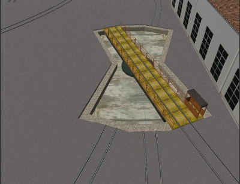
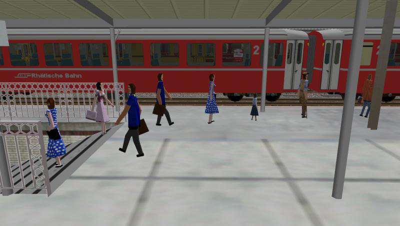

.. _features-route:

**************************
OR-Specific Route Features
**************************

As a general rule and as already stated, Open Rails provides all route 
functionalities that were already available for MSTS, plus some opportunities 
such as also accepting textures in .dds format.

.. _features-route-modify-trk:

Modifications to .trk Files
===========================

.. index::
   single: ORTSUserPreferenceForestClearDistance

Many of the features described in this chapter require additional parameters to be 
added in the route's .trk file. The additional parameters can be directly added at 
the end (just above the last parenthesis) of  
the route's .trk file residing in the route's root folder. Don't add such parameters 
in other positions of the file, because this would create problems if you want to use 
the MSTS editors with the related route. However, to avoid 
modifying the original file, the *Include* method described 
:ref:`here <physics-inclusions>` is also applicable to the .trk file, creating a 
new .trk file inserted into an ``OpenRails`` folder in the root folder of the route.
As an example, in case of the parameter needed to avoid forest trees on tracks ( see 
:ref:`here <features-route-remove-trees>`), this additional .trk file will contain::

    include ( ../Surfliner2.trk )
        ORTSUserPreferenceForestClearDistance ( 2 )

Only OR will look in the ``Openrails`` folder.

For a full list of parameters, see :ref:`Developing OR Content - Parameters and Tokens<parameters_and_tokens>`

Repetition of Snow Terrain Textures
===================================

OR provides a simple way to add snow terrain textures: the following default 
snow texture names are recognized: ``ORTSDefaultSnow.ace`` and 
``ORTSDefaultDMSnow.ace``, to be positioned within folder ``TERRTEX\SNOW`` of 
the concerned route. For the snow textures that are missing in the ``SNOW`` 
subfolder, and only for them, ORTS uses such files to display snow, if they 
are present.

To have a minimum working snow texture set, the file ``microtex.ace`` must 
also be present in the ``SNOW`` subfolder.

Snow Textures with Night Textures
=================================
MSTS did not allow snow textures to be used with night textures.
This meant having dark buildings when running an activity at night
when the weather is set to snow.  It turns out that OR is able to run
with snow textures and night textures.  To do this, you have to create
the ``Night\`` folder in the ``Textures\Snow\`` directory and copy the needed textures 
into the ``Night\`` folder.  Doing this will allow night textures to be visible when operating
in snow at night.  Keep in mind that the current night textures such as buildings do not 
include snow so new textures will have to be created.

One warning, if you decide to do this, there is a possiblility of experiencing resource
issues.

Operating Turntables and Transfertables
=======================================

A cool feature available in OR is the one of operating turntables and transfertables. 
In MSTS they are static, and can't rotate and transfer trainsets.
Turntables and transfertables are managed in a similar way by OR, and share also a 
significant portion of code. Therefore here reference to turntables will be made, and 
then only the differences for transfertables will be described.

.. caution:: Turntables and transfertables can't be directly connected to a leading switch. A track section of at least 1 meter must be laid in between.

Turntables
----------

The best way to get a turntable to be operational is to refer to an example.
So here are the instructions and the files to test this function, both for route 
Catania-Messina (SICILIA 1) and for other routes using ``a1t27mturntable.s``.
Route Catania-Messina can be downloaded from 
`here <http://www.trainsimhobby.net/infusions/pro_download_panel/download.php?did=544>`_ . 
A .ws file within the World subdirectory must be replaced with file 
``w-005631+014158.zip``
available in the Open Rails pack in the ``Documentation\SampleFiles\Manual`` subfolder. 
(this has nothing to do with turntables, it's a file that contains incoherent data that 
can cause a crash).
Pls. note that also the other sample files cited in this paragraph are available in such subfolder. 

Two test paths, included in file ``Turntable_PATHS.zip``, one for each turntable in the route, which can be used either 
in explore mode or within activities are available in the Open Rails pack.
Within the route's folder an OpenRails subfolder must be created, that must contain 
2 files. The first one is following file ``turntables.dat``, which contains the data needed 
to OR to locate and specify the turntable.

.. index::
   single: Turntable

turntables.dat::

  2
  Turntable(
  WFile ( "w-005625+014198.w" )
  UiD ( 1280 )
  XOffset ( 0 )
  ZOffset ( 13.4 )
  TrackShapeIndex ( 253 )
  Animation ( "TRACKPIECE" )
  Diameter ( 27 )
  )
  Turntable(
  WFile ( "w-005631+014158.w" )
  UiD ( 638 )
  XOffset ( 0 )
  ZOffset ( 13.4 )
  TrackShapeIndex ( 253 )
  Animation ( "TRACKPIECE" )
  Diameter ( 27 )
  )
 
To generate this file for other routes following has to be taken into account:

- the first line must be blank
- the number in the second line (2 in the above file) is the number of operating 
  turntables within the route
- WFile is the name of the .w file where the turntable is present
- The number in the UiD line is the UiD number of the TrackObj () block within the .w 
  file related to the turntable
- XOffset, YOffset and ZOffset are the offsets of the center of rotation of the 
  turntable with respect to the zero of the turntable shape 
- TrackShapeIndex is the index of the TrackShape () block within tsection.dat that
  refers to the turntable; please note that if a new TrackShape () block for the 
  turntable is needed, it is not necessary to modify tsection.dat; it is possible to 
  proceed as described :ref:`here <features-route-tracksections>`
- The Animation parameter is the name of the Matrix of the rotating part within the .s     file
- the Diameter value is the diameter of the turntable in meters.

The above file refers to turntables using the a1t27mturntable.s shape.

The second file to be inserted within the route's Openrails subfolder is a small 
integration .trk file that indicates the name of the .sms sound file to be associated to the turntable. For 
the route SICILIA 1 such file is therefore named ``SICILIA 1.trk``, like its parent file.
Here is the file content.

SICILIA 1.trk::

  include ( "../Sicilia 1.trk" )
			ORTSDefaultTurntableSMS ( turntable.sms )

The first line must be empty. 

File ``a1t27mturntable.s`` must be modified to add the animation data, as MSTS has provided 
it as a static file. To do this, uncompress it with Route Riter or Shapefilemanager and insert just above 
the last parenthesis the contents of file ``a1t27mturntable_animations.zip``.
If other .s files have to be used for turntables, or new ones have to be developed, it must be considered that 
the rotation animation should be as follows::

		animation ( 3599 30
			anim_nodes ( ..
				..
				..
				..
				anim_node TRACKPIECE (
					controllers ( ..
						tcb_rot ( 5
							tcb_key ( 0 0 0 0 1 0 0 0 0 0 )
							tcb_key ( 900 0 0.7071068 0 0.7071067 0 0 0 0 0 )
							tcb_key ( 1800 0 1 0 0.0 0 0 0 0 0 )
							tcb_key ( 2700 0 -0.7071068 0 0.7071067 0 0 0 0 0 )
							tcb_key ( 3600 0 0 0 -1 0 0 0 0 0 )
						)

or as follows::

		animation ( 3599 30
			anim_nodes ( ..
				..
				..
				..
                anim_node WHEEL1 (
                    controllers ( 1
                       tcb_rot ( 5
                          slerp_rot ( 0 0 0 0 1 )
                          slerp_rot ( 900 0 0.7071068 0 0.7071067 )
                          slerp_rot ( 1800 0 1 0 -1.629207E-07 )
                          slerp_rot ( 2700 0 -0.7071066 0 0.7071069 )
                          slerp_rot ( 3600 0 0 0 1 )
                        )
                     )
                 )

The above names of the anim_nodes are of course free choice.
The animation rotation direction as defined above must be counterclockwise.

Within the base Sound folder (not the one of the route) the .sms file 
``turntablesSOUND.zip`` has to be added to provide sound when the turntable rotates. It uses the two default 
MSTS .wav files for the sound. They have a bit a low volume. It is open to everyone to improve such files. 
Discrete trigger 1 is triggered when the turntable starts turning empty, discrete trigger 2 is triggered when 
the turntable starts turning with train on board, and discrete trigger 3 is triggered when rotation stops.

To help generating the tsection.dat entries for new turntable types a rough ``.xls`` 
spreadsheet (turntable_sectionidxs.xls) can be found in ``Documentation\SampleFiles\Manual``.
It computes the X, Z and degree parameters to be inserted in the SectionIdx lines of the 
TrackShape block within the tsection.dat file. You only have to insert the diameter of 
the turntable and the degree step. Of course you have to take only the lines up to the 
one preceding the one with degrees = 180.

Also turntables which may rotate less than 360 degrees can be implemented, like the one in 
the picture here below:

In this case following line has to be added at the end of the ``Turntable()`` block 
in file ``turntables.dat`` for a turntable that can rotate only between 0 and 40 degrees::

  MaxAngle ( 40 )

Angles increase clockwise.

Already many existing turntables have been successfully animated and many new other
have been created. More can be read 
`in this forum thread <http://www.elvastower.com/forums/index.php?/topic/28591-operational-turntable/>`_ .

Transfertables
--------------

.. index::
   single: Turntable
   single: Transfertable

Info for transfertables is stored in file ``turntables.dat`` too. This file may contain 
info for transfertables and turntables together. Here is an example of such file for 
a turntable and a transfertable::

  2
  Turntable(
  WFile ( "w-005625+014198.w" )
  UiD ( 1280 )
  XOffset ( 0 )
  ZOffset ( 13.4 )
  TrackShapeIndex ( 253 )
  Animation ( "TRACKPIECE" )
  Diameter ( 27 )
  )
  Transfertable(
  WFile ( "w-005578+014976.w" )
  UiD ( 72 )
  XOffset ( 0 )
  ZOffset ( 15.0)
  TrackShapeIndex ( 37300 )
  Animation ( "TRACKPIECE" )
  Length ( 29.4 )
  )

Parameters have the same meaning as for turntables. "Length" is the length of the 
transfer bridge (therefore the length of the track above it or a bit less, depending 
from the dimensions of the basin of the transfertable).

The integration .trk file format described in preceding paragraph can be used also for 
transfertables, using the same sound.

In the standard ``tsection.dat`` there are no usable transfertables defined. Therefore 
at least a new TrackShape block has to be created. Also in this case it is suggested 
to define the additional block in the route's specific ``tsection.dat``.

.. index::
   single: TrackSections
   single: TrackShapes
   single: TrackShape
   single: NumPaths
   single: SectionIdx

Here below is an example for a route's specific ``tsection.dat`` containing a 
TrackShape for a transfertable::

  include ( "../../../Global/tsection.dat" )
  _INFO ( Track section and shape addition for transfer table derived from turntable 27m )
  TrackSections ( 40000
  _SKIP ( No change here )
  )
  TrackShapes ( 40000
  _INFO(TrackShape for for 30 m transfer table derived from turntable 27m)
  TrackShape ( 37300
  FileName (  A1t30mTransfertable.s )
  NumPaths ( 9 )
  SectionIdx ( 1 0 -0.18 -1.1 0 339 )
  SectionIdx ( 1 4.985 -0.18 -1.1 0 339 )
  SectionIdx ( 1 9.97 -0.18 -1.1 0 339 )
  SectionIdx ( 1 14.955 -0.18 -1.1 0 339 )
  SectionIdx ( 1 19.94 -0.18 -1.1 0 339 )
  SectionIdx ( 1 24.925 -0.18 -1.1 0 339 )
  SectionIdx ( 1 29.91 -0.18 -1.1 0 339 )
  SectionIdx ( 1 34.895 -0.18 -1.1 0 339 )
  SectionIdx ( 1 39.88 -0.18 -1.1 0 339 )
  )
  )

The first line must be empty.  

The animation block for the above transfertable is as follows::

	animations ( 1
		animation ( 3600 30
			anim_nodes ( 2
				anim_node BASIN (
					controllers ( 0 )
				)
				anim_node TRACKPIECE (
					controllers ( 1
						linear_pos ( 2
              linear_key (	0	0	-1.92177	0	 )
              linear_key (	3600	39.88	-1.92177	0	 )
  					)					
					)
				)
			)
		)
	)

3600 is not a mandatory value, however to have a reasonable transfer speed a number of 
animation keys equal to 60 - 90 every meter should be selected. 

Locomotive and wagon elevators
------------------------------
.. index::
   single: Elevator

The elevator is managed by ORTS as a  vertically moving transfertable. So files needed 
are the same as used for a transfertable, with content modified where needed.

Info to identify an elevator in a route is stored in file turntables.dat, as it is 
for turntables and transfertables. The same file can store info for moving tables of 
different types. Here a turntables.dat file that contains info for an elevator::

  1
  Transfertable(
  WFile ( "w-005578+014976.w" )
  UiD ( 75 )
  XOffset ( 0 )
  YOffset ( -0.18 )
  ZOffset ( 13.405)
  VerticalTransfer ( 1 )
  TrackShapeIndex ( 37301 )
  Animation ( "TRACKPIECE" )
  Length ( 26.81 )
  )

What identifies this as an elevator is the presence of the VerticalTransfer parameter 
with value 1. The other difference to a transfertable is the presence of the YOffset 
parameter, which is the vertical offset of the zero position of the elevator with respect to 
the shape file zero.

An example of the animation block in the elevator shape file is shown here below::

	animations ( 1
		animation ( 1800 30
			anim_nodes ( 2
				anim_node BASIN (
					controllers ( 0 )
				)
				anim_node TRACKPIECE (
					controllers ( 1
						linear_pos ( 2
              linear_key (	0	0	-1.92177	0	 )
              linear_key (	1800	0	6.07823	0	 )
						)					
					)
				)
			)
		)
	)

wich generates a vertical movement with a span of 8 meters which is covered in 60 
seconds. Of course the 1800 value may be modified to get the desired motion speed.

The elevator must also be defined as a TrackShape in tsection.dat. It is suggested 
to define it in a route specific ``tsection.dat`` extension file, which, for the 
sample elevator, is as follows::

  
  include ( "../../../Global/tsection.dat" )
  _INFO ( Track section and shape addition for transfer table derived from turntable 27m )
  
  TrackSections ( 40000
  
  _SKIP ( No change here )
  
  )
  
  
  TrackShapes ( 40000
  
  _INFO(TrackShape for for vertical transfer table derived from turntable 27m)
   
  TrackShape ( 37301
   FileName ( A1t27mVerticalTransfertable.s )
    NumPaths ( 2 )
    SectionIdx ( 1 0 -0.18 0.0000 0 338 )
    SectionIdx ( 1 0 7.82 0.0000 0 338 )
   )
  )

To insert the elevator in a route using TSRE5 it must be reminded that the latter 
doesn't look at the tsection.dat file within the Openrails subfolder. So, for the sole 
time of the editing of the route, the TrackShape() block must be inserted in the global 
tsection.dat. After route editing is terminated, the block may be removed.
Tsection.dat build 38 or higher is required within the main Global folder.

At runtime the elevator is moved with the keys used for transfertables and turntables. 
Alt-C moves the elevator upwards, while Ctrl-C moves the elevator downwards.

.. _features-route-turntable-operation:

Path laying and operation considerations
----------------------------------------

By building up a path that enters the turntable or transfertable, exits it from the 
opposite side and has a reversal point few meters after the end of the turntable or 
transfertable, it is possible to use the 
turntable or transfertable in activity mode. The player will drive the consist into 
the turntable or transfertable and 
stop it. At that point the reversal point will have effect and will logically lay the 
consist in the return subpath. The player will put the consist in manual mode, rotate 
the turntable (in case he is using a turntable) by 180 degrees and return to auto mode. 
At this point the consist will be 
again on the activity path.

If instead the player wants the consist to exit to other tracks, he must drive the 
consist in manual mode out of the turntable or transfertable. If he later wants to 
drive back the consist 
into the turntable or transfertable and rotate or translate the train so that it exits 
the turntable or transfertable on the track 
where it initially entered it, he can pass back the train to auto mode after 
rotation, provided the path is built as defined above.

By using the feature to change :ref:`player train <driving-trainlist>` it is possible 
also to move in and out any locomotive on any track of e.g. a roundhouse or use a 
shunter to shunt a wagon in and out of a trasfertable. 
 
.. _features-route-modify-wfiles:

.w File modifiers
=================

An ``Openrails`` subfolder can be created within the route's ``World`` folder.
Within this subfolder .w file chunks can be positioned. ORTS will first read the base 
.w files, and then will correct such files with the file chunks of the ``Openrails`` 
subfolder.
This can be used both to modify parameters or to add OR-specific parameters.
Here an example of a w. file chunk for USA1 .w file w-011008+014318.w::

  SIMISA@@@@@@@@@@JINX0w0t______

  Tr_Worldfile (
		CarSpawner (
			UiD ( 532 )
			ORTSListName ( "List2" )
		)
		CarSpawner (
			UiD ( 533 )
			ORTSListName ( "List3" )
		)
		Static (
			UiD ( 296 )
			FileName ( hut3.s )
	  )
  )

With the two CarSpawner block chunks OR interprets the CarSpawners with same UiD 
present in the base .w file as extended ones 
(see :ref:`here <features-route-extended-carspawners>`). With the Static block OR 
replaces the shape defined in the Static block with same UiD within the base .w file 
with the one defined in the file chunk.
WAny Pickup, Transfer, Forest, Signal, Speedpost, LevelCrossing, Hazard, CarSpawner, 
Static, Gantry may have parameters modified or added by the "modifying" .w file. 

.. caution:: If the route is edited with a route editor, UiDs could change and so the .w file chunks could be out of date and should be modified.

.. caution:: Entering wrong data in the .w file chunks may lead to program malfunctions.

.. _features-route-extended-carspawners:

Multiple car spawner lists
==========================

With this OR-specific feature it is possible to associate any car spawner to one of 
additional car lists, therefore allowing e.g. to have different vehicles appearing in 
a highway and in a small country road.

.. index::
   single: CarSpawnerList
   single: CarSpawnerItem
   single: ListName

The additional car lists have to be defined within a file named carspawn.dat to be inserted in an ``Openrails`` subfolder within the Route's root folder.
Such file must have the structure as in following example::

  SIMISA@@@@@@@@@@JINX0v1t______

  3
  CarSpawnerList(
  ListName ( "List1" )
  2
  CarSpawnerItem( "car1.s" 4 )
  CarSpawnerItem( "postbus.s" 4 )
  )
  CarSpawnerList(
  ListName ( "List2" )
  3
  CarSpawnerItem( "policePHIL.S" 6 )
  CarSpawnerItem( "truck1.s" 13 )
  CarSpawnerItem( "postbus.s" 6 )
  )
  CarSpawnerList(
  ListName ( "List3" )
  2
  CarSpawnerItem( "US2Pickup.s" 6 )
  CarSpawnerItem( "postbus.s" 13 )
  )

.. index::
   single: ORTSListName

The first ``3`` defines the number of the additional car spawner lists.
To associate a CarSpawner block to one of these lists, a line like this one::

			ORTSListName ( "List2" )

has to be inserted in the CarSpawn block, in any position after the UiD line.

If the CarSpawner block does not contain such additional line, it will be associated 
with the base carspawn.dat file present in the route's root directory.

.. caution:: If the route is edited with the MSTS route editor modifying the .w files referring to the additional car spawners, the above line will be deleted.

To avoid this problem, two other possibilities are available to insert the additional 
line. One is described :ref:`here <features-route-modify-wfiles>`.
The other one is to use the OR specific TSRE route editor, that natively manages this 
feature. Also in the latter case, however, if the route is later edited with the MSTS 
route editor, the above line will be deleted.

Car spawners used for walking people
====================================
The OR specific TSRE route editor is able to generate car spawner paths also outside 
roads. This has many applications, one of which is to generate paths for walking people.
Walking people have the peculiarity that on an inclined path they don't incline like a 
vehicle does, instead they remain vertical. To enable OR to handle these car (or better 
person) spawners specifically, the parameter IgnoreXRotation () has to be inserted in 
the car spawner list, just after the number of the car spawner items.

.. index::
   single: IgnoreXRotation

Here is an example of a car spawner file specific for walking people to be inserted in 
the route's Openrails subfolder ( see :ref:`here <features-route-extended-carspawners>` )::

  SIMISA@@@@@@@@@@JINX0v1t______
  
  1
  CarSpawnerList(
  ListName ( "People1" )
  3
  IgnoreXRotation ()
  CarSpawnerItem( "walkingperson1.s" 3 )
  CarSpawnerItem( "walkingperson2.s" 1 )
  CarSpawnerItem( "walkingperson3.s" 1 )
  )

.. _features-route-tracksections:

Route specific TrackSections and TrackShapes
============================================

.. index::
   single: TrackSections
   single: SectionSize
   single: TrackShapes
   single: TrackShape
   single: NumPaths
   single: SectionIdx

It quite often occurs that for special routes also special TrackSections and TrackShapes 
are needed. Being file tsection.dat unique for every installation, for such routes a 
so-called mini-route installation was needed.
The present feature overcomes this problem. The route still uses the common tsection.dat,but it can add to it route-specific TrackSections and TrackShapes, and can modify common ones. This occurs by putting in an ``OpenRails`` subfolder within the route's root 
folder a route-specific chunk of tsection.dat, which includes the TrackSections and 
TrackShapes to be added or modified. Here a fictitious example for route USA1 (first 
line must be blank)::

  include ( "../../../Global/tsection.dat" )
  _INFO ( Track sections and shapes specific for USA1   )
  _Skip (
  Further comments here
  )
  TrackSections ( 40000
  _Skip (
  Comment here
  )
  _SKIP ( Bernina )
    TrackSection ( 33080
	    SectionSize ( 0.9 1.5825815 )
    )
    TrackSection ( 19950
	    SectionSize ( 0.9 12 )
    )
  )
  TrackShapes ( 40000
  _Skip (
  Comment here
  )
  -INFO(Bernina Pass narrow gauge sections / wood tie texture)
  _INFO(by Massimo Calvi)
  _INFO(straight sections)
    TrackShape ( 30000
	    FileName ( track1_6m_wt.s )
	    NumPaths ( 1 )
	    SectionIdx ( 1 0 0 0 0 33080 )
    )
    TrackShape ( 19858
	    FileName ( track12m_wt.s )
	    NumPaths ( 1 )
	    SectionIdx ( 1 0 0 0 0 19950 )
    )
  )

In this fictitious example the first TrackSection and TrackShape is present also in the 
Global tsection.dat, so the effect is that the original TrackSection and TrackShape are 
modified; the second ones are not present, and so they are added to the lists.   

.. note::  To be able to use these modified items with the actual MSTS RE and AE 
  it is necessary that these modified items are present also in the original tsection.dat 
  file. However, when the work with the RE is terminated and route is distributed, 
  it is sufficient to distribute the above route's specific tsection.dat.

.. _features-route-overhead-wire-extensions:

Overhead wire extensions
===================================

.. _features-route-overhead-wire-double-wire:

Double wire
-----------

OR provides an :ref:`experimental function that enables the upper wire <options-double-overhead-wires>` for 
electrified routes. The optional parameter ``ortsdoublewireenabled`` in the ``.trk`` file of the route can
force the activation or deactivation of the option overriding the user setting in the options panel.

.. index::
   single: OrtsDoubleWireEnabled
   single: OrtsTriphaseEnabled
   single: OrtsDoubleWireHeight

In this example the upper wire is enabled overriding the user setting::

  OrtsDoubleWireEnabled ( On )

while in this one the upper wire is forced to be disabled::

  OrtsDoubleWireEnabled ( Off )

Another parameter (``ortsdoublewireheight``) specifies the height of the upper wire relative to the contact wire;
if not specified the default is 1 meter.
In this example the upper wire is 130cm above the main wire (as in most Italian routes)::

  include ( "../tures.trk" )
    OrtsTriphaseEnabled ( Off )
    OrtsDoubleWireEnabled ( On )
    OrtsDoubleWireHeight ( 130cm )

Of course you can use any :ref:`distance unit of measure <appendices-units-of-measure>` supported by OR.

.. _features-route-overhead-wire-triphase:

Triphase lines
--------------

The modern electric locos are powered by DC or monophase AC, but some years ago there were triphase AC powered locos.
A triphase circuit needs three wires (one for each phase, no wire is needed for neutral); in rail systems two wires 
are overhead and the third is made by the rails.

OR can enable the second overhead wire with the parameter ``ortstriphaseenabled`` this way::

  OrtsTriphaseEnabled ( On )

If the parameter is missing or its value is ``Off`` the usual single wire is displayed.

Another parameter (``ortstriphasewidth``) specifies the space between the two wires with a default (if the parameter 
is not declared) of 1 meter.

.. _features-route-loading-screen:

Loading screen
==============

.. index::
   single: LoadingScreen
   single: ortsloadingscreenwide

In the ``.trk`` file of the route the parameter ``loadingscreen`` can be used as in this example::

	LoadingScreen ( Load.ace )

A DDS extension takes precedence over ACE so, if
in the main directory of the route there is a file with the same name but with extension ``.dds``,
the latter is displayed instead of that with ``.ace`` extension.
If the filename parameter is omitted then the file ``load.ace`` is loaded (as in MSTS) or ``load.dds`` if present.

The loading screen image can have any resolution and aspect ratio; it will be displayed letter-boxed
on the screen keeping the aspect ratio.

Another optional parameter ``ortsloadingscreenwide``, can specify the image to show when the user
loads the route on a wide (16:9) screen. This parameter is ignored when a traditional 4:3 display is used.

MSTS-Compatible semaphore indexing
==================================

.. index::
   single: SemaphorePos

When a signal shape has a semaphore (moving part), and its animation definition within the 
.s file has only two lines (e.g ``slerp_rot`` lines), MSTS interprets the ``SemaphorePos()`` lines within ``sigcfg.dat`` accordingly to following rule::

- SemaphorePos (2) is executed as SemaphorePos (1)
- SemaphorePos (1) is executed as SemaphorePos (0)
- SemaphorePos (0) is executed as SemaphorePos (0).

Open Rails follows this rule, in case one of the SemaphorePos lines has 2 as parameter. 
It does not follow this rule in case only 1 and 0 as parameters are present, because in 
such a case following the above rule they would be both executed as SemaphorePos (0) and 
therefore the semaphore would be static.

It is however strongly recommended to always have three animation lines within the .s file, 
where usually the third line repeats the parameters of the first line (except for the 
animation step).

.. _features-route-open-doors-ai:

Automatic door open/close on AI trains 
======================================

The feature is explained :ref:`here<options-open-doors-ai>`.

.. index::
   single: ORTSOpenDoorsInAITrains

To override the selection made in the 
:ref:`Experimental Options Window<options-experimental>`, a command line must be inserted 
in a small integration .trk file, that must be located in an Openrails subfolder within 
the route's folder, and must have the same name as the base folder. Here below an example
of such file::

  
  include ( "../Platformtest.trk" )
  			ORTSOpenDoorsInAITrains ( 1 )

The first line must be empty.

``ORTSOpenDoorsInAITrains ( 1 )`` forces door open/close for this route even if the 
option within the Experimental Options Window is not checked.

``ORTSOpenDoorsInAITrains ( 0 )`` disables door open/close for this route even if the 
option within the Experimental Options Window is checked.

.. _features-route-remove-trees:

Removing forest trees from tracks and roads
===========================================

.. index::
   single: ORTSUserPreferenceForestClearDistance
   single: ORTSUserPreferenceRemoveForestTreesFromRoads

OR and MSTS determine differently the position of trees in forests. 
This may result in trees appearing on tracks or roads.
To avoid trees on tracks following OR-specific parameter can be added to the .trk
file of the route::

  ORTSUserPreferenceForestClearDistance ( 2 )

where the parameter represents a minimum distance in metres from the track
for placement of forests.
Alternatively, the original .trk file can be left unmodified, and a new .trk file 
inserted into an ``OpenRails`` folder in the root folder of the route. This is 
explained :ref:`here <features-route-modify-trk>`. 

To avoid also forest trees on roads insert the following line which sets the Boolean value to true::

  ORTSUserPreferenceRemoveForestTreesFromRoads ( 1 )

and must be added below line::

  ORTSUserPreferenceForestClearDistance ( 2 )

either in the route's root .trk file or in the "Include" .trk file.

It is not possible to remove trees only from roads and not from tracks.      

Multiple level crossing sounds 
==============================

.. index::
   single: ORTSSoundFileName
   single: ESD_ORTSSoundFileName

This feature allows to have level crossing sounds different from the default one 
for a specific level 
crossing on a route or for a specific level crossing shape.
To get a level crossing sound different from the default one for a specific level 
crossing sound on a route a line 
like following one has to be inserted in the .w file LevelCrObj block::

  ORTSSoundFileName ( "differentcrossingsound.sms" )

where "differentcrossingsound.sms" must be replaced with the desired .sms file name.

.. caution:: If the route is edited with the MSTS route editor modifying the .w files containing such line, the above line will be deleted.

To avoid this problem, two other possibilities are available to insert the additional 
line. One is described :ref:`here <features-route-modify-wfiles>`.
The other one is to use the OR specific TSRE route editor, that natively manages this 
feature. Also in the latter case if the route is later edited with the MSTS 
route editor, the above line will be deleted. 

To get a level crossing sound different from the default one for a specific level 
crossing shape a line like 
following one must be inserted in the .sd file of the crossing shape::

  ESD_ORTSSoundFileName ( "differentcrossingsound.sms" )

If both lines are present, the first overrides the second. 
For the first case it is suggested to place the sound file in the sound folder of the 
route, although it will also be searched in the general Train Simulator Sound folder.
For the second case there is no suggestion. The file will again be searched in both folders.

.. _features-route-curve-superelevation:

Defining Curve Superelevation
=============================

.. index::
   single: ORTSTrackSuperElevation
   single: ORTSSuperElevation
   single: MaxFreightUnderbalance
   single: MaxPassengerUnderbalance
   single: MinimumCant
   single: MaximumCant
   single: Precision
   single: MaxRunOffSlope
   single: MaxRunOffSpeed
   single: MinimumSpeed
   single: MaximumSpeed
   single: ORTSForceSuperElevation
   single: TrackGauge

This feature allows curves within the route to be assigned a value for superelevation. It
is inserted either in the route's root .trk file or in the "Include" .trk file. Before
starting, the predominant gauge of track on the route should be given using the legacy
``TrackGauge`` token. The default units used are meters, though other units are supported
as in other parts of the program. If ``TrackGauge`` is set to 0 (like most MSTS routes)
or not present in the .trk file, then the default gauge given in the
:ref:`Superelevation Options <options-superelevation>` will be used for superelevation calculations.

Defining a superelevation standard in the .trk file will control both the simulated level of
superelevation on each track section on the entire route and the amount of visual
superelevation generated by the dynamic track system. However, in some cases it may be desired
to manually influence the use of visual superelevation due to (un)desired graphical effects.
The token ``ORTSForceSuperElevation`` can be given a true/false value to force enable/disable
visual superelevation effects regardless of user settings and other ORTS behaviors. Adding
this token will have no impact on the physical simulation of superelevation, this only forces
the graphical elements to be enabled or disabled.

To define a superelevation standard, add an ``ORTSSuperElevation`` block to the route's .trk
file and add some (or all) of the following parameters inside the ``ORTSSuperElevation`` block:

- ``MaxFreightUnderbalance`` -- The maximum amount (using units of length) of cant deficiency/underbalance
  that should be allowed for trains travelling at the freight speed limit. Larger allowed underbalance
  results in less extreme superelevation. (Default 100 mm for metric routes, 2 in for imperial routes.)
- ``MaxPassengerUnderbalance`` -- The maximum amount (using units of length) of cant deficiency/underbalance
  that should be allowed for trains travelling at the passenger speed limit. (Default 150 mm / 3 in.)
  For comfort reasons, the underbalance values should be equal to or less than the
  ``ORTSUnbalancedSuperElevation`` value used by the rolling stock on the route. If the superelevation
  required to achieve the max passenger underbalance is different from that required for freight, the
  curve will use whichever superelevation is larger (the actual amount of underbalance may be lower).
- ``MinimumCant`` -- If a curve needs superelevation, the amount of superelevation will be no lower than
  this value (given in units of length). (Default 10 mm / 0.5 in.)
- ``MaximumCant`` -- Sets the maximum amount of superelevation (units of length) that any curve is allowed
  to have, regardless of other factors. Usually curves should be designed to avoid reaching this limit, as
  exceeding the limit could result in excessive curve force or even trains toppling over at low speeds.
  (Default 180 mm / 6 in.)
- ``Precision`` -- Determines the accuracy (in length) to which the superelevation is maintained. If
  the superelevation required by a curve is not a nice number, it will be rounded up to the nearest
  multiple of ``Precision``. (Default 5 mm / 0.25 in.)
- ``MaxRunOffSlope`` -- Sets a limit on the amount of change in superelevation per unit length along a curve
  (quantity is unitless). This allows for smooth transition between flat and superelevated track at low speeds.
  (Default 0.003.)
- ``MaxRunOffSpeed`` -- Sets a limit on the amount of change in superelevation per second (units of speed) when
  travelling at the max speed for the curve. This allows for smooth transition between flat and superelevated
  track at high speeds. (Default 55 mm/sec / 1.5 in/sec.)
- ``MinimumSpeed`` -- The minimum speed limit required for superelevation to be added to a curve. Useful for
  preventing superelevation from being generated in yards. (Default 25 kmh / 15 mph.)
- ``MaximumSpeed`` -- The maximum speed limit allowed for superelevation to be added to a curve. This
  is only useful if a route needs multiple sets of superelevation settings. See section below for a
  description on use of multiple superelevation standards. (Default unlimited.)

Any parameters not specified will use the default values, which are suitable for most medium-speed routes.
Upon route loading, the given parameters will be used to calculate the appropriate amount of superelevation
for each curve based on the curve radius and speed limits. An example ``ORTSSuperElevation`` block which
defines the superelevation standard used by Union Pacific is given below::

    ORTSSuperElevation(
		MaxFreightUnderbalance ( 1in )
		MaxPassengerUnderbalance ( 3in )
		MinimumCant ( 0.25in )
		MaximumCant ( 5in )
		Precision ( 0.25in )
		MaxRunOffSlope ( 0.0019 )
		MaxRunOffSpeed ( 1.25in/s )
		MinimumSpeed ( 15mph )
    )

Note that it is also possible to create a superelevation standard which entirely disables superelevation
on the route, should the real railroad not use superelevation. This can be achieved by setting
``MaximumCant ( 0 )`` and leaving all other values default. Note that this disables both physics and visual
superelevation::

    ORTSSuperElevation(
		MaximumCant ( 0 )
    )

More than one ``ORTSSuperElevation`` block can be added to the .trk file to facilitate routes that require
different superelevation standards for different track speeds (for example, a route with both standard speed
160 kmh tracks and dedicated 300 kmh high speed tracks). If a track has a speed limit below ``MinimumSpeed``
or above ``MaximumSpeed``, the track will skip the superelevation standard defined and check the next standard in
the .trk file to see if the speed limit is in between the min and max of that standard. Only if the track
speed is out of bounds for every superelevation standard will no superelevation be applied at all. For
example, to have 3 different types of superelevation on one route, one from 25-60 kmh, another from 60-160 kmh,
and a third standard for 160 kph and up, the required Minimum/MaximumSpeed settings would look like this::

    ORTSSuperElevation(
        ...
		MinimumSpeed ( 25km/h )
		MaximumSpeed ( 60km/h )
    )
    ORTSSuperElevation(
        ...
		MinimumSpeed ( 60km/h )
		MaximumSpeed ( 160km/h )
    )
    ORTSSuperElevation(
        ...
		MinimumSpeed ( 160km/h )
    )

Note that the order of the ``ORTSSuperElevation`` blocks is important; they are read from top down
so the slowest superelevation standard should be on top of all faster superelevation standards.

Open Rails also supports a simpler way to define superelevation based on curve radius only, resulting
in the same superelevation regardless of track speed. If a railroad uses this simplified method, they
would provide a table of track curve radii and the superelevation used at that radius (usually also
including a maximum speed for the curve). This table can then be provided to OR using the
``ORTSTrackSuperElevation`` parameter in the .trk file::

    ORTSTrackSuperElevation (
        x1 y1
        x2 y2
        ........
    )
   
Where x and y are a series of paired parameters specifying the curve radius (default meters)
(x value), and the amount of superelevation (default meters) (y value). The statement will take
as many paired values as desired, as long as the radius values are in increasing order.
Each paired set of values must have an x and y value present. If it is desired
to 'hold' a certain value of superelevation for a number of different radii curves, then the same 
y value needs to be used for succeeding values of curve radius. Where the y value changes between 
curve radii, then Open Rails will interpolate the y value between the two points.

Superelevation calculated using ``ORTSSuperElevation`` will generally override any values
entered in ``ORTSTrackSuperElevation`` unless the ``ORTSSuperElevation`` block did not specify
a value for ``MaxFreightUnderbalance`` or ``MaxPassengerUnderbalance``. If neither is given,
superelevation will be replaced with the value given by ``ORTSTrackSuperElevation``, but will
be adjusted to match the given values of minimum and maximum cant, precision, and runoff. This
way, it is possible to represent a wide variety of superelevation configurations.

Overhead (catenary) wire
========================

Open Rails uses texture overheadwire.ace to display the overhead wire. Such 
texture must be present in the route's ``TEXTURES`` folder. If the texture is not found 
there, Open Rails looks for it in the ``GLOBAL\TEXTURES`` folder. If the texture isn't 
there either, Open Rails selects texture ``GLOBAL\TEXTURES\diselsmoke.ace``. It is however 
strongly suggested to use a specific texture to display the overhead wire. A possible 
texture to be used can be downloaded here ``Documentation\SampleFiles\Manual\overheadwire.zip``.

Fading signal lamps
===================

.. index::
   single: ORTSOnOffTimeS

In Open Rails, signal lamps fade on and off for a visually pleasing transition 
effect. The fade time defaults to one-fifth of a second. It can be customized in 
the ``SignalType`` block of the ``sigcfg.dat`` file using the ``ORTSOnOffTimeS`` 
property::

   SignalTypes( ...
       SignalType ( "AM14Light"
           ...
           ORTSOnOffTimeS ( 0.2 )
       )
   )

The value is the fade time in seconds. Use ``0`` to disable the effect 
completely.

Animated clocks
===============

Animated clocks that show the simulation time can be added or retro-fitted to a route. 
The clocks can have a second-hand that ticks each second, or one that moves smoothly or none at all.
Typically clocks could be station clocks, church tower clocks or clocks at other public buildings. 
They are placed as normal static shapes in a route, similar to other shapes such as houses or trees.

Note: Loco cabs already have provision for both analogue and digital clocks.

Overview
--------

You will need:

#. Shape and Texture Files

   A shape file which defines each shape of clock, its hands and their animation and the texture files used by the shape.

#. Reference File

   For each shape of clock in the route, a reference to the shape file in the reference file.

#. World File
 
   The location of each clock in the world must be given in the world file.

Details
-------

#. Shape and Texture Files

   Create a clock just like any other shape. The hands of the clock must be sub-objects within the shape. 
   They must have specific names and an animation.	
   
   Open Rails looks for the following names of clock hands in the shape file and animates them according to the simulation time.	
   
   The names for the clock hands must start with:	
  
   - "ORTS_HHand_Clock" for the hour hand
   - "ORTS_MHand_Clock" for the minute hand
   - "ORTS_SHand_Clock" for the second hand
   - "ORTS_CHand_Clock" for the centi-second hand
     
   This last is used to provide a smooth movement in hundredths of a second whereas the second hand ticks forward once a second.	
   It is suggested to use either the second hand or the centisecond hand or neither.	
	
   .. image:: images/features-animated-clock5.png
   
   If a clock is to have several hands of the same type, simply append a number to the names of the hands, like this:

   .. image:: images/features-animated-clock6.png

   The animation requires 4 key frames at the 12, 3, 6 and 9 positions and calculates the intermediate 
   positions using linear interpolation. 	
   
   .. image:: images/features-animated-clock3.png
					
   For example: ::

	  anim_node ORTS_HHand_Clock01 (				
		  controllers ( 1			
			  tcb_rot ( 5		
				  slerp_rot ( 0  0     0 0 -1 )	
				  slerp_rot ( 1 -0.707 0 0 -0.707 )	
				  slerp_rot ( 2 -1     0 0  0 )	
				  slerp_rot ( 3 -0.707 0 0  0.707 )	
				  slerp_rot ( 4  0     0 0  1 )	
				)	
			)		
		)

   Finally, move the clock shape and its textures into the corresponding folders SHAPES and TEXTURES of your route, 
   such as ROUTES\\<route_name>\\SHAPES\\clocks.s

#. Reference File

   Add a reference to the shape file into the reference file ROUTES\\<route_name>\\<route_name>.ref
   Make sure that this reference begins with the "Static" keyword.::

    Static (	
	    Filename    ( "ChurchClock.s" )
	    Class       ( "Clocks" )
	    Align       ( None )
	    Description ( "ChurchClock" )
    )	

#. World File

   Use a route editor to locate the clocks in the world file. 
   
   Note: Do not insert the shapes as animated ones. 
   Otherwise, if MSTS is used to view the route then the hands of the clock will rotate wildly.
   In Open Rails they will match the simulation time anyway.