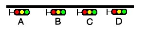

.. _operation:

***************************
Open Rails Train Operation 
***************************

Note that this document details behaviour while in single-player mode only. For 
:ref:`multi-player mode <multiplayer>`, different rules may apply.

For a full list of parameters, see :ref:`Developing OR Content - Parameters and Tokens<parameters_and_tokens>`

Open Rails Activities
=====================

OR has the aim of running in a compatible way most of the activities written for 
MSTS.

Also, activities specifically for OR can be created, using the additional 
functions OR features, like :ref:`Extended AI Shunting <operation-ai-shunting>`. 
Discussions of the execution of some functions in ORTS and MSTS are given here.

Player Paths, AI Paths, and How Switches Are Handled
----------------------------------------------------

If the player path requires a switch to be aligned both ways, the alignment that is 
the last on the path is used. If an AI train crosses the player path before the 
player train gets there, the AI train will leave the switches aligned for the main 
route (the default setting for most switches)

If you throw a switch to move into a siding, the switch at the far end of the 
siding is aligned to let you leave when your train first occupies the siding. But 
after that it is not changed back to its original setting. If the switch gets 
thrown the other way, you can leave the siding with the switch aligned incorrectly. 
If you uncouple and re-couple to the train while it occupies the misaligned switch, 
the rear end of the train will switch tracks.

Open Rails AI
=============

Basic AI Functionality

- OR supports AI trains. The AI system is becoming more and more advanced with 
  new features.
- OR supports two distinct ways of controlling trains: it supports traditional 
  activities in compatibility with MSTS, and it also supports 
  :ref:`Timetable <timetable>` mode. Note that various options and settings 
  are sometimes limited to either activity or Timetable mode.
- AI trains can meet if both paths have passing sections defined at the same 
  place, or if their paths lead them to different tracks at the meet station.
- Waiting points and reverse points work. Reverse points can be used in both 
  Activity and Timetable modes, while waiting points can only be used in Activity 
  mode.
- AI trains throw switches not lined properly before engaging them.
- In activity mode AI trains can perform shunting actions.
- Priorities: AI trains should start as scheduled as long as there is no other 
  AI train already on a conflict path.

.. _operation-control-mode:
  
Control Mode
============

Control Mode defines what interactions there are between the player and the 
control system, and the level of control of the player on signals and switches.

There are two basic modes: *Auto Mode* and *Manual Mode*.

Use the ``<Ctrl+M>`` key to toggle between these modes.

Auto Mode 
---------

In Auto Mode the control system sets the train's path and signals, and the 
player cannot change the setting of the switches or request for signals at 
danger to clear. The train's route is taken from the path as defined in the 
Activity Editor or timetable definition, and the system will attempt to clear 
the route ahead of the train according to the signalling rules and interaction 
with other trains.

No route is cleared in the reverse direction as the train is assumed not to run 
in reverse. Selecting a reverse cab or changing the position of the reverser 
does not change the direction of the route. In fact, the route will not be 
reversed other than at reversal points as defined in the train's path. At these 
reversal points, the route will reverse automatically as soon as the train stops.

If the train does accidentally run backward, e.g. due to slipping or setting 
back after overshooting a platform, only safety checks are performed for the 
rear end of the train with respect to signals, switch alignment, other trains 
and end of track. There is no check on speed limits behind the train.

Setting switches using the F8 window or ``<G>``/``<Shift+G>`` is not allowed. 
Setting switches using Alt+left mouseclick is possible, but is not allowed for 
switches in the train's path. However, any switches set manually will 
automatically be reset by an approaching train according to that train's path. 
So, in Auto Mode the train cannot deviate from the defined path. 

A request to clear a signal ahead of the train using the Tab command is only 
allowed when the track ahead is occupied by another train which is at a 
stand-still, and when that track is in the train's route. A request to clear a 
signal which would lead the train off its route is not allowed. A request to 
clear a signal behind the train using Shift+Tab is also not possible.

Auto Mode is intended for normal running under control of signals or traffic 
control. Shunting moves can be performed if fully defined in the train's path, 
using reversal points etc..

Details on Auto Mode: *Auto Signal* & *Auto Node*
'''''''''''''''''''''''''''''''''''''''''''''''''

There are two sub-modes to *Auto Mode*: *Auto Signal* and *Auto Node*.

*Auto Signal* is the normal mode on signalled routes. The train's route is 
generally cleared from signal to signal. Only in specifically defined situations 
can routes be cleared short of a signal as detailed below.

*Auto Node* is set when the train has not encountered any signals yet, e.g. on 
unsignalled routes or at the start of the route when there is no signal along 
the path of the train as far as it can be cleared - e.g. in yards where the 
train starts but has no clear route yet to the first signal.

*Auto Node* can also be set if the route ahead cannot be fully cleared up to the 
next signal, and partial clearing is allowed.

A number of sub-states are defined in Auto Node, depending on the reason that 
clearance is terminated. In the list below, (**A**) indicates a subtype which can 
occur if no signal has yet been encountered, (**B**) indicates a subtype when a 
route from a signal is partially cleared.

The following states are possible :

- (**A**) route ahead is clear to the maximum distance for which the track is 
  cleared. The control mode is set to Auto Node -- Max Distance.
- (**A**) route ahead is blocked at a switch which is aligned for and occupied or 
  reserved by another train. Control mode is set to Auto Node -- Misaligned Switch.
- (**A**)(**B** -- only if signal allows access to occupied track, or after ``<Tab>`` 
  command) route ahead is occupied by a stationary train or train moving in the 
  same direction. Control mode is set to Auto Node -- Train Ahead.
- Note that, for (**A**), it should not be possible that the route ahead is occupied 
  by a train moving in opposite direction - in that case, there should always be a 
  misaligned switch in the train's path.
- For (**B**), a signal will never clear when the train ahead is moving in the 
  opposite direction, nor will the Tab request be granted.
- (**A**)(**B**) the train's defined path terminates short of the next signal, or there 
  is a reversal point short of the next signal, and there is at least one switch 
  between this point and the next signal. 
  The control mode changes to Auto Node -- End of Path.
  Note that if there is no switch between the terminating or reversal point and 
  the next signal the route is automatically extended to the next signal.
- (**A**)(**B**) the train has passed the last signal before the end of the track, or 
  the train has reached the end of track without encountering any signal. The 
  control mode changes to Auto Node -- End of Track.

Changes from Auto Node to Auto Signal and vice-versa are automatic and cannot be 
influenced by the player.

.. _operation-manual-mode:

Manual Mode
-----------

When it is required that a train move off its defined path, a player can switch 
his train to Manual Mode. This will allow the player to set switches and request 
to clear signals off its path. However, there are a number of restrictions when 
running a train in Manual Mode.

In Manual Mode, a route is cleared from the train in both directions, ahead of 
and behind the train. The route is cleared to a shorter distance as compared to 
Auto Mode, and is never cleared automatically beyond the first signal. If a 
train is moving and passes a signal in the opposite direction, the route behind 
the train will automatically retract to that signal as that is now the next 
signal in the reverse route. The same restrictions apply with respect to signals 
ahead when the train is running in reverse.

The route orientation will not change whatever direction the train is running. 
It is fixed to the orientation of the route as it was the moment the player 
switched to Manual Mode. So, changing to a reverse-facing cab or changing the 
position of the loco's reverser does not change the direction of the route 
orientation. This is not a limitation to the train's behaviour, as routes are 
always cleared in both directions. It does, however, affect the display of the 
F4 and F8 windows, as the top/bottom direction of these windows is linked to the 
route direction and will therefore not change if the train reverses. To assist 
the player in his orientation in which direction the train is moving, an "eye" 
has been added to these displays symbolizing the direction of the cabview, and 
an "arrow" has been added to symbolize the direction of the reverser.

The player can set all switches in the train's path using the F8 window or the 
``<G>``/``<Shift+G>`` keys. The G key will set the first switch ahead of the 
train (as defined by the route direction), Shift+G sets the switch behind the 
train. It is also possible to set switches as required using the Alt+Left 
Mouseclick command. Switches can be set even if they are in the train's path and 
a signal has been cleared over that path. Switches, of course, can not be set if 
already set as part of a cleared route for another train.

The following rules apply to the setting of switches :

- all switches will remain in the position in which they were set by the last 
  train passing over that switch. If no train has yet passed over the switch, it 
  is in its default position.
- when in Manual Mode, trailing switches will not be automatically aligned for 
  the approaching player train, except :
- when a route is cleared through a signal while in Manual Mode, any trailing 
  switches in the train's path up to the end of authority (e.g. next signal) will 
  be aligned. Note that in this case, trailing switches in the path cleared by 
  the signal can no longer be reset.

Signals which the train approaches will not be cleared automatically. The player 
must request clearance of all signals encountered, by using the ``<Tab>`` or 
``<Shift+Tab>`` keys.

The ``<Tab>`` key will clear the signal ahead of the train (according to the 
route direction), the ``<Shift+Tab>`` key will clear the signal behind the 
train. Repeated use of (``<Shift>`` + )``<Tab>`` will clear the next signal 
beyond the first cleared signal etc., but only up to the maximum clearing 
distance.

Signals will always clear on request except when the section immediately behind 
the signal is already cleared for a train from the opposite direction. The 
normal route-setting limitations etc. are ignored. The signal will only clear to 
the first available most restrictive aspect above Stop.

Note that, in contrast to the situation in Auto Mode, as the signal will clear 
even if the full route behind the signal is not available, a cleared signal is 
no indication of the cleared distance beyond that signal. It may be that the 
first switch beyond the signal is already cleared for another train. Therefore, 
when in Manual Mode, use of the F4 window or the Dispatcher window to check on 
the route availability is essential when running in an area with AI traffic.

When in Manual Mode, deadlock prevention processing is switched off. This is 
because the changes in the train's route and direction which are likely to occur 
in Manual Mode could jeopardise the stability of the deadlock processing. So 
care should be taken when using Manual Mode in an area with AI traffic, 
specifically on single track sections.

Switching from Auto Mode to Manual Mode can be performed with the train at a 
standstill or with the train moving. The ``<Ctrl+M>`` key toggles between 
Auto Mode and Manual Mode. 
When switching from Auto Mode to Manual Mode, all signals already cleared will 
be reset, and new routes are cleared ahead of and behind the train for the 
maximum distance if possible, or up to the first signal.

To switch back from Manual Mode to Auto Mode the front of the train must be on 
the path as defined in the Activity Editor. If the path contains reversal 
points, the train must be in between the same reversal points as it was when it 
switched to Manual Mode (i.e. same subpath).

If the train is moving in the direction as the path defines, switching back to 
Auto Mode can be done while the train is moving. The rear of the train need not 
be on the defined path, only the front.

If the train is moving in the opposite direction, it must be at a standstill in 
order to switch back to Auto Mode. If the orientation of the train's route was 
somehow reversed (e.g. by moving through a balloon-line or a Y-section) and 
differs from the direction in the defined path, both the front and rear must be 
on the defined path. In this situation, the orientation will switch back to the 
direction as defined in the path.

Out-of-Control Mode
-------------------

This is a special mode. Normally, the player train should not be in this mode. 
The out-of-control mode is activated when the player violates a security rule. 
Such incidents are:

- when the player train passes a signal at danger (SPAD);
- when the player train passes over a misaligned switch;
- when the player train runs beyond the end of the authorised path.

These actions will place the player train into out-of-control mode. In this 
situation, the emergency brake is activated and maintained until the train is 
stopped. The player has no control over his train until it is at a standstill.

Once the train has stopped, the player can switch to Manual Mode to try to 
return to a correct situation (e.g. get back to in front of the signal at 
danger, authorised path etc.). Once a normal situation has been restored, the 
player can switch back to Auto Mode. If the action led the player train onto a 
section of track already cleared for another train, that train is also stopped.

Explorer Mode
-------------

When OR is started in Explorer Mode instead of in an activity, the train is set 
to Explorer Mode. The player has full control over all switches. Signals will 
clear as normal but signals can be cleared over routes which are not normally 
available using the ``<Tab>`` or ``<Shift+Tab>`` commands.

Track Access Rules
==================

All trains clear their own path. When in Auto Signal mode, part of that function 
is transferred to the signals.

In *Auto Node* mode, trains will clear their path up to 5000 metres, or the 
distance covered in 2 mins at the maximum allowed speed, whichever is greater. 
In *Auto Signal* mode, the number of signals cleared ahead of the train is taken 
from the value of the ``SignalNumClearAhead`` parameter as defined in the 
``sigcfg.dat`` file for the first signal ahead of the train.

In Manual mode, the distance cleared is 3000 metres maximum, or as limited by 
signals.

Distances in Explorer Mode are similar to those in Auto Mode.

If a train is stopped at a signal it can claim the track ahead ensuring it will 
get priority as the next train onto that section, but to avoid needless blocking 
of other possible routes, no claim is made if the train ahead is also stopped.

No distinctions are made between types of train, and there are no priority rules.

Deadlock Processing
===================

When a train is started, it will check its path against all other trains 
(including those not yet started). If a section is found on which this train and 
the other train are due in opposite directions, the boundaries of that total 
common section are determined, and *deadlock traps* are set at those boundaries, 
for each train in the appropriate direction. These boundaries are always switch 
nodes. When a train passes a node which has a *deadlock trap* for that train, 
the trap is sprung. When a train approaches a node which has an active deadlock, 
it will stop at that node, or at the last signal ahead of it if there is one. 
This train will now also spring its deadlock traps, and will claim the full 
common section of that deadlock to ensure it will be the next train allowed onto 
that section. The deadlock traps are removed when a train passes the end node of 
a deadlock section.

When a train is started, and the train's path includes one or more reversal 
points, deadlocks are only checked for the part of the path up to the first 
reversal point. On reversal, deadlocks are checked for the next part, etc..

Deadlock traps are removed when a train switches to Manual mode. When the train 
switches back to Auto mode, the deadlock check is performed again.

There are no deadlock checks in Explorer Mode as there are no AI trains when 
running in this mode.

If an alternative path is defined (using the Passing Path definition in MSTS 
Activity Editor), and the train is setting a route to the start node of this 
alternative path, it will check if a deadlock is set for the related end node. 
If so, and the alternative path is clear, it will take the alternative path, 
allowing the other train to use the main path. If the alternative path is 
already occupied, the train will wait short of the node where the path starts 
(or the last signal in front, if any); this is to prevent blocking both tracks 
which would leave the opposite train nowhere to go.

Further rules for the use of alternative paths :

- Trains from both direction must have the same main path through the area.
- If only one train has an alternative path defined, and the trains are to pass, 
  that train will always use the alternative path; the other train will always use 
  the main path regardless of which train arrives first. 
- If both trains have an alternative path defined, and the trains are to pass, 
  the first train to clear its route will take the alternative path. Note that 
  this need not always be the first train to arrive - it could be that the train 
  which first clears its path takes much longer to actually get to the passing 
  loop.

.. _operation-reversal-points:

Reversal Points
===============

If a reversal point is defined, the path will be extended beyond that point to 
the end of the section, this is to the next switch or signal or the end of track. 

The *diverging* point is determined -- this is the switch node where the reverse 
route diverges from the incoming route. From this point, a search is made for 
the last signal facing the reverse direction which is located such that the full 
train will fit in between the signal and the end of the path. If there is such a 
signal, this will become the *diverging* point. In order for a train to be able 
to reverse, the rear of the train must be clear of this *diverging* point.

Reversal for AI trains occurs as in MSTS; that is, when the AI train's first car 
reaches the reversal point. If at that point the rear of the train has not yet 
cleared the diverging point, the reversal takes place later, when the diverging 
point is cleared.

For player trains the reversal can take place starting from 50 meters before the 
reversal point provided the diverging point is cleared.  The colour of the 
reversal point icon in the :ref:`Track Monitor <driving-track-monitor>` is green 
if the *diverging* point has been cleared (meaning that the player train may 
already revert, even if it hasn't yet reached the reversal point), while it is 
white in the opposite case (meaning that the player train must proceed further 
towards the diverging point, eventually reaching it if colour does not change 
to green, before reverting).

As in MSTS, double reversal points can be used to set a signal at red after such 
reversal points. However waiting points are recommended for this, as explained 
in the next paragraph.

Waiting Points
==============

General
-------

Waiting points (WP) set in a path used by an AI train are regularly respected by 
the train, and executed when the head of the train reaches the WP.

Differently from MSTS, waiting points do not influence the length of the 
reserved path, except when the WP is followed by a signal in the same track 
section (no nodes -- that is switches -- in between).

WPs set in a path used by a player train have no influence on the train run, 
except -- again -- when the WP is followed by a signal in the same track section. In 
such cases, for both AI trains and player train, the signal is set to red when 
the train approaches the WP.

For AI trains the signal returns to green (if the block conditions after the 
signal allow this) one second after expiration of the WP.

For player trains the signal returns 
to green 5 seconds after expiration of the WP.

If there are more WPs in the track section where the signal resides, only the 
last one influences the signal.

Waiting points cannot be used in Timetable mode.

.. _operation-absoluteWP:

Absolute Waiting Points
-----------------------

Waiting points with a *waiting time* between 
30000 and 32359 are interpreted as absolute time-of-day waiting points, with a 
format 3HHMM, where HH and MM are the hour and minute of the day in standard 
decimal notation.

If the AI train will reach the WP before this time of day, the WP will expire at 
HH:MM. If the AI train will reach the WP later, the WP will be alreay expired. This type of WP can also be used in conjunction with a signal in the 
same track section, as explained in preceding paragraph.

Again, such waiting points won't have an effect on a player train if there is no 
signal in the same section; if instead there is a signal, it will stay red until 
the WP has expired.

Absolute waiting points are a comfortable way of synchronizing and scheduling 
train operation.

.. _operation-signals:

Signals at Station Stops
========================

If the Experimental Option :ref:`Forced red at station stops <options-forced-red>` has been selected, 
and if there is a signal at the end of a platform, 
that signal will be held at danger up to 2 minutes before the booked departure. 
If the station stop is less than 2 minutes, the signal will clear as the train 
comes to a stand. This applies to both AI train and player trains.

However, if the platform length is less than half the train length, the signal 
will not be held but will clear as normal to allow the train to properly 
position itself along the platform. Signals which only protect plain track will 
also not be held.

In some railway control systems trains do not get a red at the station starting 
signal when they have to stop in that station. In these cases the above option 
must be disabled.

Speedposts and Speed Limits Set by Signals
==========================================

Speed limits which raise the allowed speed, as set by speedposts or signals, 
only become valid when the rear of the train has cleared the position of 
speedpost or signal.

When a speed limit set by a signal is lower than the speed limit set by the last 
speedpost, the speed limit is set to the lower value. However, when a speed 
limit as set by a signal is higher than the present speed limit set by the last 
speedpost, the limit defined by the speedpost will be maintained. If a lower 
speed limit was in force due to a limit set by another signal, the allowed limit 
is set to that as defined by the speedpost.

In timetable mode if a speedpost sets a limit which is higher than that set by the last signal, 
the limit set by the signal is overruled and the allowed limit is set to that as 
defined by the speedpost.

In activity mode in the preceding case the lower of the two limits becomes 
valid.

Further Features of AI Train Control
====================================

- AI trains always run in Auto control mode. 
- AI trains will ignore any manual setting of switches and will reset all 
  switches as defined in their path.
- AI trains will stop at stations and will adhere to the booked station 
  departure times if possible. 
- AI trains will stop at a platform such that the middle of the train is in the 
  middle of the platform. If the train is longer than the platform, 
  both the front and rear of the train will extend outside the platform. If the 
  platform has a signal at the end, and this signal is held at danger (see 
  further :ref:`above <operation-signals>`), 
  and the train is too long for the platform, it will stop at the signal. But if 
  the train length is more than double the platform length, the signal will not be 
  held. 
- AI trains will adhere to the speed limits. 
- AI trains will stop at a signal approximately 30 m. short of a signal at 
  danger in Timetable mode, and at a shorter distance in activity mode. 
- Where AI trains are allowed to follow other trains in the same section passing 
  permissive signals, the train will adjust its speed to that of the train ahead, 
  and follow at a distance of approx. 300 m. If the train ahead has stopped, the 
  train behind will draw up to a distance of about 50m. However, if the train 
  ahead is stopped in a station, and the train behind is also booked to stop at 
  that station, the train will draw up behind the first train up to a distance of 
  a few metres.
- The control of AI trains before the start of an activity is similar to the 
  normal control during an activity, except that the update frequency is reduced 
  from the normal update rate to just once per second. But all rules regarding 
  speed limits, station stops, deadlock, interaction between AI trains (signals 
  etc.) are followed. The position of all AI trains at the start of an activity 
  therefore is as close as possible to what it would have been if the activity had 
  been started at the start time of the first AI train. 

.. _operation-locationpath:

Location-linked Passing Path Processing
=======================================

Passing paths can be used to allow trains to pass one another on single track 
routes. The required passing paths are defined per train path in the MSTS 
Activity Editor or in the native ORTS path editor included within TrackViewer.

The present version is an 'intermediate' stage leading to complete new 
processing. The data structure and processing have already been prepared for the 
next stage, when 'alternative paths' (not just a single passing path but 
multiple paths through a certain area) will be defined per location, and no 
longer per train.

The present version, however, is still based on the MSTS activity and path 
definition, and therefore is still based on the definition of alternative paths 
per train.

The setup of this version is as detailed below :

- Passing paths defined for the *player* train are available to *all* trains -- 
  in both directions. The 'through' path of the player train is taken to be the 
  "main" path through that location. This only applies to Activity mode, as 
  there is no predefined player train when running in Timetable mode.
- Each train can have definitions for additional passing paths, these will be 
  available to that train only. Note that this implies that there can be more than 
  one passing path per location.
- When possible passing locations are determined for each pair of trains, the 
  train lengths are taken into consideration. A location is only 'valid' as a 
  passing location if at least one of the trains fits into the shortest of the 
  available passing paths.
- The order in which passing paths are selected:

    - If no train is approaching from the opposite direction (through route):
    
        - Train's own path.
        - "Main" path.
        - Any alternative path.

    - If train is to pass another train approaching from the opposite direction (passing route):
    
        - Train's own path (if not the same as "main" path).
        - Alternative path.
        - "Main" path.

However, in the situation where the train does not fit on all paths, for the 
first train to claim a path through the area, preference is given to the paths 
(if any) where the train will fit.

The setting of the 'deadlock' trap (the logic which prevents trains from getting 
on a single track from both directions) has also been changed.

In the 'old' version, the trap was 'sprung' as a train claimed its path through 
a possible passing area.

However, this often lead to quite early blocking of trains in the opposite 
direction.

In this version the trap is 'sprung' when a train actually claims its path in 
the single track section itself.

One slight flaw in this logic is that this can lead to the train which is to 
wait being allocated to the "main" path, while the train which can pass is 
directed over the "loop". This can happen when two trains approach a single 
track section at almost the same time, each one claiming its path through the 
passing areas at either end before the deadlock trap is actually sprung.

If a passing location contains platforms and there are passenger trains which 
are booked to stop there, OR will try to locate an alternate platform on the 
passing path, and if it can find it, this platform will replace the original one 
as the stop platform. This behavior occurs only if the :ref:`Location-linked 
Passing Path Processing <options-location-linked-passing-path>` option has been 
checked.

Selecting this type of passing path with the related experimental option 
processing can lead to considerable changes in the behaviour of trains on single 
track routes -- and behaviour that is certainly significantly different from that 
in MSTS.

Other Comparisons Between Running Activities in ORTS or MSTS
============================================================

End of run of AI trains
-----------------------

AI trains end their run where the end point of their path resides, as in MSTS. 
However they always end their run at zero speed.

.. _operation-performance:

Default Performance and Performance Parameters
----------------------------------------------

If the AI train does not make station stops, its maxspeed (not considering 
signal, speedpost and route speed) is given by the first MaxVelocity parameter 
in the .con file, expressed in meters per second, multiplied by the "Default 
performance" parameter (divided by 100) that can be found and modified in the 
MSTS AE in the "Service editor". Such parameter divided by 100 is written by the 
AE in the .srv file as "Efficiency".

If the AI train makes station stops, its maxspeed depends from the "Performance" 
parameter for every route section, as can be seen and defined in the AI train 
timetable (that is maxspeed is the product of the first MAxVelocity parameter by 
the "Performance" parameter divided by 100).

Such performance parameter list is written (divided by 100) by the AE in 
"Service_Definition" block in the activity editor, again as "Efficiency" (for 
every station stop).

From the starting location of the AI train up to the first station, the 
"Performance" linked to such station is used; from the first station to the 
second one, the "Performance" linked to the second station is used and so on. 
From the last station up to end of path the "Default performance" mentioned 
above is used.

This corresponds to MSTS behaviour.

Moreover the Efficiency parameter is used also to compute acceleration and 
braking curves.

Calculation of Train Speed Limit
--------------------------------

*For the player train*: speed limit is the lowest among:

  - route speed limit as defined in the ``.trk`` file
  - local signal speed limit
  - local speedpost speed limit
  - local temporary speedpost speed limit
  - first parameter ``MaxVelocityA`` in ``.con`` file, if bigger than zero and not 
    equal 40
  - locomotive speed limit in ``.eng`` file in the other cases. 

 *For the AI trains*: speed limit is the lowest among:  

  - route speed limit as defined in the ``.trk`` file
  - local signal speed limit
  - local speedpost speed limit
  - local temporary speedpost speed limit
  - first parameter ``MaxVelocityA`` in ``.con`` file, if bigger than zero and not 
    equal 40
  - locomotive speed limit in ``.eng`` file in the other cases. 

  - route speed limit as defined in the ``.trk`` file
  - local signal speed limit
  - local speedpost speed limit
  - local temporary speedpost speed limit
  - first parameter ``MaxVelocityA`` in ``.con`` file, if bigger than zero, 
    multiplied by the Efficiency as explained :ref:``here <operation-performance>``.

Start of Run of AI train in a Section Reserved by Another Train
---------------------------------------------------------------

The AI train is created as in MSTS. It is up to the activity creator not to 
generate deadlocks. Creation of a train in a section where another train resides 
is possible only if the created train is not front-to-front with the existing train.

Stop Time at Stations
---------------------

The platform passenger number as defined by the MSTS activity editor is read by OR.

Each passenger requires 10 seconds to board. This time must be divided by the 
number of passenger wagons within the platform boundaries. Also locomotives with 
the line ``PassengerCapacity`` in their .eng file count as passenger wagons (EMU, 
DMU). The criterion to define if a passenger wagon is within the platform 
boundaries is different for player trains and AI trains. For player trains an 
individual check is made on every passenger wagon to check if it is within the 
plaform boundaries (it is assumed that this is OK if at least two thirds of the 
wagon are within). For AI trains instead the number of wagons + engines within the 
platform is computed, and all of them, up to the number of the passenger wagons 
in the consist, are considered as passenger wagons. The player or AI train 
boarding time is added to the real arrival time, giving a new departure time; 
this new departure time is compared with the scheduled departure time and the 
higher value is selected as the real departure time. 

A train is considered to be a passenger train if at least one wagon (or engine) 
carries passengers.

AI real freight trains (0 passenger cars) stop 20 seconds at stations as in MSTS 
if scheduled starting times are not present. If they are present the freight 
trains will stop up to the scheduled starting time or up to the real arrival 
time plus 20 seconds, whichever is higher.

A special behaviour has been introduced for trains with more than 10 cars and 
having a single passenger car. This type of train has been used in MSTS to have 
the possibility of also defining schedules for freight trains. These trains are 
managed -- like MSTS -- as passenger trains with the rules defined above. However 
a simplification for the player has been introduced for the player train: if the 
train stops with the single passenger car outside of the platform, the stop is 
still considered valid. 

All this is compatible with MSTS operation; only the fact that the scheduled 
departure time is considered for AI trains differs, as it is considered an 
improvement.

Restricted speed zones defined in activities
--------------------------------------------

OR manages restricted speed zones defined in activities as MSTS. Start of a 
restricted speed zone can be recognized on the Track Monitor Window because 
the maxspeed is shown in red; the maxspeed at an end of a restricted speed 
zone is shown in green.

.. _operation-ai-shunting:

Extended AI Train Shunting
==========================

General
-------

Having AI trains performing shunting operations ensures more interesting and varied activities.

Note that this feature is not available in Timetable mode, which has other ways to 
perform AI Train shunting.

The following additional shunting functions are available:

1. AI train couples to a static consist and restarts with it.
2. AI train couples to a player or AI train and becomes part of it; the coupled train continues on its path.
3. AI train couples to a player or AI train and leaves to it its cars; the coupled and coupling train continue on their path.
4. AI train couples to a player or AI train and *steals* its cars; the coupled and coupling train continue on their path.
5. AI train uncouples any number of its cars; the uncoupled part becomes a static consist. With the same function it is possible to couple any number of cars from a static consist.
6. AI train couples to a player or AI train; the resulting combined train runs for part of the path, then stops; the train is split there into two parts that continue on their own paths (*join and split* function).
7. AI train can get permission to pass a signal at danger.

These functions are described in detail below.

A sample activity can be found in ``Documentation\SampleFiles\Manual\Show_AI_shunting_enh.zip``.

Activity Design for Extended AI Train Shunting Functions
--------------------------------------------------------

Activity design can be performed with the MSTS Activity Editor, and does not 
need post-processing of the created files.

Extended AI Functions 1 to 4 (these all involve coupling)
'''''''''''''''''''''''''''''''''''''''''''''''''''''''''

It is not always desired that AI trains couple to other trains; e.g. the 
activity could have been designed so that the trains proceed separately, but 
then, at runtime, they could be at the same place at the same moment because 
of timing problems. In such a case it would be undesirable that the 
trains couple. So coupling is activated only if certain conditions are met.

In general the signal protection rules apply, that is, an AI train will find a 
red signal if its path leads it directly to another train. So in general these 
functions can be used only if there are no signals between the coupling train 
and the coupled train. However, this can be overcome in three modes:

- by the activity developer, by inserting a double reversal point between the 
  signal and the coupled train (this works only if the double reversal point is 
  not in the track section occupied by the coupled train).
- by the player, forcing the signal to the clear state by using the 
  :ref:`dispatcher window <driving-dispatcher>`. 
- or even better, by using extended AI shunting function #7, which is 
  described further below, that allows the AI train to pass a signal at danger.

Coupling with a static consist is not subject to other conditions, since if the 
activity designer decided that the path would lead an AI train up to against a 
static consist, it was also desired that the AI train would couple to it.

Coupling with another AI train or with the player train is subject to the 
following conditions. Either:

- the coupling happens in the last path section of the coupling AI train, and the 
  path end point is under the coupled train or beyond it in the same section, or
- the coupling happens in the last section before a reverse point of the 
  coupling AI train, and the reverse point is under the coupled train or beyond it 
  in the same section.

In this way undesired couplings are avoided in case the AI train has its path 
running in the same direction beyond the coupled train.

Just after coupling OR performs another check to define what happens next.

In the case where the coupled train is static:

- if there is at least one reverse point further in the path or if there are 
  more than 5 track sections further in the path, the coupling train couples with 
  the static train, and then the resulting formed train restarts following the 
  path of the coupling train, or
- if not, the coupling train couples with the static train and becomes part of 
  the static train itself (is absorbed by it), stopping movement.

In case the coupled train is a player train or an AI train:

- if there is at least one reverse point under the coupling train or further 
  in the same track section, the coupling train couples with the coupled 
  train; at that point there are two possibilities:

    1.  The trainset coupling to the coupled train is a wagon: in this case the 
        coupling train leaves to the coupled train all the cars between its 
        locomotive and the coupled train, decouples and moves further in its own 
        path (it can only reverse due to above conditions). The coupled train 
        follows its own path.
    2.  The trainset coupling to the coupled train is a locomotive: in this case 
        the coupling train *steals* from the coupled train all the cars between 
        the coupled train's locomotive and the coupling train, decouples and moves 
        further in its own path (it can only reverse due to the above conditions). 
        The coupled train follows its own path.

- or if there is no reverse point further in the path of the coupling train, the 
  coupling train couples with the coupled train and becomes part of it (is 
  absorbed by it). The coupled train follows its own path.

Now on how to design paths:

- If one wants the coupling train to be absorbed by the coupled train: simply 
  put the end point of the path of the coupling train below the coupled train
  or further, but in the same track section.
- If one wants the coupling train to move further on in its path after having 
  coupled with the coupled train: put in the path of the coupling train a reverse 
  point below the coupled train. If one also wants that the coupling train does 
  not immediately restart, but that it performs a pause, a waiting point has to be 
  added in the path of the coupling train, subsequent to the reverse point. It is 
  suggested to put the waiting point near the reverse point, and in any case in 
  the same track section. OR will execute the waiting point even if it is not 
  exactly below what remains of the coupling train after coupling/decoupling is 
  only the locomotive. 
- If the coupled train is an AI train, obviously it must be stopped on a waiting 
  point when it has to be coupled by the coupling train.

Extended AI Function 5 (AI train uncouples any number of its cars)
''''''''''''''''''''''''''''''''''''''''''''''''''''''''''''''''''

To uncouple a predefined number of cars from an AI train, a special waiting 
point (WP) has to be inserted.

The format of this waiting point (in decimal notation) is usually 4NNSS, where 
NN is the number of cars in front of the AI train that are NOT uncoupled, 
locomotive included, and SS is the duration of the waiting point in seconds. 

The 5NNSS format is also accepted. In this case the remaining AI train is formed 
by NN cars (locomotives included) starting from the rear of the train. Of course 
there must be at least one locomotive in this part of the train. 

It must be noted that the "front" of the AI train is the part which is at the 
front of the train in the actual forward direction. So, if the consist has been 
created with the locomotive at first place, the locomotive will be at the front 
up to the first reverse point. At that point, "front" will become the last car 
and so on.

The following possibilities arise:

- The AI train proceeds and stops with the locomotive at the front, and wants to 
  uncouple and proceed in the same direction: a WP with the format 4NNSS is 
  inserted where the AI train will stop, counting cars starting from the locomotive.
- The AI train proceeds with the locomotive at the rear, and wants to uncouple 
  and proceed in the reverse direction: a reverse point has to be put in the point 
  where the train will stop, and a 4NNSS WP has to be put sequentially after the reverse 
  point, somewhere under the part of the train that will remain with the train, 
  formatted as above. As the train has changed direction at the reverse point, 
  again cars are counted starting from the locomotive.
- The AI locomotive proceeds and couples to a loose consist, and wants to get 
  only a part of it: a reverse point is inserted under the loose consist, and a 4NNSS WP is inserted sequentially after the reverse point, somewhere under the part of 
  the train that will remain with the train, formatted as above.

What is NOT currently possible is the ability to couple the AI train to the 
player train or to another AI train, and to "steal" from it a predefined number 
of cars. With the currently available functions it is only possible to steal all 
the cars or to pass all the cars. If it is desired that only a number of cars be 
passed from an AI or player train to the other, the first AI train has to 
uncouple these cars as described above, then move a bit forward, and then make 
the second AI train couple to these cars.

Function 6 (Join and split)
'''''''''''''''''''''''''''
*Introduction*

Join and split means that two trains (AI or player) each start running on their 
own path; then they join and run coupled together a part of their path, and then 
they split and run further each on its own path (in the same direction or in 
opposite directions).

This can have e.g. the following example applications:

Application 1:

- a pair of helper locomotives couples to the rear or to the front of a long 
  train;
- the resulting train runs uphill;
- when they have arrived uphill, the helper locomotives uncouple from the train.

    - if the helpers were coupled to the rear of the other train, the train continues forward on its path, while the helper locomotives return downhill.
    - If the helpers were coupled to the front, the helpers will enter a siding and stop; the train will continue forward on its path, and when the train has passed, thee helpers can reverse and return downhill.

  This means that a complete helper cycle can be simulated.

Application 2:

- a passenger train is formed from two parts that join (e.g. two sections of a 
  HST);
- the train reaches an intermediate station and the two sections decouple;
- one section takes the main line, while the other one takes a branch line (this 
  can happen in any direction for both trains).
- Both the joining train (the one that moves and couples to the other train -- 
  the joined train) and the joined train may be an AI train or a player train.

*Activity development*

1)  The two trains start as separate trains, couple together and decouple 
    later in the game . After that of course such trains can couple to other 
    trains, and so on.
2)  The coupling train becomes an "Incorporated" train after coupling, that 
    is it has no more cars or locomotives (they all become part of the coupled 
    train) and is a sort of virtual train. In this phase it is not shown in the 
    Dispatcher information HUD. It will return to life when an uncoupling command 
    (automatic or manual) is issued.
3)  To become an "Incorporated" train, the coupling train if of AI type, 
    must pass in its path before coupling over a Waiting Point with value 
    60001 (the effective waiting time is 0 seconds); such WP is not necessary 
    if the coupling train is the player train.
4)  For the coupling train to couple to the rear of the coupled train there 
    are no particular requirements; if however you want to have very short runs 
    from coupling train start to coupling moment, it could be necessary to 
    insert a couple of reversal points in between, or else the train could stop 
    and avoid coupling. Please don't disdain double reversals: they are     sometimes the only way to limit the authority range of a train. 
5)  If the coupling train has to couple to the front of the coupled train, 
    obviously a reversal point is needed for the coupling train: it must be laid 
    somewhere under the coupled train, or even farther down in the same track 
    section; also in this case there can be a problem of authority, that could
    require that the coupled train has a couple of reversal points after the 
    point where it waits to be coupled.
6)  The incorporated train has its own path, but from coupling to decoupling 
    point it must pass over the same track sections of the path 
    of the incorporating train. The incorporated train must 
    not have waiting points nor station stops in the common path part (the 
    coupled train instead may have them). If there are reversals within the 
    common path part, they must be present in both paths.
7)  At the point of decoupling the number of cars and locomotives to be 
    decoupled from the train can be different from the number of the original 
    train.
8)  The whole train part to be decoupled must lie on the same track section. 
    After decoupling, the "incorporated" train returns to being a standard AI 
    train.
9)  Manual decoupling (for player trains) occurs using the F9 window; 
    automatic decoupling occurs with the 4NNSS and 5NNSS commands (see previous 
    paragraph); the first one has to be used when the part to be decoupled is at 
    the rear of the train, and the second one where the part is at the front of 
    the train.
10) In the standard case where the main part of the train continues in the 
    same direction, the following cases can occur: 

    - If the decoupled part is on the front, this decoupled part can only 
      proceed further in the same direction (ahead of the main part of the 
      train). To avoid it starting immediately after decoupling, it is wise to 
      set a WP of some tens of seconds in the path of the decoupled train. 
      This WP can be set at the beginning of the section where decoupling 
      occurs; OR will move it under the decoupled part, so you don't need to 
      be precise in positioning it.
    - If the decoupled part is on the rear, two cases are possible: either 
      the decoupled part reverses or the decoupled part continues in the same 
      direction. In the first case a reversal point has to be put anywhere in 
      the section where the decoupling occurs (better towards the end of the 
      section), and OR will move it to the right place so that the train 
      reverses at the point where decoupling occurred; moreover it is also 
      advised to put a WP of some tens of seconds, so that the train does not 
      restart immediately. This WP must be located logically after the 
      reversal point, and in the same track section; OR will move it under the 
      decoupled train.
    - If the decoupled part continues in the same direction, neither WP nor 
      RP are needed. This train part will wait that the part ahead will clear 
      the path before starting.
        
*Activity run hints*

- When you run as player, you have to uncouple the train where foreseen by the 
  activity (the uncoupled train must lay in a route section present in its path). 
  If you don't uncouple on a track section present in the path of the uncoupled 
  train, the uncoupled train will become a static train, because it's not on its 
  path.
- You can run the train formed by the original train plus the incorporated train 
  from any cab (also in a cab of the incorporated train). However before 
  uncoupling (splitting) the trains, you have to return to a cab of the original 
  train.

Function 7 (Permission to pass signal at danger for AI train)
'''''''''''''''''''''''''''''''''''''''''''''''''''''''''''''

During AI train shunting there are cases where it is necessary that the AI train 
is conditionally able to pass a red signal, in a similar way of the player 
trains when pressing TAB. 

This can be accomplished by defining a specific WP with value 60002 to be laid 
down in the AI train path before the signal to be passed (in the track section 
just in front of the signal). 

Signal related files
====================

*For content developers*

OR manages signals as defined in the files ``sigcfg.dat`` and ``sigscr.dat`` in 
a way that is highly compatible to MSTS. A description of their contents and 
how to modify these two files is contained in the Word document 
``How_to_make_Signal_config_and_Script_files.doc`` that is found in the 
``TECH DOCS`` folder of an MSTS installation. Note that these files must be 
edited with a Unicode text editor.

SignalNumClearAhead
-------------------

Specific rules, however, apply to the sigcfg.dat parameter ``SignalNumClearAhead 
()``, that is not managed in a consistent way by MSTS.

In this paragraph the standard case is discussed, where sigcfg.dat and 
sigscr.dat are located in the root of of the route.

If for a SignalType only one SignalNumClearAhead () is defined (as is standard 
in MSTS files), then this parameter defines the number of NORMAL signal heads (not 
signals!) that are cleared down the route, including the signal heads of the 
signal where the SignalType resides. This is not exactly as in MSTS, where quite 
complex and strange calculations are perfomed, and in some cases could lead to 
too few signals being cleared for a satisfactory train operation. Moreover MSTS doesn't consider the SignalNumClearAhead () value related to the signal, but the maximum SignalNumClearAhead () encountered in the signal types used in the route. Therefore, if it is desired that OR approaches the MSTS operation, the value of SignalNumClearAhead ()of all signals must be set at the same maximum value. To avoid affecting also MSTS operation, there are two approaches that are described here below.

If for a SignalType a second SignalNumClearAhead () parameter is added just 
before the existing one, OR interprets it as the number of NORMAL SIGNALS that 
are cleared down the route, including the signal where the SignalType resides.

MSTS will skip this first SignalNumClearAhead () and will consider only the 
second. In this way this change to sigcfg.dat does not affect its use in MSTS.

However, instead of modifying the copy of the file sigcfg.dat residing in the 
route's root, the approach described in the next paragraph is recommended.

Location of OR-specific sigcfg and sigscr files
-----------------------------------------------

By simply copying the original sigscr.dat and sigcfg.dat into a subfolder named 
``OpenRails`` created within the main folder of the route, OR will no longer 
consider the pair of files located in the route's root folder, and will 
interpret the (single) SignalNumClearAhead () line as defining the number of 
signals cleared. So OR interprets sigscr.dat in a different way, depending 
whether there is a copy of this file in the ``OpenRails`` subfolder or not. In 
this way the problem of too few signals cleared for satisfactory train 
operation is usually solved.

If however this single line standard sigscr.dat doesn't behave satisfactorily 
even counting signals (a reason has been described in preceding paragraph), it will have to be optimized for OR by modifying the 
parameter SignalNumClearAhead () for the unsatisfactory signals; if preferred 
the line can stay as it is, and an optimized line can be added before the 
existing one, and it will again count signals. In this case the sigscr.dat file 
behaves the same as if it would if located in the route's root folder.

Sigcfg.dat must keep its name, while the sigscr files can also have other 
names, provided that within sigcfg.dat there is a reference to these other names.

OR-unique values for SignalNumClearAhead ()
-------------------------------------------

OR recognizes two additional unique values of the parameter SignalNumClearAhead 
(), when this parameter is located on a line preceding the line with the MSTS 
value, or if the sigcfg.dat file is located in the subfolder ``OpenRails``:

- 0 : no signal will be cleared beyond this signal until train passes this 
  signal.
- -1: signal does not count when determining the number of signals to clear.

OR-specific Signaling Functions
===============================

A set of powerful OR-specific signaling functions are available. Sigcfg and 
sigscr files referring to these functions must be located as described in the 
previous paragraph.

SPEED Signals -- a New Signal Function Type
-------------------------------------------

The SPEED signal function type allows a signal object marker to be used as a 
speed sign.

The advantages of such a use are :

- The signal object marker only applies to the track on which it is placed. 
  Original speed signs always also affect any nearby lines, making it difficult 
  and sometimes impossible to set a specific speed limit on just one track in 
  complex areas.
- As a signal object, the SPEED signal can have multiple states defined and a 
  script function to select the required state, e.g. based on route selection. 
  This allows different speed limits to be defined for different routes through 
  the area, e.g. no limit for the main line but specific limits for a number of 
  diverging routes.

The SPEED signal is fully processed as a speed limit and not as a signal, and 
it has no effect on any other signals.

Limitation: it is not possible to define different speeds related to type of 
train (passenger or freight).

*Definition and usage*

The definition is similar to that of any other signal, with ``SignalFnType`` 
set to ``SPEED``.

It allows the definition of drawstates and aspects like any other signal. 
Different speed values can be defined per aspect as normal. 

An aspect can be set to not have an active speed limit. If this aspect is 
active, the speed limit will not be changed. This can, for instance, be used if 
a route-linked speed limit is required. This aspect can then be set for a route 
for which no speed limit is required.

An aspect can also be set to not have an active speed limit but with a special 
signal flag : ``OR_SPEEDRESET``.

If this flag is set, the speed limit will be reset to the limit as set by the 
last speed limit sign. This can be used to reset any limit imposed by a 
specific signal aspect. Note that this does not overrule any speed limits set 
by another SPEED signal as those limits are processed as if set by a speed 
limit sign.

Example 1::

    SignalType ("SpeedSignal"
        SignalFnType ( SPEED )    
        SignalLightTex ( "ltex" )
        SignalDrawStates ( 5
            SignalDrawState ( 0
                "speed25"
            )
            SignalDrawState ( 1
                "speed40"
            )
            SignalDrawState ( 2
                "speed50"
            )
            SignalDrawState ( 3
                "speed60"
            )
            SignalDrawState ( 4
                "speed70"
            )
        )
        SignalAspects ( 5
            SignalAspect ( APPROACH_1    "speed25"    SpeedMPH ( 25 ) )
            SignalAspect ( APPROACH_2    "speed40"    SpeedMPH ( 40 ) )
            SignalAspect ( APPROACH_3    "speed50"    SpeedMPH ( 50 ) )
            SignalAspect ( CLEAR_1       "speed60"    SpeedMPH ( 60 ) )
            SignalAspect ( CLEAR_2       "speed70"    SpeedMPH ( 70 ) )
        )
        SignalNumClearAhead ( 2 )
    )

Notes:

- The SignalNumClearAhead value must be included to satisfy syntax but has no 
  function.
- The actual speed can be set either using fixed aspect selection through user 
  functions, or can be route linked.

The actual use is defined in the related script and the related shape definition.

Example 2::

    SignalType ( "SpeedReset"
        SignalFnType ( SPEED )
        SignalLightTex ( "ltex" )
        SignalDrawStates ( 1
            SignalDrawState ( 0
                "Red"
            )
        )
        SignalAspects ( 1
            SignalAspect ( STOP     "Red"  signalflags (OR_SPEEDRESET) )
        )
        SignalNumClearAhead ( 2 )
    )

This example resets the speed to the limit as set by the last speed sign, 
overruling any speed limits set by signal aspects.

Approach control functions
--------------------------

Approach control signals are used, specifically in the UK, to keep a signal at 
'danger' until the train is within a specific distance ahead of the signal, or 
has reduced its speed to a specific value. Such control is used for diverging 
routes, to ensure the speed of the train is reduced sufficiently to safely 
negotiate the switches onto the diverging route.

Three script functions for use in OR have been defined which can be used to
control the signal until the train has reached a specific position or has 
reduced its speed.

These functions are::

    APPROACH_CONTROL_POSITION(position)
    APPROACH_CONTROL_POSITION_FORCED(position)
    APPROACH_CONTROL_SPEED(position, speed)

These functions are Boolean functions: the returned value is 'true' if a train 
is approaching the signal and is within the required distance of the signal and,
for ``APPROACH_CONTROL_SPEED``, has reduced its speed below the required values.

``APPROACH_CONTROL_POSITION_FORCED`` function is similar to
``APPROACH_CONTROL_POSITION``, but it can be used with any type of signal.
Meanwhile, ``APPROACH_CONTROL_POSITION`` requires NORMAL signals, and will
only clear the signal if it is the train's next signal.

Parameters :

    - position : required distance of train approaching the signal, in meters
    - speed : required speed, in m/s

Note that the speed is checked only when the train is within the defined 
distance.

Important note : although the script uses 'float' to define local variables, 
these are in fact all integers. This is also true for the values used in these 
functions : if direct values are used, these must be integer values.

The values may be set directly in the signal script, either as variables or as 
numbers in the function call.

However, it is also possible to define the required limits in the sigcfg.dat 
file as part of the signal definition.

The syntax definition for this is::

    ApproachControlLimits ( <definitions> )

Allowed definitions :

- Position :

    - Positionm : position in meters.
    - Positionkm : position in kilometers.
    - Positionmiles : position in miles.
    - Positionyd : position in yards.

- Speed :

    - Speedkph : speed in km / hour.
    - Speedmph : speed in miles / hour.

These values are referenced in the script file using the following variable 
names :

- ``Approach_Control_Req_Position``
- ``Approach_Control_Req_Speed``

These variables must not be defined as floats etc., but can be used directly 
without prior definition.

Note that the values as defined in the sigcfg.dat file will be converted to 
meters and meters/sec and rounded to the nearest integer value.

The following example is for a three-head search light signal, which uses 
Approach Control if the route is set to the 'lower' head.

Route selection is through 'dummy' DISTANCE type route-selection signals.

Signal definition::

    SignalType ( "SL_J_40_LAC"
        SignalFnType ( NORMAL )
        SignalLightTex ( "bltex" )
        SigFlashDuration ( 0.5 0.5 )
        SignalLights ( 8
            SignalLight ( 0 "Red Light"
                Position ( 0 6.3 0.11 )
                Radius ( 0.125 )
            )
            SignalLight ( 1 "Amber Light"
                Position ( 0 6.3 0.11 )
                Radius ( 0.125 )
            )
            SignalLight ( 2 "Green Light"
                Position ( 0 6.3 0.11 )
                Radius ( 0.125 )
            )
            SignalLight ( 3 "Red Light"
                Position ( 0 4.5 0.11 )
                Radius ( 0.125 )
            )
            SignalLight ( 4 "Amber Light"
                Position ( 0 4.5 0.11 )
                Radius ( 0.125 )
            )
            SignalLight ( 5 "Green Light"
                Position ( 0 4.5 0.11 )
                Radius ( 0.125 )
            )
            SignalLight ( 6 "Amber Light"
                Position ( 0 2.7 0.11 )
                Radius ( 0.125 )
            )
            SignalLight ( 7 "White Light"
                Position ( 0 2.7 0.11 )
                Radius ( 0.125 )
            )
        )
        SignalDrawStates ( 8
            SignalDrawState ( 0
                "Red"
                DrawLights ( 1
                    DrawLight ( 0 )
                )
            )
            SignalDrawState ( 1
                "TopYellow"
                DrawLights ( 1
                    DrawLight ( 1 )
                )
            )
            SignalDrawState ( 2
                "TopGreen"
                DrawLights ( 1
                    DrawLight ( 2 )
                )
            )
            SignalDrawState ( 3
                "TopYellowMidGreen"
                DrawLights ( 2
                    DrawLight ( 1 )
                    DrawLight ( 5 )
                )
            )
            SignalDrawState ( 4
                "MidYellow"
                DrawLights ( 2
                    DrawLight ( 0 )
                    DrawLight ( 4 )
                )
            )
            SignalDrawState ( 5
                "MidGreen"
                DrawLights ( 2
                    DrawLight ( 0 )
                    DrawLight ( 5 )
                )
            )
            SignalDrawState ( 6
                "LowYellow"
                DrawLights ( 3
                    DrawLight ( 0 )
                    DrawLight ( 3 )
                    DrawLight ( 6 )
                )
            )
            SignalDrawState ( 7
                "LowWhite"
                DrawLights ( 3
                    DrawLight ( 0 )
                    DrawLight ( 3 )
                    DrawLight ( 7 SignalFlags ( FLASHING ))
                )
            )
        )
        SignalAspects ( 8
            SignalAspect ( STOP                "Red" )
            SignalAspect ( STOP_AND_PROCEED    "LowWhite"  SpeedMPH(25) )
            SignalAspect ( RESTRICTING         "LowYellow" SpeedMPH(25) )
            SignalAspect ( APPROACH_1          "MidYellow" SpeedMPH(40) )
            SignalAspect ( APPROACH_2          "TopYellowMidGreen" )
            SignalAspect ( APPROACH_3          "TopYellow" )
            SignalAspect ( CLEAR_1             "MidGreen"  SpeedMPH(40) )
            SignalAspect ( CLEAR_2             "TopGreen" )
        )
        ApproachControlSettings (
                PositionM  ( 500 )
                SpeedMpH   ( 10  )
        )
        SignalNumClearAhead ( 5 )
    )

Signal function (reduced to show use of approach control only).
This function uses approach control for the 'lower' route.::

    SCRIPT SL_J_40_LAC

    // Searchlight Top Main Junction
    extern float    block_state ();
    extern float    route_set ();
    extern float    def_draw_state ();
    extern float    next_sig_lr ();
    extern float    sig_feature ();
    extern float    state;
    extern float    draw_state;
    extern float    enabled;
    //
    // Returned states
    // drawn :
    //      SIGASP_STOP
    //
    //   Top Cleared :
    //      SIGASP_APPROACH_3
    //      SIGASP_APPROACH_2
    //      SIGASP_CLEAR_2
    //
    //   Middle Cleared :
    //      SIGASP_APPROACH_1
    //      SIGASP_CLEAR_1
    //
    //   Lower Cleared :
    //      SIGASP_RESTRICTING
    //      SIGASP_STOP_AND_PROCEED
    //
    // User Flags
    //
    // USER1 : copy top approach
    // USER2 : top approach junction
    // USER3 : copy middle approach
    // USER4 : no check block for lower
    //
    float           clearstate;
    float           setstate;
    float           diststate;
    float           adiststate;
    float           nextstate;
    float           routestate;
    float           blockstate;

    blockstate = 0;
    clearstate = 0;
    routestate = 0;
    setstate   = 0;
    nextstate  = next_sig_lr(SIGFN_NORMAL);
    diststate  = next_sig_lr(SIGFN_DISTANCE);
    adiststate = diststate;

    if (diststate ==# SIGASP_CLEAR_1)
    {
       diststate = SIGASP_CLEAR_2;
    }
    if (diststate ==# SIGASP_APPROACH_1)
    {
       diststate = SIGASP_APPROACH_3;
    }

    // get block state
    if (!enabled)
    {
        clearstate = -1;
    }

    if (block_state () ==# BLOCK_JN_OBSTRUCTED)
    {
        clearstate = -1;
    }

    if (block_state() ==# BLOCK_OCCUPIED)
    {
        blockstate = -1;
    }

    // check if distant indicates correct route
    if (diststate ==# SIGASP_STOP)
    {
        clearstate = -1;
    }

    // top route
    state = SIGASP_STOP;

    if (blockstate == 0 && clearstate == 0 && diststate ==# SIGASP_CLEAR_2)
    {
        // aspect selection for top route (not shown)
        .......
    }

    // middle route
    if (blockstate == 0 && clearstate == 0 && diststate ==# SIGASP_APPROACH_3) 
    {
        // aspect selection for middle route (not shown)
        .......
    }

    // lower route
    if (blockstate == 0 && clearstate == 0 && diststate ==# SIGASP_RESTRICTING) 
    {
        if (Approach_Control_Speed(Approach_Control_Req_Position, Approach_Control_Req_Speed))
        {
            state = SIGASP_RESTRICTING;
        }
    }

    // Get draw state
    draw_state = def_draw_state (state);

.. _operation-callon-functions:
    
TrainHasCallOn, TrainHasCallOn_Advanced Functions
-------------------------------------------------

This function is intended specifically to allow trains to 'call on' in 
Timetable mode when allowed to do so as defined in the timetable. The use of 
this function allows a train to 'call on' into a platform in Timetable mode 
without jeopardizing the functionality in normal Activity mode.

The Function TrainHasCallOn will open the Signal only if the train has arrived 
on the block before the Signal. If the Signal shall open earlier, use the 
TrainHasCallOn_Advanced Function instead, the opening of the Signal will then 
follow the rules of the Sigcfg.dat-Parameter SignalNumClearAhead().

It is a Boolean function and returns state as follows:

- Activity Mode :

    - Returns true if :

        - Route from signal is not leading into a platform.

- Timetable Mode :

    - Returns true if :

        - Route from signal is not leading into a platform.
        - Route from signal is leading into a platform and the train has a 
          booked stop in that platform, and any of the following states is 
          true:
          
            - Train has ``$CallOn`` command set for this station.
            - Train has ``$Attach`` command set for this station and the train in 
              the platform is the train which it has to attach to.
            - Train is part of ``RunRound`` command, and is to attach to the 
              train presently in the platform.

Additionally, both in Timetable and Activity modes, this functions will return 
true if the CallOn option is selected from signal's context menu in the
:ref:`Dispatcher Window <driving-dispatcher>`.
              
The use of this function must be combined with a check for::

    blockstate ==# BLOCK_OCCUPIED

Note : this function must **NOT** be used in combination with::

    blockstate ==# JN_OBSTRUCTED

The state ``JN_OBSTRUCTED`` is used to indicate that the route is not 
accessible to the train (e.g. switch set against the train, opposite movement 
taking place etc.).

Some signal scripts allow signals to clear on ``blockstate ==# JN_OBSTRUCTED``. 
This can lead to all kinds of incorrect situations. These problems are not due 
to programming errors but to route signal script errors.

Example (part of script only)::

    if (enabled && route_set() )
    {
        if (block_state == #BLOCK_CLEAR)
        {
        // normal clear, e.g.
             state = #SIGASP_CLEAR_1;
        }
        else if (block_state == #BLOCK_OCCUPIED && TrainHasCallOn() )
        {
        // clear on occupied track and CallOn allowed
            state = #SIGASP_STOP_AND_PROCEED;
        }
        else
        {
        // track is not clear or CallOn not allowed
            state = #SIGASP_STOP;
        }
    }

TrainHasCallOn_Restricted, TrainHasCallOn_Restricted_Advanced Functions
-----------------------------------------------------------------------

This function has been introduced because signals with call-on aspects can be 
used not only as entrance signals for stations, but also on 'free line' 
sections, that is, away from stations.

The Function TrainHasCallOn_Restricted will open the Signal only if the train 
has arrived on the block before the Signal. If the Signal shall open earlier, 
use the TrainHasCallOn_Restricted_Advanced Function instead. the opening of 
the Signal will then follow the rules of the Sigcfg.dat Parameter 
SignalNumClearAhead().

In next lines, where ``TrainHasCallOn`` appears, ``TrainHasCallOn`` and 
``TrainHasCallOn_Advanced`` is meant; analogously, when ``TrainHasCallOn_Restricted`` 
appears, ``TrainHasCallOn_Restricted`` and ``TrainHasCallOn_Restricted_Advanced`` is meant.

``TrainHasCallOn`` always allows call-on if the signal is on a 'free-line' 
section. This is to allow proper working for USA-type permissive signals.

Some signal systems however use these signals on sections where call-on is not 
allowed. For this case, the ``TrainHasCallOn_Restricted`` function has been 
introduced.

When approaching a station, both functions behave the same, but on 'free line' 
sections, the ``TrainHasCallOn_Restricted()`` will never allow call-on.

So, in a nutshell :

    - Use on approach to stations:

        - ``TrainHasCallOn()`` and ``TrainHasCallOn_Restricted()``:

            - Activity: call-on not allowed
            - Timetable: call-on allowed in specific situations (with 
              ``$callon``, ``$stable`` or ``$attach`` commands)

    - Use on 'free line' :

        - ``TrainHasCallOn()``:

            - Activity or Timetable: call-on always allowed

        - ``TrainsHasCallOn_Restricted()``:

            - Activity or Timetable: call-on never allowed

All these functions can be set to true by hand from the
:ref:`Dispatcher Window <driving-dispatcher>`.

These signals can be laid down with the MSTS RE. In the .tdb file only a 
reference to the  SignalType name is written, an in the world file only a 
reference to the signal head is written. As these are accordingly to MSTS 
standards, no need to manually edit route files exists.

Signalling Function NEXT_NSIG_LR
--------------------------------

This function is similar to ``NEXT_SIG_LR``, except that it returns the state of 
the nth signal ahead.

Function call::

    state = NEXT_NSIG_LR(MstsSignalFunction fn_type, int n).

Returned value:

    - state of nth signal ahead, except,

        - When there are less than n signals ahead of the train.
        - when any of the intermediate signals is at danger.

        In those situations, the function will return SIGASP_STOP.

Usage : take, for instance, the sequence of signals as shown below.

The distance between signals B and C, as well as between C and D, is shorter 
than the required braking distance. Therefore, if D is at danger, both C and B 
must show yellow; similar, if C is at danger, both B and A must be yellow.

Problem now is what aspect should be shown at A : if B is yellow, is it because 
C is at red, so A must also be yellow, or is it because C is at yellow as D is 
at red -- in which case A can show green. One could, of course, use two 
different states for yellow at C, but that soon gets rather complicated, and 
also one might soon run out of available aspects.

With the new function, it becomes simpler : if B is at yellow, A can directly 
check the state of C, and so decide if it can clear to green or must show yellow.

Suppose state ``SIGASP_STOP`` shows red, ``SIGASP_APPROACH_1`` shows yellow and 
``SIGASP_CLEAR_1`` shows green for all signals, the related part of the script 
could be as follows::

    if (next_sig_lr(SIGFN_NORMAL) == SIGASP_APPROACH_1)
    {
        if (next_nsig_lr(SIGFN_NORMAL, 2) == SIGASP_STOP)
        {
            state = SIGASP_APPROACH_1;
        }
        else
        {
            state = SIGASP_CLEAR_1;
        }
    }

The function is also very useful when a distant signal is to reflect the state 
of more than one home signal, but ``dist_multi_sig_mr`` cannot be used because 
there is no distant signal further on.

Signalling Function HASHEAD
---------------------------

This function can be used for any optional ``SIGNAL_HEAD`` as defined for the 
relevant signalshape in sigcfg.dat, to check if that has been selected for this 
signal or not.

Using 'DECOR' dummy heads, this allows these heads to be used as additional 
user settings, and as such are kind of an extension to the four available 
``SIGFEAT_USER`` flags.

*Please note that this function is still experimental*.

Function call::

    state = HASHEAD( n );

where n is the SignalSubObj-Number in question.
Function returns 1 if head SignalSubObj is set, else 0.

Signalling flag OR_NOSPEEDREDUCTION
-----------------------------------
Differently from MSTS, as default AI trains pass signals with aspect ``RESTRICTED`` or 
``STOP_AND_PROCEED`` at reduced speed.
To provide also an MSTS-compatible operation and to take into account signalling 
systems where no a speed reduction is required when passing such signals, the flag 
``OR_NOSPEEDREDUCTION`` has been introduced. This is an example of usage of such flag::

  SignalAspects ( 7
	SignalAspect ( STOP		"Red" )
	SignalAspect ( STOP_AND_PROCEED	"LowYellowFlash" SpeedMPH(25) signalflags (OR_NOSPEEDREDUCTION) )
	SignalAspect ( RESTRICTING 	"LowYellow"	SpeedMPH(25) signalflags (OR_NOSPEEDREDUCTION) )
	SignalAspect ( APPROACH_2			"TopYellowMidGreen" )
	SignalAspect ( APPROACH_3			"TopYellow" )
	SignalAspect ( CLEAR_1				"MidGreen" )
	SignalAspect ( CLEAR_2				"TopGreen" )
  )

With this flag set, no speed reduction is applied when passing the signal.

.. _operation-activity:

OR-Specific Additions to Activity Files
=======================================

The additions described below will be ignored by MSTS.
Since activity files are not used in Timetable mode, none of the following 
features will operate in that mode.
You can make these additions in three different ways, which are described in following subparagraphs.

Manually modifying the .act file
--------------------------------

Make these additions by modifying the .act file with a Unicode-enabled editor. 
Note that these additions will be 
removed by the MSTS Activity Editor if the .act activity file is opened and 
saved as an .act file by the AE. However, if the activity is opened in the AE 
and saved in an .apk Activity Package, the additions will instead be included.

Using the TSRE5 activity editing capabilities
---------------------------------------------

The TSRE5 Route Editor includes activity editing capabilities. These capabilities 
include addition of some OR-specific additions to activity files described in 
following paragraphs. A note is present where this does not apply.

.. _operation-extension-activity-file:

Generating an extension activity file
--------------------------------------

If the TSRE5 editor isn't used, and if it is desired to avoid the problem that the 
OR-specific additions are lost by later modifying the activity with the MSTS Activity Editor, 
it is recommended to use this third possibility: an OpenRails subfolder must be created 
within the route's ACTIVITIES folder, and an .act file including only the OR-specific extensions 
used can be created with an Unicode-enable editor and then located there.
An example of an unmodified .act file and of an extension .act file within the route's 
OpenRails subfolder is included in file ORActivityExtensionFileSample.zip, which may be 
found within the ``Documentation\SampleFiles\Manual`` subfolder within the OpenRails folder.
As can be seen, the name of such extension .act file must be the same as the one of the base 
.act file. Re events, to ensure a correct cross-correspondence between event definitions 
within the base file and within the extension file, in the extension file within 
the EventCategory block of every modified event the first line must be the ID () one, 
and the ID must correspond with the one present in the base .act file. Only the added 
lines within such EventCategory block must be present in the extension .act file.

No Halt by Activity Message Box
-------------------------------

.. index::
   single: ORTSContinue

MSTS activities may contain instructions to display a message box when the 
player train reaches a specific location in the activity, or at a specific 
time. Normally the simulation is halted when the message box is displayed until 
the player manually closes the box. This behavior can be modified if the line::

    ORTSContinue ( nn )

Where nn = number of seconds to display the box, is added to the event 
declaration (EventTypeLocation or EventTypeTime) in the .act file.

For example::

    EventCategoryLocation (
        EventTypeLocation ( )
        ID ( 1 )
        Activation_Level ( 1 )
        Outcomes (
            DisplayMessage ( "Test nopause." )
        )
        Name ( Location1 )
        Location ( -146 14082 -1016.56 762.16 10 )
        TriggerOnStop ( 0 )
        ORTSContinue ( 10 )
    )

Now, the activity will continue to run while the message window is displayed. 
If the player does nothing, the window disappears automatically after nn 
seconds. The player may close the window manually or pause the activity by 
clicking on the appropriate button in the window. Note that this modification 
does not work for the terminating event of the activity. 

AI Train Horn Blow
------------------

Horn blow by AI trains is achieved by inserting into the AI train path a 
waiting point.
If the waiting time value is between 60011 (1 second horn blow) and 
60020 (10 seconds horn blow), a single horn blow is generated.
If the waiting time value is 60021, a horn blow sequence is generated, 
with the pattern long blow - long blow - short blow - long blow (North 
American horn pattern at level crossings).

The AI train will not stop at these waiting points, but will continue at its 
regular speed.

If a "normal" waiting point follows a horn blow waiting point, the horn blow 
must be terminated before the normal waiting point is reached ( just in case).

On the other hand, a horn blow waiting point may be positioned just after a 
normal WP (thus achieving the effect that the train blows the horn when it 
restarts).

If the lead locomotive of the AI train has parameter DoesHornTriggerBell 
set to 1 in the .eng file, the bell is played for further 30 seconds after 
the end of the horn blow.

To implement this feature it is not necessary to proceed as described in the 
first three paragraphs of this chapter. It is enough to insert the waiting 
points within the paths with either the MSTS AE or through TrackViewer.

AI Horn Blow at Level Crossings
-------------------------------

.. index::
   single: ORTSAIHornAtCrossings
   single: NextActivityObjectUID

If the line::

    ORTSAIHornAtCrossings ( 1 )

is inserted into the activity file following the line::

    NextActivityObjectUID ( 32768 )

(note that the number in the brackets may be different), then AI trains will 
blow their horn at level crossings for a random time between 2 and 5 
seconds. The level crossing must be defined as such in the MSTS route editor. 

If line::

    ORTSAIHornAtCrossings ( 1 )

is followed by line::

	ORTSAICrossingHornPattern ( US )

instead of a single horn blow, a horn blow sequence will be generated
for all AI trains before crossings,  
with the pattern long blow - long blow - short blow - long blow (North 
American horn pattern at level crossings). 

*Simple* road crossings, not defined as level crossings, may also be present in 
the route. The AI train will not blow the horn at these crossings. Examining 
the route with TrackViewer allows identification of the true level crossings. 
If a horn blow is also desired for a *simple* road crossing, the feature *AI 
Train Horn Blow* described above must be used.

If the lead locomotive of the AI train has parameter DoesHornTriggerBell 
set to 1 in the .eng file, the bell is played for further 30 seconds after 
the end of the horn blow.

.. _operation-event-triggered-by-ai-train:

Location Event triggered by AI Train
------------------------------------

.. index::
   single: ORTSTriggeringTrain

Under MSTS location events may only be triggered when the player train reaches 
them. OR provides also location events that are triggered by AI trains.
In this case a line like following one must be added within the
EventCategoryLocation block::
  
  				ORTSTriggeringTrain ( "TestEventAI" 43230 )

where "TestEventAI" is the service name of the AI train, and 43230 is the 
starting time of day (in seconds) of the AI train. The second parameter may be 
omitted in case there is only one AI train with the service name present in the 
above line.

This feature in connection with the :ref:`AI train Waiting Point 
modification through event <operation-waiting-point-modification>` allows 
synchronization between AI trains or also between an AI train and the 
player train.

This feature is not yet managed by TSRE5.

Location Event and Time Event Sound File
----------------------------------------

.. index::
   single: ORTSActivitySound
   single: ORTSActSoundFile
   single: ORTSSoundLocation

An activity file can be modified so that a sound file is played when the train 
reaches a location specified in an EventTypeLocation event in the .act file, 
or when a certain time interval specified in an EventTypeTime event has 
elapsed since the start of the activity. Within the Outcomes() subblock of 
the event add following subblock::

    ORTSActivitySound (
        ORTSActSoundFile ( Filename SoundType )
        ORTSSoundLocation ( TileX TileZ X Y Z )
        )

to the ``EventCategoryLocation`` or ``EventCategoryTime`` event, where:
    - *Filename* = name, in quotations, of a .wav file located in the SOUND 
      folder of the route. (If the .wav file is located elsewhere in the 
      computer, the string must contain also the path from the ``SOUND`` 
      folder to the location where the sound is located.)
    - *Soundtype* = any one of the strings:
    
        - ``Everywhere`` -- sound is played in all views at the same volume 
            without fading effects
        - ``Cab`` -- sound is played only in the cab
        - ``Pass`` -- sound is played only in the active passenger view
        - ``Ground`` -- sound is played externally from a fixed position, the 
            one that the locomotive has reached when the event is triggered. The 
            sound is also heard in internal views in an attenuated way, and 
            becomes attenuated by moving away from the position.
        - ``Location`` -- sound is played externally from a fixed position 
            defined in the ORTSSoundLocation parameter. 
            

Note: Parameter ORTSSoundLocation is needed only when *Soundtype* is ``Location``.

.. index::
   single: EventCategoryLocation
   single: EventCategoryTime
   single: EventTypeLocation
   single: Activation_Level
   single: Outcomes
   single: DisplayMessage
   single: Name
   single: Location
   single: TriggerOnStop
   single: ORTSContinue

For example::

    EventCategoryLocation (
        EventTypeLocation ( )
        ID ( 7 )
        Activation_Level ( 1 )
        Outcomes (
            DisplayMessage ( "Won't be shown because ORTSContinue = 0")
    		ORTSActivitySound (
				ORTSActSoundFile ( "milanogrecopirelli.wav" "Ground" )
			)
        )
        Name ( Location6 )
        Location ( -146 14082 -1016.56 762.16 10 )
        TriggerOnStop ( 0 )
        ORTSContinue ( 0 )
    )

Including the ``ORTSContinue`` line (explained above) inhibits the normal halting 
of the activity by the event. Also, if the value of 0 is inserted in the line as in the example 
above, the display of the event message is completely suppressed. Only one 
sound file per event is allowed.

This feature is not yet managed by TSRE5 in this format.

.. _operation-activity-weather-change:

Weather Change Activity Event 
-----------------------------

.. index::
   single: ORTSWeatherChange
   single: ORTSOvercast
   single: final_overcastFactor
   single: overcast_transitionTime
   single: ORTSFog
   single: final_fogDistance
   single: fog_transitionTime
   single: ORTSPrecipitationIntensity
   single: final_precipitationIntensity
   single: precipitationIntensity_transitionTime
   single: ORTSPrecipitationLiquidity
   single: final_precipitationLiquidity
   single: precipitationLiquidity_transitionTime

An activity can be modified so that the weather changes when running the 
activity in ORTS. MSTS operation is not affected by these WeatherChange events. 
The following block can be added within the Outcomes () block of an Event Block 
(either a Location or a Time event) of the .act file::

    ORTSWeatherChange (
        ORTSOvercast ( 
            final_overcastFactor(float) 
            overcast_transitionTime(int) 
        )
        ORTSFog ( final_fogDistance(float) fog_transitionTime(int) )
        ORTSPrecipitationIntensity ( 
            final_precipitationIntensity(float) 
            precipitationIntensity_transitionTime(int)
        )
        ORTSPrecipitationLiquidity ( 
            final_precipitationLiquidity(float) 
            precipitationLiquidity_transitionTime(int)
        )
    )

The weather will change accordingly during the activity. The ranges of the 
factors are as follows:

- *final_overcastFactor*: value from 0 to 1.
- *final_fogDistance*: value from 10 (meters) to 100000.
- *final_precipitationIntensity*: value from 0 to 0.020 (clamped to 0.010 if a 16 
  bit graphics card is used).
- *final_precipitationLiquidity*: value from 0 to 1.

The weather type will change accordingly to the following rules:

- when *precipitationIntensity* falls to 0, the weather type is set to Clear. 
- when *precipitationIntensity* rises above 0 the weather type is selected 
  accordingly to *final_precipitationLiquidity*.
- when *precipitationLiquidity* is above 0.3 the weather type is set to Rain.
- when *precipitationLiquidity* is below or equal to 0.3, weather type is set to 
  Snow.

The parameter ``ORTSPrecipitationLiquidity`` allows for a smooth transition 
from rain (ORTSPrecipitationLiquidity = 1) to snow (ORTSPrecipitationLiquidity 
= 0) and vice-versa.

The xx_transitionTime is expressed in seconds, and indicates the time needed 
to pass from the initial weather feature value (overcastFactor, fogDistance 
and so on) to the final weather feature value. If such xx_transitionTime is 
set to 0, the weather feature takes immediately the final value. This is 
useful to start activities with weather features in intermediate states.

.. index::
   single: ORTSContinue

The event can also include an ORTSContinue ( 0 ) line, therefore not displaying 
messages and not suspending activity execution.

Manual commands related to weather interrupt the weather change triggered by 
the above events.

Each Event Block in the activity file may include only one WeatherChange block, 
and every WeatherChange block may include one to all of the lines specified 
above.

Event blocks including WeatherChange blocks may be partly interlaced (execution 
of one block can be still active at the moment a new WeatherChange block is 
triggered). Execution of the various weather parameter changes remains 
independent. If one weather parameter is present in both events, the execution 
of the parameter change commanded by the first block is stopped and the one 
commanded by the second block is started.

Note: editing the .act file with the MSTS Activity Editor after inclusion of 
WeatherChange events will remove them, so they should be backed up separately. 
Opening an .act file that contains WeatherChange events with the MSTS Activity 
Editor and packaging it without editing it generates an .apk file that contains 
the WeatherChange events.

This feature is not managed by TSRE5 in this format.

.. _operation-waiting-point-modification:

AI train Waiting Point modification through event
-------------------------------------------------

Purpose of the feature
''''''''''''''''''''''

An event outcome is available which modifies the waiting point expiration time 
when the event is hit (e.g. when the player train reaches it, in case of a 
location event).

This solves AI train sync problems. If e.g. an AI train is due to couple or 
uncouple cars to/from the player train, it must be ensured that the two trains 
are at the right place at the right time. If however this occurs after a long 
run of the player train, this one could be delayed, and so it is difficult to 
guarantee that the rendez-vous occurs correctly. In this case a long lasting 
waiting point may be placed on the AI train path. The AI train will wait there for 
the player train. At the sync location (usuall few before the point where the player 
train must be touched by the AI train) a location event is positioned, which 
indicates the updated waiting point value for the AI train (usually a short 
waiting point). When the player train will hit such location event, the AI 
train wating point will be updated and such train will restart after the updated 
waiting point has 
expired, and it will couple to the player train.

The feature may be used also for other features, like having an AI train 
coupling to the player train as helper, or like guaranteeing a passenger train 
connection in a station, or like having an AI train coupling to another AI train 
(as the event may also be triggered by an AI train, see :ref:`Location Event 
triggered by AI Train <operation-event-triggered-by-ai-train>`.

Syntax of the feature
'''''''''''''''''''''
To make use of this feature it is suggested to generate an :ref:`Extension activity 
file <operation-extension-activity-file>` .

.. index::
   single: Tr_Activity
   single: Tr_Activity_File
   single: Events
   single: EventCategoryLocation
   single: ORTSContinue
   single: Outcomes
   single: ORTSRestartWaitingTrain
   single: ORTSWaitingTrainToRestart
   single: ORTSDelayToRestart
   single: ORTSMatchingWPDelay

Here is an example of an extension activity file using such feature::

  SIMISA@@@@@@@@@@JINX0a0t______
  
  Tr_Activity (
  	Tr_Activity_File (
  		Events (
  			EventCategoryLocation (
  				ID ( 1 )
  				ORTSContinue ( 3 )
  				Outcomes (
  					ORTSRestartWaitingTrain (
  						ORTSWaitingTrainToRestart ( "TesteventWP_ai_longerpath" 23240 )
  							ORTSDelayToRestart ( 60 )
  							ORTSMatchingWPDelay ( 31500 )
  							)
  				)
  			)
  		)
  	)
  )

Description of parameters:

1) ORTSWaitingTrainToRestart has as first parameter the service name of the AI train whose 
   waiting point has to be modified, and as second (optional) parameter the starting 
   time of the AI train.
2) ORTSDelayToRestart is the new delay for the waiting point. It is expressed in seconds.
3) ORTSMatchingWPDelay indicates the original value of the AI train waiting point; this 
   is used to ensure 
   that the correct waiting point is modified.

The above file is also available as file TesteventWP_longerpath_extension.zip, which may be 
found within the ``Documentation\SampleFiles\Manual`` subfolder within the OpenRails folder. 
A sample activity using such file is available as file testeventwp_longerpath.zip in the same 
subfolder. It is an .apk file.

The activity uses the MSTS legacy route USA1 and legacy trainsets.

The player train exits from the tunnel and stops at the Baltimore station. Just before this, 
it hits the location event setting the AI train WP. Later an AI train will enter the station 
and stop. This train hits an absolute WP just after terminating passenger unloading. As the 
player train arrived before, such absolute WP becomes zeroed and the AI train will restart 
without further waiting.

If instead the player train is stopped before entering the station, and stays there until the 
AI train has entered the station and unloaded passsengers, the AI train will stay further 
there until the player train restarts, hits the location event and the modified WP time has 
expired.

This feature is not yet managed by TSRE5.

Old formats
-----------

Following alternate formats are accepted by OR for Event Sound Files and 
Weather Change. These formats are not recommended for new activities.

.. index::
   single: ORTSActSoundFile
   single: ORTSWeatherChange

Event Sound Files: The sound file may be defined by a single line::

        ORTSActSoundFile ( Filename SoundType )

to be inserted directly in the EventCategoryLocation () or 
EventCategoryTime () block, instead of being inserted within the 
Outcomes() subblock. In this alternate format the ``Location`` SoundType is 
not supported.

TSRE5 manages this format.

Weather Change events: the ORTSWeatherChange () block may be inserted 
directly in the EventCategoryLocation () or 
EventCategoryTime () block, instead of being inserted within the 
Outcomes() subblock.

TSRE5 manages this format.

