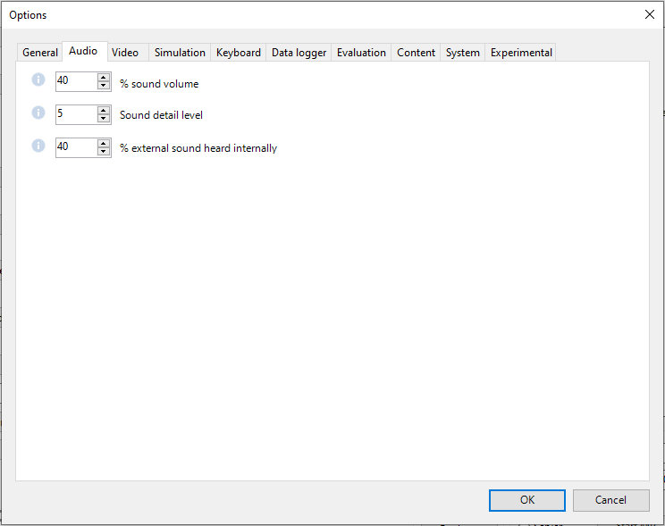
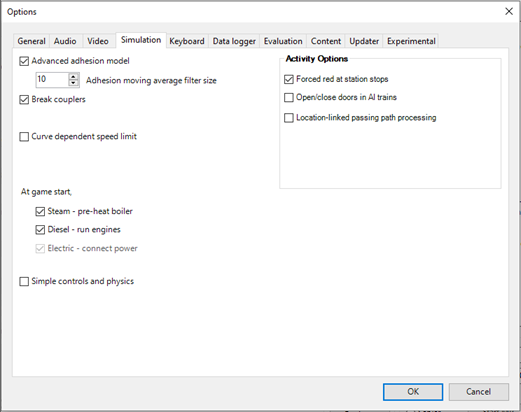

.. _options:

******************
Open Rails Options
******************

Clicking on the *Options* button opens a multi-panel window. The *Menu >
Options* panels contain the settings which remain in effect during your
simulation. Most of the options are self-explanatory; you may set them
according to your preference and system configuration. For example, you
can turn off dynamic shadowing if your system has low FPS
(frames-per-second) capability. The options configuration that you select
is saved when you click *OK*. When you restart OR, it will use the last
options configuration that you selected.

There are 10 option panels, described below.

.. _options-general:

General Options
===============

.. image:: images/options-general.png

Alerter in Cab
--------------

As in real life, when this option is selected, the player driving the train
is required to perform specific actions to demonstrate that he is *alive*,
i.e. press the Alerter Button (or press the Key ``<Z>``). As the player may
sometimes use a view other than the cabview to follow the train, and
therefore will not see the alerter warning, selecting the related option
*Also in external views* enables the alerter in those views as well.

.. _options-dispatcher:

Dispatcher window
-----------------

It is suggested to always select this option. When this option is selected,
pressing ``<Ctrl+9>`` at runtime creates an additional window like the
following. This window coexists with the main Open Rails window, and
``<Alt+Tab>`` switches between it and the Open Rails window. See the related
option :ref:`Fast fullscreen Alt+Tab <options-fullscreen>`.

Through this window you can monitor train movements and also influence
them, by setting signals and switches. A complete description of the
dispatcher window can be found :ref:`here <driving-dispatcher>`.

.. image:: images/options-dispatcher.png

Graduated release air brakes
----------------------------

Selecting this option allows a partial release of the brakes. Generally
speaking, operating with the option checked is equivalent to passenger
standard and unchecked is equivalent to freight standard. A complete
description of this option can be found :ref:`here <physics-braking>`.

Large address aware binaries
----------------------------

It is suggested to leave this option checked. When it is unchecked, Open
Rails can use a maximum of 2 GB of RAM. When it is checked, the maximum is
4 GB for 64-bit Windows systems, and 2 or 3 GB for 32-bit Windows systems.
To increase the maximum RAM used by OR in 32-bit Windows systems from 2 to
3 GB see the information found `here <http://knowledge.autodesk.com/
support/autocad/troubleshooting/caas/sfdcarticles/sfdcarticles/
How-to-enable-a-3GB-switch-on-Windows-Vista-Windows-7-or-Windows-XP-s.html>`_.

Take note that the RAM increase from 2 to 3 GB in 32-bit systems can slow
down computer operation when not using OR.

Control confirmations
---------------------

Following MSTS practice, whenever you make adjustments to the train
controls (e.g. open the throttle) OR briefly shows a message near the
bottom of the screen.

.. image:: images/options-confirmations.png

This is helpful for operations that don't have visible feedback and also
allows you to control the train without being in the cab.

Uncheck this option if you prefer to monitor your cab instruments and
don't want to see these messages.

OR uses the same message scheme for system messages such as "Game saved"
or "Replay ended" but you cannot suppress these system messages.

Control confirmations can also be toggled on and off at runtime using the 
key combination Ctrl-Alt-F10. 

.. _options-retainers:

Retainer valve on all cars
--------------------------

The player can change the braking capability of all of the cars in the
simulation to include :ref:`Brake Retainers <physics-retainers>`. These
cause the brake cylinder on a car to retain some fixed pressure when the
train brakes are released; this causes the car to produce a constant
braking force. If this option is not checked, then brake retainers are
only found on cars that have an appropriate entry, as described
:ref:`here <physics-retainers>`, in their .wag files.

.. _options-brake-pipe-charging:

Brake pipe charging rate
------------------------

The Brake Pipe Charging Rate (psi/s) value controls the charging rate of
the main air brake pipe. Increasing the value will reduce the time
required to recharge the train (i.e. when releasing the brakes after a
brake application), while decreasing the value will slow the charging
rate. See also the :ref:`paragraphs <physics-hud-brake>` on the OR implementation of the braking
system.

If this parameter is set at 1000, a simplified, MSTS-like braking model is
implemented, providing for faster brake release and being less influenced
by incoherent braking parameters within .eng file.

Language
--------

OR is an internationalized package. It supports many languages, and others
can be added by following the instructions contained in the *Localization
Manual* which can be found in the Open Rails ``Source/Trunk/Documentation``
folder.

When *System* is selected, OR automatically selects the language of the
hosting OS, if the language is available.

.. _options-pressure:

Pressure unit
-------------

The player can select the unit of measure of brake pressure in the
:ref:`HUD display <driving-hud>`.

When set to *automatic* the unit of measure is the same as that used in
the cabview of the locomotive.

Other units
-----------

This selects the units displayed for length, mass, pressure, etc. in the
:ref:`F5 HUD <driving-hud>` of the simulation.

The option *Player's Location* sets the units according to the Windows
*Language and Region* settings on the player's computer.

The option *Route* sets the units based on the data in the route files.
The other options are self-explanatory.

The F5 HUD uses the abbreviations *stn* for short tons (2000 lb) and
*t* or *tn* for metric tons (tonnes).

Note that the units displayed by the :ref:`F4 Track Monitor <driving-track-monitor>` (e.g. velocity and
distance) are always based on data read from the route files.

Disable TCS scripts
-------------------

This option disables the train control system scripts for locomotives where
these have been implemented.

Audio Options
=============

Except for very slow computers, it is suggested that you leave the *MSTS
Bin compatible sound* option checked and set the Sound detail level to 5.

The *% sound volume* scroll button allows adjustment of the volume of OR
sound. Default is 40.

The *% external sound heard internally* scroll button allows to define the percentage
of the original volume of external sounds heard in cab and passenger views. In fact
in real world external sounds are attenuated when heard within a trainset.
This percentage may be overridden trainset by trainset as defined
:ref:`here <sound-external>`.

Video Options
=============

.. image:: images/options-video.png

Dynamic shadows
---------------

With this option it is possible to enable or disable the display of
dynamic shadows. Disabling can be helpful if low frame rates are
experienced.

Shadow for all shapes
---------------------

When this option is selected and also the Dynamic shadows option is selected,
OR displays a shadow also for the objects that don't have a shadow defined in
the .ref file, and also for forest trees. This may reduce game performance.

.. _options-fullscreen:

Fast full-screen Alt+Tab
------------------------

When this option is selected, and OR is running full-screen, pressing
Alt+Tab leaves OR full-screen and running, and allows the
:ref:`Dispatcher Window <driving-dispatcher>` to be shown in front of it. If this option is not selected, OR is
minimized. The Dispatcher Window :ref:`option <options-dispatcher>` must also be selected and the
Dispatcher Window started with Ctrl+9 to display the Dispatcher Window.
Each successive press of Alt+Tab will toggle between the Dispatcher window
and the OR window.

Glass on in-game windows
------------------------

When this option is checked, the in-game windows are displayed in a
semitransparent mode.

Model instancing
----------------

When the option is checked, in cases where multiple instances of the same
object have to be drawn, only a single draw call is sent to the GPU. This
means lower CPU load. It is suggested to always check this option.

Overhead wire
-------------

This option will enable or disable display of the overhead wire.

.. _options-double-overhead-wires:

Double overhead wires
---------------------

MSTS uses a single wire for electrified routes; you may check this box so
that OR will show the two overhead wires that are more common.

.. _options-vsync:

Vertical sync
-------------

When this option is selected, the OR update rate cannot be higher than the
monitor vertical sync frequency (typically 60 Hz). This reduces CPU energy
consumption in fast PCs.

.. _options-cab-stretch:

% Cab 2D Stretch
----------------

OR manages not only cab interiors using 2D images in a MSTS-compatible
way, but also supports 3D models. Most 2D cab images follow MSTS practice,
being 1024 x 768 pixels to suit monitors with a 4:3 aspect ratio.

So, the problem arises -- how to display these 4:3 cabs on a 16:9 or 16:10
monitor?

One possibility is to stretch these images horizontally to match other
aspect ratios, as shown in the image below.

.. image:: images/options-2dstretch_1.png

To respect the proportions however, by default OR does no stretching and
shows the full width of the cab interior, thus losing a portion from the
top and bottom of the image. You can use the Up and Down Arrow keys to pan
and reveal these missing portions.

Therefore the setting for % Cab 2D Stretch has a default value of 0
providing no stretching and a maximum value of 100 which stretches the
picture so as to cover the complete display. Intermediate values provide a
blend of panning and stretching.

.. image:: images/options-2dstretch_2.png

OR can also pillarbox or letterbox the cab by filling the missing space with 
black bars. You can activate this mode in-game by pressing Ctrl+1. It overrides 
any stretching.

.. image:: images/options-2dstretch_3.png

Viewing distance
----------------

This option defines the maximum distance at which terrain is displayed. At
higher distances Distant Mountains will be displayed (see below). This
parameter increases CPU and GPU load. Also, some routes are optimized for
the standard MSTS maximum viewing distance (2000m).

Distant Mountains
-----------------

Distant mountains are supported in a way that is compatible with MSTS.
Distant mountains are present in the route if it has a folder called
LO_TILE. You may turn the feature on by checking the *Distant Mountains*
checkbox. In addition to MSTS capability, you can select the viewing
distance of the distant mountains.

.. image:: images/options-mountains.png

Viewing vertical FOV
--------------------

This value defines the vertical angle of the world that is shown. Higher
values correspond roughly to a zoom out effect. The default is 45 degrees.

World object density
--------------------

This value can be set from 0 to 10; when 10 is selected, all objects
defined in the route files are displayed. Lower values do not display some
categories of objects.

Window size
-----------

This pair of values defines the size of the OR window. There are some
preconfigured pairs of values, however you may also manually enter a
different size to be used.

Ambient daylight brightness
---------------------------

With this slider you can set the daylight brightness.

.. _options-simulation:

Simulation Options
==================

The majority of these options define train physics behavior.

.. _options-advanced-adhesion:

Advanced adhesion model
-----------------------

OR supports two adhesion models: the basic one is similar to the one used
by MSTS, while the advanced one is based on a model more similar to reality.

For more information read the section on :ref:`Adhesion Models <physics-adhesion>` later in this
manual.

Adhesion moving average filter size
-----------------------------------

The computations related to adhesion are passed through a moving average
filter. Higher values cause smoother operation, but also less
responsiveness. 10 is the default filter size.

Break couplers
--------------

When this option is selected, if the force on a coupler is higher than the
threshold set in the .eng file, the coupler breaks and the train is
divided into two parts. OR will display a message to report this.

.. _options-curve-resistance:

Curve dependent resistance
--------------------------

When this option is selected, resistance to train motion is influenced by
the radius of the curve on which the train is running. This option is
described in detail :ref:`here <physics-curve-resistance>` (theory) and
also :ref:`here <physics-curve-resistance-application>` (OR application).

Curve dependent speed limit
---------------------------

When this option is selected, OR computes whether the train is running too
fast on curves, and if so, a warning message is logged and displayed on
the monitor. Excessive speed may lead to overturn of cars, this is also
displayed as a message. This option is described in detail
:ref:`here <physics-curve-speed-limit>` (theory) and also
:ref:`here <physics-curve-speed-limit-application>` (OR application).
OR does not display the damage.

.. _options-tunnel-resistance:

Tunnel dependent resistance
---------------------------

When this option is selected, OR takes into account the fact that trains
in tunnels are subject to higher air resistance, and therefore need a
higher effort at invariant speed. This option is described in detail
:ref:`here <physics-tunnel-friction>` (theory) and
:ref:`here <physics-tunnel-friction-application>` (OR application).

.. _options-wind-resistance:

Wind dependent resistance
-------------------------

When this option is selected, resistance to train motion is influenced by
the wind speed, and the direction that it is blowing. This option is
described in detail :ref:`here <physics-wind-resistance>`

Override non-electrified route line-voltage
-------------------------------------------

This option allows running (in a non-prototypical way) electric
locomotives on non-electrified routes.

Steam locomotive hot start
--------------------------

This option allows starting the game with the boiler water temperature
already at a value that allows running the locomotive. If the option is
not selected, you will have to wait until the water temperature reaches a
high enough value.

.. _options-autopilot:

Autopilot
---------

With this option enabled and when in activity mode, it is possible to stay
in the cab of the player train, but to let Open Rails move the train,
respecting path, signals, speeds and station stops.

It is possible to switch the player train between autopilot mode and
player driven mode at run time. The Autopilot mode is described
:ref:`here <driving-autopilot>`.

.. _options-ai-shunting:

Extended AI train shunting
--------------------------

When this option is selected, further AI train shunting functions are
available. This allows for more interesting and varied activities. If an
activity is run which makes use of these function, this option must be
selected. This option has no effect in :ref:`Timetable mode <timetable>`.

The following additional shunting functions are available:

- AI train couples to static consist and restarts with it.
- AI train couples to player or AI train and becomes part of it; coupled AI
  train continues on its path.
- AI train couples to player or AI train and leaves to it its cars; coupled
  and coupling train continue on their path.
- AI train couples to player or AI train and *steals* its cars; coupled
  and coupling train continue on their path.
- AI train uncouples any number of its cars; the uncoupled part becomes a
  static consist. With the same function it is possible to couple any number
  of cars from a static consist.

.. admonition:: For content developers

    A more detailed description of this feature can be found under
    Extended AI Train Shunting under :ref:`Open Rails Train Operation
    <operation-ai-shunting>`.

.. admonition:: For content developers

    Selecting this option also enables the waiting points to declare an
    absolute time-of-day instead of a waiting point duration. A more
    detailed description of this feature can be found in the
    :ref:`related paragraph <operation-absoluteWP>` in the chapter *Open Rails Train Operation*.

.. _options-forced-red:

Forced red at station stops
---------------------------

In case a signal is present beyond a station platform and in the same
track section (no switches in between), OR will set the signal to red
until the train has stopped and then hold it as red from that time up to
two minutes before starting time. This is useful in organizing train meets
and takeovers, however it does not always correspond to reality nor to
MSTS operation. So with this option the player can decide which behavior
the start signal will have. This option is checked by default. Unchecking
the option has an effect on simulation behavior only if no
:ref:`Timetable mode <timetable>` operation is under way.

.. _options-open-doors-ai:

Open/close doors on AI trains
-----------------------------

This option enables door open/close at station stops on AI trains having passenger
trainsets with door animation. Doors are opened 4 seconds after train stop and closed
10 seconds before train start. Due to the fact that not all routes have been built with
correct indication of the platform side with respect to the track, this option can be
individually disabled or enabled on a per-route basis, as explained
:ref:`here <features-route-open-doors-ai>`.
With option enabled, doors open and
close automatically also when a player train is in :ref:`autopilot mode <driving-autopilot>`.
The option is active only in activity mode.

.. _options-keyboard:

Keyboard Options
================

.. image:: images/options-keyboard.png

In this panel you will find listed the keyboard keys that are associated
with all OR commands.

You can modify them by clicking on a field and pressing the new desired
key. Three symbols will appear at the right of the field: with the first
one you validate the change, with the second one you cancel it, with the
third one you return to the default value.

By clicking on *Check* OR verifies that the changes made are compatible,
that is, that there is no key that is used for more than one command.

By clicking on *Defaults* all changes that were made are reset, and the
default values are reloaded.

By clicking on *Export* a printable text file ``Open Rails
Keyboard.txt`` is generated on the desktop, showing all links between
commands and keys.

Data Logger Options
===================

.. image:: images/options-logger.png

By selecting the option *Start logging with the simulation start* or by
pressing ``<F12>`` a file with the name dump.csv is generated in the
configured Open Rails logging folder (placed on the Desktop by default).
This file can be used for later analysis.

Evaluation Options
==================

.. image:: images/options-evaluation.png

When data logging is started (see preceding paragraph), data selected in
this panel are logged, allowing a later evaluation on how the activity was
executed by the player.

.. _options-Content:

Content Options
===============

.. image:: images/options-content.png

This window allows you to add, remove or modify access to additional MSTS
installations or miniroute installations for Open Rails. Installations
located on other drives, or on a USB key, can be added even if they are
not always available.

Click on the *Add* button, and locate the desired installation. OR will
automatically enter a proposed name in the *Name:* window that will
appear in the *Installation set:* window on the main menu form. Modify
the name if desired, then Click *OK* to add the new path and name to
Open Rails.

To remove an entry (note that this does not remove the installation
itself!) select the entry in the window, and click *Delete*, then *OK*
to close the window. To modify an entry, use the *Browse...* button to
access the location; make the necessary changes, and then *Save* the
changes.

.. _options-updater:

Updater Options
===============

.. image:: images/options-updater.png

These options control which OR version update channel is active (see also
:ref:`here <updating-or>`). The various options available are self-explanatory.

.. _options-experimental:

Experimental Options
====================

.. image:: images/options-experimental.png

Some experimental features being introduced in Open Rails may be turned on
and off through the *Experimental* tab of the Options window, as
described below.

Super-elevation
---------------

If the value set for *Level* is greater than zero, OR supports super
elevation for long curved tracks. The value *Minimum Length* determines
the length of the shortest curve to have super-elevation. You need to
choose the correct gauge for your route, otherwise some tracks may not be
properly shown.

When superelevation is selected, two viewing effects occur at runtime:

1. If an external camera view is selected, the tracks and the running
   train will be shown inclined towards the internal part of the curve.
2. When the cab view is selected, the external world will be
   shown as inclined towards the external part of the curve.

.. image:: images/options-superelevation_1.png
.. image:: images/options-superelevation_2.png

OR implements super elevated tracks using Dynamic Tracks. You can change
the appearance of tracks by creating a ``<route folder>/TrackProfiles/
TrProfile.stf`` file. The document ``How to Provide Track Profiles for
Open Rails Dynamic Track.docm`` describing the creation of track profiles
can be found in the OpenRails ``/Source/Documentation/`` folder. Forum
discussions about track profiles can also be found on `Elvas Tower
<http://www.elvastower.com/forums/index.php?/topic/21119-superelevation/
page__view__findpost__p__115247>`_.

Automatically tune settings to keep performance level
-----------------------------------------------------

When this option is selected OR attempts to maintain the selected Target
frame rate FPS ( Frames per second). To do this it decreases or increases
the viewing distance of the standard terrain. If the option is selected,
also select the desired FPS in the *Target frame rate* window.

.. _options-location-linked-passing-path:

Location-linked passing path processing
---------------------------------------

When this option is NOT selected, ORTS acts similarly to MSTS. That is, if
two trains meet whose paths share some track section in a station, but are
both provided with passing paths as defined with the MSTS Activity Editor,
one of them will run through the passing path, therefore allowing the
meet. Passing paths in this case are only available to the trains whose
path has passing paths.

When this option is selected, ORTS makes available to all trains the main
and the passing path of the player train. Moreover, it takes into account
the train length in selecting which path to assign to a train in case of a
meet.

.. admonition:: For content developers

    A more detailed description of this feature can be
    found under :ref:`Location-Linked Passing Path Processing <operation-locationpath>`
    in the chapter  *Open Rails Train Operation*.

.. _options-shape-warnings:

Show shape warnings
-------------------

When this option is selected, when OR is loading the shape (.s) files it
will report errors in syntax and structure (even if these don't cause
runtime errors) in the :ref:`Log file <driving-logfile>` ``OpenRailsLog.txt`` on the desktop.

.. _options-etcs:

ETCS circular speed gauge
-------------------------

When this option is selected, it is possible to add to the cabview a
circular speed gauge accordingly to the European standard train control
system ETCS.

.. image:: images/options-etcs.png
   :scale: 60 %
   :align: center

.. admonition:: For content developers

    The gauge is added by the insertion of a block like the following
    into the .cvf file::

        Digital (
            Type ( SPEEDOMETER DIGITAL )
            Style ( NEEDLE )
            Position ( 160 255 56 56 )
            ScaleRange ( 0 250 )
            Units ( KM_PER_HOUR )
        )

Load day/night textures only when needed
----------------------------------------

As a default OR loads night textures together with the day textures both at
daytime and nighttime. When this option is selected, to reduce loading time and reduce
memory used, night textures are not loaded in the daytime and are only
loaded at sunset (if the game continues through sunset time); analogously day
textures are not loaded in the nighttime if the related night textures are
available, and are only loaded at sunrise (if the game continues through sunrise
time).

Signal light glow
-----------------

When this option is set, a glowing effect is added to signal semaphores
when seen at distance, so that they are visible at a greater distance.
There are routes where this effect has already been natively introduced;
for these, this option is not recommended.

Correct questionable braking parameters
---------------------------------------

When this option is selected, Open Rails corrects some braking parameters
if they are out of a reasonable range or if they are incoherent. This is
due to the fact that many existing .eng files have such issues, that are
not a problem for MSTS, which has a much simpler braking model, but that
are a problem for OR, which has a more sophisticated braking model. The
problem usually is that the train brakes require a long time to release,
and in some times do not release at all.

The following checks and corrections are performed if the option is
checked (only for single-pipe brake system):

- if the compressor restart pressure is smaller or very near to the max
  system pressure, the compressor restart pressure and if necessary the max
  main reservoir pressure are increased;
- if the main reservoir volume is smaller than 0.3 m\ :sup:`3` and the
  engine mass is higher than 20 tons, the reservoir volume is raised to 0.78
  m\ :sup:`3`;
- the charging rate of the reservoir is derived from the .eng parameter
  ``AirBrakesAirCompressorPowerRating`` (if this generates a value greater
  than 0.5 psi/s) instead of using a default value.

.. _options-act-randomization:

Activity randomization
----------------------
The related ``Level`` box may be set to integer values from zero to three.
When a level of zero is selected, no randomization is inserted.
When a level greater than zero is selected, some activity parameters are randomly
changed, therefore causing different behaviors of the activity at every run.
Level 1 generates a moderate randomization, level 2 a significant randomization
and level 3 a high randomization, that may be unrealistic in some cases.
This feature is described in greater detail :ref:`here
<driving-act-randomization>`.

.. _options-actweather-randomization:

Activity weather randomization
------------------------------

The ``Level`` box works as the one for activity randomization, and has the
same range. When a level greater than zero is selected, the initial weather is
randomized, and moreover it changes during activity execution.
The randomization is not performed if at activity start the train is within a
lat/lon rectangle corresponding to the arid zone of North America (lat from
105 to 120 degrees west and lon from 30 to 45 degrees north).
The randomization is not performed either if the activity contains weather
change events.

Extend object maximum viewing distance to horizon
-------------------------------------------------

With this option selected, all objects viewable up to the viewing distance
defined in the Video Options are displayed. As a default ORTS only
displays objects up to 2000 m distance. Selecting this option improves
display quality but may reduce frame rate.

.. _options-dds-textures:

Load DDS textures in preference to ACE
--------------------------------------

Open Rails is capable of loading both ACE and DDS textures. If only one of
the two is present, it is loaded. If both are present, the ACE texture is
loaded unless this option has been selected.

MSTS Environments
-----------------

By default ORTS uses its own environment files and algorithms, e.g. for
night sky and for clouds.

With this option selected, ORTS applies the MSTS environment files. This
includes support of Kosmos environments, even if the final effect may be
different from the current MSTS one.

Adhesion factor correction
--------------------------

The adhesion is multiplied by this percentage factor. Therefore lower
values of the slider reduce adhesion and cause more frequent wheel slips
and therefore a more difficult, but more challenging driving experience.

Level of detail bias
--------------------

This option is an expansion (and replacement) of an earlier experimental
option: *Always use highest level of detail*. The new option allows you to
increase or reduce the level of detail generally shown independently of
the viewing distance and world object density.

Adhesion proportional to rain/snow/fog
--------------------------------------

When this option is selected, adhesion becomes dependent on the intensity
of rain and snow and the density of fog. Intensities and density can be
modified at runtime by the player.

Adhesion factor random change
-----------------------------

This factor randomizes the adhesion factor corrector by the entered
percentage. The higher the value, the higher the adhesion variations.

Precipitation Box Size
----------------------

Open Rails will simulate precipitation -- i.e. rain or snow, as falling
individual particles. This represents a significant computing and display
system load, especially for systems with limited resources. Therefore, the
region in which the precipitation particles are visible, the
*Precipitation Box*, is limited in size and moves with the camera. The
size of the box can be set by the entries in the height, width and length
boxes. The X and Z values are centered on the camera location, and falling
particles *spawn* and fall from the top of the box.

The max size for both length and width is 3000 meters or 9,842ft. Due to possibe
resource issues, the ability to use max length and width may not be possible.  The
best way to use the precipitation box is to define a square around your entire train
if small enough or around most of your train.  Keep track on how your resources are 
being used since snow will take up the most resources so you will have to adjust the
size until you are satisified with the results.

The reason for defining a square around your train is to minimize the moments when your train
is approaching the edge of the precipitation box.  Worst case is to save the activity,
exit and re-enter the activity since doing this will set your train back in the middle of the
precipitation box.

