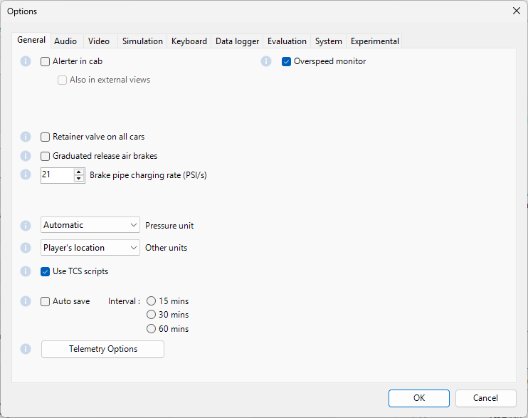
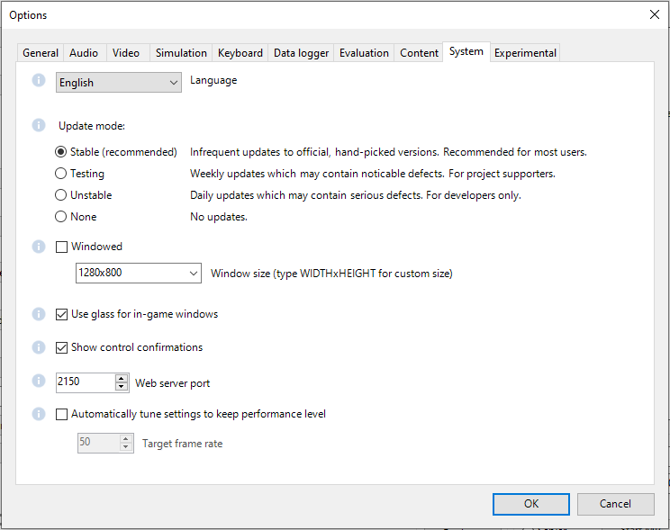
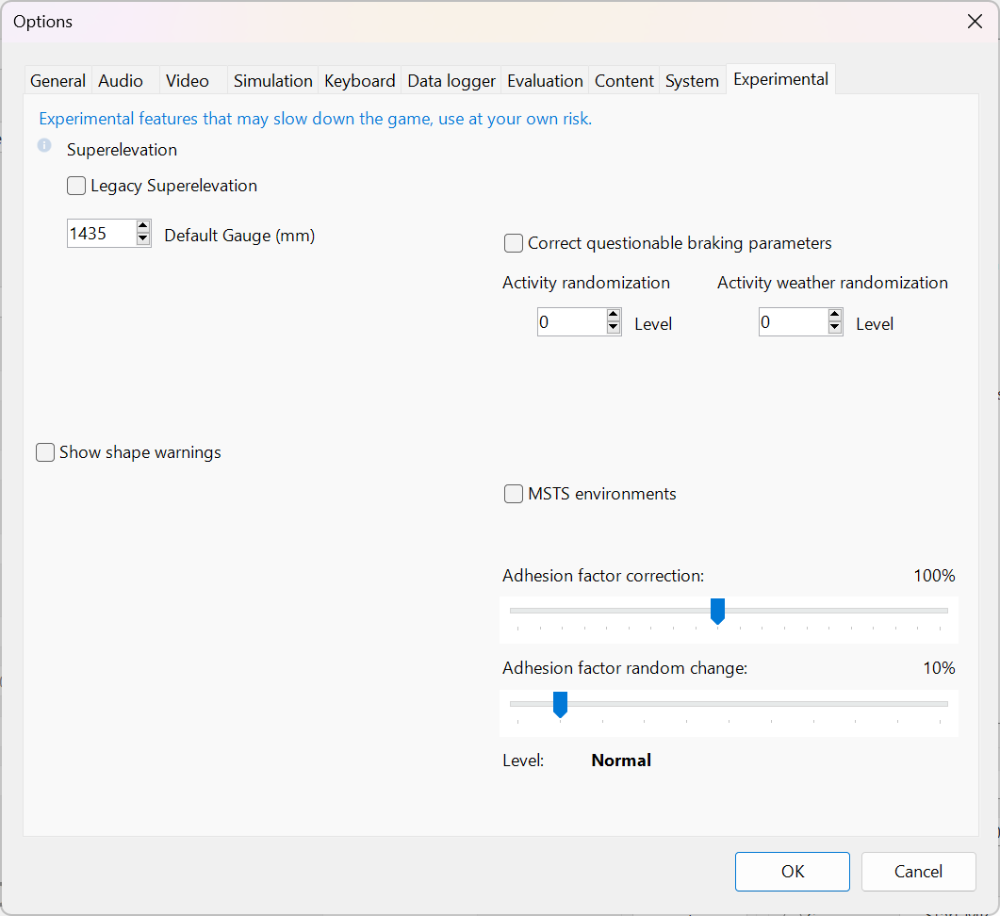

.. _options:

******************
Open Rails Options
******************

Clicking on the *Options* button opens a multi-panel window. The *Menu >
Options* panels contain the settings which remain in effect during your
simulation. Most of the options are self-explanatory; you may set them
according to your preference and system configuration. For example, you
can turn off dynamic shadowing if your system has low FPS
(frames-per-second) capability. The options configuration that you select
is saved when you click *OK*. When you restart OR, it will use the last
options configuration that you selected.

There are 10 option panels, described below.

.. _options-general:

General Options
===============

Alerter in cab
--------------

As in real life, when this option is selected, the player driving the train
is required to perform specific actions to demonstrate that he is *alive*,
i.e. press the Alerter Button (or press the Key ``<Z>``). As the player may
sometimes use a view other than the cabview to follow the train, and
therefore will not see the alerter warning, selecting the related option
*Also in external views* enables the alerter in those views as well.

Graduated release air brakes
----------------------------

Selecting this option allows a partial release of the brakes. Generally
speaking, operating with the option checked is equivalent to passenger
standard and unchecked is equivalent to freight standard. A complete
description of this option can be found :ref:`here <physics-braking>`.

.. _options-retainers:

Retainer valve on all cars
--------------------------

The player can change the braking capability of all of the cars in the
simulation to include :ref:`Brake Retainers <physics-retainers>`. These
cause the brake cylinder on a car to retain some fixed pressure when the
train brakes are released; this causes the car to produce a constant
braking force. If this option is not checked, then brake retainers are
only found on cars that have an appropriate entry, as described
:ref:`here <physics-retainers>`, in their .wag files.

.. _options-brake-pipe-charging:

Brake pipe charging rate
------------------------

The Brake Pipe Charging Rate (psi/s) value controls the charging rate of
the main air brake pipe. Increasing the value will reduce the time
required to recharge the train (i.e. when releasing the brakes after a
brake application), while decreasing the value will slow the charging
rate. See also the :ref:`paragraphs <physics-hud-brake>` on the ORTS implementation of the braking
system.

If this parameter is set at 1000, a simplified, MSTS-like braking model is
implemented, providing for faster brake release and being less influenced
by incoherent braking parameters within .eng file.

.. _options-pressure:

Pressure unit
-------------

The player can select the unit of measure of brake pressure in the
:ref:`HUD display <driving-hud>`.

When set to *automatic* the unit of measure is the same as that used in
the cabview of the locomotive.

Other units
-----------

This selects the units displayed for length, mass, pressure, etc. in the
:ref:`F5 Train Driving Info Window and also the Alt+F5 HUD <driving-hud>` of the simulation.

The option *Player's Location* sets the units according to the Windows
*Language and Region* settings on the player's computer.

The option *Route* sets the units based on the data in the route files.
The other options are self-explanatory.

These windows use the abbreviations *t-us* for short tons (2000 lb),
*t-uk* for long tons (2240 lb) and *t* for metric tons (1000 kg).

Note: The units displayed by the :ref:`F4 Track Monitor <driving-track-monitor>` (e.g. velocity and
distance) are always based on data read from the route files.

Use TCS scripts
-------------------

This option uses the train control system scripts for locomotives where
these have been implemented.

Overspeed Monitor
-----------------

If a Train Control Script (TCS) is specified for the loco and not disabled, then that takes priority.
Otherwise, if the loco has an Overspeed Monitor specified in its ENG file, then that monitor will detect excessive speed and respond as it was specified, e.g. by applying emergency braking.

This monitor is enabled by checking the option.

Audio Options
=============

.. image:: images/options-audio.png

Sound Volume
------------
The *% sound volume* scroll button allows adjustment of the volume of OR sound. 

Default is 40.

Sound Detail Level
------------------
Except for very slow computers, it is suggested that you set the Sound detail level to 5.

External Sound
--------------
The *% external sound heard internally* scroll button defines the percentage
of the original volume of external sounds heard in cab and passenger views.
This percentage may be overridden trainset by trainset as defined
:ref:`here <sound-external>`.

Video Options
=============

Viewing distance
----------------

This option defines the maximum distance at which terrain and objects are displayed. 
Where the content provides "Distant Mountains", these are displayed independently (see below).

Note: When the option to tune settings automatically is applied, then this 
value will be overridden and dynamically changed to maintain a target frame rate.

Note: Some routes are optimized for a viewing distance of 2km as this is the maximum provided by MSTS.

The default distance is 2km.

Distant mountains
-----------------

This option defines the maximum distance at which "Distant Mountains" are displayed. 

Note: "Distant Mountains" are present in the route if it has a folder called LO_TILE. 

The default setting is checked.

The default distance is 40km.

.. image:: images/options-mountains.png

Extend object maximum viewing distance to horizon
-------------------------------------------------

With this option selected, all objects viewable up to the viewing distance
(as defined above) are displayed, even if they have a level of detail (LOD) that is less distant. 

Without this option, ORTS only displays objects up to their peak distance set by their level of detail (LOD) 
or the viewing distance, whichever is less. 

Selecting this option shows all the objects that should be in view but it may reduce the frame rate.
MSTS limits the viewing distance to just 2km and the peak LOD distances are usually 2km, so this option
is especially useful for viewing routes created for MSTS at distances above 2km.

However, for routes that make good use of LOD settings, showing the objects that should be in view can be 
achieved at higher frame rates by unchecking this option.
For example, if the viewing distance is 10km and the content has been created with some large objects having 
peak distance LODs set at 5km and smaller objects having LODs which are much shorter, then this strategy
will show all the objects that should be in view without reducing the frame rate.

The default setting is checked.

Dynamic shadows
---------------

This option causes movable objects such as trains to cast shadows.
Unchecking the option will increase the frame rate.

The default setting is checked.

Shadow for all shapes
---------------------

Check this option to cast shadows from static objects.

The default setting is unchecked.

Note: This may reduce the frame rate.

Note: Static objects provided with shadows (in the World files) 
will cast shadows anyway. This option adds shadows for other static objects.

Overhead wire
-------------

This option will enable or disable display of the overhead wire.

.. _options-double-overhead-wires:

Double overhead wires
---------------------

MSTS uses a single wire for electrified routes; you may check this box so
that ORTS will show the two overhead wires that are more common.

Signal light glow
-----------------

When this option is set, a glowing effect is added to signal semaphores
when seen at distance, so that they are visible at a greater distance.
There are routes where this effect has already been natively introduced;
for these, this option is not recommended.

Ambient daylight brightness
---------------------------

With this slider you can set the daylight brightness.

Note: The controls on the right side of the tab are more subtle and the 
changes they make may be less easy to detect.

Model instancing
----------------

When the option is checked, in cases where multiple instances of the same 
object have to be drawn, only a single draw call is sent to the GPU. 
Uncheck this option to avoid the graphical glitches which appear on some 
hardware, but this may reduce the frame rate.

The default setting is checked.

.. _options-vsync:

Vertical sync
-------------

Vertical Sync (VSync) attempts to lock Open Rails’ output frame rate 
to your monitor's refresh rate for the smoothest image and to resist 
image "tearing".

VSync may help keep the frame rate more stable on complex routes, 
reducing sudden frame rate drops and apparent control lag in some cases.
If Open Rails' frame rate drops below your monitor's frame rate, you 
may see stuttering or image "tearing". To prevent this, either uncheck 
the VSync option or reduce the values for video options such as view 
distance, anti-aliasing, or world object density.

The default setting is checked.

Anti-aliasing
-------------

Controls the anti-aliasing method used by Open Rails. Anti-aliasing is a
computer graphics technique that smooths any harsh edges, otherwise known as
"jaggies," present in the video image. Currently, Open Rails only supports the
multisample anti-aliasing (MSAA) method. Higher applications of anti-aliasing
will require exponentially more graphics computing power.

The default setting is MSAA with 2x sampling.

World object density
--------------------

This value can be set from 0 to 99 and the default value is 49.
When 49 is selected, all content defined in the route files and intended for the player to see is visible. 
Lower values will hide some categories of objects which tends to increase frame rates.

In legacy routes, all the content was assigned to categories 0-10.
In more modern routes, content may be assigned to categories between 0 and 49.
Content builders are advised to reserve values 50 to 99 for objects used in building the route.

Level of detail bias
--------------------

Many visual objects are modelled at more than one level of detail (LOD) so, 
when they are seen at a distance, Open Rails can switch to the lesser level 
of detail without compromising the view. This use of multiple LODs reduces 
the processing load and so may increase frame rates.

Lowering the LOD Bias setting below 0 reduces the distance at which a lower 
level of detail comes into view, and so boosts frame rates but there may be 
some loss of sharpness.

Raising the LOD Bias setting above 0 increases the distance at which a lower 
level of detail comes into view. This may be useful to sharpen distant content 
that was created for a smaller screen or a wider field of view than you are 
currently using.

The default setting is 0.

Note: If your content does not use multiple LODs, then this option will have no effect.

Viewing vertical FOV
--------------------

This value defines the vertical angle of the world that is shown. Higher
values correspond roughly to a zoom out effect. The default is 45 degrees.

.. _options-simulation:

Simulation Options
==================

The majority of these options define train physics behavior.

.. image:: images/options-simulation.png

.. _options-advanced-adhesion:

Advanced adhesion model
-----------------------

OR supports two adhesion models: the basic one is similar to the one used
by MSTS, while the advanced one is based on a model more similar to reality.

For more information read the section on :ref:`Adhesion Models <physics-adhesion>` later in this
manual.

Adhesion moving average filter size
-----------------------------------

The computations related to adhesion are passed through a moving average
filter. Higher values cause smoother operation, but also less
responsiveness. 10 is the default filter size.

Break couplers
--------------

When this option is selected, if the force on a coupler is higher than the
threshold set in the .eng file, the coupler breaks and the train is
divided into two parts. ORTS will display a message to report this.

.. _options-curve-resistance:

Curve dependent speed limit
---------------------------

When this option is selected, ORTS computes whether the train is running too
fast on curves, and if so, a warning message is logged and displayed on
the monitor. Excessive speed may lead to overturn of cars, this is also
displayed as a message. This option is described in detail
:ref:`here <physics-curve-speed-limit>` (theory) and also
:ref:`here <physics-curve-speed-limit-application>` (OR application).
OR does not display the damage.

At game start, Steam - pre-heat boiler
--------------------------------------

With this option selected, the temperature and pressure of steam in the boiler is ready to pull the train.
Uncheck this option for a more detailed behaviour in which the player has to raise the boiler pressure.

If not, the boiler pressure will be at 2/3 of maximum, which is only adequate for light work.
If your schedule gives you time to raise the pressure close to maximum, then 
switch from AI Firing to Manual Firing (Ctrl+F) and increase the Blower (N) to 100% to raise a draught. 
Replenish the coal using R and Shift+R to keep the fire mass close to 100%.
Full pressure may be reached in 5 minutes or so.

The default setting is checked.

At game start, Diesel - run engines
-----------------------------------

When this option is checked, stationary diesel locos start the simulation with their engines running.
Uncheck this option for a more detailed behaviour in which the player has to start the loco's engine.

The default setting is checked.

At game start, Electric - power connected
-----------------------------------

When this option is checked, stationary electric locos start the simulation with power available.
Uncheck this option for a more detailed behaviour in which the player has to switch on electrical equipment.

The default setting is unchecked.

.. _options-forced-red:

Forced red at station stops
---------------------------

In case a signal is present beyond a station platform and in the same
track section (no switches in between), ORTS will set the signal to red
until the train has stopped and then hold it as red from that time up to
two minutes before starting time. This is useful in organizing train meets
and takeovers, however it does not always correspond to reality nor to
MSTS operation. So with this option the player can decide which behavior
the start signal will have. 

This option is checked by default. 

Note: Unchecking the option has no effect when in 
:ref:`Timetable mode <timetable>`.

.. _options-open-doors-ai:

Open/close doors on AI trains
-----------------------------

This option enables door open/close at station stops on AI trains having passenger
trainsets with door animation. Doors are opened 4 seconds after train stop and closed
10 seconds before train start. Due to the fact that not all routes have been built with
correct indication of the platform side with respect to the track, this option can be
individually disabled or enabled on a per-route basis, as explained
:ref:`here <features-route-open-doors-ai>`.
With option enabled, doors open and
close automatically also when a player train is in :ref:`autopilot mode <driving-autopilot>`.
The option is active only in activity mode.

.. _options-location-linked-passing-path:

Location-linked passing path processing
---------------------------------------

When this option is NOT selected, ORTS acts similarly to MSTS. That is, if
two trains meet whose paths share some track section in a station, but are
both provided with passing paths as defined with the MSTS Activity Editor,
one of them will run through the passing path, therefore allowing the
meet. Passing paths in this case are only available to the trains whose
path has passing paths.

When this option is selected, ORTS makes available to all trains the main
and the passing path of the player train. Moreover, it takes into account
the train length in selecting which path to assign to a train in case of a
meet.

.. admonition:: For content developers

    A more detailed description of this feature can be
    found under :ref:`Location-Linked Passing Path Processing <operation-locationpath>`
    in the chapter  *Open Rails Train Operation*.

Simple control and physics
--------------------------

This is an option which players can set to simplify either the train controls or physics. 
This feature is intended for players who want to focus on "running" trains and don't want to be bothered 
by complex controls or prototypical physics which may require some additional expertise to operate.

Initially this option affects only trains that use vacuum braking but other controls may be added in future versions.

With vacuum braking, it is sometimes necessary to operate two different controls to apply and release the brakes. 
With "Simple control and physics" checked, the player is able to operate the brakes just with the brake valve 
and doesn't need to consider the steam ejector separately.

.. _options-keyboard:

Keyboard Options
================

.. image:: images/options-keyboard.png

In this panel you will find listed the keyboard keys that are associated
with all ORTS commands.

You can modify them by clicking on a field and pressing the new desired
key. Three symbols will appear at the right of the field: with the first
one you validate the change, with the second one you cancel it, with the
third one you return to the default value.

By clicking on *Check* ORTS verifies that the changes made are compatible,
that is, that there is no key that is used for more than one command.

By clicking on *Defaults* all changes that were made are reset, and the
default values are reloaded.

By clicking on *Export* a printable text file ``Open Rails
Keyboard.txt`` is generated on the desktop, showing all links between
commands and keys.

Data Logger Options
===================

.. image:: images/options-logger.png

By selecting the option *Start logging with the simulation start* or by
pressing ``<F12>`` a file with the name dump.csv is generated in the
configured Open Rails logging folder (placed on the Desktop by default).
This file can be used for later analysis.

.. _options-Content:

Content Options
===============

.. image:: images/options-content.png

This window allows you to add, remove or modify access to content.
Each profile may be a folder containing one or more routes, or an MSTS
installation. 
Profiles located on other drives, or on a USB key, can be added even if they are
not always available.

Click on the *Add* button, and locate the desired installation. ORTS will
automatically enter a proposed name in the *Name:* window that will
appear in the *Installation set:* window on the main menu form. Modify
the name if desired, then click *OK* to add the new path and name to
Open Rails.

Please do not store content or any files within the folder containing the Open Rails software.
This is because the Updater operates by wiping out the contents of that folder before replacing it
with a new updated version. 
It would be unfriendly for users to lose content that they have stored there, so
attempts to add a profile folder stored there are blocked and lead to an error message. 

To remove an entry (note that this does not remove the installation
itself!) select the entry in the window, and click *Delete*, then *OK*
to close the window. To modify an entry, use the *Change...* button to
access the location and make the necessary changes.

.. _options-system:

System Options
===============

Language
--------
ORTS is an internationalized package. It supports many languages, and others
can be added by following the instructions contained in the *Localization
Manual* which can be found in the Open Rails ``Documentation``
folder.

When *System* is selected, ORTS automatically selects the language of the
hosting OS, if that language is available.

.. _options-updater-options:

Update mode
-----------
These options set which channel is active to update the ORTS version. 
More details are given
:ref:`here <updating-or>`.

.. _options-windowed:

Windowed
--------
If the ``Windowed`` checkbox is checked, Open Rails will run in a window 
instead of full screen.

Once the game has started, you can toggle between windowed mode and full screen by 
pressing ``Alt+Enter``.

The default setting is unchecked.

Window size
-----------

This pair of values defines the size of the ORTS window. There are some
pre-configured pairs of values and you can also enter a
specific width and height to be used.

The format is <width>x<height>, for example 1024x768.

.. _options-window-glass:

Glass on in-game windows
------------------------

When this option is checked, the in-game windows are shown semi-transparently.

The default setting is checked.

.. _options-control-confirmations:

Control confirmations
---------------------

Whenever you make adjustments to the train
controls (e.g. open the throttle) Open Rails briefly shows a message near the
bottom of the screen.

.. image:: images/options-confirmations.png

This is helpful for operations that don't have visible feedback and also
allows you to control the train without being in the cab.

Informational, Warning and Error messages are displayed here also. 

The default setting of this option is to show all messages. Dropdown list gives the following choices:

- None: no messages suppressed (default)
- Information: informational messages and control confirmations suppressed
- Warning: warning messages and the ones mentioned above suppressed
- Error: error messages and the ones mentioned above suppressed

OR uses the same message scheme for system messages such as "Game saved"
or "Replay ended" but you cannot suppress these system messages.

Once the game has started, you can cycle through the above settings  
by pressing ``Ctrl+Alt+F10``. 

.. _options-web-server-port:

Web server port
-----------------

The web server can be accessed from a browser on the local machine at
``http://localhost:<port>``, where ``<port>`` is the specified port number.
Change the default value of 2150 if it conflicts with other services.

If you `open
<https://www.howtogeek.com/394735/how-do-i-open-a-port-on-windows-firewall/>`_
the web server port (just granting RunActivity.exe an exemption is not
sufficient) in Windows Firewall, the server can also be accessed from a device
on the local network, such as a smartphone, tablet or another PC, using your
system's `IP address
<https://support.microsoft.com/en-us/windows/find-your-ip-address-f21a9bbc-c582-55cd-35e0-73431160a1b9>`_.
E.g.: If your Open Rails PC is at IP address 192.168.0.99, browse to
``http://192.168.0.99:2150``, where ``2150`` is the specified port number.

:ref:`Sample web pages <sample-web-pages>` are included in the Open Rails
installation and the browser will show a menu of sample pages.

As well as a web browser, data from the web server can also be fetched by any
program which can make a web request, such as C# or Python, using the
:ref:`Application Programming Interface <web-server-api>` (API).

.. _options-performance-tuner:

Automatically tune settings to keep performance level
-----------------------------------------------------

When this option is selected ORTS attempts to maintain the selected Target
frame rate FPS ( Frames per second). To do this it decreases or increases
the viewing distance of the standard terrain. If the option is selected,
also select the desired FPS in the *Target frame rate* field.

The default setting is unchecked.

.. _options-experimental:

Experimental Options
====================

Some experimental features being introduced in Open Rails may be turned on
and off through the *Experimental* tab of the Options window, as
described below.

Super-elevation
---------------

If the value set for *Level* is greater than zero, ORTS supports super-elevation 
for long curved tracks. The value *Minimum Length* determines
the length of the shortest curve to have super-elevation. You need to
choose the correct gauge for your route, otherwise some tracks may not be
properly shown.

When super-elevation is selected, two viewing effects occur at runtime:

1. If an external camera view is selected, the tracks and the running
   train will be shown inclined towards the inside of the curve.
2. When the cab view is selected, the external world will be
   shown as inclined towards the outside of the curve.

.. image:: images/options-superelevation_1.png
.. image:: images/options-superelevation_2.png

OR implements super-elevated tracks using Dynamic Tracks. You can change
the appearance of tracks by creating a ``<route folder>/TrackProfiles/
TrProfile.stf`` file. The document ``How to Provide Track Profiles for
Open Rails Dynamic Track.pdf`` describing the creation of track profiles
can be found in the *Menu > Documents* drop-down or the 
Open Rails ``/Source/Documentation/`` folder. Forum
discussions about track profiles can also be found on `Elvas Tower
<http://www.elvastower.com/forums/index.php?/topic/21119-superelevation/
page__view__findpost__p__115247>`_.

.. _options-shape-warnings:

Show shape warnings
-------------------

When this option is selected, when ORTS is loading the shape (.s) files it
will report errors in syntax and structure (even if these don't cause
runtime errors) in the :ref:`Log file <driving-logfile>` ``OpenRailsLog.txt`` on the desktop.

Correct questionable braking parameters
---------------------------------------

When this option is selected, Open Rails corrects some braking parameters
if they are out of a reasonable range or if they are incoherent. This is
due to the fact that many existing .eng files have such issues, that are
not a problem for MSTS, which has a much simpler braking model, but that
are a problem for OR, which has a more sophisticated braking model. The
problem usually is that the train brakes require a long time to release,
and in some times do not release at all.

.. index::
   single: AirBrakesAirCompressorPowerRating

The following checks and corrections are performed if the option is
checked (only for single-pipe brake system):

- if the compressor restart pressure is smaller or very near to the max
  system pressure, the compressor restart pressure and if necessary the max
  main reservoir pressure are increased;
- if the main reservoir volume is smaller than 0.3 m\ :sup:`3` and the
  engine mass is higher than 20 tons, the reservoir volume is raised to 0.78
  m\ :sup:`3`;
- the charging rate of the reservoir is derived from the .eng parameter
  ``AirBrakesAirCompressorPowerRating`` (if this generates a value greater
  than 0.5 psi/s) instead of using a default value.

For a full list of parameters, see :ref:`Developing ORTS Content - Parameters and Tokens<parameters_and_tokens>`

.. _options-act-randomization:

Activity randomization
----------------------
The related ``Level`` box may be set to integer values from zero to three.
When a level of zero is selected, no randomization is inserted.
When a level greater than zero is selected, some activity parameters are randomly
changed, therefore causing different behaviors of the activity at every run.
Level 1 generates a moderate randomization, level 2 a significant randomization
and level 3 a high randomization, that may be unrealistic in some cases.
This feature is described in greater detail :ref:`here
<driving-act-randomization>`.

.. _options-actweather-randomization:

Activity weather randomization
------------------------------

The ``Level`` box works as the one for activity randomization, and has the
same range. When a level greater than zero is selected, the initial weather is
randomized, and moreover it changes during activity execution.
The randomization is not performed if at activity start the train is within a
lat/lon rectangle corresponding to the arid zone of North America (lat from
105 to 120 degrees west and lon from 30 to 45 degrees north).
The randomization is not performed either if the activity contains weather
change events.

MSTS Environments
-----------------

By default ORTS uses its own environment files and algorithms, e.g. for
night sky and for clouds.

With this option selected, ORTS applies the MSTS environment files. This
includes support of Kosmos environments, even if the final effect may be
different from the current MSTS one.

Adhesion proportional to rain/snow/fog
--------------------------------------

Adhesion is dependent on the intensity
of rain and snow and the density of fog. Intensities and density can be
modified at runtime by the player.

Adhesion factor correction
--------------------------

The adhesion is multiplied by this percentage factor. Therefore lower
values of the slider reduce adhesion and cause more frequent wheel slips
and therefore a more difficult, but more challenging driving experience.

Adhesion factor random change
-----------------------------

This factor randomizes the adhesion factor corrector by the entered
percentage. The higher the value, the higher the adhesion variations.
