.. |deg|  unicode:: U+000B0 .. DEGREE SIGN
.. |mgr|  unicode:: U+003BC .. GREEK SMALL LETTER MU
.. |rgr|  unicode:: U+003C1 .. GREEK SMALL LETTER RHO
.. _physics:

******************
Open Rails Physics
******************

Open Rails physics is in an advanced stage of development. The physics
structure is divided into logical classes; more generic classes are parent
classes, more specialized classes inherit properties and methods of their
parent class. Therefore, the description for train cars physics is also
valid for locomotives (because a locomotive is a special case of a train
car). All parameters are defined within the .wag or .eng file.  The
definition is based on MSTS file format and some additional ORTS based
parameters. To avoid possible conflicts in MSTS, the *ORTS* prefix is
added to every OpenRails specific parameter (such as
``ORTSMaxTractiveForceCurves``).

The .wag or .eng file may be placed as in MSTS in the
``TRAINS\TRAINSET\TrainCar\`` folder (where TrainCar is the name of the
train car folder). If OR-specific parameters are used, or if different
.wag or .eng files are used for MSTS and OR, the preferred solution is to
place the OR-specific .wag or .eng file in a created folder
``TRAINS\TRAINSET\TrainCar\OpenRails\`` (see :ref:`here <physics-inclusions>`
for more).

For a full list of parameters, see :ref:`Developing OR Content - Parameters and Tokens<parameters_and_tokens>`

Train Cars (WAG, or Wagon Part of ENG file)
===========================================

The behavior of a train car is mainly defined by a resistance / resistive
force (a force needed to pull a car). Train car physics also includes
coupler slack and braking. In the description below, the Wagon section of
the WAG / ENG file is discussed.

Resistive Forces
----------------

Open Rails physics calculates resistance based on real world physics:
gravity, mass, rolling resistance and optionally curve resistance. This is
calculated individually for each car in the train. The program calculates
rolling resistance, or friction, based on the Friction parameters in the
Wagon section of .wag/.eng file. Open Rails identifies whether the .wag
file uses the *FCalc* utility or other friction data. If *FCalc* was used to
determine the Friction variables within the .wag file, Open Rails compares
that data to the Open Rails Davis equations to identify the closest match
with the Open Rails Davis equation. If no-FCalc Friction parameters are
used in the .wag file, Open Rails ignores those values, substituting its
actual Davis equation values for the train car.

.. index::
   single: ORTSDavis_A
   single: ORTSDavis_B
   single: ORTSDavis_C
   
A basic (simplified) Davis formula is used in the following form:

F\ :sub:`res` = ORTSDavis_A + speedMpS * (ORTSDavis_B + ORTSDavis_C * speedMpS\ :sup:`2`\ )

Where F\ :sub:`res` is the friction force of the car. The rolling resistance
can be defined either by *FCalc* or ORTSDavis_A, _B and _C components. If
one of the *ORTSDavis* components is zero, *FCalc* is used. Therefore, e.g.
if the data doesn't contain the B part of the Davis formula, a very small
number should be used instead of zero.

.. index::
   single: ORTSMergeSpeed
   single: ORTSStandstillFriction

When a train is initially started, additional force is needed to overcome
the initial higher bearing torque (forces) and track resistance.  Starting resistance is calculated 
automatically by Open Rails based upon empirical prototypical data at low speeds. 
By selecting different values for ``ORTSBearingType`` different values of starting 
resistance will be applied. The Open Rails calculation for starting resistance takes 
into account different conditions, such as weather (for example, snowing or clear), 
wagon (axle) load, wheel bearing temperature and wheel diameter. Hence when using the OR calculation 
the correct values should be inserted in ``ORTSNumberAxles`` parameter in the wagon section, and 
``ORTSNumberDriveAxles`` in the engine section. The ``WheelRadius`` value should also be 
inserted in both sections as appropriate.

Alternatively the low-speed friction force can be manually specified by the user by setting 
``ORTSStandstillFriction`` and ``ORTSMergeSpeed``.

.. index::
   single: ORTSTrackGauge
   single: ORTSRigidWheelBase

When running on a curve and if the
:ref:`Curve dependent resistance <options-curve-resistance>` option is
enabled, additional resistance is calculated, based on the curve radius,
rigid wheel base, track gauge and super elevation. The curve resistance
has its lowest value at the curve's optimal speed. Running at higher or
lower speed causes higher curve resistance. The worst situation is
starting a train from zero speed. The track gauge value can be set by
``ORTSTrackGauge`` parameter, otherwise 1435 mm is used. The rigid wheel base
can be also set by ``ORTSRigidWheelBase``, otherwise the value is estimated.
Further details are discussed later.

When running on a slope (uphill or downhill), additional resistance is
calculated based on the car mass taking into account the elevation of the
car itself. Interaction with the ``car vibration feature`` is a known issue
(if the car vibrates the resistance value oscillate).

Coupler Slack
-------------

Slack action for couplers is introduced and calculated the same way as in
MSTS.

Hot Wheel Bearings
------------------

Open Rails (OR) has instead used a representative bearing heat model to simulate 
the typical outcomes for bearing temperature heating or cooling effects.

- Bearing heats up and cools down as the train moves and stops.
- Bearing resistance in cold weather is significantly higher then when the 
  bearing is at its 'normal' operating temperature. Typically railway companies 
  elected to reduce loads for trains in cold conditions. The OR model will 
  reduce the car resistance as the bearing heats up, and it will increase 
  resistance as the bearing cools down.
- OR has a built in temperature model to determine the ambient temperature. The 
  ambient temperature is calculated based upon a world model of the average 
  temperatures at various latitudes. OR will use the latitude of the route to 
  calculate the ambient temperature. As ambient temperature also decreases with 
  height above sea level, OR takes this into account as well, and varies the 
  temperature accordingly.
- Depending upon the ``ActivityRandomizationLevel`` setting in the Option menu, 
  an overheating bearing (hotbox) may be randomly initialized on any trailing 
  car in the train (locomotives and tenders are excepted from overheating 
  bearings). The Hotbox will be activated randomly within the first 66% of the 
  activity duration. So for example, in an activity with a 20 minute duration, 
  a hotbox will only be activiated in the first 12 minutes of the activity, if 
  it has been initialised.

A special smoke effect,  ``BearingHotboxFX``, can be added adjacent to the wagon hot box. 
This will be triggered if the bearing overheats.

.. _physics-adhesion:

Adhesion of Locomotives -- Settings Within the Wagon Section of ENG files
-------------------------------------------------------------------------

MSTS calculates the adhesion parameters based on a very strange set of
parameters filled with an even stranger range of values. Since ORTS is not
able to mimic the MSTS calculation, a standard method based on the
adhesion theory is used with some known issues in use with MSTS content.

.. index::
   single: ORTSAdhesion
   single: ORTSCurtius_Kniffler

MSTS ``Adheasion`` (sic!) parameters are not used in ORTS. Instead, a new
set of parameters is used, which must be inserted within the ``Wagon``
section  of the .ENG file::

    ORTSAdhesion (
        ORTSCurtius_Kniffler (A B C D )
    )

The A, B and C values are coefficients of a standard form of various
empirical formulas, e.g. Curtius-Kniffler or Kother. The D parameter is
used in the advanced adhesion model described later.

From A, B and C a coefficient CK is computed, and the adhesion force limit
is then calculated by multiplication of CK by the car mass and the
acceleration of gravity (9.81), as better explained later.

The adhesion limit is only considered in the adhesion model of locomotives.

.. index::
   single: ORTSSlipWarningThreshold
   single: ORTSInertia
   
The adhesion model is calculated in two possible ways. The first one -- the
simple adhesion model -- is based on a very simple threshold condition and
works similarly to the MSTS adhesion model. The second one -- the advanced
adhesion model -- is a dynamic model simulating the real world conditions
on a wheel-to-rail contact and will be described later. The advanced
adhesion model uses some additional parameters such as::

    ORTSAdhesion (
        ORTSSlipWarningThreshold ( T )
    )

where T is the wheelslip percentage considered as a warning value to be
displayed to the driver; and::

    ORTSAdhesion(
        Wheelset (
            Axle (
                ORTSInertia (
                    Inertia
                )
            )
        )
    )

where Inertia is the model inertia in kg.m2 and can be set to adjust the
advanced adhesion model dynamics. The value considers the inertia of all
the axles and traction drives. If not set, the value is estimated from the
locomotive mass and maximal power.

The first model -- simple adhesion model -- is a simple tractive force
condition-based computation. If the tractive force reaches its actual
maximum, the wheel slip is indicated in HUD view and the tractive force
falls to 10% of the previous value. By reducing the throttle setting
adherence is regained. This is called the simple adhesion model.

The second adhesion model (advanced adhesion model) is based on a
simplified dynamic adhesion theory. Very briefly, there is always some
speed difference between the wheel speed of the locomotive and the
longitudinal train speed when the tractive force is different from zero.
This difference is called *wheel slip / wheel creep*. The adhesion
status is indicated in the HUD *Force Information* view by the *Wheel
Slip* parameter and as a warning in the general area of the HUD view. For
simplicity, only one axle model is computed (and animated). A tilting
feature and the independent axle adhesion model will be introduced in the
future.

The heart of the model is the slip characteristics (picture below).

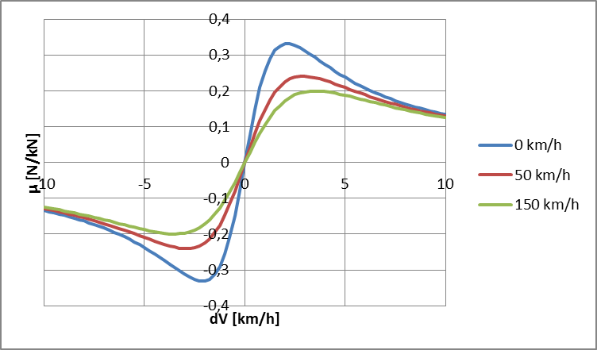

The *wheel creep* describes the stable area of the characteristics and is
used in the most of the operation time. When the tractive force reaches
the actual maximum of the slip characteristics, force transition falls
down and more power is used to speed up the wheels, so called *wheel
slip*.

To avoid the loss of the tractive force, use the throttle in combination
with sanding to return to the stable area (wheel creep area). A possible
sequence of the wheel slip development is shown on the pictures below. The
*Wheel slip* value is displayed as a value relative to the best adhesion
conditions for actual speed and weather. The value of 63% means very good
force transition. For values higher than ``( ORTSadhesion (
ORTSSlipWarningThreshold ) )`` or 70% by default, the *Wheel slip*
warning is displayed, but the force transition is still very good. This
indication should warn you to use the throttle very carefully. Exceeding
100%, the *Wheel slip* message is displayed and the wheels are starting
to speed up, which can be seen on the speedometer or in external view 2.
To reduce the wheel slip, use *throttle down*, sanding or the locomotive
brake.

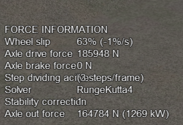
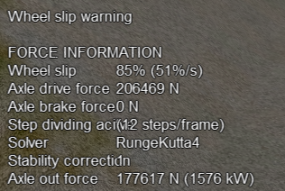
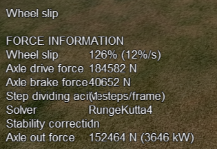

|image-paw1| |image-paw2| |image-paw3|

The *actual maximum* of the tractive force is based on the
Curtius-Kniffler adhesion theory and can be adjusted by the aforementioned
``ORTSCurtius_Kniffler ( A B C D )`` parameters, where A, B, C are
coefficients of Curtius-Kniffler, Kother or similar formula. By default,
Curtius-Kniffler is used.

.. math::

  F_{adhMAX} = W\cdot m\left[\mathrm{kg}\right]\cdot
  9.81\left[\mathrm{\frac{m}{s^2}}\right]\cdot\left(
  \frac{A}{B + v\left[\mathrm{\frac{km}{h}}\right]} + C\right)

Where ``W`` is the weather coefficient. This means that the maximum is
related to the speed of the train, or to the weather conditions.

The ``D`` parameter is used in an advanced adhesion model and should
always be 0.7.

There are some additional parameters in the *Force Information* HUD
view. The axle/wheel is driven by the *Axle drive force* and braked by
the *Axle brake force*. The *Axle out force* is the output force of
the adhesion model (used to pull the train). To compute the model
correctly the FPS rate needs to be divided by a *Solver dividing* value
in a range from 1 to 50. By default, the Runge-Kutta4 solver is used to
obtain the best results. When the *Solver dividing* value is higher than
40, in order to reduce CPU load the Euler-modified solver is used instead.

In some cases when the CPU load is high, the time step for the computation
may become very high and the simulation may start to oscillate (the
*Wheel slip* rate of change (in the brackets) becomes very high). There
is a stability correction feature that modifies the dynamics of the
adhesion characteristics. Higher instability can cause a huge wheel slip.
You can use the ``DebugResetWheelSlip`` (``<Ctrl+X>`` keys by default)
command to reset the adhesion model. If you experience such behavior most
of time, use the basic adhesion model instead by pressing
``DebugToggleAdvancedAdhesion`` ( ``<Ctrl+Alt+X>`` keys by default).

Another option is to use a Moving average filter available in the
:ref:`Simulation Options <options-simulation>`. The higher the value,
the more stable the simulation will be. However, the higher value causes
slower dynamic response. The recommended range is between 10 and 50.

.. index::
   single: ORTSWheelSlipCausesThrottleDown

To match some of the real world features, the *Wheel slip* event can
cause automatic zero throttle setting. Use the ``Engine (ORTS
(ORTSWheelSlipCausesThrottleDown))`` Boolean value of the ENG file.

Engine -- Classes of Motive Power
=================================

Open Rails software provides for different classes of engines: diesel,
electric, steam and default. If needed, additional classes can be created
with unique performance characteristics.

Diesel Locomotives in General
-----------------------------

The diesel locomotive model in ORTS simulates the behavior of two basic
types of diesel engine driven locomotives-- diesel-electric and
diesel-mechanical. The diesel engine model is the same for both types, but
acts differently because of the different type of load. Basic controls
(direction, throttle, dynamic brake, air brakes) are common across all
classes of engines. Diesel engines can be started or stopped by pressing
the START/STOP key (``<Shift+Y>`` in English keyboards). The starting and
stopping sequence is driven by a *starter* logic, which can be customized,
or is estimated by the engine parameters.

The diesel electric locomotive uses a diesel prime mover to generate electricity 
(using generators naturally) and this electricity is then used to drive 
traction motors to turn the wheels. The other types of diesel locomotives are 
similar from the perspective that they have a diesel prime mover, and then some 
form of transmission mechanism to transfer the power output of the prime 
mover to the locomotive wheels.

In configuring the locomitve correctly it is important to use the correct 
power/force values. The key values required in the ENG file for a diesel 
locomotive (regardless of transmission type) are as follows:

.. index::
   single: ORTSDieselEngineMaxPower
   single: MaxPower
   single: MaxForce
   single: MaxContinuousForce

``ORTSDieselEngineMaxPower`` ==> sets the maximum power output at the 
shaft of the diesel engine (or prime mover).

``MaxPower`` ==> sets the maximum power at the rail (provided to the wheels).

``MaxForce`` ==> sets the force that the locomotive is able to apply to the 
wheels when starting. 

``MaxContinuousForce`` ==> is the maximum force that the locomotive can 
continuously supply to the wheels without exceeding the design specifications. 
Typically this is linked to a particular speed (see next parameter).

.. index::
   single: ORTSSpeedOfMaxContinuousForce
   single: MaxVelocity
   
``ORTSSpeedOfMaxContinuousForce`` ==> is the speed at which the maximum force 
will be applied.

``MaxVelocity`` ==> is the maximum rated design speed of the locomotive. 
Some locomotives had a speed alarm which applied the brakes, or set the throttle 
to a lower value. This can be modelled using the OverspeedMonitor function.

.. index::
   single: ORTSUnloadingSpeed

``ORTSUnloadingSpeed`` ==> is the locomotive speed when the generator reaches 
its maximum voltage, and due to the speed of the train, the engine starts 
to 'unload'. Typically beyond this speed, power output of the locomotive 
will decrease.

If using power/force Tables, then some of the above values will not be 
required, see the sections below for details.

Starting the Diesel Engine
''''''''''''''''''''''''''

To start the engine, simply press the START/STOP key once. The direction
controller must be in the neutral position (otherwise, a warning message
pops up). The engine RPM (revolutions per minute) will increase according
to its speed curve parameters (described later). When the RPM reaches 90%
of StartingRPM (67% of IdleRPM by default), the fuel starts to flow and
the exhaust emission starts as well. RPM continues to increase up to
StartingConfirmationRPM (110% of IdleRPM by default) and the demanded RPM
is set to idle. The engine is now started and ready to operate.

Stopping the Diesel Engine
''''''''''''''''''''''''''

To stop the engine, press the START/STOP key once. The direction
controller must be in the neutral position (otherwise, a warning message
pops up). The fuel flow is cut off and the RPM will start to decrease
according to its speed curve parameters. The engine is considered as fully
stopped when RPM is zero. The engine can be restarted even while it is
stopping (RPM is not zero).

Starting or Stopping Helper Diesel Engines
''''''''''''''''''''''''''''''''''''''''''

By pressing the Diesel helper START/STOP key (``<Ctrl+Y>`` on English
keyboards), the diesel engines of helper locomotives can be started or
stopped. Also consider disconnecting the unit from the multiple-unit (MU)
signals instead of stopping the engine
(see :ref:`here <driving-car-operations>`, *Toggle MU connection*).

It is also possible to operate a locomotive with the own engine off and
the helper's engine on.

ORTS Specific Diesel Engine Definition
''''''''''''''''''''''''''''''''''''''

If no ORTS specific definition is found, a single diesel engine definition
is created based on the MSTS settings. Since MSTS introduces a model
without any data crosscheck, the behavior of MSTS and ORTS diesel
locomotives can be very different. In MSTS, MaxPower is not considered in
the same way and you can get much *better* performance than expected. In
ORTS, diesel engines cannot be overloaded.

No matter which engine definition is used, the diesel engine is defined by
its load characteristics (maximum output power vs. speed) for optimal fuel
flow and/or mechanical characteristics (output torque vs. speed) for
maximum fuel flow. The model computes output power / torque according to
these characteristics and the throttle settings. If the characteristics
are not defined (as they are in the example below), they are calculated
based on the MSTS data and common normalized characteristics.

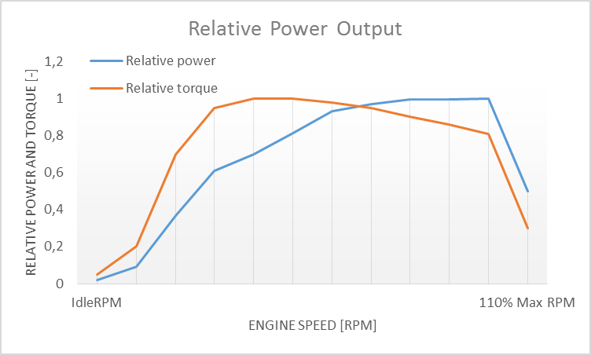

In many cases the throttle vs. speed curve is customized because power vs.
speed is not linear. A default linear throttle vs. speed characteristics
is built in to avoid engine overloading at lower throttle settings.
Nevertheless, it is recommended to adjust the table below to get more
realistic behavior.

In ORTS, single or multiple engines can be set for one locomotive. In case
there is more than one engine, other engines act like *helper* engines
(start/stop control for helpers is ``<Ctrl+Y>`` by default). The power of
each active engine is added to the locomotive power. The number of such
diesel engines is not limited.

If the ORTS specific definition is used, each parameter is tracked and if
one is missing (except in the case of those marked with *Optional*), the
simulation falls back to use MSTS parameters.

.. index::
   single: Engine
   single: ORTSDieselEngines
   single: Diesel
   single: IdleRPM
   single: MaxRPM
   single: StartingRPM
   single: StartingConfirmRPM
   single: ChangeUpRPMpS
   single: ChangeDownRPMpS
   single: RateOfChangeUpRPMpSS
   single: RateOfChangeDownRPMpSS
   single: MaximalPower
   single: IdleExhaust
   single: MaxExhaust
   single: ExhaustDynamics
   single: ExhaustDynamicsDown
   single: ExhaustColor
   single: ExhaustTransientColor
   single: DieselPowerTab
   single: DieselConsumptionTab
   single: ThrottleRPMTab
   single: DieselTorqueTab
   single: MinOilPressure
   single: MaxOilPressure
   single: Cooling
   single: TempTimeConstant
   single: OptTemperature
   single: IdleTemperature

+---------------------------------+------------------------------------+
|::                               |::                                  |
|                                 |                                    |
| Engine(                         | Engine section in eng file         |
| ...                             |                                    |
| ORTSDieselEngines ( 2           | Number of engines                  |
|   Diesel (                      |                                    |
|     IdleRPM ( 510 )             | Idle RPM                           |
|     MaxRPM ( 1250 )             | Maximal RPM                        |
|     StartingRPM ( 400 )         | Starting RPM                       |
|     StartingConfirmRPM ( 570 )  | Starting confirmation RPM          |
|     ChangeUpRPMpS ( 50 )        | Increasing change rate RPM/s       |
|     ChangeDownRPMpS ( 20 )      | Decreasing change rate RPM/s       |
|     RateOfChangeUpRPMpSS ( 5 )  | Jerk of ChangeUpRPMpS RPM/s^2      |
|     RateOfChangeDownRPMpSS ( 5 )| Jerk of ChangeDownRPMpS RPM/s^2    |
|     MaximalPower ( 300kW )      | Maximal output power               |
|     IdleExhaust ( 5 )           | Num of exhaust particles at IdleRPM|
|     MaxExhaust ( 50 )           | Num of exhaust particles at MaxRPM |
|     ExhaustDynamics ( 10 )      | Exhaust particle mult. at transient|
|     ExhaustDynamicsDown (10)    | Mult. for down transient (Optional)|
|     ExhaustColor ( 00 fe )      | Exhaust color at steady state      |
|     ExhaustTransientColor(      | Exhaust color at RPM changing      |
|         00 00 00 00)            |                                    |
|     DieselPowerTab (            | Diesel engine power table          |
|         0       0               |    RPM        Power in Watts       |
|         510     2000            |                                    |
|         520     5000            |                                    |
|         600     2000            |                                    |
|         800     70000           |                                    |
|         1000    100000          |                                    |
|         1100    200000          |                                    |
|         1200    280000          |                                    |
|         1250    300000          |                                    |
|     )                           |                                    |
|     DieselConsumptionTab (      | Diesel fuel consumption table      |
|         0       0               |  RPM   Vs consumption l/h/rpm      |
|         510     10              |                                    |
|         1250    245             |                                    |
|     )                           |                                    |
|     ThrottleRPMTab (            | Eengine RPM vs. throttle table     |
|         0   510                 |    Throttle %      Demanded RPM    |
|         5   520                 |                                    |
|         10  600                 |                                    |
|         20  700                 |                                    |
|         50  1000                |                                    |
|         75  1200                |                                    |
|         100 1250                |                                    |
|     )                           |                                    |
|     DieselTorqueTab (           | Diesel engine RPM vs. torque table |
|         0       0               |    RPM           Force in Newtons  |
|         510     25000           |                                    |
|         1250    200000          |                                    |
|     )                           |                                    |
|     MinOilPressure ( 40 )       | Min oil pressure PSI               |
|     MaxOilPressure ( 90 )       | Max oil pressure PSI               |
|     MaxTemperature ( 120 )      | Maximal temperature Celsius        |
|     Cooling ( 3 )               | Cooling 0=No cooling, 1=Mechanical,|
|                                 | 2= Hysteresis, 3=Proportional      |
|     TempTimeConstant ( 720 )    | Rate of temperature change         |
|     OptTemperature ( 90 )       | Normal temperature Celsius         |
|     IdleTemperature ( 70 )      | Idle temperature Celsius           |
|   )                             |                                    |
|   Diesel ( ... )                | The same as above, or different    |
+---------------------------------+------------------------------------+

Diesel Engine Speed Behavior
''''''''''''''''''''''''''''

The engine speed is calculated based on the RPM rate of change and its
rate of change. The usual setting and the corresponding result is shown
below. ``ChangeUpRPMpS`` means the slope of RPM, ``RateOfChangeUpRPMpSS``
means how fast the RPM approaches the demanded RPM.

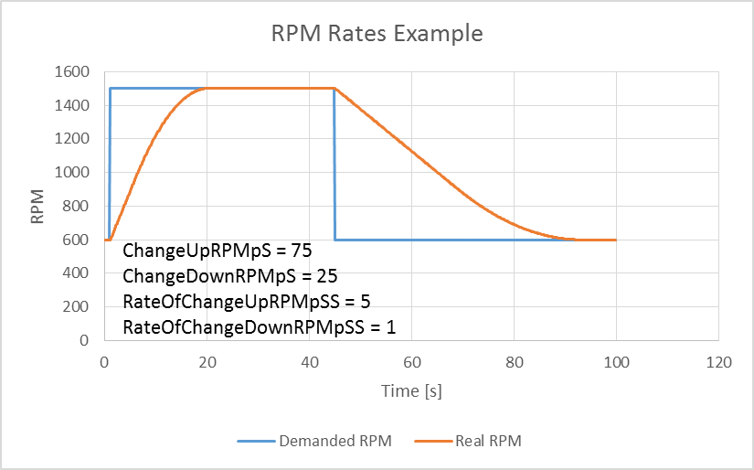

Fuel Consumption
''''''''''''''''

Following the MSTS model, ORTS computes the diesel engine fuel consumption
based on .eng file parameters. The fuel flow and level are indicated by
the HUD view. Final fuel consumption is adjusted according to the current
diesel power output (load).

Diesel Exhaust
''''''''''''''

The diesel engine exhaust feature can be modified as needed. The main idea
of this feature is based on the general combustion engine exhaust. When
operating in a steady state, the color of the exhaust is given by the new
ENG parameter ``engine (ORTS (Diesel (ExhaustColor)))``.

The amount of particles emitted is given by a linear interpolation of the
values of ``engine(ORTS (Diesel (IdleExhaust)))`` and ``engine(ORTS (Diesel
(MaxExhaust)))`` in the range from 1 to 50. In a transient state, the
amount of the fuel increases but the combustion is not optimal. Thus, the
quantity of particles is temporarily higher: e.g. multiplied by the value
of

``engine(ORTS (Diesel (ExhaustDynamics)))`` and displayed with the color
given by ``engine(ORTS(Diesel(ExhaustTransientColor)))``.

The format of the *color* value is (aarrggbb) where:

- aa = intensity of light;
- rr = red color component;
- gg = green color component;
- bb = blue color component;

and each component is in HEX number format (00 to ff).

Cooling System
''''''''''''''

ORTS introduces a simple cooling and oil system within the diesel engine
model. The engine temperature is based on the output power and the cooling
system output. A maximum value of 100\ |deg|\ C can be reached with no impact on
performance. It is just an indicator, but the impact on the engine's
performance will be implemented later. The oil pressure feature is
simplified and the value is proportional to the RPM. There will be further
improvements of the system later.

Diesel-Electric Locomotives
---------------------------

Diesel-electric locomotives are driven by electric traction motors
supplied by a diesel-generator set. The gen-set is the only power source
available, thus the diesel engine power also supplies auxiliaries and
other loads. Therefore, the output power will always be lower than the
diesel engine rated power.

.. index::
   single: ORTSTractionCharacteristics
   single: ORTSMaxTractiveForceCurves
   single: MaxForce
   single: MaxPower
   single: MaxVelocity
   single: ThrottleRPMTab
   single: DieselEngineType

In ORTS, the diesel-electric locomotive can use
``ORTSTractionCharacteristics`` or tables of ``ORTSMaxTractiveForceCurves``
to provide a better approximation to real world performance. If a table is
not used, the tractive force is limited by MaxForce, MaxPower and
MaxVelocity. The throttle setting is passed to the ThrottleRPMTab, where
the RPM demand is selected. The output force increases with the Throttle
setting, but the power follows maximal output power available (RPM
dependent).

Diesel-Hydraulic Locomotives
----------------------------

Diesel-hydraulic locomotives are not implemented in ORTS. However, by
using either ``ORTSTractionCharacteristics`` or ``ORTSMaxTractiveForceCurves``
tables, the desired performance can be achieved, when no gearbox is in use
and the ``DieselEngineType`` is *electric*.

Diesel-Mechanical Locomotives
-----------------------------

.. index::
   single: GearBoxBackLoadForce
   single: GearBoxCoastingForce
   single: GearBoxEngineBraking

ORTS features a mechanical gearbox feature that mimics MSTS behavior,
including automatic or manual shifting. Some features not well described
in MSTS are not yet implemented, such as ``GearBoxBackLoadForce``,
``GearBoxCoastingForce`` and ``GearBoxEngineBraking``.

Output performance is very different compared with MSTS. The output force
is computed using the diesel engine torque characteristics to get results
that are more precise.

Electric Locomotives
====================

.. index::
   single: MaxPower
   single: MaxForce

At the present time, diesel and electric locomotive physics calculations
use the default engine physics. Default engine physics simply uses the
MaxPower and MaxForce parameters to determine the pulling power of the
engine, modified by the Reverser and Throttle positions. The locomotive
physics can be replaced by traction characteristics (speed in mps vs.
force in Newtons) as described below.

Some OR-specific parameters are available in order to improve the realism
of the electric system.

Pantographs
-----------

The pantographs of all locomotives in a consist are triggered by
*Control Pantograph First* and *Control Pantograph Second* commands
( ``
`` and ``<Shift+P>`` by default ). The status of the pantographs
is indicated by the *Pantographs* value in the HUD view.

Since the simulator does not know whether the
pantograph in the 3D model is up or down, you can set some additional
parameters in order to add a delay between the time when the command to
raise the pantograph is given and when the pantograph is actually up.

.. index::
   single: ORTSPantographs
   single: Pantograph
   single: Delay

In order to do this, you can write in the Wagon section of your .eng file
or .wag file (since the pantograph may be on a wagon) this optional
structure::

    ORTSPantographs(
        Pantograph(         << This is going to be your first pantograph.
            Delay( 5s )     << Example : a delay of 5 seconds
        )
        Pantograph(
            ... parameters for the second pantograph ...
        )
    )

Other parameters will be added to this structure later, such as power
limitations or speed restrictions.

3rd and 4th Pantograph
----------------------

.. index::
   single: ORTSPantographs
   single: Pantograph
   single: ORTS_PANTOGRAPH3
   single: ORTS_PANTOGRAPH4

Open Rails supports up to 4 pantographs per locomotive. If three or four 
pantographs are present, the above ORTSPantographs() block is mandatory, 
and must contain a number of Pantograph() blocks equal to the number of 
pantographs in the locomotive.
The animation names of the 3rd and 4th pantograph follow the same rules valid 
for Pantograph 2 (replacing 2 with 3 and 4).
The third panto is moved with Ctrl-P, while the fourth panto is moved with Ctrl-Shift-P.
The cabview controls must be named ORTS_PANTOGRAPH3 and ORTS_PANTOGRAPH4.

.. _physics-circuit-breaker:

Circuit breaker
---------------

The circuit breaker of all locomotives in a consist can be controlled by
*Control Circuit Breaker Closing Order*, *Control Circuit Breaker Opening Order*
and *Control Circuit Breaker Closing Authorization* commands
( ``<O>``, ``<I>`` and ``<Shift+O>`` by default ). The status of the circuit breaker
is indicated by the *Circuit breaker* value in the HUD view.

.. index::
   single: ORTSCircuitBreaker
   single: ORTSCircuitBreakerClosingDelay

Two default behaviours are available:

- By default, the circuit breaker of the train closes as soon as power is available
  on the pantograph.
- The circuit breaker can also be controlled manually by the driver. To get this
  behaviour, put the parameter ``ORTSCircuitBreaker( Manual )`` in the Engine section
  of the ENG file.

In order to model a different behaviour of the circuit breaker,
a :ref:`scripting interface <features-scripting-cb>` is available. The script
can be loaded with the parameter ``ORTSCircuitBreaker( <name of the file> )``.

In real life, the circuit breaker does not
close instantly, so you can add a delay with the optional parameter
``ORTSCircuitBreakerClosingDelay( )`` (by default in seconds).

.. _physics-power-supply:

Power supply
------------

The power status is indicated by the *Power* value in the HUD
view.

.. index::
   single: ORTSPowerOnDelay
   single: ORTSAuxPowerOnDelay

The power-on sequence time delay can be adjusted by the optional
``ORTSPowerOnDelay( )`` value (for example: ``ORTSPowerOnDelay( 5s )``) within
the Engine section of the .eng file (value in seconds). The same delay for
auxiliary systems can be adjusted by the optional parameter
``ORTSAuxPowerOnDelay( )`` (by default in seconds).

A :ref:`scripting interface <features-scripting-eps>` to customize the behavior
of the power supply is also available.

.. _physics-steam:

Steam Locomotives
=================

General Introduction to Steam Locomotives
-----------------------------------------

Principles of Train Movement
''''''''''''''''''''''''''''

Key Points to Remember:

- Steam locomotive tractive effort must be greater than the train
  resistance forces.
- Train resistance is impacted by the train itself, curves, gradients,
  tunnels, etc.
- Tractive effort reduces with speed, and will reach a point where it
  *equals* the train resistance, and thus the train will not be able to go
  any faster.
- This point will vary as the train resistance varies due to changing
  track conditions.
- Theoretical tractive effort is determined by the boiler pressure,
  cylinder size, drive wheel diameters, and will vary between locomotives.
- Low Factors of Adhesion will cause the locomotive's driving wheels to slip.

Forces Impacting Train Movement
...............................

The steam locomotive is a heat engine which converts *heat* energy generated
through the burning of fuel, such as coal, into heat and ultimately steam.
The steam is then used to do *work* by injecting the steam into the
cylinders to drive the wheels around and move the locomotive forward. To
understand how a train will move forward, it is necessary to understand
the principal mechanical forces acting on the train. The diagram below
shows the two key forces affecting the ability of a train to move.

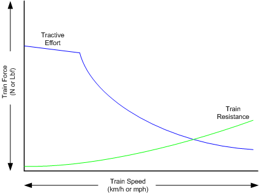

The first force is the tractive effort produced by the locomotive, whilst
the second force is the resistance presented by the train. Whenever the
tractive effort is greater than the train resistance the train will
continue to move forward; once the resistance exceeds the tractive effort,
then the train will start to slow down, and eventually will stop moving
forward.

The sections below describe in more detail the forces of tractive effort
and train resistance.

Train Resistance
................

The movement of the train is opposed by a number of different forces which
are collectively grouped together to form the *train resistance*.

The main resistive forces are as follows (the first two values of
resistance are modelled through the Davis formulas, and only apply on
straight level track):

- Journal or Bearing resistance (or friction)
- Air resistance
- Gradient resistance -- trains travelling up hills will experience
  greater resistive forces then those operating on level track.
- :ref:`Curve resistance <physics-curve-resistance>` -- applies when
  the train is traveling around a curve, and will be impacted by the
  curve radius, speed, and fixed wheel base of the rolling stock.
- :ref:`Tunnel resistance <physics-tunnel-friction>` -- applies when
  a train is travelling through a tunnel.

Tractive Effort
...............

Tractive Effort is created by the action of the steam against the pistons,
which, through the media of rods, crossheads, etc., cause the wheels to
revolve and the engine to advance.

Tractive Effort is a function of mean effective pressure of the steam
cylinder and is expressed by following formula for a simple locomotive.
Geared and compound locomotives will have slightly different formula::

    TE = Cyl/2 x (M.E.P. x d2 x s) / D

Where:

- Cyl = number of cylinders
- TE = Tractive Effort (lbf)
- M.E.P. = mean effective pressure of cylinder (psi)
- D = diameter of cylinder (in)
- S = stroke of cylinder piston (in)
- D = diameter of drive wheels (in)

Theoretical Tractive Effort
...........................

To allow the comparison of different locomotives, as well as determining
their relative pulling ability, a theoretical approximate value of
tractive effort is calculated using the boiler gauge pressure and includes
a factor to reduce the value of M.E.P.

Thus our formula from above becomes::

    TE = Cyl/2 x (0.85 x BP x d2 x s) / D

Where:

- BP = Boiler Pressure (gauge pressure - psi)
- 0.85 -- factor to account for losses in the engine, typically values
  between 0.7 and 0.85 were used by different manufacturers and railway
  companies.

Factor of Adhesion
..................

The factor of adhesion describes the likelihood of the locomotive slipping
when force is applied to the wheels and rails, and is the ratio of the
starting Tractive Effort to the weight on the driving wheels of the
locomotive::

    FoA = Wd / TE

Where:

- FoA = Factor of Adhesion
- TE = Tractive Effort (lbs)
- Wd = Weight on Driving Wheels (lbs)

Typically the Factor of Adhesion should ideally be between 4.0 & 5.0 for
steam locomotives. Values below this range will typically result in
slippage on the rail.

Indicated HorsePower (IHP)
..........................

Indicated Horsepower is the theoretical power produced by a steam
locomotive. The generally accepted formula for Indicated Horsepower is::

    I.H.P. = Cyl/2 x (M.E.P. x L x A x N) / 33000

Where:

- IHP = Indicated Horsepower (hp)
- Cyl = number of cylinders
- M.E.P. = mean effective pressure of cylinder (psi)
- L = stroke of cylinder piston (ft)
- A = area of cylinder (sq in)
- N = number of cylinder piston strokes per min (NB: two piston
  strokes for every wheel revolution)

As shown in the diagram below, IHP increases with speed, until it reaches
a maximum value. This value is determined by the cylinder's ability to
maintain an efficient throughput of steam, as well as for the boiler's
ability to maintain sufficient steam generation to match the steam usage
by the cylinders.

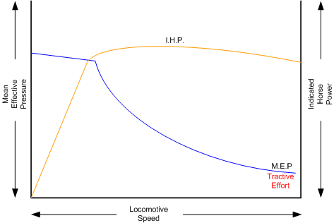

Hauling Capacity of Locomotives
...............................

Thus it can be seen that the hauling capacity is determined by the
summation of the tractive effort and the train resistance.

Different locomotives were designed to produce different values of
tractive effort, and therefore the loads that they were able to haul would
be determined by the track conditions, principally the ruling gradient for
the section, and the load or train weight. Therefore most railway
companies and locomotive manufacturers developed load tables for the
different locomotives depending upon their theoretical tractive efforts.

The table below is a sample showing the hauling capacity of an American
(4-4-0) locomotive from the Baldwin Locomotive Company catalogue, listing
the relative loads on level track and other grades as the cylinder size,
drive wheel diameter, and weight of the locomotive is varied.

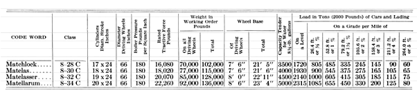

Typically the ruling gradient is defined as the maximum uphill grade
facing a train in a particular section of the route, and this grade would
typically determine the maximum permissible load that the train could haul
in this section. The permissible load would vary depending upon the
direction of travel of the train.

Elements of Steam Locomotive Operation
''''''''''''''''''''''''''''''''''''''

A steam locomotive is a very complex piece of machinery that has many
component parts, each of which will influence the performance of the
locomotive in different ways. Even at the peak of its development in the
middle of the 20th century, the locomotive designer had at their disposal
only a series of factors and simple formulae to describe its performance.
Once designed and built, the performance of the locomotive was measured
and adjusted by empirical means, i.e. by testing and experimentation on
the locomotive. Even locomotives within the same class could exhibit
differences in performance.

A simplified description of a steam locomotive is provided below to help
understand some of the key basics of its operation.

As indicated above, the steam locomotive is a heat engine which converts
fuel (coal, wood, oil, etc.) to heat; this is then used to do work by
driving the pistons to turn the wheels. The operation of a steam
locomotive can be thought of in terms of the following broadly defined
components:

- Boiler and Fire (Heat conversion)
- Cylinder (Work done)

Boiler and Fire (Heat conversion)
.................................

The amount of work that a locomotive can do will be determined by the
amount of steam that can be produced (evaporated) by the boiler.

Boiler steam production is typically dependent upon the Grate Area, and
the Boiler Evaporation Area.

- *Grate Area* -- the amount of heat energy released by the burning of
  the fuel is dependent upon the size of the grate area, draught of air
  flowing across the grate to support fuel combustion, fuel calorific
  value, and the amount of fuel that can be fed to the fire (a human
  fireman can only shovel so much coal in an hour). Some locomotives may
  have had good sized grate areas, but were 'poor steamers' because they
  had small draught capabilities.
- *Boiler Evaporation Area* -- consisted of the part of the firebox in
  contact with the boiler and the heat tubes running through the boiler.
  This area determined the amount of heat that could be transferred to
  the water in the boiler. As a rule of thumb a boiler could produce
  approximately 12-15 lbs/h of steam per ft\ :sup:`2` of evaporation area.
- *Boiler Superheater Area* -- Typically modern steam locomotives are
  superheated, whereas older locomotives used only saturated steam.
  Superheating is the process of putting more heat into the steam
  without changing the pressure. This provided more energy in the steam
  and allowed the locomotive to produce more work, but with a reduction
  in steam and fuel usage. In other words a superheated locomotive
  tended to be more efficient then a saturated locomotive.

Cylinder (Work done)
....................

To drive the locomotive forward, steam was injected into the cylinder
which pushed the piston backwards and forwards, and this in turn rotated
the drive wheels of the locomotive. Typically the larger the drive wheels,
the faster the locomotive was able to travel.

The faster the locomotive travelled the more steam that was needed to
drive the cylinders. The steam able to be produced by the boiler was
typically limited to a finite value depending upon the design of the
boiler. In addition the ability to inject and exhaust steam from the
cylinder also tended to reach finite limits as well. These factors
typically combined to place limits on the power of a locomotive depending
upon the design factors used.

Locomotive Types
''''''''''''''''

During the course of their development, many different types of
locomotives were developed, some of the more common categories are as
follows:

- Simple -- simple locomotives had only a single expansion cycle in
  the cylinder
- Compound -- locomotives had multiple steam expansion cycles and
  typically had a high and low pressure cylinder.
- Saturated -- steam was heated to only just above the boiling point
  of water.
- Superheated -- steam was heated well above the boiling point of
  water, and therefore was able to generate more work in the locomotive.
- Geared -- locomotives were geared to increase the tractive effort
  produced by the locomotive, this however reduced the speed of
  operation of the locomotive.

Superheated Locomotives
.......................

In the early 1900s, superheaters were fitted to some locomotives. As the
name was implied a superheater was designed to raise the steam temperature
well above the normal saturated steam temperature. This had a number of
benefits for locomotive engineers in that it eliminated condensation of
the steam in the cylinder, thus reducing the amount of steam required to
produce the same amount of work in the cylinders. This resulted in reduced
water and coal consumption in the locomotive, and generally improved the
efficiency of the locomotive.

Superheating was achieved by installing a superheater element that
effectively increased the heating area of the locomotive.

Geared Locomotives
..................

In industrial type railways, such as those used in the logging industry,
spurs to coal mines were often built to very cheap standards. As a
consequence, depending upon the terrain, they were often laid with sharp
curves and steep gradients compared to normal *main line standards*.

Typical *main line* rod type locomotives couldn't be used on these lines
due to their long fixed wheelbase (coupled wheels) and their relatively
low tractive effort was no match for the steep gradients. Thus geared
locomotives found their niche in railway practice.

Geared locomotives typically used bogie wheelsets, which allowed the rigid
wheelbase to be reduced compared to that of rod type locomotives, thus
allowing the negotiation of tight curves. In addition the gearing allowed
an increase of their tractive effort to handle the steeper gradients
compared to main line tracks.

Whilst the gearing allowed more tractive effort to be produced, it also
meant that the *maximum* piston speed was reached at a lower track speed.

As suggested above, the maximum track speed would depend upon loads and
track conditions. As these types of lines were lightly laid, excessive
speeds could result in derailments, etc.

The three principal types of geared locomotives used were:

- Shay Locomotives
- Climax
- Heisler

Steam Locomotive Operation
--------------------------

To successfully drive a steam locomotive it is necessary to consider the
performance of the following elements:

- Boiler and Fire (Heat conversion )
- Cylinder (Work done)

For more details on these elements, refer to the "Elements of Steam
Locomotive Operation"

Summary of Driving Tips

- Wherever possible, when running normally, have the regulator at
  100%, and use the reverser to adjust steam usage and speed.
- Avoid jerky movements when starting or running the locomotive, thus
  reducing the chances of breaking couplers.
- When starting always have the reverser fully wound up, and open the
  regulator slowly and smoothly, without slipping the wheels.

.. _physics-steam-firing:

Open Rails Steam Functionality (Fireman)
''''''''''''''''''''''''''''''''''''''''

The Open Rails Steam locomotive functionality provides two operational
options:

- Automatic Fireman (Computer Controlled):
  In Automatic or Computer Controlled Fireman mode all locomotive
  firing and boiler management is done by Open Rails, leaving the
  player to concentrate on driving the locomotive. Only the basic
  controls such as the regulator and throttle are available to the
  player.
- Manual Fireman:
  In Manual Fireman mode all locomotive firing and boiler management
  must be done by the player. All of the boiler management and firing
  controls, such as blower, injector, fuel rate, are available to the
  player, and can be adjusted accordingly.

A full listing of the keyboard controls for use when in manual mode is
provided on the *Keyboard* tab of the Open Rails :ref:`Options <options>`
panel.

Use the keys ``<Crtl+F>`` to switch between Manual and Automatic firing
modes.

Hot or Cold Start
'''''''''''''''''

The locomotive can be started either in a hot or cold mode. Hot mode
simulates a locomotive which has a full head of steam and is ready for duty.

Cold mode simulates a locomotive that has only just had the fire raised,
and still needs to build up to full boiler pressure, before having full
power available.

This function can be selected through the Open Rails options menu on the
:ref:`Simulation <options-simulation>` tab.

Main Steam Locomotive Controls
''''''''''''''''''''''''''''''

This section will describe the control and management of the steam
locomotive based upon the assumption that the Automatic fireman is
engaged. The following controls are those typically used by the driver in
this mode of operation:

- Cylinder Cocks -- allows water condensation to be exhausted from the
  cylinders.
  (Open Rails Keys: toggle ``<C>``)
- Regulator -- controls the pressure of the steam injected into the
  cylinders.
  (Open Rails Keys: ``<D>`` = increase, ``<A>`` = decrease)
- Reverser -- controls the valve gear and when the steam is "cutoff".
  Typically it is expressed as a fraction of the cylinder stroke.
  (Open Rails Keys: ``<W>`` = increase, ``<S>`` = decrease). Continued operation
  of the W or S key will eventually reverse the direction of travel
  for the locomotive.
- Brake -- controls the operation of the brakes.
  (Open Rails Keys: ``<'>`` = increase, ``<;>`` = decrease)

Recommended Option Settings
...........................

For added realism of the performance of the steam locomotive, it is
suggested that the following settings be considered for selection in the
Open Rails options menu:

- Break couplers
- Curve speed dependent
- Curve resistance speed
- Hot start
- Tunnel resistance dependent

NB: Refer to the relevant sections of the manual for more detailed
description of these functions.

Locomotive Starting
...................

Open the cylinder cocks. They are to remain open until the engine has
traversed a distance of about an average train length, consistent with
safety.

The locomotive should always be started in full gear (reverser up as high
as possible), according to the direction of travel, and kept there for the
first few turns of the driving wheels, before adjusting the reverser.

After ensuring that all brakes are released, open the regulator
sufficiently to move the train, care should be exercised to prevent
slipping; do not open the regulator too much before the locomotive has
gathered speed. Severe slipping causes excessive wear and tear on the
locomotive, disturbance of the fire bed and blanketing of the spark
arrestor. If slipping does occur, the regulator should be closed as
appropriate, and if necessary sand applied.

Also, when starting, a slow even increase of power will allow the couplers
all along the train to be gradually extended, and therefore reduce the
risk of coupler breakages.

Locomotive Running
..................

Theoretically, when running, the regulator should always be fully open and
the speed of the locomotive controlled, as desired, by the reverser. For
economical use of steam, it is also desirable to operate at the lowest
cut-off values as possible, so the reverser should be operated at low
values, especially running at high speeds.

When running a steam locomotive keep an eye on the following key
parameters in the Heads up Display (HUD -- ``<F5>``) as they will give the driver
an indication of the current status and performance of the locomotive with
regard to the heat conversion (Boiler and Fire) and work done (Cylinder)
processes. Also bear in mind the above driving tips.

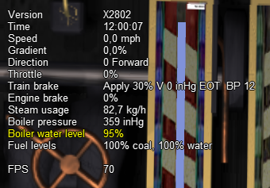

- Direction -- indicates the setting on the reverser and the direction
  of travel. The value is in per cent, so for example a value of 50
  indicates that the cylinder is cutting off at 0.5 of the stroke.
- Throttle -- indicates the setting of the regulator in per cent.
- Steam usage -- these values represent the current steam usage per
  hour.
- Boiler Pressure -- this should be maintained close to the maximum
  working pressure of the locomotive.
- Boiler water level -- indicates the level of water in the boiler.
  Under operation in Automatic Fireman mode, the fireman should manage
  this.
- Fuel levels -- indicate the coal and water levels of the locomotive.

For information on the other parameters, such as the brakes, refer to the
relevant sections in the manual.

For the driver of the locomotive the first two steam parameters are the
key ones to focus on, as operating the locomotive for extended periods of
time with steam usage in excess of the steam generation value will result
in declining boiler pressure. If this is allowed to continue the
locomotive will ultimately lose boiler pressure, and will no longer be
able to continue to pull its load.

Steam usage will increase with the speed of the locomotive, so the driver
will need to adjust the regulator, reverser, and speed of the locomotive
to ensure that optimal steam pressure is maintained. However, a point will
finally be reached where the locomotive cannot go any faster without the
steam usage exceeding the steam generation. This point determines the
maximum speed of the locomotive and will vary depending upon load and
track conditions

The AI Fireman in Open Rails is not proactive, ie it cannot look ahead for
gradients, etc, and therefore will only add fuel to the fire once the train
is on the gradient. This reactive approach can result in a boiler pressure
drop whilst the fire is building up. Similarly if the steam usage is dropped
(due to a throttle decrease, such as approaching a station) then the fire
takes time to reduce in heat, thus the boiler pressure can become excessive.

To give the player a little bit more control over this, and to facilitate
the maintaining of the boiler pressure the following key controls have been
added to the AI Fireman function:

AIFireOn - (``<Alt+H>``) - Forces the AI fireman to start building
the fire up (increases boiler heat & pressure, etc) - typically used just
before leaving a station to maintain pressure as steam consumption increases.
This function will be turned off if AIFireOff, AIFireReset are triggered or
if boiler pressure or BoilerHeat exceeds the boiler limit.

AIFireOff - (``<Ctrl+H>``) - Forces the AI fireman to stop adding
to the fire (allows boiler heat to decrease as fire drops) - typically used
approaching a station to allow the fire heat to decrease, and thus stopping
boiler pressure from exceeding the maximum. This function will be turned off
if AIFireOn, AIFireReset are triggered or if boiler pressure or BoilerHeat
drops too low.

AIFireReset - (``<Ctrl+Alt+H>``) - turns off both of the above
functions when desired.

If theses controls are not used, then the AI fireman operates in the same
fashion as previously.

Steam Boiler Heat Radiation Loss
''''''''''''''''''''''''''''''''

A certain amount of heat is lost from the boiler of a steam locomotive. An 
uninsulated boiler could lose a lot of heat and this impacts on the 
performance of the locomotive, hence boilers were insulated to reduce the 
heat losses.

The amount of heat lost will be dependent upon the exposed surface area of 
the boiler, the difference in temperature between the boiler and the ambient 
temperature. The amount of heat lost will also increase as the speed of the 
locomotive increases.

OR models the heat loss from a boiler with some standard default settings, 
however the model can be customised to suit the locomotive by adjusting the 
following settings.

.. index::
   single: ORTSBoilerSurfaceArea
   single: ORTSFractionBoilerInsulated
   single: ORTSHeatCoefficientInsulation

- ``ORTSBoilerSurfaceArea`` - Surface area of the boiler / fire box that impacts heat loss. Default UoM - (ft\ :sup:`2`)

- ``ORTSFractionBoilerInsulated`` - Fraction of boiler surface area covered by insulation (less then 1)

- ``ORTSHeatCoefficientInsulation`` - Thermal conduction coefficient. Default UoM - (BTU / (ft\ :sup:`2` / hr.) / (1 (in. / F)) 

Steam Boiler Blowdown
'''''''''''''''''''''
Over time as steam is evaporated from the boiler a concentration of impurities 
will build up in the boiler. The boiler blowdown valve was used to remove these 
sediments from the boiler which could impact its efficiency. Depending upon the 
quality of the feed water used in the boiler, blowdown could be needed regularly 
when the locomotive was in operation.

.. index::
   single: ORTS_BLOWDOWN_VALVE

The blowdown valve can be operated by toggling the ``<Shft+C>`` keys onn and off. 
Alternatively a cab control can be set up by using the ``<ORTS_BLOWDOWN_VALVE ( x, y, z )>``.

A special steam effect can also be added. See the section on steam effects.

Steam Locomotive Carriage Steam Heat Modelling
''''''''''''''''''''''''''''''''''''''''''''''

Overview
........

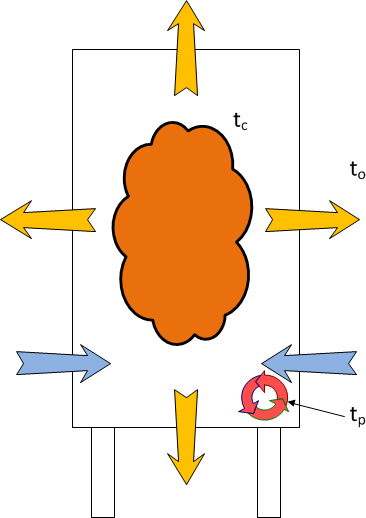

In the early days of steam, passenger carriages were heated by fire burnt
in stoves within the carriage, but this type of heating proved to be
dangerous, as on a number of occasions the carriages actually caught fire
and burnt.

A number of alternative heating systems were adopted as a safer replacement.

The Open Rails Model is based upon a direct steam model, ie one that has
steam pipes installed in each carriage, and pumps steam into each car to
raise the internal temperature in each car.

The heat model in each car is represented by Figure 1 below. The key
parameters influencing the operation of the model are the values of tc,
to, tp, which represent the temperature within the carriage, ambient
temperature outside the carriage, and the temperature of the steam pipe
due to steam passing through it.

As shown in the figure the heat model has a number of different elements
as follows:

    Heat Model for Passenger Car

i.   *Internal heat mass* -- the air mass in the carriage (represented
     by cloud) is heated to temperature that is comfortable to the
     passengers. The energy required to maintain the temperature will
     be determined the volume of the air in the carriage.
ii.  *Heat Loss -- Transmission* -- over time heat will be lost through
     the walls, roof, and floors of the carriage (represented by
     outgoing orange arrows), this heat loss will reduce the
     temperature of the internal air mass.
iii. *Heat Loss -- Infiltration* -- also over time as carriage doors are
     opened and closed at station stops, some cooler air will enter the
     carriage (represented by ingoing blue arrows), and reduce the
     temperature of the internal air mass.
iv.  *Steam Heating* -- to offset the above heat losses, steam was piped
     through each of the carriages (represented by circular red arrows).
     Depending upon the heat input from the steam pipe, the temperature
     would be balanced by offsetting the steam heating against the heat
     losses.

Carriage Heating Implementation in Open Rails
.............................................

.. index::
   single: MaxSteamHeatingPressure

Steam heating can be set up on steam locomotives, or on diesels with steam 
heating boilers, or alternatively with special cars that had steam heating 
boilers installed in them.

To enable steam heating to work in Open Rails the following parameter must
be included in the engine section of the steam locomotive ENG File::

    MaxSteamHeatingPressure( x )

Where: x = maximum steam pressure in the heating pipe -- should not exceed
100 psi

If the above parameter is added to the locomotive, then an extra line will
appear in the extended HUD to show the temperature in the train, and the
steam heating pipe pressure, etc.

Steam heating will only work if there are passenger cars attached to the
locomotive, or cars that have been set as requiring heating.

Warning messages will be displayed if the temperature inside the carriage
drops below the temperature limits.

The player can control the train temperature by using the following
controls:

- ``<Alt+U>`` -- increase steam pipe pressure (and hence train temperature)
- ``<Alt+D>`` -- decrease steam pipe pressure (and hence train temperature)

.. index::
   single: ORTSSteamHeat

The steam heating control valve can be configured by adding an engine controller
called ``ORTSSteamHeat ( w, x, y, z)``. It should be configured as a standard
4 value controller.

The primary purpose of this model is to calculate steam usage for the heating, 
and in the case of a steam locomotive this will reduce available steam for the 
locomotive to use. Water and fuel usage in producing the heat will also result 
in the mass of the locomotive or steam heating van to be reduced.

It should be noted that the impact of steam heating will vary depending
upon the season, length of train, etc.

A set of standard default parameters are included in Open Rails which will allow 
steam heating to work once the above changes have been implemented.

For those who would like to customise the steam heating the following parameters 
which can be inserted in the wagon file section can be adjusted as follows.

.. index::
   single: ORTSHeatingWindowDeratingFactor
   single: ORTSHeatingCompartmentTemperatureSet
   single: ORTSHeatingCompartmentPipeAreaFactor
   single: ORTSHeatingTrainPipeOuterDiameter
   single: ORTSHeatingTrainPipeInnerDiameter
   single: ORTSHeatingConnectingHoseOuterDiameter
   single: ORTSHeatingConnectingHoseInnerDiameter

The passenger (or other heated cars) can be adjusted with the following parameters:

- ``ORTSHeatingWindowDeratingFactor`` - is the fraction of the car side that is occupied by windows.

- ``ORTSHeatingCompartmentTemperatureSet`` - is the temperature that the car thermostat is set to.

- ``ORTSHeatingCompartmentPipeAreaFactor`` - is a factor that adjusts the heating area of the steam heater in the passenger compartment.

- ``ORTSHeatingTrainPipeOuterDiameter`` - outer diameter of the main steam pipe that runs the length of the train.

- ``ORTSHeatingTrainPipeInnerDiameter`` - inner diameter of the main steam pipe that runs the length of the train.

- ``ORTSHeatingConnectingHoseOuterDiameter`` - outer diameter of the connecting hose between carriages.

- ``ORTSHeatingConnectingHoseInnerDiameter`` - inner diameter of the connecting hose between carriages.

.. index::
   single: ORTSWagonSpecialType
   single: ORTSHeatingBoilerWaterUsage
   single: ORTSHeatingBoilerFuelUsage
   single: ORTSHeatingBoilerWaterTankCapacity
   single: ORTSHeatingBoilerFuelTankCapacity

For diesel locomotives or steam heating boiler vans the following parameters can be used 
to set the parameters of the steam heating boiler:

- ``ORTSWagonSpecialType`` - can be used to indicate whether the car is a boiler van (set = HeatingBoiler), or if the car is heated (set = Heated).

- ``ORTSHeatingBoilerWaterUsage`` - is the water usage for the steam heating boiler, and is a table with a series of x and y parameters, where x = steam usage (lb/hr) and y = water usage (g-uk/hr).

- ``ORTSHeatingBoilerFuelUsage`` - is the fuel usage for the steam heating boiler, and is a table with a series of x and y parameters, where x = steam usage (lb/hr) and y = fuel usage (g-uk/hr).

- ``ORTSHeatingBoilerWaterTankCapacity`` - is the feed water tank capacity for the steam boiler.

- ``ORTSHeatingBoilerFuelTankCapacity`` - is the fuel tank capacity for the steam boiler. Applies to steam heating boiler cars only. 

Special effects can also be added to support the steam heating model, see the section 
:ref:`Special Visual Effects for Locomotives or Wagons <visual-effects>` for more information.

Steam Locomotives -- Physics Parameters for Optimal Operation
-------------------------------------------------------------

Required Input ENG and WAG File Parameters
''''''''''''''''''''''''''''''''''''''''''

The OR Steam Locomotive Model (SLM) should work with default MSTS files;
however optimal performance will only be achieved if the following
settings are applied within the ENG file. **The following list only
describes the parameters associated with the SLM, other parameters such as
brakes, lights, etc. still need to be included in the file.**
As always, make sure that you keep a backup of the original MSTS file.

Open Rails has been designed to do most of the calculations for the
modeler, and typically only the key parameters are required to be included
in the ENG or WAG file. The parameters shown in the *Locomotive
performance Adjustments* section should be included only where a specific
performance outcome is required, since *default* parameters should provide
a satisfactory result.

When creating and adjusting ENG or WAG files, a series of tests should be
undertaken to ensure that the performance matches the actual real-world
locomotive as closely as possible. For further information on testing, as
well as some suggested test tools, go to `this site
<http://coalstonewcastle.com.au/physics/>`_.

**NB: These parameters are subject to change as Open Rails continues to
develop.**

Notes:

- New -- parameter names starting with *ORTS* means added as part of
  OpenRails development
- Existing -- parameter names not starting with *ORTS* are original
  in MSTS or added through MSTS BIN

Possible Locomotive Reference Info:

i.   `Steam Locomotive Data
     <http://orion.math.iastate.edu/jdhsmith/term/slindex.htm>`_
ii.  `Example Wiki Locomotive Data
     <http://en.wikipedia.org/wiki/SR_Merchant_Navy_class>`_
iii. `Testing Resources for Open Rails Steam Locomotives
     <http://coalstonewcastle.com.au/physics/>`_

.. index::
   single: ORTSSteamLocomotiveType
   single: WheelRadius
   single: MaxSteamHeatingPressure
   single: ORTSSteamBoilerType
   single: BoilerVolume
   single: ORTSEvaporationArea
   single: MaxBoilerPressure
   single: ORTSSuperheatArea
   single: MaxTenderWaterMass 
   single: MaxTenderCoalMass
   single: IsTenderRequired
   single: ORTSGrateArea
   single: ORTSFuelCalorific
   single: ORTSSteamFiremanMaxPossibleFiringRate
   single: SteamFiremanIsMechanicalStoker
   single: NumCylinder
   single: CylinderStroke
   single: CylinderDiameter
   single: LPNumCylinders
   single: LPCylinderStroke
   single: LPCylinderDiameter
   single: ORTSDavis_A
   single: ORTSDavis_B
   single: ORTSDavis_C
   single: ORTSBearingType
   single: ORTSDriveWheelWeight
   single: ORTSUnbalancedSuperElevation
   single: ORTSTrackGauge
   single: CentreOfGravity 
   single: ORTSRigidWheelBase
   single: ORTSSteamGearRatio
   single: ORTSSteamMaxGearPistonRate
   single: ORTSGearedTractiveEffortFactor
   single: ORTSBoilerEvaporationRate
   single: ORTSBurnRate
   single: ORTSCylinderEfficiencyRate
   single: ORTSBoilerEfficiency
   single: ORTSCylinderExhaustOpen
   single: ORTSCylinderInitialPressure
   single: ORTSCylinderPortOpening
   single: ORTSCylinderBackPressure

.. |-| unicode:: U+00AD .. soft hyphen
  :trim:

+-----------------------------------------------------------+-------------------+-------------------+-------------------+
|Parameter                                                  |Description        |Recommended Units  |Typical Examples   |
+===========================================================+===================+===================+===================+
|**General Information (Engine section)**                                                                               |
+-----------------------------------------------------------+-------------------+-------------------+-------------------+
|ORTS |-| Steam |-| Locomotive |-| Type ( x )               |Describes the      |Simple,            || (Simple)         |
|                                                           |type of            |Compound,          || (Compound)       |
|                                                           |locomotive         |Geared             || (Geared)         |
+-----------------------------------------------------------+-------------------+-------------------+-------------------+
|Wheel |-| Radius ( x )                                     |Radius of drive    |Distance           || (0.648m)         |
|                                                           |wheels             |                   || (36in)           |
+-----------------------------------------------------------+-------------------+-------------------+-------------------+
|Max |-| Steam |-| Heating |-| Pressure ( x )               |Max pressure       |Pressure,          |(80psi)            |
|                                                           |in steam heating   |NB:                |                   |
|                                                           |system for         |normally           |                   |
|                                                           |passenger carriages|< 100 psi          |                   |
+-----------------------------------------------------------+-------------------+-------------------+-------------------+
|**Boiler Parameters (Engine section)**                                                                                 |
+-----------------------------------------------------------+-------------------+-------------------+-------------------+
|ORTS |-| Steam |-| Boiler |-| Type ( x )                   |Describes the type |Saturated,         || (Saturated)      |
|                                                           |of boiler          |Superheated        || (Superheated)    |
+-----------------------------------------------------------+-------------------+-------------------+-------------------+
|Boiler |-| Volume ( x )                                    |Volume of boiler.  |Volume,            |("220*(ft^3)")     |
|                                                           |This parameter     |where an           |("110*(m^3)")      |
|                                                           |is not overly      |act. value         |                   |
|                                                           |critical.          |is n/a, use        |                   |
|                                                           |                   |approx.            |                   |
|                                                           |                   |EvapArea /         |                   |
|                                                           |                   |8.3                |                   |
+-----------------------------------------------------------+-------------------+-------------------+-------------------+
|ORTS |-| Evaporation |-| Area ( x )                        |Boiler evaporation |Area               |("2198*(ft^2)")    |
|                                                           |area               |                   |("194*(m^2)")      |
+-----------------------------------------------------------+-------------------+-------------------+-------------------+
|Max |-| Boiler |-| Pressure ( x )                          |Max boiler working |Pressure           || (200psi)         |
|                                                           |pressure (gauge)   |                   || (200kPa)         |
+-----------------------------------------------------------+-------------------+-------------------+-------------------+
|ORTS |-| Superheat |-| Area ( x )                          |Superheating       |Area               |("2198*(ft^2)")    |
|                                                           |heating area       |                   |("194*(m^2)" )     |
+-----------------------------------------------------------+-------------------+-------------------+-------------------+
|**Locomotive Tender Info (Wagon section - will override Engine section values)**                                       |
+-----------------------------------------------------------+-------------------+-------------------+-------------------+
|ORTS |-| Tender |-| Wagon |-| Water |-| Mass ( x )         |Water in tender    |Mass               || (36500lb)        |
|                                                           |                   |                   || (16000kg)        |
+-----------------------------------------------------------+-------------------+-------------------+-------------------+
|ORTS |-| Tender |-| Wagon |-| Coal |-| Mass ( x )          |Coal in tender     |Mass               || (13440lb)        |
|                                                           |                   |                   || (6000kg)         |
+-----------------------------------------------------------+-------------------+-------------------+-------------------+
|**Locomotive Tender Info (Engine section)**                                                                            |
+-----------------------------------------------------------+-------------------+-------------------+-------------------+
|Max |-| Tender |-| Water |-| Mass ( x )                    |Water in tender    |Mass               || (36500lb)        |
|                                                           |                   |                   || (16000kg)        |
+-----------------------------------------------------------+-------------------+-------------------+-------------------+
|Max |-| Tender |-| Coal |-| Mass ( x )                     |Coal in tender     |Mass               || (13440lb)        |
|                                                           |                   |                   || (6000kg)         |
+-----------------------------------------------------------+-------------------+-------------------+-------------------+
|Is |-| Tender |-| Required ( x )                           |Locomotive Requires|0 = No,            || (0)              |
|                                                           |a tender           |1 = Yes            || (1)              |
+-----------------------------------------------------------+-------------------+-------------------+-------------------+
|**Fire (Engine section)**                                                                                              |
+-----------------------------------------------------------+-------------------+-------------------+-------------------+
|ORTS |-| Grate |-| Area ( x )                              |Locomotive fire    |Area               |("2198*(ft^2)")    |
|                                                           |grate area         |                   |("194*(m^2)")      |
+-----------------------------------------------------------+-------------------+-------------------+-------------------+
|ORTS |-| Fuel |-| Calorific ( x )                          |Calorific value    |For coal use       |(13700btu/lb)      |
|                                                           |of fuel            |13700 btu/lb       |(33400kj/kg)       |
+-----------------------------------------------------------+-------------------+-------------------+-------------------+
|ORTS |-| Steam |-| Fireman |-| Max |-| Possible |-|        |Maximum fuel rate  |Use as def:        |                   |
|Firing |-| Rate ( x )                                      |that fireman can   |UK:3000lb/h        |(4200lb/h)         |
|                                                           |shovel in an hour. |US:5000lb/h        |                   |
|                                                           |(Mass Flow)        |AU:4200lb/h        |(2000kg/h)         |
+-----------------------------------------------------------+-------------------+-------------------+-------------------+
|Steam |-| Fireman |-| Is |-| Mechanical |-| Stoker ( x )   |Mechanical stoker =|Boolean,           |( 1 )              |
|                                                           |large rate of coal |0=no-stoker        |                   |
|                                                           |feed               |1=stoker           |                   |
+-----------------------------------------------------------+-------------------+-------------------+-------------------+
|**Steam Cylinder (Engine section)**                                                                                    |
+-----------------------------------------------------------+-------------------+-------------------+-------------------+
|Num |-| Cylinders ( x )                                    |Number of steam    |Boolean            |( 2 )              |
|                                                           |cylinders          |                   |                   |
+-----------------------------------------------------------+-------------------+-------------------+-------------------+
|Cylinder |-| Stroke ( x )                                  |Length of cylinder |Distance           || (26in)           |
|                                                           |stroke             |                   || (0.8m)           |
+-----------------------------------------------------------+-------------------+-------------------+-------------------+
|Cylinder |-| Diameter ( x )                                |Cylinder diameter  |Distance           || (21in)           |
|                                                           |                   |                   || (0.6m)           |
+-----------------------------------------------------------+-------------------+-------------------+-------------------+
|LP |-| Num |-| Cylinders ( x )                             |Number of steam LP |Boolean            |( 2 )              |
|                                                           |cylinders (compound|                   |                   |
|                                                           |locomotive only)   |                   |                   |
+-----------------------------------------------------------+-------------------+-------------------+-------------------+
|LP |-| Cylinder |-| Stroke ( x )                           |LP cylinder stroke |Distance           || (26in)           |
|                                                           |length (compound   |                   || (0.8m)           |
|                                                           |locomotive only)   |                   |                   |
+-----------------------------------------------------------+-------------------+-------------------+-------------------+
|LP |-| Cylinder |-| Diameter ( x )                         |Diameter of LP     |Distance           || (21in)           |
|                                                           |cylinder (compound |                   || (0.6m)           |
|                                                           |locomotive only)   |                   |                   |
+-----------------------------------------------------------+-------------------+-------------------+-------------------+
|**Friction (Wagon section)**                                                                                           |
+-----------------------------------------------------------+-------------------+-------------------+-------------------+
|ORTS |-| Davis_A ( x )                                     |Journal or roller  |N, lbf.            || (502.8N)         |
|                                                           |bearing +          |Use FCalc          || (502.8lb)        |
|                                                           |mechanical friction|to calculate       |                   |
+-----------------------------------------------------------+-------------------+-------------------+-------------------+
|ORTS |-| Davis_B ( x )                                     |Flange friction    |Nm/s,              |(1.5465Nm/s)       |
|                                                           |                   |lbf/mph.           |(1.5465lbf/mph)    |
|                                                           |                   |Use FCalc          |                   |
+-----------------------------------------------------------+-------------------+-------------------+-------------------+
|ORTS |-| Davis_C ( x )                                     |Air resistance     |Nm/s^2,            |(1.43Nm/s^2)       |
|                                                           |friction           |lbf/mph^2          |(1.43lbf/mph^2)    |
|                                                           |                   |Use FCalc          |                   |
+-----------------------------------------------------------+-------------------+-------------------+-------------------+
|ORTS |-| Bearing |-| Type ( x )                            |Bearing type,      || Roller,          |( Roller )         |
|                                                           |defaults to        || Friction,        |                   |
|                                                           |Friction           || Low              |                   |
|                                                           |                   |                   |                   |
+-----------------------------------------------------------+-------------------+-------------------+-------------------+
|**Friction (Engine section)**                                                                                          |
+-----------------------------------------------------------+-------------------+-------------------+-------------------+
|ORTS |-| Drive |-| Wheel |-| Weight ( x )                  |Total weight on the|Mass,              |(2.12t)            |
|                                                           |locomotive driving |Leave out if       |                   |
|                                                           |wheels             |unknown            |                   |
+-----------------------------------------------------------+-------------------+-------------------+-------------------+
|**Curve Speed Limit (Wagon section)**                                                                                  |
+-----------------------------------------------------------+-------------------+-------------------+-------------------+
|ORTS |-| Unbalanced |-| Super |-| Elevation ( x )          |Determines the     |Distance,          |  (3in)            |
|                                                           |amount of Cant     |Leave out if       |  (0.075m)         |
|                                                           |Deficiency applied |unknown            |                   |
|                                                           |to carriage        |                   |                   |
+-----------------------------------------------------------+-------------------+-------------------+-------------------+
|ORTS |-| Track |-| Gauge ( x )                             |Track gauge        |Distance,          || (4ft 8.5in)      |
|                                                           |                   |Leave out if       || ( 1.435m )       |
|                                                           |                   |unknown            || ( 4.708ft)       |
+-----------------------------------------------------------+-------------------+-------------------+-------------------+
|Centre |-| Of |-| Gravity ( x, y, z )                      |Defines the centre |Distance,          || (0m, 1.8m, 0m)   |
|                                                           |of gravity of a    |Leave out if       || (0ft, 5.0ft, 0ft)|
|                                                           |locomotive or wagon|unknown            |                   |
+-----------------------------------------------------------+-------------------+-------------------+-------------------+
|**Curve Friction (Wagon section)**                                                                                     |
+-----------------------------------------------------------+-------------------+-------------------+-------------------+
|ORTS |-| Rigid |-| Wheel |-| Base ( x )                    |Rigid wheel base of|Distance,          || (5ft 6in)        |
|                                                           |vehicle            |Leave out if       || (3.37m)          |
|                                                           |                   |unknown            |                   |
+-----------------------------------------------------------+-------------------+-------------------+-------------------+
|**Locomotive Gearing (Engine section -- Only required if locomotive is geared)**                                       |
+-----------------------------------------------------------+-------------------+-------------------+-------------------+
|ORTS |-| Steam |-| Gear |-| Ratio ( a, b )                 |Ratio of gears     |Numeric            |(2.55, 0.0)        |
+-----------------------------------------------------------+-------------------+-------------------+-------------------+
|ORTS |-| Steam |-| Max |-| Gear |-| Piston |-| Rate ( x )  |Max speed of piston|ft/min             |( 650 )            |
|                                                           |                   |                   |                   |
+-----------------------------------------------------------+-------------------+-------------------+-------------------+
|ORTS |-| Steam |-| Gear |-| Type ( x )                     |Fixed gearing or   |Fixed,             || (Fixed)          |
|                                                           |selectable gearing |Select             || (Select)         |
+-----------------------------------------------------------+-------------------+-------------------+-------------------+
|ORTS |-| Geared |-| Tractive |-| Effort |-| Factor ( x )   |Factor to include  |Fixed              || (Fixed)          |
|                                                           | in TE calculation |                   ||                  |
+-----------------------------------------------------------+-------------------+-------------------+-------------------+
|**Locomotive Performance Adjustments (Engine section -- Optional, for experienced modellers)**                         |
+-----------------------------------------------------------+-------------------+-------------------+-------------------+
|ORTS |-| Boiler |-| Evaporation |-| Rate ( x )             |Multipl. factor for|Be       tween     |(15.0)             |
|                                                           |adjusting maximum  |10--15,            |                   |
|                                                           |boiler steam output|Leave out if       |                   |
|                                                           |                   |not used           |                   |
+-----------------------------------------------------------+-------------------+-------------------+-------------------+
|ORTS |-| Burn |-| Rate ( x, y )                            |Tabular input: Coal|x -- lbs,          |                   |
|                                                           |combusted (y) to   |y -- kg,           |                   |
|                                                           |steam generated (x)|series of x        |                   |
|                                                           |                   |& y values.        |                   |
|                                                           |                   |Leave out if       |                   |
|                                                           |                   |unused             |                   |
+-----------------------------------------------------------+-------------------+-------------------+-------------------+
|ORTS |-| Cylinder |-| Efficiency |-| Rate ( x )            |Multipl. factor for|Un       limited,  |(1.0)              |
|                                                           |steam cylinder     |Leave out if       |                   |
|                                                           |(force) output     |unused             |                   |
+-----------------------------------------------------------+-------------------+-------------------+-------------------+
|ORTS |-| Boiler |-| Efficiency (x, y)                      |Tabular input:     |x --               |                   |
|                                                           |boiler efficiency  |lbs/ft2/h,         |                   |
|                                                           |(y) to coal        |series of x        |                   |
|                                                           |combustion (x)     |& y values.        |                   |
|                                                           |                   |Leave out if       |                   |
|                                                           |                   |unused             |                   |
+-----------------------------------------------------------+-------------------+-------------------+-------------------+
|ORTS |-| Cylinder |-| Port |-| Opening ( x )               |Size of cylinder   |Between            |(0.085)            |
|                                                           |port opening       |0.05--0.12,        |                   |
|                                                           |                   |Leave out if       |                   |
|                                                           |                   |unused             |                   |
+-----------------------------------------------------------+-------------------+-------------------+-------------------+
|ORTS |-| Cylinder |-| Initial |-| Pressure |-|             |Tabular input:     |x -- rpm,          |                   |
|Drop ( x, y )                                              |wheel speed (x) to |series of x        |                   |
|                                                           |pressure drop      |& y values.        |                   |
|                                                           |factor (y)         |Leave out if       |                   |
|                                                           |                   |unused             |                   |
+-----------------------------------------------------------+-------------------+-------------------+-------------------+
|ORTS |-| Cylinder |-| Back |-| Pressure ( x, y )           |Tabular input: Loco|x -- hp,           |                   |
|                                                           |indicated power (x)|y -- psi(g),       |                   |
|                                                           |to backpressure (y)|series of x        |                   |
|                                                           |                   |& y values.        |                   |
|                                                           |                   |Leave out if       |                   |
|                                                           |                   |unused             |                   |
+-----------------------------------------------------------+-------------------+-------------------+-------------------+

.. _visual-effects:

`Special Visual Effects for Locomotives or Wagons`
--------------------------------------------------
Steam exhausts on a steam locomotive, and other special visual effects can be modelled in OR by defining
appropriate visual effects in the ``SteamSpecialEffects`` section of the steam locomotive ENG file, the
``DieselSpecialEffects`` section of the diesel locomotive ENG file, or the ``SpecialEffects`` section
of a relevant wagon (including diesel, steam or electric locomotives.

OR supports the following special visual effects in a steam locomotive:

- Steam cylinders (named ``CylindersFX`` and ``Cylinders2FX``) -- two effects
  are provided which will represent the steam exhausted when the steam
  cylinder cocks are opened.  Two effects are provided to represent the steam
  exhausted at the front and rear of each piston stroke. These effects will
  appear whenever the cylinder cocks are opened, and there is sufficient
  steam pressure at the cylinder to cause the steam to exhaust, typically the
  regulator is open (> 0%).
- Stack (named ``StackFX``) -- represents the smoke stack emissions. This
  effect will appear all the time in different forms depending upon the firing
  and steaming conditions of the locomotive.
- Compressor (named ``CompressorFX``) -- represents a steam leak from the air
  compressor. Will only appear when the compressor is operating.
- Generator (named ``GeneratorFX``) -- represents the emission from the
  turbo-generator of the locomotive. This effect operates continually. If a
  turbo-generator is not fitted to the locomotive it is recommended that this
  effect is left out of the effects section which will ensure that it is not
  displayed in OR.
- Safety valves (named ``SafetyValvesFX``) -- represents the discharge of the
  steam valves if the maximum boiler pressure is exceeded. It will appear
  whenever the safety valve operates.
- Whistle (named ``WhistleFX``) -- represents the steam discharge from the
  whistle.
- Injectors (named ``Injectors1FX`` and ``Injectors2FX``) -- represents the
  steam discharge from the steam overflow pipe of the injectors. They will
  appear whenever the respective injectors operate.
- Ejectors (named ``SmallEjectorFX`` and ``LargeEjectorFX``) -- represents the
  steam discharge from the steam ejectors associated with vacuum braking. They will
  appear whenever the respective ejectors operate.  
- Boiler blowdown valves (named ``BlowdownFX``) -- represents the discharge of the
  steam boiler blowdown valve. It will appear whenever the blowdown valve operates.

OR supports the following special visual effects in a diesel locomotive:

- Exhaust (named ``Exhaustnumber``) -- is a diesel exhaust. Multiple exhausts can
  be defined, simply by adjusting the numerical value of the number after the key
  word exhaust.

OR supports the following special visual effects in a wagon (also the wagon section of
an ENG file):

- Steam Heating Boiler (named ``HeatingSteamBoilerFX``) -- represents the exhaust for
  a steam heating boiler. Typically this will be set up on a diesel or electric train
  as steam heating was provided directly from a steam locomotive.

- Wagon Generator (named ``WagonGeneratorFX``) -- represents the exhaust for a generator.
  This generator was used to provide additional auxiliary power for the train, and
  could have been used for air conditioning, heating lighting, etc.

- Wagon Smoke (named ``WagonSmokeFX``) -- represents the smoke coming from say a wood fire. This might have been a heating unit located in the guards van of the train.

- Heating Hose (named ``HeatingHoseFX``) -- represents the steam escaping from a steam pipe connection between wagons.

- Heating Compartment Steam Trap (named ``HeatingCompartmentSteamTrapFX``) -- represents the steam escaping from the steam trap under a passenger compartment.

- Heating Main Pipe Steam Trap (named ``HeatingMainPipeSteamTrapFX``) -- represents the steam escaping from a steam trap in the main steam pipe running under the passenger car.

NB: If a steam effect is not defined in the ``SteamSpecialEffects``,  ``DieselSpecialEffects``, or the
``SpecialEffects`` section of an ENG/WAG file, then it will not be displayed  in the simulation.
Similarly if any of the co-ordinates are zero, then the effect will not be displayed.

Each effect is defined by inserting a code block into the ENG/WAG file similar to
the one shown below::

    CylindersFX (
        -1.0485 1.0 2.8
        -1  0  0
        0.1
    )

The code block consists of the following elements:

- Effect name -- as described above,
- Effect location on the locomotive (given as an x, y, z offset in metres
  from the origin of the wagon shape)
- Effect direction of emission (given as a normal x, y and z)
- Effect nozzle width (in metres)

Auxiliary Water Tenders
-----------------------

To increase the water carrying capacity of a steam locomotive, an *auxiliary tender* (or as known in Australia as a water gin) would sometimes be coupled to the locomotive. This auxiliary tender would provide additional water to the locomotive tender via connecting pipes.

Typically, if the connecting pipes were opened between the locomotive tender and the auxiliary tender, the water level in the two vehicles would equalise at the same height.

To implement this feature in Open Rails, a suitable water carrying vehicle needs to have the following parameter included in the WAG file.

.. index::
   single: ORTSAuxTenderWaterMass

``ORTSAuxTenderWaterMass ( 70000lb )`` The units of measure are in mass.

When the auxiliary tender is coupled to the locomotive the *tender* line in the LOCOMOTIVE INFORMATION HUD will show the two tenders and the water capacity of each. Water (C) is the combined water capacity of the two tenders, whilst Water (T) shows the water capacity of the  locomotive tender, and Water (A) the capacity of the auxiliary tender (as shown below).

To allow the auxiliary tender to be filled at a water fuelling point, a water freight animation will be need to be added to the WAG file as well. (Refer to *Freight Animations* for more details).

Engines -- Multiple Units in Same Consist or AI Engines
=======================================================

In an OR player train one locomotive is controlled by the player, while
the other units are controlled by default by the train's MU (multiple
unit) signals for braking and throttle position, etc. The
player-controlled locomotive generates the MU signals which are passed
along to every unit in the train. For AI trains, the AI software directly
generates the MU signals, i.e. there is no player-controlled locomotive.
In this way, all engines use the same physics code for power and friction.

This software model will ensure that non-player controlled engines will
behave exactly the same way as player controlled ones.

.. _physics-braking:

Open Rails Braking
==================

Open Rails software has implemented its own braking physics in the
current release. It is based on the Westinghouse 26C and 26F air brake
and controller system. Open Rails braking will parse the type of braking
from the .eng file to determine if the braking physics uses passenger or
freight standards, self-lapping or not. 

There are two different features regarding graduated release of brakes.
If the train brake controller has a self-lapping notch that provides
graduated release, then the amount of brake pressure can be adjusted up
or down by changing the control in this notch. If the notch does not
provide graduated release, then the brakes can only be increased in 
this notch and one of the release positions is required to release the brakes.
The list of notches that have graduated release can be found :ref:`here <physics-brake-controller>`.

To achieve a graduated release, the brake valves in the train cars must
have this capability. If the BrakeEquipmentType() parameter in the Wagon()
section contains "Graduated_release_triple_valve" or "Distributor", then the 
brake cylinder pressure is regulated to keep it proportional to the difference 
between the emergency reservoir pressure and the brake pipe pressure. If the
brake valve is a "Triple_valve" instead, when the brake pipe
pressure rises above the auxiliary reservoir pressure, the brake
cylinder pressure is released completely at a rate determined by the
retainer setting.

Selecting :ref:`Graduated Release Air Brakes <options-general>` in *Menu >
Options* will force self-lapping notches in the brake controller to have
graduated release. It will also force graduated release of brakes in triple
valves. This option should be unchecked, except for compatibility problems
with old MSTS stock.

The following brake types are implemented in OR:

- Vacuum single
- Air single-pipe
- Air twin-pipe
- EP (Electro-pneumatic)
- Single-transfer-pipe (air and vacuum)

The operation of air single-pipe brakes is described in general below.

The auxiliary reservoir needs to be charged by the brake pipe and,
depending on the WAG file parameters setting, this can delay the brake
release. When the *Graduated Release Air Brakes* box is not checked, the
auxiliary reservoir is also charged by the emergency reservoir (until
both are equal and then both are charged from the pipe). When the
*Graduated Release Air Brakes* box is checked, the auxiliary reservoir is
only charged from the brake pipe. The Open Rails software implements it
this way because the emergency reservoir is used as the source of the
reference pressure for regulating the brake cylinder pressure.

The end result is that you will get a slower release when the *Graduated
Release Air Brakes* box is checked. This should not be an issue with two
pipe air brake systems because the second pipe can be the source of air
for charging the auxiliary reservoirs.

Open Rails software has modeled most of this graduated release car brake
behavior based on the 26F control valve, but this valve is designed for
use on locomotives. The valve uses a control reservoir to maintain the
reference pressure and Open Rails software simply replaced the control
reservoir with the emergency reservoir.

Increasing the :ref:`Brake Pipe Charging Rate <options-brake-pipe-charging>`
(psi/s) value controls the charging rate. Increasing the value will reduce the
time required to recharge the train; while decreasing the value will slow the
charging rate. However, this might be limited by the train brake controller
parameter settings in the ENG file. The brake pipe pressure cannot go up faster
than that of the equalization reservoir.

The default value, 21, should cause the recharge time from a full set to
be about 1 minute for every 12 cars. If the *Brake Pipe Charging Rate*
(psi/s) value is set to 1000, the pipe pressure gradient features
will be disabled and will also disable some but not all of the other new
brake features.

Brake system charging time depends on the train length as it should, but
at the moment there is no modeling of main reservoirs and compressors.

.. _physics-brake-controller:

Train Brake Controller Positions
--------------------------------

The following notch positions can be defined for the train brake at ``Engine(EngineControllers(Brake_Train``:

.. index::
   single: TrainBrakesControllerFullQuickReleaseStart
   single: TrainBrakesControllerReleaseStart
   single: TrainBrakesControllerOverchargeStart
   single: TrainBrakesControllerApplyStart
   single: TrainBrakesControllerSlowServiceStart
   single: TrainBrakesControllerFullServiceStart
   single: TrainBrakesControllerHoldStart
   single: TrainBrakesControllerEPHoldStart
   single: TrainBrakesControllerSelfLapStart
   single: TrainBrakesControllerRunningStart
   single: TrainBrakesControllerMinimalReductionStart
   single: TrainBrakesControllerHoldLappedStart
   single: TrainBrakesControllerVaccumContinuousServiceStart
   single: TrainBrakesControllerVaccumApplyContinuousService
   single: TrainBrakesControllerGraduatedSelfLapLimitedStart
   single: TrainBrakesControllerGraduatedSelfLapLimitedHoldingStart
   single: TrainBrakesControllerSuppressionStart
   single: TrainBrakesControllerContinuousServiceStart
   single: TrainBrakesControllerEPApplyStart
   single: TrainBrakesControllerEPFullServiceStart
   single: TrainBrakesControllerEPOnlyStart
   single: TrainBrakesControllerEmergencyStart
   single: Dummy
   single: ORTSTrainBrakesControllerMaxOverchargePressure
   single: ORTSTrainBrakesControllerOverchargeEliminationRate
   single: ORTSTrainBrakesControllerSlowApplicationRate

.. table:: Brake Controller Tokens
    :widths: 20 45 20 15

    +-----------------+-----------------+-----------------+-----------+
    | OR Brake Token  | Description     | Brake Systems   | Operation |
    +-----------------+-----------------+-----------------+-----------+
    | **RELEASE and RUNNING tokens**                                  |
    +-----------------+-----------------+-----------------+-----------+
    | Train |-|       | RELEASE or      | Air single pipe | Air       |
    | Brakes |-|      | OVERCHARGE      |                 |           |
    | Controller |-|  |                 | Air twin pipe   |           |
    | Overcharge |-|  | Rapidly         |                 |           |
    | Start           | releases air    | EP              |           |
    |                 | brakes and      |                 |           |
    |                 | charges air     |                 |           |
    |                 | reservoirs.     |                 |           |
    |                 |                 |                 |           |
    |                 | Train brake     |                 |           |
    |                 | pipe may be     |                 |           |
    |                 | overcharged (up |                 |           |
    |                 | to ORTS |-|     |                 |           |
    |                 | Train |-|       |                 |           |
    |                 | Brakes |-|      |                 |           |
    |                 | Controller |-|  |                 |           |
    |                 | Max |-|         |                 |           |
    |                 | Overcharge |-|  |                 |           |
    |                 | Pressure |-|    |                 |           |
    |                 | and will        |                 |           |
    |                 | gradually       |                 |           |
    |                 | return to       |                 |           |
    |                 | normal working  |                 |           |
    |                 | pressure when   |                 |           |
    |                 | the controller  |                 |           |
    |                 | is moved to a   |                 |           |
    |                 | release         |                 |           |
    |                 | position (the   |                 |           |
    |                 | rate will be    |                 |           |
    |                 | determined by   |                 |           |
    |                 | ORTS |-| Train  |                 |           |
    |                 | Brakes |-|      |                 |           |
    |                 | Controller |-|  |                 |           |
    |                 | Overcharge |-|. |                 |           |
    |                 | Elimination |-| |                 |           |
    |                 | Rate            |                 |           |
    +-----------------+-----------------+-----------------+-----------+
    | Train |-|       | RELEASE or      | Air single pipe | Air       |
    | Brakes |-|      | QUICK RELEASE   |                 |           |
    | Controller |-|  |                 | Air twin pipe   | EP        |
    | Full |-| Quick  | Air brakes:     |                 |           |
    | |-| Release |-| | Rapidly         | EP              | Vacuum    |
    | Start           | releases air    |                 |           |
    |                 | brakes and      | Vacuum single   |           |
    |                 | charges air     | pipe            |           |
    |                 | reservoirs,     |                 |           |
    |                 | without         |                 |           |
    |                 | overcharging    |                 |           |
    |                 | the train pipe. |                 |           |
    |                 |                 |                 |           |
    |                 | EP brakes:      |                 |           |
    |                 | Rapidly         |                 |           |
    |                 | releases EP     |                 |           |
    |                 | brakes.         |                 |           |
    |                 |                 |                 |           |
    |                 | Vacuum brakes – |                 |           |
    |                 | diesel and      |                 |           |
    |                 | electric loco:  |                 |           |
    |                 | Operates        |                 |           |
    |                 | exhauster at    |                 |           |
    |                 | fast speed.     |                 |           |
    |                 | Rapidly         |                 |           |
    |                 | releases vacuum |                 |           |
    |                 | brakes and      |                 |           |
    |                 | charges vacuum  |                 |           |
    |                 | reservoirs.     |                 |           |
    |                 |                 |                 |           |
    |                 | Vacuum brakes – |                 |           |
    |                 | steam with      |                 |           |
    |                 | combination     |                 |           |
    |                 | ejector:        |                 |           |
    |                 | Operates large  |                 |           |
    |                 | ejector at full |                 |           |
    |                 | power. Rapidly  |                 |           |
    |                 | releases vacuum |                 |           |
    |                 | brakes and      |                 |           |
    |                 | charges vacuum  |                 |           |
    |                 | reservoirs.     |                 |           |
    |                 |                 |                 |           |
    |                 | Vacuum brakes – |                 |           |
    |                 | steam with      |                 |           |
    |                 | separate        |                 |           |
    |                 | ejector:        |                 |           |
    |                 | Connects brake  |                 |           |
    |                 | pipe to         |                 |           |
    |                 | ejector(s)      |                 |           |
    |                 | and/or vacuum   |                 |           |
    |                 | pump. Brakes    |                 |           |
    |                 | may be released |                 |           |
    |                 | by operating    |                 |           |
    |                 | large or small  |                 |           |
    |                 | ejector.        |                 |           |
    +-----------------+-----------------+-----------------+-----------+
    | Train |-|       | RUNNING or      | Air single pipe | Air       |
    | Brakes |-|      | RELEASE         |                 |           |
    | Controller |-|  |                 | Air twin pipe   | EP        |
    | Release |-|     | Air brakes:     |                 |           |
    | Start           | Maintains       | EP              | Vacuum    |
    |                 | working         |                 |           |
    |                 | pressure in     | Vacuum single   |           |
    |                 | train pipe.     | pipe            |           |
    |                 | Slowly releases |                 |           |
    |                 | brakes.         |                 |           |
    |                 |                 |                 |           |
    |                 | EP brakes:      |                 |           |
    |                 | Releases        |                 |           |
    |                 | brakes.         |                 |           |
    |                 |                 |                 |           |
    |                 | Vacuum brakes – |                 |           |
    |                 | diesel and      |                 |           |
    |                 | electric loco:  |                 |           |
    |                 | Connects brake  |                 |           |
    |                 | pipe to         |                 |           |
    |                 | exhauster.      |                 |           |
    |                 | Maintains       |                 |           |
    |                 | vacuum in train |                 |           |
    |                 | pipe. Slowly    |                 |           |
    |                 | releases        |                 |           |
    |                 | brakes.         |                 |           |
    |                 |                 |                 |           |
    |                 | Vacuum brakes – |                 |           |
    |                 | steam with      |                 |           |
    |                 | combination     |                 |           |
    |                 | ejector:        |                 |           |
    |                 | Operates large  |                 |           |
    |                 | ejector at full |                 |           |
    |                 | power. Rapidly  |                 |           |
    |                 | releases vacuum |                 |           |
    |                 | brakes and      |                 |           |
    |                 | charges vacuum  |                 |           |
    |                 | reservoirs.     |                 |           |
    |                 |                 |                 |           |
    |                 | Vacuum brakes – |                 |           |
    |                 | steam with      |                 |           |
    |                 | separate        |                 |           |
    |                 | ejector:        |                 |           |
    |                 | Connects brake  |                 |           |
    |                 | pipe to         |                 |           |
    |                 | ejector(s)      |                 |           |
    |                 | and/or vacuum   |                 |           |
    |                 | pump. Brakes    |                 |           |
    |                 | may be released |                 |           |
    |                 | by operating    |                 |           |
    |                 | large or small  |                 |           |
    |                 | ejector.        |                 |           |
    +-----------------+-----------------+-----------------+-----------+
    | **LAP, HOLDING and NEUTRAL tokens**                             |
    +-----------------+-----------------+-----------------+-----------+
    | Train |-|       | LAP or RUNNING  | Air single pipe | Air       |
    | Brakes |-|      |                 |                 |           |
    | Controller |-|  | Air brakes:     | Air twin pipe   | EP        |
    | Running |-|     | Train pipe      |                 |           |
    | Start           | pressure is     | EP              | Vacuum    |
    |                 | held at any     |                 |           |
    |                 | pressure with   | Vacuum single   |           |
    |                 | compensation    | pipe            |           |
    |                 | for leakage.    |                 |           |
    |                 |                 |                 |           |
    |                 | EP brakes:      |                 |           |
    |                 | Brake           |                 |           |
    |                 | application is  |                 |           |
    |                 | held at any     |                 |           |
    |                 | value.          |                 |           |
    |                 |                 |                 |           |
    |                 | Vacuum brakes – |                 |           |
    |                 | diesel and      |                 |           |
    |                 | electric loco:  |                 |           |
    |                 | Train pipe      |                 |           |
    |                 | vacuum is held  |                 |           |
    |                 | at any value    |                 |           |
    |                 | with            |                 |           |
    |                 | compensation    |                 |           |
    |                 | for leakage.    |                 |           |
    |                 |                 |                 |           |
    |                 | Vacuum brakes – |                 |           |
    |                 | steam with      |                 |           |
    |                 | combination     |                 |           |
    |                 | ejector:        |                 |           |
    |                 | Connects brake  |                 |           |
    |                 | pipe to small   |                 |           |
    |                 | ejector and/or  |                 |           |
    |                 | vacuum pump.    |                 |           |
    |                 | Maintains       |                 |           |
    |                 | vacuum. Brakes  |                 |           |
    |                 | may be released |                 |           |
    |                 | by operating    |                 |           |
    |                 | small ejector.  |                 |           |
    |                 |                 |                 |           |
    |                 | (Vacuum brakes  |                 |           |
    |                 | – steam with    |                 |           |
    |                 | separate        |                 |           |
    |                 | ejector:        |                 |           |
    |                 | Connects brake  |                 |           |
    |                 | pipe only to    |                 |           |
    |                 | small ejector   |                 |           |
    |                 | and/or vacuum   |                 |           |
    |                 | pump.)          |                 |           |
    +-----------------+-----------------+-----------------+-----------+
    | Train |-|       | LAP             | Air single pipe | Air       |
    | Brakes |-|      |                 |                 |           |
    | Controller |-|  | Air brakes:     | Air twin pipe   | EP        |
    | Self |-| Lap    | Train pipe      |                 |           |
    | |-| Start       | pressure is     | EP              | Vacuum    |
    |                 | held at any     |                 |           |
    |                 | pressure with   | Vacuum single   |           |
    |                 | compensation    | pipe            |           |
    |                 | for leakage.    |                 |           |
    |                 |                 |                 |           |
    |                 | EP brakes:      |                 |           |
    |                 | Brake           |                 |           |
    |                 | application is  |                 |           |
    |                 | held at any     |                 |           |
    |                 | value.          |                 |           |
    |                 |                 |                 |           |
    |                 | Vacuum brakes:  |                 |           |
    |                 | Train pipe      |                 |           |
    |                 | vacuum is held  |                 |           |
    |                 | with            |                 |           |
    |                 | compensation    |                 |           |
    |                 | for leakage.    |                 |           |
    +-----------------+-----------------+-----------------+-----------+
    | Train |-|       | LAP – all brake | Air single pipe | Air       |
    | Brakes |-|      | types held      |                 |           |
    | Controller |-|  | without change  | Air twin pipe   | EP        |
    | Hold |-| Start  | – legacy MSTS   |                 |           |
    |                 | token           | EP              | Vacuum    |
    |                 |                 |                 |           |
    |                 |                 | Vacuum single   |           |
    |                 |                 | pipe            |           |
    +-----------------+-----------------+-----------------+-----------+
    | Train\ |-|\     | HOLD EP – EP    | EP              | EP        |
    | Brakes\ |-|\    | brake setting   |                 |           |
    | Controller\     | is held without |                 |           |
    | |-|\ EP\ Hold   | influence on    |                 |           |
    | |-|  Start      | train air pipe. |                 |           |
    +-----------------+-----------------+-----------------+-----------+
    | Train |-|       | LAP or NEUTRAL  | Air single pipe | Air       |
    | Brakes |-|      |                 |                 |           |
    | Controller |-|  | Air brakes:     | Air twin pipe   | EP        |
    | Hold |-| Lapped | Train pipe      |                 |           |
    | |-| Start       | pressure is     | EP              | Vacuum    |
    |                 | held without    |                 |           |
    |                 | compensation    | Vacuum single   |           |
    |                 | for leakage.    | pipe            |           |
    |                 |                 |                 |           |
    |                 | EP brakes:      |                 |           |
    |                 | Brake           |                 |           |
    |                 | application is  |                 |           |
    |                 | held at any     |                 |           |
    |                 | value.          |                 |           |
    |                 |                 |                 |           |
    |                 | Vacuum brakes:  |                 |           |
    |                 | Train pipe      |                 |           |
    |                 | vacuum is held  |                 |           |
    |                 | without         |                 |           |
    |                 | compensation    |                 |           |
    |                 | for leakage.    |                 |           |
    +-----------------+-----------------+-----------------+-----------+
    | Train |-|       | LAP or NEUTRAL  | Air single pipe | Air       |
    | Brakes |-|      |                 |                 |           |
    | Controller |-|  | Air brakes:     | Air twin pipe   | EP        |
    | Neutral |-|     | Train pipe      |                 |           |
    | Handle |-| Off  | pressure is     | EP              | Vacuum    |
    | |-| Start       | held without    |                 |           |
    |                 | compensation    | Vacuum single   |           |
    |                 | for leakage.    | pipe            |           |
    |                 |                 |                 |           |
    |                 | EP brakes:      |                 |           |
    |                 | Brake           |                 |           |
    |                 | application is  |                 |           |
    |                 | held at any     |                 |           |
    |                 | value.          |                 |           |
    |                 |                 |                 |           |
    |                 | Vacuum brakes:  |                 |           |
    |                 | Train pipe      |                 |           |
    |                 | vacuum is held  |                 |           |
    |                 | without         |                 |           |
    |                 | compensation    |                 |           |
    |                 | for leakage.    |                 |           |
    +-----------------+-----------------+-----------------+-----------+
    | **SELF LAPPING APPLY tokens**                                   |
    +-----------------+-----------------+-----------------+-----------+
    | Train |-|       | INITIAL / FIRST | Air single pipe | Air       |
    | Brakes |-|      | SERVICE         |                 |           |
    | Controller |-|  |                 | Air twin pipe   | Vacuum    |
    | Minimal |-|     | Notch. Train    |                 |           |
    | Reduction |-|   | pipe pressure   | Vacuum single   |           |
    | Start           | or vacuum is    | pipe            |           |
    |                 | held at Minimum |                 |           |
    |                 | Reduction       |                 |           |
    |                 | value.          |                 |           |
    +-----------------+-----------------+-----------------+-----------+
    | Train |-|       | INITIAL / FIRST | Air single pipe | Air       |
    | Brakes |-|      | SERVICE << >>   |                 |           |
    | Controller |-|  | FULL SERVICE    | Air twin pipe   |           |
    | Graduated |-|   |                 |                 |           |
    | Self |-| Lap    | Graduated       |                 |           |
    | |-| Limited |-| | service         |                 |           |
    | Start           | application and |                 |           |
    |                 | release of air  |                 |           |
    |                 | brakes only.    |                 |           |
    +-----------------+-----------------+-----------------+-----------+
    | Train |-|       | INITIAL / FIRST | Air single pipe | Air       |
    | Brakes |-|      | SERVICE >>>>    |                 |           |
    | Controller |-|  | FULL SERVICE    | Air twin pipe   |           |
    | Graduated |-|   |                 |                 |           |
    | Self |-| Lap    | Graduated       |                 |           |
    | |-| Limited |-| | service         |                 |           |
    | Holding |-|     | application of  |                 |           |
    | Start           | air brakes      |                 |           |
    |                 | only. (Release  |                 |           |
    |                 | is not          |                 |           |
    |                 | graduable.)     |                 |           |
    +-----------------+-----------------+-----------------+-----------+
    | Train |-|       | INITIAL / FIRST | Air single pipe | Air       |
    | Brakes |-|      | SERVICE << >>   |                 |           |
    | Controller |-|  | FULL SERVICE    | Air twin pipe   | EP        |
    | EPApply |-|     |                 |                 |           |
    | Start           | Graduated       | EP              |           |
    |                 | service         |                 |           |
    |                 | application and |                 |           |
    |                 | release of air  |                 |           |
    |                 | brakes and EP   |                 |           |
    |                 | brakes.         |                 |           |
    |                 |                 |                 |           |
    |                 | Can be used for |                 |           |
    |                 | notched         |                 |           |
    |                 | controllers.    |                 |           |
    +-----------------+-----------------+-----------------+-----------+
    | Train |-|       | INITIAL / FIRST | Air single pipe | Air       |
    | Brakes |-|      | SERVICE >>>>    |                 |           |
    | Controller |-|  | FULL SERVICE    | Air twin pipe   | EP        |
    | Continuous |-|  |                 |                 |           |
    | Service |-|     | Graduated       | EP              |           |
    | Start           | service         |                 |           |
    |                 | application of  |                 |           |
    |                 | air brakes and  |                 |           |
    |                 | EP brakes.      |                 |           |
    |                 | (Release is not |                 |           |
    |                 | graduable.)     |                 |           |
    +-----------------+-----------------+-----------------+-----------+
    | Train |-|       | INITIAL / FIRST | EP              | EP        |
    | Brakes |-|      | SERVICE << >>   |                 |           |
    | Controller |-|  | FULL SERVICE    |                 |           |
    | EPOnly |-|      |                 |                 |           |
    | Start           | Graduated       |                 |           |
    |                 | service         |                 |           |
    |                 | application and |                 |           |
    |                 | release of EP   |                 |           |
    |                 | brakes only     |                 |           |
    |                 | without         |                 |           |
    |                 | reduction in    |                 |           |
    |                 | air train pipe  |                 |           |
    |                 | pressure.       |                 |           |
    +-----------------+-----------------+-----------------+-----------+
    | Train |-|       | RUNNING << >>   | Vacuum single   | Vacuum    |
    | Brakes |-|      | FULL SERVICE /  | pipe            |           |
    | Controller |-|  | EMERGENCY       |                 |           |
    | Vacuum |-|      |                 |                 |           |
    | Continuous |-|  | Graduated       |                 |           |
    | Service |-|     | application and |                 |           |
    | Start           | release of      |                 |           |
    |                 | vacuum brakes.  |                 |           |
    +-----------------+-----------------+-----------------+-----------+
    | Dummy           | Train pipe      | Air single pipe | Air       |
    |                 | pressure of     |                 |           |
    |                 | vacuum can be   | Air twin pipe   | Vacuum    |
    |                 | held at any     |                 |           |
    |                 | value.          | Vacuum single   |           |
    |                 |                 | pipe            |           |
    |                 | Can be used for |                 |           |
    |                 | notched         |                 |           |
    |                 | controllers.    |                 |           |
    +-----------------+-----------------+-----------------+-----------+
    | **NON SELF LAPPING APPLY tokens**                               |
    +-----------------+-----------------+-----------------+-----------+
    | Train |-|       | FIRST SERVICE   | Air single pipe | Air       |
    | Brakes |-|      | or SLOW APPLY   |                 |           |
    | Controller |-|  |                 | Air twin pipe   | EP        |
    | Slow |-|        | Notch. Train    |                 |           |
    | Service |-|     | brakes are      | EP              |           |
    | Start           | applied at a    |                 |           |
    |                 | slow rate from  |                 |           |
    |                 | minimal         |                 |           |
    |                 | application     |                 |           |
    |                 | until full      |                 |           |
    |                 | service         |                 |           |
    |                 | application.    |                 |           |
    |                 | The rate is     |                 |           |
    |                 | determined by   |                 |           |
    |                 | ORTS |-| Train  |                 |           |
    |                 | |-| Brakes |-|  |                 |           |
    |                 | Controller |-|  |                 |           |
    |                 | Slow |-|        |                 |           |
    |                 | Application |-| |                 |           |
    |                 | Rate in the     |                 |           |
    |                 | .eng file.      |                 |           |
    +-----------------+-----------------+-----------------+-----------+
    | Train |-|       | APPLY           | Air single pipe | Air       |
    | Brakes |-|      |                 |                 |           |
    | Controller |-|  | Notch. Train    | Air twin pipe   | EP        |
    | Full |-|        | brakes are      |                 |           |
    | Service |-|     | applied at the  | EP              |           |
    | Start           | normal service  |                 |           |
    |                 | rate from       |                 |           |
    |                 | minimal         |                 |           |
    |                 | application     |                 |           |
    |                 | until full      |                 |           |
    |                 | service         |                 |           |
    |                 | application.    |                 |           |
    +-----------------+-----------------+-----------------+-----------+
    | Train |-|       | EP APPLY        | EP              | EP        |
    | Brakes |-|      |                 |                 |           |
    | Controller |-|  | Notch. EP       |                 |           |
    | EP |-| Full |-| | brakes are      |                 |           |
    | Service |-|     | applied at the  |                 |           |
    | Start           | normal service  |                 |           |
    |                 | rate without    |                 |           |
    |                 | reduction in    |                 |           |
    |                 | air train pipe  |                 |           |
    |                 | pressure.       |                 |           |
    +-----------------+-----------------+-----------------+-----------+
    | Train |-|       | APPLY           | Air single pipe | Air       |
    | Brakes |-|      |                 |                 |           |
    | Controller |-|  | Notch. Train    | Air twin pipe   | EP        |
    | Apply |-| Start | brakes are      |                 |           |
    |                 | applied at the  | EP              | Vacuum    |
    |                 | normal service  |                 |           |
    |                 | rate from       | Vacuum single   |           |
    |                 | minimal         | pipe            |           |
    |                 | application     |                 |           |
    |                 | until emergency |                 |           |
    |                 | application.    |                 |           |
    |                 |                 |                 |           |
    |                 | (Vacuum brakes  |                 |           |
    |                 | – steam: MSTS   |                 |           |
    |                 | legacy          |                 |           |
    |                 | controller is   |                 |           |
    |                 | now replaced by |                 |           |
    |                 | Train |-|       |                 |           |
    |                 | Brakes |-|      |                 |           |
    |                 | Controller |-|  |                 |           |
    |                 | Vaccuum |-|     |                 |           |
    |                 | Apply |-|       |                 |           |
    |                 | Continuous |-|  |                 |           |
    |                 | Service |-|     |                 |           |
    |                 | Start)          |                 |           |
    +-----------------+-----------------+-----------------+-----------+
    | Train |-|       | APPLY           | Vacuum single   | Vacuum    |
    | Brakes |-|      |                 | pipe            |           |
    | Controller |-|  | Range. The rate |                 |           |
    | Vacuum |-|      | of the brake    |                 |           |
    | Apply |-|       | application is  |                 |           |
    | Continuous |-|  | determined by   |                 |           |
    | ServiceStart    | the position of |                 |           |
    |                 | the valve.      |                 |           |
    +-----------------+-----------------+-----------------+-----------+
    | Train |-|       | EMERGENCY       | Air single pipe | Air       |
    | Brakes |-|      |                 |                 |           |
    | Controller |-|  | Notch. Makes a  | Air twin pipe   | EP        |
    | Emergency |-|   | full emergency  |                 |           |
    | Start           | application of  | EP              | Vacuum    |
    |                 | brakes at the   |                 |           |
    |                 | fastest         | Vacuum single   |           |
    |                 | possible rate.  | pipe            |           |
    +-----------------+-----------------+-----------------+-----------+
    | **OTHER train brake controller tokens**                         |
    +-----------------+-----------------+-----------------+-----------+
    | Train |-|       | Cancels effect  | Air single pipe | Air       |
    | Brakes |-|      | of penalty      |                 |           |
    | Controller |-|  | brake           | Air twin pipe   | EP        |
    | Suppression |-| | application by  |                 |           |
    | Start           | TCS and         | EP              |           |
    |                 | restores        |                 |           |
    |                 | control of      |                 |           |
    |                 | brakes to       |                 |           |
    |                 | driver.         |                 |           |
    +-----------------+-----------------+-----------------+-----------+

.. _physics-hud-brake:

Brake Shoe Adhesion
-------------------

The braking of a train is impacted by the following two types of adhesion (friction coefficients):

- **Brakeshoe** -- the coefficient of friction of the brakeshoe varies due to the type of brake shoe, and the speed of the wheel increases. Typically older cast iron brake shoes had lower friction coefficients then more modern composite brakeshoes.

- **Wheel** -- the adhesion or friction coefficient between the wheel and the rail will also vary with different conditions, such as whether the track was dry or wet, and will also vary with the speed of rotation of the wheel.

Thus a train traveling at high speed will have lower brake shoe adhesion, which means that the train will take a longer time to stop (or alternatively more force needs to be applied to the brakeshoe to achieve the same slowing effect of the wheel, as at slower speeds). Traveling at high speeds may also result in insufficient force being available to stop the train, and therefore under some circumstances the train may become uncontrollable (unstoppable) or *runaway* on steep falling gradients.

Conversely if too much force is applied to the brakeshoe, then the wheel could *lock up*, and this could result in the wheel slipping along the rail once the *adhesive force* (wagon weight x coefficient of friction) of the wagon is exceeded by the braking force. In this instance the static friction between the wheel and the track will change to dynamic friction, which is significantly lower than the static friction, and thus the train will not be stopped in the desired time and distance.

When designing the braking forces railway engineers need to ensure that the maximum braking force applied to the wheels takes into account the above adhesion factors.

*Implementation in Open Rails*

Open Rails models the aspects described above, and operates within one of the following modes:

-	Advanced Adhesion NOT selected - brake force operates as per previous OR functionality, i.e. - constant brake force regardless of speed.

-	Advanced Adhesion SELECTED and legacy WAG files, or NO additional user friction data defined in WAG file - OR assumes the users assigned friction coefficient have been set at 20% friction coefficient for cast iron brakes, and reverse engineers the braking force, and then applies the default friction curve as the speed varies.

-	Advanced Adhesion SELECTED and additional user friction data HAS been defined in WAG file - OR applies the user defined friction/speed curve.

It should be noted that the MaxBrakeForce parameter in the WAG file is the actual force applied to the wheel after reduction by the friction coefficient.

Option iii) above is the ideal recommended method of operating, and naturally will require include files, or variations to the WAG file.

.. index::
   single: ORTSBrakeShoeFriction

To setup the WAG file, the following values need to be set:

- use the OR parameter ``ORTSBrakeShoeFriction ( x, y )`` to define an appropriate friction/speed curve, where x = speed in kph, and y = brakeshoe friction. This parameter needs to be included in the WAG file near the section defining the brakes. This parameter allows the user to customise to any brake type.

- Define the ``MaxBrakeForce`` value with a friction value equal to the zero speed value of the above curve, i.e. in the case of the curve below this woyuld be 0.49.

For example, a sample curve definition for a COBRA (COmposition BRAkes) brakeshoe might be as follows:

``ORTSBrakeShoeFriction ( 0.0 0.49 8.0 ................  80.5 0.298 88.5 0.295 96.6 0.289 104.6 0.288 )``

The debug FORCES INFORMATION HUD has been modified by the addition of two extra columns:

- Brk. Frict. - Column shows the current friction value of the brakeshoe and will vary according to the speed. (Applies to modes ii) and iii) above). In mode i) it will show friction constant at 100%, which indicates that the MaxBrakeForce defined in the WAG file is being used without alteration, ie it is constant regardless of the speed.

- Brk. Slide - indicates that the vehicle wheels are sliding along the track under brake application. (Ref to *Wheel Skidding due to Excessive Brake Force* )

It should be noted that the *Adhesion factor correction* slider in the options menu will vary the brakeshoe coefficient above and below 100% (or unity). It is recommended that this is set @ the default value of 100%.

These changes introduce an extra challenge to train braking, but provide a more realistic train operation.

For example, in a lot of normal Westinghouse brake systems, a minimum pressure reduction was applied by moving the brake controller to the LAP position. Typically Westinghouse recommended values of between 7 and 10 psi.

Train Brake Pipe Losses
-----------------------

The train brake pipe on a train is subject to air losses through leakage at joints, etc. Typically when the brake controller is in the RUNNING position, air pressure is maintained in the pipe from the reservoir. However on some brake systems, especially older ones such as the A6-ET, when the brake controller is in the LAP position the train brake pipe is isolated from the air reservoir, and hence over time the pipe will suffer pressure drops due to leakages. This will result in the brakes being gradually applied.

Some brake systems allow small leakage to happen without applying brakes. This can be regulated with the parameter ``ORTSBrakeInsensitivity`` in the WAG file. UIC vehicles are usually insensitive to pressure drop rates lower than 0.3 bar/min. This parameter also prevents brakes being applied while an overcharge in the brake pipe is being eliminated.

More modern systems have a self lapping feature which compensates for train brake pipe leakage regardless of the position that the brake controller is in.

Open Rails models this feature whenever the ``TrainPipeLeakRate`` parameter is defined in the engine section of the ENG file. Typically most railway companies accepted leakage rates of around 5 psi/min in the train brake pipe before some remedial action needed to be undertaken.

If this parameter is left out of the ENG file, then no leakage will occur.

Wheel Skidding due to Excessive Brake Force
-------------------------------------------

The application of excessive braking force onto a wheel can cause it to lock up and then start to slip along the rails. This occurs where the wagon braking force exceeds the adhesive weight force of the wagon wheel, i.e. the wheel to rail friction is overcome, and the wheel no longer *grips* the rails.

Typically this happens with lightly loaded vehicles at lower speeds, and hence the need to ensure that braking forces are applied to design standards. Skidding will be more likely to occur when the adhesion between the wheel and track is low, so for example skidding is more likely in wet weather then dry weather. The value *Wag Adhesion* in the FORCES INFORMATION HUD indicates this adhesion value, and will vary with the relevant weather conditions.

When a vehicle experiences wheel skid, an indication is provided in the FORCES INFORMATION HUD. To correct the problem the brakes must be released, and then applied slowly to ensure that the wheels are not *locked* up. Wheel skid will only occur if ADVANCED adhesion is selected in the options menu.

(Ref to *Wheel Skidding due to Excessive Brake Force* for additional information)

Using the F5 HUD Expanded Braking Information
---------------------------------------------

This helps users of Open Rails to understand the status of braking within
the game and assists in realistically coupling and uncoupling cars. Open
Rails braking physics is more realistic than MSTS, as it models the
connection, charging and exhaust of brake lines.

When coupling to a static consist, note that the brake line for the newly
added cars normally does not have any pressure. This is because the train
brake line/hose has not yet been connected. The last columns of each line
shows the condition of the air brake hose connections of each unit in the
consist.

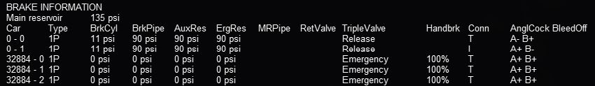

The columns under *AnglCock* describe the state of the *Angle Cock*, a
manually operated valve in each of the brake hoses of a car: A is the
cock at the front, B is the cock at the rear of the car. The symbol ``+``
indicates that the cock is open and the symbol ``-`` that it is closed. The
column headed by ``T`` indicates if the hose on the locomotive or car is
interconnected: ``T`` means that there is no connection, ``I`` means it is
connected to the air pressure line. If the angle cocks of two consecutive
cars are B+ and A+ respectively, they will pass the main air hose
pressure between the two cars. In this example note that the locomotive
air brake lines start with A- (closed) and end with B- (closed) before
the air hoses are connected to the newly coupled cars. All of the newly
coupled cars in this example have their angle cocks open, including those
at the ends, so their brake pressures are zero. This will be reported as
*Emergency* state.

Coupling Cars
'''''''''''''

Also note that, immediately after coupling, you may also find that the
handbrakes of the newly added cars have their handbrakes set to 100% (see
column headed *Handbrk*). Pressing ``<Shift+;>`` (Shift plus semicolon
in English keyboards) will release all the handbrakes on the consist as
shown below. Pressing ``<Shift+'>`` (Shift plus apostrophe on English
keyboards) will set all of the handbrakes. Cars without handbrakes will
not have an entry in the handbrake column.

If the newly coupled cars are to be moved without using their air brakes
and parked nearby, the brake pressure in their air hose may be left at
zero: i.e. their hoses are not connected to the train's air hose. Before
the cars are uncoupled in their new location, their handbrakes should be
set. The cars will continue to report *State Emergency* while coupled to
the consist because their BC value is zero; they will not have any
braking. The locomotive brakes must be used for braking. If the cars are
uncoupled while in motion, they will continue coasting.

If the brakes of the newly connected cars are to be controlled by the
train's air pressure as part of the consist, their hoses must be joined
together and to the train's air hose and their angle cocks set correctly.
Pressing the Backslash key ``<\>``) (in English keyboards; please check the
keyboard assignments for other keyboards) connects the brake hoses
between all cars that have been coupled to the engine and sets the
intermediate angle cocks to permit the air pressure to gradually approach
the same pressure in the entire hose. This models the operations
performed by the train crew. The HUD display changes to show the new
condition of the brake hose connections and angle cocks:

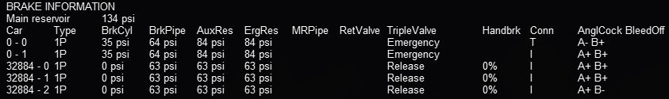

All of the hoses are now connected; only the angle cocks on the lead
locomotive and the last car are closed as indicated by the ``-``. The rest
of the cocks are open (``+``) and the air hoses are joined together (all
``I``)  to connect to the air supply on the lead locomotive.

Upon connection of the hoses of the new cars, recharging of the train
brake line commences. Open Rails uses a default charging rate of about 1
minute per every 12 cars. The HUD display may report that the consist is
in *Emergency* state; this is because the air pressure dropped when the
empty car brake systems were connected. Ultimately the brake pressures
reach their stable values:

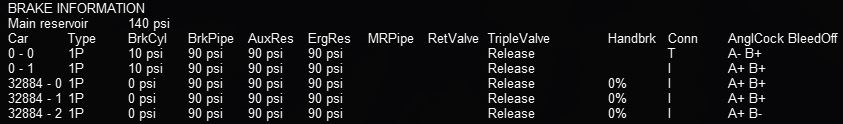

If you don't want to wait for the train brake line to charge, pressing
``<Shift+/>`` (in English keyboards) executes *Brakes Initialize* which
will immediately fully charge the train brakes line to the final state.
However, this action is not prototypical and also does not allow control
of the brake retainers.

The state of the angle cocks, the hose connections and the air brake
pressure of individual coupled cars can be manipulated by using the F9
Train Operations Monitor, described :ref:`here <driving-train-operations>`.
This will permit more realistic shunting of cars in freight yards.

Uncoupling Cars
'''''''''''''''

When uncoupling cars from a consist, using the F5 HUD Expanded Brake
Display in conjunction with the F9 Train Operations Monitor display
allows the player to set the handbrakes on the cars to be uncoupled, and
to uncouple them without losing the air pressure in the remaining cars.
Before uncoupling, close the angle cock at the rear of the car ahead of
the first car to be uncoupled so that the air pressure in the remaining
consist is not lost when the air hoses to the uncoupled cars are
disconnected. If this procedure is not followed, the train braking system
will go into *Emergency* state and will require pressing the ``<\>``
(backslash) key to connect the air hoses correctly and then waiting for
the brake pressure to stabilize again.

Setting Brake Retainers
'''''''''''''''''''''''

If a long consist is to be taken down a long or steep grade the operator may
choose to set the *Brake Retainers* on some or all of the cars to create a
fixed braking force by those cars when the train brakes are released. (This
requires that the retainer capability of the cars be enabled; either by the
menu option :ref:`Retainer valve on all cars <options-retainers>`, or by the
inclusion of an appropriate keyword in the car's .wag file.) The train must be
fully stopped and the main brakes must be applied so that there is adequate
pressure in the brake cylinders. Pressing ``<Shift+]>`` controls how many
cars in the consist have their retainers set, and the pressure value that is
retained when the train brakes are released. The settings are described in
:ref:`Brake Retainers <physics-retainers>` below. Pressing ``<Shift+[>``
cancels the settings and exhausts all of the air from the brake cylinders when
the brakes are released. The F5 display shows the symbol *RV ZZ* for the
state of the retainer valve in all cars, where ZZ is: *EX* for *Exhaust* or
*LP* or *HP*. When the system brakes are released and there are no
retainers set, the air in the brake cylinders in the cars is normally released
to the air. The BC pressure for the cars with retainers set will not fall below
the specified value. In order to change the retainer settings, the train must
be fully stopped. A sample F5 view with 50% LP is shown below:

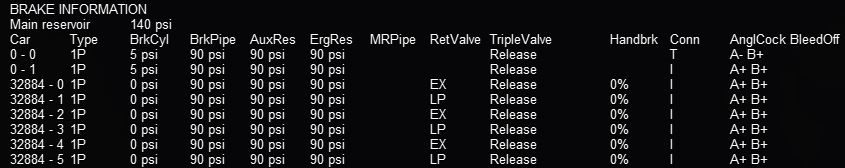

Dynamic Brakes
--------------

Open Rails software supports dynamic braking for engines. To increase the
Dynamic brakes press Period (.) and Comma (,) to decrease them. Dynamic
brakes are usually off at train startup (this can be overridden by the
related MSTS setting in the .eng file), the throttle works and there is
no value shown in the dynamic brake line in the HUD. To turn on dynamic
brakes set the throttle to zero and then press Period. Pressing Period
successively increases the Dynamic braking forces. If the value n in the
MSTS parameter DynamicBrakesDelayTimeBeforeEngaging ( n ) is greater than
zero, the dynamic brake will engage only after n seconds. The throttle
will not work when the Dynamic brakes are on.

The Dynamic brake force as a function of control setting and speed can be
defined in a DynamicBrakeForceCurves table that works like the
:ref:`MaxTractiveForceCurves table <physics-inclusions>`. If there is no
DynamicBrakeForceCurves defined in the ENG file, than one is created
based on the MSTS parameter values.

Native Open Rails Braking Parameters
------------------------------------

Open Rails has implemented additional specific braking parameters to
deliver realism in braking performance in the simulation.

Following are a list of specific OR parameters and their default values.
The default values are used in place of MSTS braking parameters; however,
two MSTS parameters are used for the release state:
MaxAuxilaryChargingRate and EmergencyResChargingRate.

.. index::
   single: BrakePipeVolume
   single: ORTSMainResChargingRate
   single: ORTSEngineBrakeReleaseRate
   single: ORTSEngineBrakeApplicationRate
   single: ORTSBrakePipeChargingRate
   single: ORTSBrakePipeQuickChargingRate
   single: ORTSBrakeServiceTimeFactor
   single: ORTSBrakeEmergencyTimeFactor
   single: ORTSBrakePipeTimeFactor

- ``Wagon(BrakePipeVolume`` -- Volume of car's brake pipe in cubic feet
  (default .5).
  This is dependent on the train length calculated from the ENG to the
  last car in the train. This aggregate factor is used to approximate the
  effects of train length on other factors.
  Strictly speaking this value should depend on the car length, but the
  Open Rails Development team doesn't believe it is worth the extra
  complication or CPU time that would be needed to calculate it in real
  time. We will let the community customize this effect by adjusting the
  brake servicetimefactor instead, but the Open Rails Development team
  doesn't believe this is worth the effort by the user for the added
  realism.
- ``Engine(ORTSMainResChargingRate`` -- Rate of main reservoir pressure change
  in psi per second when the compressor is on (default .4).
- ``Engine(ORTSEngineBrakeReleaseRate`` -- Rate of engine brake pressure
  decrease in psi per second
  (default 12.5).
- ``Engine(ORTSEngineBrakeApplicationRate`` -- Rate of engine brake pressure
  increase in psi per second
  (default 12.5).
- ``Engine(ORTSBrakePipeChargingRate`` -- Rate of lead engine brake pipe
  pressure increase in PSI per second (default 21).
- ``Engine(ORTSBrakePipeQuickChargingRate`` -- Rate of lead engine brake pipe
  pressure increase in PSI per second during a quick release (by default
  will be equal to ORTSBrakePipeChargingRate).
- ``Engine(ORTSBrakeServiceTimeFactor`` -- Time in seconds for lead engine
  brake pipe pressure to drop to about 1/3 for service application
  (default 1.009).
- ``Engine(ORTSBrakeEmergencyTimeFactor`` -- Time in seconds for lead engine
  brake pipe pressure to drop to about 1/3 in emergency (default .1).
- ``Engine(ORTSBrakePipeTimeFactor`` -- Time in seconds for a difference in
  pipe pressure between adjacent cars to equalize to about 1/3
  (default .003).

.. _physics-retainers:

Brake Retainers
---------------

The retainers of a car will only be available if either the General Option
:ref:`Retainer valve on all cars <options-retainers>` is checked, or the car's
.wag file contains a retainer valve declaration. To declare a retainer the line
``BrakeEquipmentType (  )`` in the .wag file must include either the item
``Retainer_4_Position`` or  the item ``Retainer_3_Position``. A 4 position
retainer includes four states: exhaust, low pressure (10 psi), high pressure
(20 psi), and slow direct (gradual drop to zero). A 3 position retainer does
not include the low pressure position. The use and display of the retainers is
described in :ref:`Extended HUD for Brake Information <physics-hud-brake>`.

The setting of the retained pressure and the number of retainers is
controlled using the Ctrl+[ and Ctrl+] keys (Ctrl plus the left and right
square bracket ([ and ]) keys on an English keyboard). The Ctrl+[ key
will reset the retainer on all cars in the consist to exhaust (the
default position). Each time the Ctrl+] key is pressed the retainer
settings are changed in a defined sequence. First the fraction of the
cars set at a low pressure is selected (25%, 50% and then 100% of the
cars), then the fraction of the cars at a high pressure is selected
instead, then the fraction at slow direct. For the 25% setting the
retainer is set on every fourth car starting at the rear of the train,
50% sets every other car and 100% sets every car. These changes can only
be made when the train is stopped. When the retainer is set to exhaust,
the ENG file release rate value is used, otherwise the pressures and
release rates are hard coded based on some AB brake documentation used by
the Open Rails development team.

.. _physics-emergency:

Emergency Brake Application Key
-------------------------------

The *Backspace* key is used, as in MSTS, to apply the train brakes in an
emergency situation without requiring operation of the train brake lever.
However in OR moving the brake lever back to the Release position will
only cause OR to report *Apply Emergency Brake Push Button*. The
Backspace key must be pressed again to cancel the emergency application,
then normal operation can be resumed. When the button is active, the F5
HUD will display *Emergency Brake Push Button* in the *Train Brake* line.

.. _physics-vacuum:

Automatic Vacuum Brakes
-----------------------

Automatic Vacuum braking has been implemented in Open Rails in one of the two following forms:

- Direct Vacuum - in this form, while ever the Brake Pipe (BP) is connected to the ejectors
  or vacuum pump, depending upon the operating capacity of the ejectors, a vacuum will be
  maintained or created. Typically this will be when the brake controller is in a Brake Off position.

- Equalising Reservoir (EQ) - in this form a main vacuum reservoir is fitted to the locomotive,
  along with the equalising reservoir. Typically the main reservoir is maintained at a sufficiently
  high enough vacuum to create the vacuum in the BP to release the brakes. The BP vacuum will
  equalise at the vacuum set by the driver on the equalising reservoir.

As the altitude at which the train is operating increases, so the effectiveness of vacuum brakes decreases. 
For example, if a train is operating with a 21InHg system, based upon the following railway highest points 
in the countries indicated, it would be expect that only the following maximum possible vacuum levels would 
be achieveable:

UK = 350m = 20InHg
Aus = 923m = 19InHg
USA = 4,301m = 14InHg

In general, brakes (in particular a system with an equalising reservoir) will have three
potential timings that impact the application or the releasing of the brakes.

i) In the equalising reservoir as the brake controller is varied
ii) In the train brake pipe as the vacuum is increased or decreased
iii) In the brake cylinder as it is applied or released.

In the case of brakes without an equalising reservoir only items ii) and iii) are valid
in the above list.

The OR code attempts to model the above three items, however some compromises may need
to be made, and it is suggested that the best outcome will be achieved when an overall timing
approach is considered, rather than considering each of the individual components in isolation.

To enable the Equalising Reservoir option above BrakesTrainBrakeType must be set
to ``vacuum_single_pipe_eq`` in the engine section of the ENG file.

Following is a list of specific OR parameters and their default values. The default
values can be overwritten by including the following parameters into the relevant
wagon section of the WAG or ENG file.

.. index::
   single: ORTSAuxilaryResCapacity
   single: ORTSBrakeCylinderSize
   single: ORTSNumberBrakeCylinders
   single: ORTSDirectAdmissionValve
   single: ORTSBrakeShoeFriction
   single: MaxBrakeForce
   single: MaxReleaseRate
   single: MaxApplicationRate
   single: BrakeCylinderPressureForMaxBrakeBrakeForce

- ``wagon(BrakePipeVolume`` -- Volume of brake pipe fitted to car in cubic feet
  (default calculated from car length, and assumption of 2in BP).
- ``wagon(ORTSAuxilaryResCapacity`` -- Volume of auxiliary vacuum reservoir
  (coupled to brake cylinder) in cubic feet (default calculated on basis of 24in reservoir).
- ``wagon(ORTSBrakeCylinderSize`` -- Size of brake cylinders fitted to wagon in inches
  (default assumes a 18in brake cylinder).
- ``wagon(ORTSNumberBrakeCylinders`` -- Number of brake cylinders fitted to wagon,
  as an integer number (default 2).
- ``wagon(ORTSDirectAdmissionValve`` -- Car has direct admission valves fitted,
  0 = No, 1 = Yes (default No).
- ``wagon(ORTSBrakeShoeFriction`` -- defines the friction curve for the brake shoe
  with speed (default curve for cast iron brake shoes included in OR).

Other standard brake parameters such as ``MaxBrakeForce``, ``MaxReleaseRate``, ``MaxApplicationRate``,
``BrakeCylinderPressureForMaxBrakeBrakeForce`` can be used as well.

.. index::
   single: BrakeCylinderPressureForMaxBrakeBrakeForce
   single: ORTSBrakeEmergencyTimeFactor
   single: ORTSBrakePipeTimeFactor
   single: TrainPipeLeakRate
   single: ORTSVacuumBrakesMainResVolume
   single: ORTSVacuumBrakesMainResMaxVacuum
   single: ORTSVacuumBrakesExhausterRestartVacuum
   single: ORTSVacuumBrakesMainResChargingRate

Additionaly the following are defined in the engine section of the ENG file:

- ``engine(BrakeCylinderPressureForMaxBrakeBrakeForce`` -- sets the rate at which the brake pipe charges in InHg per second
  (default 0.32) This value should be calculated on the basis of feeding into a 200ft^3 brake system,
  as OR will adjust the value depending upon the connected volume of the brake cylinders and brake pipe.

- ``engine(ORTSBrakeServiceTimeFactor`` -- Time for lead engine brake pipe pressure to drop in seconds (default 10.0)

- ``engine(ORTSBrakeEmergencyTimeFactor`` -- Time for lead engine brake pipe pressure to drop under
  emergency conditions, in seconds (default 1.0)

- ``engine(ORTSBrakePipeTimeFactor`` -- Controls propagation increase time along train pipe as vacuum
  increases, ie when brakes released, in seconds (default 0.02)

- ``engine(TrainPipeLeakRate`` -- Rate at which the train brake pipe leaks at, in InHg per second (default no leakage)

- ``engine(ORTSVacuumBrakesMainResVolume`` -- The volume of the main vacuum brake reservoir in cubic feet
  (default 110.0 , EQ operation only)

- ``engine(ORTSVacuumBrakesMainResMaxVacuum`` -- The maximum vacuum in the main vacuum brake reservoir.
  When this pressure is reached the exhauster will automatically stop running, in InHg. (default 23 , EQ
  operation only)

- ``engine(ORTSVacuumBrakesExhausterRestartVacuum`` -- pressure below which the exhauster will start to
  operate to recharge the main reservoir, in InHg (default 21 , EQ operation only)

- ``engine(ORTSVacuumBrakesMainResChargingRate`` -- rate at which the main vacuum reservoir charges at,
  in InHg per second (default 0.2, EQ operation only)

**Note: It is strongly recommended that UoM be used whenever units such as InHg, etc are specificed in the above parameters.**

.. index::
   single: VacuumBrakesHasVacuumPump
   single: VacuumBrakesMinBoilerPressureMaxVacuum
   single: VacuumBrakesSmallEjectorUsageRate
   single: VacuumBrakesLargeEjectorUsageRate
   single: TrainBrakesControllerFullQuickReleaseStart
   single: TrainBrakesControllerReleaseStart
   single: TrainBrakesControllerRunningStart
   single: TrainBrakesControllerApplyStart
   single: TrainBrakesControllerHoldLappedStart
   single: TrainBrakesControllerVacuumContinuousServiceStart
   single: TrainBrakesControllerHoldLappedStart
   single: TrainBrakesControllerEmergencyStart
   single: EngineBrakesControllerReleaseStart
   single: EngineBrakesControllerRunningStart
   single: EngineBrakesControllerApplyStart
   single: TrainPipeLeakRate
   single: ORTSSmallEjector
   single: ORTSLargeEjector
   single: ORTSFastVacuumExhauster

Other standard brake parameters such as ``VacuumBrakesHasVacuumPump``, ``VacuumBrakesMinBoilerPressureMaxVacuum``,
``VacuumBrakesSmallEjectorUsageRate``, ``VacuumBrakesLargeEjectorUsageRate`` can be defined as well.

When defining the Brake Controllers for vacuum braked locomotives, only the following BrakesController
tokens should be used - ``TrainBrakesControllerFullQuickReleaseStart``, ``TrainBrakesControllerReleaseStart``,
``TrainBrakesControllerRunningStart``, ``TrainBrakesControllerApplyStart``, ``TrainBrakesControllerHoldLappedStart``,
``TrainBrakesControllerVacuumContinuousServiceStart``, ``TrainBrakesControllerEmergencyStart``,
``EngineBrakesControllerReleaseStart``, ``EngineBrakesControllerRunningStart``, ``EngineBrakesControllerApplyStart``.

If ``TrainPipeLeakRate`` has been set in the ENG file, then the small ejector will be required to offset the leakage
in the Brake Pipe. The *J* and *Shft-J* keys can be used to increase/decrease the level of operation of the small ejector.

An engine controller can be configured to customise the operation of the small ejector. This controller is called
``ORTSSmallEjector ( w, x, y, z )``, and will be set up as a standard 4 value controller.

An engine controller can also be configured to customise the operation of the large ejector. This controller is called
``ORTSLargeEjector ( w, x, y, z )``, and will be set up as a standard 4 value controller. The large ejector needs to 
be operated to release the brakes. The *Alt-J* and *Ctrl-J* keys can be used to decrease/increase the level of 
operation of the large ejector.

In diesel and electric locomotives, the Vacuum Exhauster preforms a similar function to the small and large ejector, 
but in an "automated" fashion. The *J* key can be used to run the vacuum exhauster at high speed to facilitate a 
quicker release of the brakes. An engine controller called ``ORTSFastVacuumExhauster ( x y z )``, and will be set 
up as a standard 3 value controller.

If it is not desired to operate the large ejector, a simplified brake operation can be used by selecting the 
"Simple Contol and Physics" option in the options menu (Simulator TAB). This option can also be used if there is a 
"mismatch" between the locomotive and car brakes to set a standard default set of brakes.

Engine brakes can also be configured for locomotives as required. They will work in a similar fashion to those fitted 
to air braked locomotives.

Non Automatic Vacuum Brakes
---------------------------

Non automatic (or Straight) vacuum braking has been added to OR. This braking has been based upon the Eames and Hardy 
vacuum braking systems.

Straight brakes operate in the reverse way to "normal" vacuum brakes, ie the train brake pipe needs to have a vacuum 
created in it to apply the brakes, and air needs to be allowed into the brake pipe to release the brakes. The straight 
brake had the major disadvantage that if the brake pipe was interupted then the brakes would not be able to be applied 
and stop the train. Consequently they were only mostly applied to early trains and were replaced over time by automatic 
brakes.

To configure a car with manual braking then in the car brake section configure the fllowing two parameters:

``BrakeEquipmentType( "Straight_Vacuum_Single_Pipe" )``

Additional train controllers have been added to facilitate the operation of straight braked controlled cars.

``TrainBrakesControllerStraightBrakingReleaseOffStart`` - closes the Eames release valve
``TrainBrakesControllerStraightBrakingReleaseOnStart`` - opens the Eames release valve to release the brakes. 
The normal large ejector controls need to be used to apply the brakes (use *Alt-J* and *Ctrl-J* keys )

``TrainBrakesControllerStraightBrakingReleaseStart`` - Hardy brake - release
``TrainBrakesControllerStraightBrakingLapStart`` - Hardy brake - hold at current vacuum level
``TrainBrakesControllerStraightBrakingApplyStart`` - Hardy brake - twin ejector - use large ejector to apply 
brakes on train only
``TrainBrakesControllerStraightBrakingApplyAllStart`` - Hardy brake - single ejector type - use large ejector to apply 
brakes
``TrainBrakesControllerStraightBrakingEmergencyStart`` - Hardy brake - twin ejector type - use large and small ejector 
to apply brakes on train, locomotive and tender

Similar timing parameters to those used in the Vacuum Brake above are used in this brake type. 

.. _physics-manual:

Manual Brakes
-------------

Manual braking is provided in OR to facilitate cars with no brakes fitted (for example Stephenson's Rocket locomotive 
initially had no brakes fitted). Alternatively some trains used manually operated brakes controlled by a brakeman. 
This feature allows for the creation of braking on selected cars along the train that are operated by a brakeman (for 
example some trains had brakes only on the locomotive and the brakevans (caboose) which would be operated to control the 
stopping of the train.

An additional engine controller has been added to facilitate the operation of all brakeman (manual braked) controlled cars.

.. index::
   single: TrainBrakesControllerManualBrakingStart
   single: BrakeSystemType
   single: BrakeEquipmentType
   single: MaxBrakeForce
   single: MaxReleaseRate
   single: MaxApplicationRate

The controller can be added to an ENG file in a similar fashion to an air brake or vacuum controller by using the following 
brake controller parameter: ``TrainBrakesControllerManualBrakingStart``

To configure a car with manual braking then in the car brake section configure the following two parameters:

``BrakeSystemType ( "Manual_Braking" )``
``BrakeEquipmentType( "Manual_brake, Handbrake" )``

If the BrakeEquipmentType is left out, OR will assume that no braking is fitted to the car.

The following values, in the wagon section of the file need to be set for a manually braked car:

- ``MaxBrakeForce``
- ``MaxReleaseRate``
- ``MaxApplicationRate``

The manual brake can be increased by pressing *Alt-]*, and decreased by pressing *Alt-[*.

.. _physics-steam:

Steam Brakes
------------

Steam brakes can be applied to a locomotive, and its corresponding tender, by adding the following parameter to the ENG file:

``BrakesEngineBrakeType ( "Steam_brake" )``

The brake can be applied by pressing ], and released by pressing the [ keys.

To control the application and release rates on the brake use the ``EngineBrakesControllerMaxApplicationRate`` and 
``EngineBrakesControllerMaxReleaseRate`` parameters.

The ``SteamBrakeFX`` special effect, if added to the wagon, will turn on and off with the brake operation 
and can be used to model steam leakage of the steam brake cylinder, etc.

Dynamically Evolving Tractive Force
===================================

.. index::
   single: ORTSMaxTractiveForceCurves
   single: ORTSContinuousForceTimeFactor

The Open Rails development team has been experimenting with
max/continuous tractive force, where it can be dynamically altered during
game play using the ``ORTSMaxTractiveForceCurves`` parameter as shown
earlier. The parameters were based on the Handbook of Railway Vehicle
Dynamics. This says the increased traction motor heat increase resistance
which decreases current and tractive force. We used a moving average of
the actual tractive force to approximate the heat in the motors. Tractive
force is allowed to be at the maximum per the ENG file, if the average
heat calculation is near zero. If the average is near the continuous
rating than the tractive force is de-rated to the continuous rating.
There is a parameter called ``ORTSContinuousForceTimeFactor`` that roughly
controls the time over which the tractive force is averaged. The default
is 1800 seconds.

.. _physics-curve-resistance:

Curve Resistance - Theory
=========================

Introduction
------------

When a train travels around a curve, due to the track resisting the
direction of travel (i.e. the train wants to continue in a straight line),
it experiences increased resistance as it is *pushed* around the curve.
Over the years there has been much discussion about how to accurately
calculate curve friction. The calculation methodology presented (and used
in OR) is meant to be representative of the impacts that curve friction
will have on rolling stock performance.

Factors Impacting Curve Friction
--------------------------------

A number of factors impact upon the value of resistance that the curve
presents to the trains movement, as follows:

- Curve radius -- the smaller the curve radius the higher the higher the
  resistance to the train
- Rolling Stock Rigid Wheelbase -- the longer the rigid wheelbase of the
  vehicle, the higher the resistance to the train. Modern bogie stock tends
  to have shorter rigid wheelbase values and is not as bad as the older style
  4 wheel wagons.
- Speed -- the speed of the train around the curve will impact upon the
  value of resistance, typically above and below the equilibrium speed (i.e.
  when all the wheels of the rolling stock are perfectly aligned between the
  tracks). See the section below *Impact of superelevation*.

The impact of wind resistance on curve friction is calculated in the general
calculations for Wind Resistance.

Impact of Rigid Wheelbase
-------------------------

The length of the rigid wheelbase of rolling stock will impact the value of
curve resistance. Typically rolling stock with longer rigid wheelbases will
experience a higher degree of *rubbing* or frictional resistance on tight
curves, compared to stock with smaller wheelbases.

Steam locomotives usually created the biggest problem in regard to this as
their drive wheels tended to be in a single rigid wheelbase as shown in
figure. In some instances on routes with tighter curve the *inside* wheels
of the locomotive were sometimes made flangeless to allow them to *float*
across the track head. Articulated locomotives, such as Shays, tended to
have their drive wheels grouped in bogies similar to diesel locomotives and
hence were favoured for routes with tight curves.

.. figure:: images/physics-curve-rigid-wheels.png
    :align: center

    Diagram Source: The Baldwin Locomotive Works -- Locomotive Data -- 1944
    Example of Rigid Wheelbase in steam locomotive

The value used for the rigid wheelbase is shown as W in figure

Impact of Super Elevation
-------------------------

On any curve whose outer rail is super-elevated there is, for any car, one
speed of operation at which the car trucks have no more tendency to run
toward either rail than they have on straight track, where both rail-heads
are at the same level (known as the equilibrium speed). At lower speeds the
trucks tend constantly to run down against the inside rail of the curve,
and thereby increase the flange friction; whilst at higher speeds they run
toward the outer rail, with the same effect. This may be made clearer by
reference to figure below, which represents the forces which operate on a
car at its centre of gravity.

With the car at rest on the curve there is a component of the weight W
which tends to move the car down toward the inner rail. When the car moves
along the track centrifugal force ``Fc`` comes into play and the car action
is controlled by the force ``Fr`` which is the resultant of ``W`` and
``Fc``. The force ``Fr`` likewise has a component which, still tends to
move the car toward the inner rail. This tendency persists until, with
increasing speed, the value of ``Fc`` becomes great enough to cause the
line of operation of ``Fr`` to coincide with the centre line of the track
perpendicular to the plane of the rails. At this equilibrium speed there is
no longer any tendency of the trucks to run toward either rail. If the
speed be still further increased, the component of ``Fr`` rises again, but
now on the opposite side of the centre line of the track and is of opposite
sense, causing the trucks to tend to move toward the outer instead of the
inner rail, and thereby reviving the extra flange friction. It should be
emphasized that the flange friction arising from the play of the forces
here under discussion is distinct from and in excess of the flange friction
which arises from the action of the flanges in forcing the truck to follow
the track curvature. This excess being a variable element of curve
resistance, we may expect to find that curve resistance reaches a minimum
value when this excess reduces to zero, that is, when the car speed reaches
the critical value referred to. This critical speed depends only on the
super-elevation, the track gauge, and the radius of the track curvature.
The resulting variation of curve resistance with speed is indicated in
diagram below.

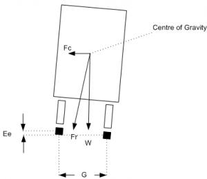

    Forces on rolling stock transitioning a curve

Calculation of Curve Resistance
-------------------------------

R = W F (D + L) 2 r

Where:

- R = Curve resistance,
- W = vehicle weight,
- F = Coefficient of Friction,

  - 0.1 -- 0.3 for wet rail
  - 0.5 for dry, smooth steel-to-steel 

- D = track gauge,
- L = Rigid wheelbase,
- r = curve radius.

(Source: The Modern locomotive by C. Edgar Allen - 1912)

Calculation of Curve Speed Impact
---------------------------------

The above value represents the least value amount of resistance, which
occurs at the equilibrium speed, and as described above will increase as
the train speed increases and decreases from the equilibrium speed. This
concept is shown pictorially in the following graph. Open Rails uses the
following formula to model the speed impact on curve resistance:

.. math::

    SpeedFactor = abs\left(\left(v_{equilibrium} - v_{train}\right)
    \cdot v_{equilibrium}\right)\cdot ResistanceFactor_{start}

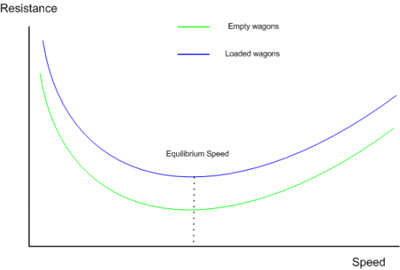

    Generalisation of Variation of Curve Resistance With Speed

Further background reading
--------------------------

`<http://en.wikipedia.org/wiki/Curve_resistance_(railroad)>`_

.. _physics-curve-resistance-application:

Curve Resistance - Application in OR
====================================

Open Rails models this function, and the user may elect to specify the
known wheelbase parameters, or the above *standard* default values will be
used. OR calculates the equilibrium speed in the speed curve module,
however it is not necessary to select both of these functions in the
simulator options TAB. Only select the function desired. By studying the
*Forces Information* table in the HUD, you will be able to observe the
change in curve resistance as the speed, curve radius, etc. vary.

OR Parameter Values
-------------------

.. index::
   single: ORTSRigidWheelBase
   single: ORTSTrackGauge

Typical OR parameter values may be entered in the Wagon section of the .wag
or .eng file, and are formatted as below.::

    ORTSRigidWheelBase ( 3in )
    ORTSTrackGauge ( 4ft 8.5in) // (also used in curve speed module)

OR Default Values
-----------------

The above values can be entered into the relevant files, or alternatively
if they are not present, then OR will use the default values described
below.

Rigid Wheelbase -- as a default OR uses the figures shown above in the
*Typical Rigid Wheelbase Values* section. The starting curve resistance
value has been assumed to be 200%, and has been built into the speed impact
curves. OR calculates the curve resistance based upon the actual wheelbases
provided by the player or the appropriate defaults. It will use this as the
value at *Equilibrium Speed*, and then depending upon the actual calculated
equilibrium speed (from the speed limit module) it will factor the
resistance up as appropriate to the current train speed.

Steam locomotive wheelbase approximation -- the following approximation is
used to determine the default value for the fixed wheelbase of a steam
locomotive.

.. math::

    WheelBase = 1.25\cdot(axles - 1)\cdot DrvWheelDiameter

Typical Rigid Wheelbase Values
------------------------------

The following values are used as defaults where actual values are not
provided by the player.

+------------------------------------------+-----------------------------+
|Rolling Stock Type                        |Typical value                |
+==========================================+=============================+
|Freight Bogie type stock (2 wheel bogie)  |5' 6" (1.6764m)              |
+------------------------------------------+-----------------------------+
|Passenger Bogie type stock (2 wheel bogie)|8' (2.4384m)                 |
+------------------------------------------+-----------------------------+
|Passenger Bogie type stock (3 wheel bogie)|12' (3.6576m)                |
+------------------------------------------+-----------------------------+
|Typical 4 wheel rigid wagon               |11' 6" (3.5052m)             |
+------------------------------------------+-----------------------------+
|Typical 6 wheel rigid wagon               |12' (3.6576m)                |
+------------------------------------------+-----------------------------+
|Tender (6 wheel)                          |14' 3" (4.3434m)             |
+------------------------------------------+-----------------------------+
|Diesel, Electric Locomotives              |Similar to passenger stock   |
+------------------------------------------+-----------------------------+
|Steam locomotives                         |Dependent on drive wheels #. |
|                                          |Can be up to 20'+, e.g. large|
|                                          |2--10--0 locomotives         |
+------------------------------------------+-----------------------------+

Modern publications suggest an allowance of approximately 0.8 lb per ton
(US) per degree of curvature for standard gauge tracks. At very slow
speeds, say 1 or 2 mph, the curve resistance is closer to 1.0 lb (or 0.05%
up grade) per ton per degree of curve.

.. _physics-curve-speed-limit:

Super Elevation (Curve Speed Limit) -- Theory
=============================================

Introduction
------------

When a train rounds a curve, it tends to travel in a straight direction and
the track must resist this movement, and force the train to move around the
curve. The opposing movement of the train and the track result in a number
of different forces being in play.

19th & 20th Century vs Modern Day Railway Design
------------------------------------------------

In the early days of railway construction financial considerations were a
big factor in route design and selection. Given that the speed of competing
transport, such as horses and water transport was not very great, speed was
not seen as a major factor in the design process. However as railway
transportation became a more vital need for society, the need to increase
the speed of trains became more and more important. This led to many
improvements in railway practices and engineering. A number of factors,
such as the design of the rolling stock, as well as the track design,
ultimately influence the maximum speed of a train. Today's high speed
railway routes are specifically designed for the speeds expected of the
rolling stock.

Centrifugal Force
-----------------

Railway locomotives, wagons and carriages, hereafter referred to as rolling
stock, when rounding a curve come under the influence of centrifugal force.
Centrifugal force is commonly defined as:

- The apparent force that is felt by an object moving in a curved path that
  acts outwardly away from the centre of rotation.
- An outward force on a body rotating about an axis, assumed equal and
  opposite to the centripetal force and postulated to account for the
  phenomena seen by an observer in the rotating body.

For this article the use of the phrase centrifugal force shall be
understood to be an apparent force as defined above.

Effect of Centrifugal Force
---------------------------

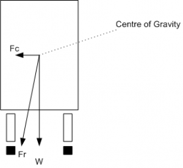

    Forces at work when a train rounds a curve

When rolling stock rounds a curve, if the rails of the track are at the
same elevation (i.e. the two tracks are at the same level) the combination
of centrifugal force Fc and the weight of the rolling stock W will produce
a resulting force Fr that does not coincide with the centre line of track,
thus producing a downward force on the outside rail of the curve that is
greater than the downward force on the inside rail (Refer to Figure 1). The
greater the velocity and the smaller the radius of the curve (some railways
have curve radius as low as 100m), the farther the resulting force Fr will
move away from the centre line of track. Equilibrium velocity was the
velocity at which a train could negotiate a curve with the rolling stock
weight equally distributed across all the wheels.

If the position of the resulting force Fr approaches the outside rail, then
the rolling stock is at risk of *falling* off the track or overturning. The
following drawing, illustrates the basic concept described. Lateral
displacement of the centre of gravity permitted by the suspension system of
the rolling stock is not illustrated.

Use of Super Elevation
----------------------

    This illustrates the concept.

In order to counteract the effect of centrifugal force Fc the outside rail
of the curve may be elevated above the inside rail, effectively moving the
centre of gravity of the rolling stock laterally toward the inside rail.

This procedure is generally referred to as super elevation. If the
combination of lateral displacement of the centre of gravity provided by
the super elevation, velocity of the rolling stock and radius of curve is
such that resulting force Fr becomes centred between and perpendicular to a
line across the running rails the downward pressure on the outside and
inside rails of the curve will be the same. The super elevation that
produces this condition for a given velocity and radius of curve is known
as the balanced or equilibrium elevation.

Limitation of Super Elevation in Mixed Passenger & Freight Routes
-----------------------------------------------------------------

Typical early railway operation resulted in rolling stock being operated at
less than equilibrium velocity (all wheels equally sharing the rolling
stock weight ), or coming to a complete stop on curves. Under such
circumstances excess super elevation may lead to a downward force
sufficient to damage the inside rail of the curve, or cause derailment of
rolling stock toward the centre of the curve when draft force is applied to
a train. Routine operation of loaded freight trains at low velocity on a
curve superelevated to permit operation of higher velocity passenger trains
will result in excess wear of the inside rail of the curve by the freight
trains.

Thus on these types of routes, super elevation is generally limited to no
more than 6 inches.

Limitation of Super Elevation in High Speed Passenger Routes
------------------------------------------------------------

Modern high speed passenger routes do not carry slower speed trains, nor
expect trains to stop on curves, so it is possible to operate these routes
with higher track super elevation values. Curves on these types of route
are also designed with a relatively gentle radius, and are typically in
excess of 2000m (2km) or 7000m (7km) depending on the speed limit of the
route.

+-----------------------+-------+-------+-------+-------+-------+
|Parameters             |France |Germany|Spain  |Korea  |Japan  |
+=======================+=======+=======+=======+=======+=======+
|Speed (km/h)           |300/350|300    |350    |300/350|350    |
+-----------------------+-------+-------+-------+-------+-------+
|Horizontal curve radius|10000  |7000   |7000   |7000   |4000   |
|(m)                    |(10km) |(7km)  |(7km)  |(7km)  |(4km)  |
+-----------------------+-------+-------+-------+-------+-------+
|Super elevation (mm)   |180    |170    |150    |130    |180    |
+-----------------------+-------+-------+-------+-------+-------+
|Max Grade (mm/m)       |35     |40     |12.5   |25     |15     |
+-----------------------+-------+-------+-------+-------+-------+
|Cant Gradient (mm/s)   |50     |34.7   |32     |N/A    |N/A    |
+-----------------------+-------+-------+-------+-------+-------+
|Min Vertical radius (m)|16000  |14000  |24000  |N/A    |10000  |
|                       |(16km) |(14km) |(24km) |       |(10km) |
+-----------------------+-------+-------+-------+-------+-------+

**Table: Curve Parameters for High Speed Operations
(Railway Track Engineering by J. S. Mundrey)**

Maximum Curve Velocity
----------------------

The maximum velocity on a curve may exceed the equilibrium velocity, but
must be limited to provide a margin of safety before overturning velocity
is reached or a downward force sufficient to damage the outside rail of the
curve is developed. This velocity is generally referred to as maximum safe
velocity or safe speed. Although operation at maximum safe velocity will
avoid overturning of rolling stock or rail damage, a passenger riding in a
conventional passenger car will experience centrifugal force perceived as a
tendency to slide laterally on their seat, creating an uncomfortable
sensation of instability. To avoid passenger discomfort, the maximum
velocity on a curve is therefore limited to what is generally referred to
as maximum comfortable velocity or comfortable speed. Operating experience
with conventional passenger cars has led to the generally accepted
practice, circa 1980, of designating the maximum velocity for a given curve
to be equal to the result for the calculation of equilibrium velocity with
an extra amount added to the actual super elevation that will be applied to
the curve. This is often referred to as unbalanced super elevation or cant
deficiency. Tilt trains have been introduced to allow faster train
operation on tracks not originally designed for *high speed* operation, as
well as high speed railway operation. The tilting of the passenger cab
allows greater values of unbalanced super elevation to be used.

Limitation of Velocity on Curved Track at Zero Cross Level
----------------------------------------------------------

The concept of maximum comfortable velocity may also be used to determine
the maximum velocity at which rolling stock is permitted to round curved
track without super elevation and maintained at zero cross level. The lead
curve of a turnout located between the heel of the switch and the toe of
the frog is an example of curved track that is generally not super
elevated. Other similar locations would include yard tracks and industrial
tracks where the increased velocity capability made possible by super
elevation is not required. In such circumstances the maximum comfortable
velocity for a given curve may also be the maximum velocity permitted on
tangent track adjoining the curve.

Height of Centre of Gravity
---------------------------

Operation on a curve at equilibrium velocity results in the centre of
gravity of the rolling stock coinciding with a point on a line that is
perpendicular to a line across the running rails and the origin of which is
midway between the rails. Under this condition the height of the centre of
gravity is of no consequence as the resulting force Fr coincides with the
perpendicular line described above. When rolling stock stops on a super
elevated curve or rounds a curve under any condition of non-equilibrium the
resulting force Fr will not coincide with the perpendicular line previously
described and the height of the centre of gravity then becomes significant
in determining the location of the resulting force Fr relative to the
centre line of the track. The elasticity of the suspension system of
rolling stock under conditions of non-equilibrium will introduce a roll
element that affects the horizontal displacement of the centre of gravity
and that must also be considered when determining the location of the
resulting force Fr.

Calculation of Curve Velocity
-----------------------------

The generic formula for calculating the various curve velocities is as
follows:

.. math::

    v = \sqrt{E\cdot g\cdot r\cdot G}

Where:

- E = Ea (track super elevation) + Ec (unbalanced super elevation)
- g = acceleration due to gravity
- r = radius of curve
- G = track gauge

Typical Super Elevation Values & Speed Impact -- Mixed Passenger & Freight Routes
---------------------------------------------------------------------------------

The values quoted below are "typical" but may vary from country to country.

Track super elevation typically will not be more than 6 inches (150mm).
Naturally, depending upon the radius of the curve, speed restrictions may
apply.

Normally unbalanced super elevation is typically restricted to 3 inches
(75mm), and is usually only allowed for passenger stock.

Tilt trains may have values of up to 12 inches (305mm).

Typical Super Elevation Values & Speed Impact -- High Speed Passenger Routes
----------------------------------------------------------------------------

+-------------------------------+-------------------+-----------------------+
|                               |Cant D             |Cant deficiency        |
|                               |(SuperElevation)   |(Unbalanced            |
|                               |(mm)               |SuperElevation) I (mm) |
+===============================+===================+=======================+
|CEN (draft) -- Tilting trains  |180--200           |300                    |
+-------------------------------+-------------------+-----------------------+
|Czech Rep. -- Tilting trains   |150                |270                    |
+-------------------------------+-------------------+-----------------------+
|France -- Tilting trains       |180                |260                    |
+-------------------------------+-------------------+-----------------------+
|Germany -- Tilting trains      |180                |300                    |
+-------------------------------+-------------------+-----------------------+
|Italy -- Tilting trains        |160                |275                    |
+-------------------------------+-------------------+-----------------------+
|Norway -- Tilting trains       |150                |280                    |
+-------------------------------+-------------------+-----------------------+
|Spain -- Tilting trains        |160                |210                    |
|(equivalent for standard gauge)|(139)              |(182)                  |
+-------------------------------+-------------------+-----------------------+
|Sweden -- Tilting trains       |150                |245                    |
+-------------------------------+-------------------+-----------------------+
|UK -- Tilting trains           |180                |300                    |
+-------------------------------+-------------------+-----------------------+

**Table: Super Elevation limits (source - Tracks for tilting trains - A
study within the Fast And Comfortable Trains (FACT) project by B. Kufver,
R. Persson)**

.. _physics-curve-speed-limit-application:

Super Elevation (Curve Speed Limit) Application in OR
=====================================================

Open Rails implements this function, and has *standard* default values
applied. The user may elect to specify some of the standard parameters used
in the above formula.

OR Super Elevation Parameters
-----------------------------

.. index::
   single: ORTSUnbalancedSuperElevation
   single: ORTSTrackGauge

Typical OR parameters can be entered in the Wagon section of the .wag or
.eng file, and are formatted as below. ::

    ORTSUnbalancedSuperElevation ( 3in )
    ORTSTrackGauge( 4ft 8.5in)

OR Super Elevation Default Values
---------------------------------

The above values can be entered into the relevant files, or alternatively
OR will default to the following functionality.

OR will initially use the speed limit value from the route's .trk file to
determine whether the route is a conventional mixed freight and passenger
route or a high speed route.

- Speed limit < 200km/h (125mph) -- Mixed Freight and Pass route
- Speed limit > 200km/h (125mph) -- High speed passenger route

*Default* values of tracksuperelevation will be applied based upon the
above classifications.

Track gauge will default to the standard value of 4' 8.5" (1435mm).

Unbalancedsuperelevation (Cant Deficiency) will be determined from the
value entered by the user, or will default to the following values:

- Conventional Freight -- 0" (0mm)
- Conventional Passenger -- 3" (75mm)
- Engines & tenders -- 6" (150mm)

Tilting trains require the addition of the relevant
unbalancedsuperelevation information to the relevant rolling stock files.

.. _physics-tunnel-friction:

Tunnel Friction -- Theory
=========================

Introduction
------------

When a train travels through a tunnel it experiences increased resistance
to the forward movement.

Over the years there has been much discussion about how to accurately
calculate tunnel resistance. The calculation methodology presented (and
used in OR) is meant to provide an indicative representation of the impacts
that tunnel resistance will have on rolling stock performance.

Factors Impacting Tunnel Friction
---------------------------------

In general, the train aerodynamics are related to aerodynamic drag,
pressure variations inside the train, train-induced flows, cross-wind
effects, ground effects, pressure waves inside the tunnel, impulse waves at
the exit of tunnel, noise and vibration, etc. The aerodynamic drag is
dependent on the cross-sectional area of the train body, train length, the
shape of train fore- and after-bodies, the surface roughness of train body,
and geographical conditions around the traveling train. The train-induced
flows can influence passengers on a subway platform and is also associated
with the cross-sectional area of the train body, the train length, the
shape of train fore- and after-bodies, surface roughness of train body, etc.

A high speed train entering a tunnel generates a compression wave at the
entry portal that moves at the speed of sound in front of the train. The
friction of the displaced air with the tunnel wall produces a pressure
gradient and, as a consequence, a rise in pressure in front of the train.
On reaching the exit portal of the tunnel, the compression wave is
reflected back as an expansion wave but part of it exits the tunnel and
radiates outside as a micro-pressure wave. This wave could cause a sonic
boom that may lead to structural vibration and noise pollution in the
surrounding environment. The entry of the tail of the train into the tunnel
produces an expansion wave that moves through the annulus between the train
and the tunnel. When the expansion pressure wave reaches the entry portal,
it is reflected towards the interior of the tunnel as a compression wave.
These compression and expansion waves propagate backwards and forwards
along the tunnel and experience further reflections when meeting with the
nose and tail of the train or reaching the entry and exit portals of the
tunnel until they eventually dissipate completely.

The presence of this system of pressure waves in a tunnel affects the
design and operation of trains, and they are a source of energy losses,
noise, vibrations and aural discomfort for passengers.

These problems are even worse when two or more trains are in a tunnel at
the same time. Aural comfort is one of the major factors determining the
area of new tunnels or the maximum train speed in existing tunnels.

Importance of Tunnel Profile
----------------------------

As described above, a train travelling through a tunnel will create a bow
wave of air movement in front of it, which is similar to a *piston effect*.
The magnitude and impact of this effect will principally be determined by
the **tunnel profile**, **train profile** and **speed**.

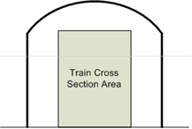

.. image:: images/physics-tunnel-profile2.png
    :align: center
    :scale: 80%

Typical tunnel profiles are shown in the diagrams.

As can be seen from these diagrams, the smaller the tunnel cross sectional
area compared to the train cross sectional area, the less air that can
*escape* around the train, and hence the greater the resistance experienced
by the train. Thus it can be understood that a single train in a double
track tunnel will experience less resistance then a single train in a
single track tunnel.

Calculation of Tunnel Resistance
--------------------------------

.. math::

    W_t = \frac{AL_{tr}}{(P + G)}v^2
    \left(1 - \frac{1}{1+\sqrt{\frac{B+C(L_t - L_{tr})}{L_{tr}}}}\right)^2

where

.. math::

    A=\frac{0.00003318\cdot\rho\cdot F_t}{(1-F_{tr}/F_t)^2},

    B=174.419(1-F_{tr}/F_t)^2,

    C=2.907\frac{(1-F_{tr}/F_t)^2}{4F_t/R_t}.

+-----------------------------------------------------------+-----------------------------------------------------------+
|F\ :sub:`t` -- tunnel cross-sectional area (m\ :sup:`2`\ ) |F\ :sub:`tr` -- train cross-sectional area (m\ :sup:`2`\ ) |
+-----------------------------------------------------------+-----------------------------------------------------------+
|:math:`\rho` -- density of air ( = 1.2 kg/m\ :sup:`3`\ )   |R\ :sub:`t` -- tunnel perimeter (m)                        |
+-----------------------------------------------------------+-----------------------------------------------------------+
|L\ :sub:`tr` -- length of train (m)                        |L\ :sub:`t` -- length of tunnel (m)                        |
+-----------------------------------------------------------+-----------------------------------------------------------+
|*v* -- train velocity (m/s)                                |P -- locomotive mass (t)                                   |
+-----------------------------------------------------------+-----------------------------------------------------------+
|W\ :sub:`t` -- additional aerodynamic drag in tunnel (N/kN)|G -- train mass (t)                                        |
+-----------------------------------------------------------+-----------------------------------------------------------+

**Source: Reasonable compensation coefficient of maximum gradient in long
railway tunnels by Sirong YI*, Liangtao NIE, Yanheng CHEN, Fangfang QIN**

.. _physics-tunnel-friction-application:

Tunnel Friction -- Application in OR
====================================

To enable this calculation capability it is necessary to select the
:ref:`Tunnel dependent resistance <options-tunnel-resistance>` option on the
Open Rails Menu. The implication of tunnel resistance is designed to model the
relative impact, and does not take into account multiple trains in the tunnel
at the same time.

Tunnel resistance values can be seen in the :ref:`Train Forces HUD
<driving-hud-force>`.

The default tunnel profile is determined by the route speed recorded in the
TRK file.

OR Parameters
-------------

.. index::
   single: ORTSSingleTunnelArea
   single: ORTSSingleTunnelPerimeter
   single: ORTSDoubleTunnelArea
   single: ORTSDoubleTunnelPerimeter

The following parameters maybe included in the TRK file to overwrite
standard default values used by Open Rails:

- ``ORTSSingleTunnelArea ( x )`` -- Cross section area of single track
  tunnel -- units area
- ``ORTSSingleTunnelPerimeter ( x )`` -- Perimeter of single track
  tunnel -- units distance
- ``ORTSDoubleTunnelArea ( x )`` -- Cross section area of double track
  tunnel -- units area
- ``ORTSDoubleTunnelPerimeter ( x )`` -- Perimeter of double track
  tunnel -- units distance

To insert these values in the .trk file, it is suggested that you add them
just prior to the last parenthesis. You may also use an *Include file*
method, described :ref:`here <physics-inclusions>`.

OR Defaults
-----------

Open Rails uses the following standard defaults, unless overridden by
values included in the TRK file.

+---------------+-----------------+------------------+
|Speed          |1 track          |2 tracks          |
+===============+=================+==================+
|**Tunnel Perimeter**                                |
+---------------+-----------------+------------------+
|< 160 km/h     |21.3 m           |31.0 m            |
+---------------+-----------------+------------------+
|160 < 200 km/h |25.0 m           |34.5 m            |
+---------------+-----------------+------------------+
|200 < 250 km/h |28.0 m           |35.0 m            |
+---------------+-----------------+------------------+
|250 < 350 km/h |32.0 m           |37.5 m            |
+---------------+-----------------+------------------+
|**Tunnel Cross Sectional Area**                     |
+---------------+-----------------+------------------+
|< 120 km/h     |27.0 m\ :sup:`2` |45.0 m\ :sup:`2`  |
+---------------+-----------------+------------------+
|< 160 km/h     |42.0 m\ :sup:`2` |76.0 m\ :sup:`2`  |
+---------------+-----------------+------------------+
|200 km/h       |50.0 m\ :sup:`2` |80.0 m\ :sup:`2`  |
+---------------+-----------------+------------------+
|250 km/h       |58.0 m\ :sup:`2` |90.0 m\ :sup:`2`  |
+---------------+-----------------+------------------+
|350 km/h       |70.0 m\ :sup:`2` |100.0 m\ :sup:`2` |
+---------------+-----------------+------------------+

.. _physics-wind-resistance:

Wind Resistance
===============

The default Davis resistance formula is only valid for train operation in STILL
air. At high train speeds, and especially for Very Fast trains the impact of
wind can be quite significant, and special consideration is required when
designing rolling stock, etc. If wind is present, then the impact of drag forces
on the train will vary, and be in addition to the values calculated in the
default (or still air) conditions.

The wind resistance in OR is modeled by the following two components:

**Wind Drag Resistance**  - If a train is heading into a headwind then the
train will experience greater resistance to movement, similarly if the train
has a tailwind, then the trains resistance will decrease as the wind provides
a "helping hand". As the wind swings from the head of the train to the rear
resistance will decrease. When the wind is perpendicular to the train, drag
impact due to the wind will be zero.

**Wind Lateral Force Resistance**  - When the wind blows from the side of the
train, the train will be pushed against the outside track rail, thus increasing
the amount of resistance experienced by the train.

To activate calculation of wind resistance, select the tickbox for "Wind dependent
resistance" in the Simulation TAB of the options menu. As wind only becomes
significant at higher train speeds, the wind resistance calculation only commences
once the train speed exceeds 5 mph.

The amount of wind resistance that the train is experiencing is shown in the FORCES
INFORMATION HUD. (see attached screenshot) The current wind conditions are also shown
in the HUD, and include the Wind speed and direction, train direction, and the
resulting vectors for the combined train and wind speed. The value in the Friction
column is the default still air conditions as calculated by the Davis formula.
It should be noted that OR calculates the Wind Drag resistance as a difference
compared to the still air Davis C value, and hence it is possible for values in the
Wind column to go negative on occasions. This is most likely when the wind is blowing
from the rear of the train, ie the ResWind direction is greater then 90\ |deg|\ C degrees, and
hence the wind is actually aiding the train movement, and in effect reducing the
amount of still air resistance.

The wind model has been adjusted in the following way:

- Wind Update speed - 1 sec
- Wind direction will always be within +/- 45\ |deg|\ C degrees of the randomly selected default
  value selected at startup
- Wind speed is limited to approx 10mph.

The Wind Resistance model will use default information, such as the width and height of
the stock from the Size statement, so by default it is not necessary to add any additional
parameters for its operation. However for those who like to customise, the following
parameters can be inputted via the WAG file or section.

.. index::
   single: ORTSWagonFrontalArea
   single: ORTSDavisDragConstant

``ORTSWagonFrontalArea`` -- The frontal cross sectional area of the wagon. The default units
are in ft^2, so if entering metres, include the Units of Measure.

``ORTSDavisDragConstant`` -- OR by default uses the standard Davis Drag constants. If alternate
drag constants are used in calculating the still air resistance, then it might be worthwhile
inputting these values.

.. _physics-trailing-locomotive-resistance:

Trailing Locomotive Resistance
==============================

Typically only one set of resistance parameters is allowed for each WAG file. In the case of locomotives
this can create issues as a leading locomotive will have a higher drag resistance then a trailing locomotive.

OR automatically adjusts the Drag resistance for trailing locomotives based upon the ratio of the original
Davis formula.

However for those who like to customise, the following parameter can be inputted via the WAG file or section.

.. index::
   single: ORTSTrailLocomotiveResistanceFactor

``ORTSTrailLocomotiveResistanceFactor`` -- The constant value by which the leading locomotive resistance
needs to be decreased for trailing operation.

For steam locomotive tenders it may be necessary to enter this value depending upon the Drag constant used
to calculate the tender resistance.

.. _physics-inclusions:

OR-Specific *Include Files* for Modifying MSTS File Parameters
==============================================================

Modifications to .eng and .wag Files
------------------------------------

In the preceding paragraphs many references have been made to OR-specific
parameters and tables to be included in .eng and .wag files. MSTS is in
general quite tolerant if it finds unknown parameters and even blocks
within .eng and .wag files, and continues running normally. However this
way of operating is not encouraged by the OR team. Instead, a cleaner
approach, as described here, has been implemented.

Within the trainset folder containing the .eng and .wag files to be
upgraded, create a subfolder named ``OpenRails``. Only OR will read
files from this folder. Within this subfolder a
text file named xxxx.eng or xxxx.wag, where xxxx.eng or xxxx.wag is the
name of the original file, must be created.

This new file may contain either:

- all of the information included in the original file (using (modified parts
  where desired) plus the OR-specific parts if any, or:
- at its beginning only an *include* reference to the original file,
  followed by the modified parts and the OR-specific parts. This
  does not apply to the ``Name()`` statement and the Loco Description
  Information, where in any case the data in the base .eng file is retained.

An example of an OR-specific ``bc13ge70tonner.eng`` file to be placed into the
OpenRails subfolder that uses the second possibility is as follows::

    include ( ../bc13ge70tonner.eng )
    Wagon (
      MaxReleaseRate ( 2.17 )
      MaxApplicationRate ( 3.37 )
      MaxAuxilaryChargingRate ( .4 )
      EmergencyResChargingRate ( .4 )
      BrakePipeVolume ( .4 )
      ORTSUnbalancedSuperElevation ( 3in )
    Engine (
      AirBrakeMainresvolume ( 16 )
      MainResChargingRate ( .5 )
      BrakePipeChargingRate ( 21 )
      EngineBrakeReleaseRate ( 12.5 )
      EngineBrakeApplicationRate ( 12.5 )
      BrakePipeTimeFactor ( .00446 )
      BrakeServiceTimeFactor ( 1.46 )
      BrakeEmergencyTimeFactor ( .15 )
      ORTSMaxTractiveForceCurves (
        0 (
          0 0 50 0 )
        .125 (
          0 23125
          .3 23125
          1 6984
          2 3492
          5 1397
          10 698
          20 349
          50 140 )
        .25 (
          0 46250
          .61 46250
          1 27940
          2 13969
          5 5588
          10 2794
          20 1397
          50 559 )
        .375 (
          0 69375
          .91 69375
          2 31430
          5 12572
          10 6287
          20 3143
          50 1257 )
        .5 (
          0 92500
          1.21 92500
          5 22350
          10 11175
          20 5588
          50 2235 )
        .625 (
          0 115625
          1.51 115625
          5 34922
          10 17461
          20 8730
          50 3492 )
        .75 (
          0 138750
          1.82 138750
          5 50288
          10 25144
          20 12572
          50 5029 )
        .875 (
          0 161875
          2.12 161875
          5 68447
          10 34223
          20 17112
          50 6845 )
        1 (
          0 185000
          2.42 185000
          5 89400
          10 44700
          20 22350
          50 8940 )
        )
      )
    )

Take into account that the first line must be blank (before the include line).

.. index::
   single: ORTSMaxTractiveForceCurves

The ``ORTSMaxTractiveForceCurves`` are formed by blocks of pairs of parameters
representing speed in metres per second and tractive force in Newtons;
these blocks are each related to the value of the throttle setting present
at the top of each block. For intermediate values of the speed an
interpolated value is computed to get the tractive force, and the same
method applies for intermediate values of the throttle.

If the parameter that is modified for OR is located within a named (i.e.
bracketed) block in the original file, then in the OpenRails file it must be
included in a matching bracketed block. For instance, it is not possible to
replace only a part of the ``Lights()`` block. It must be replaced in its
entirety. For example, to use a different ``Cabview()``, it must be enclosed
in an ``Engine`` block::

    Engine ( BNSF4773
        CabView ( dash9OR.cvf )
    )

This is also required in the case of certain Brake parameters; to correctly
manage reinitialization of brake parameters, the entire block containing them
must be present in the .eng file in the OpenRails folder.

This use of the ``Include`` command can be extended to apply to sections of
groups of .wag or .eng files that the user wishes to replace by a specific
block of data -- the parameters can be provided by a text file located
outside the usual MSTS folders; e.g. brake parameters.

Train Control System
====================

The Train Control System is a system that ensures the safety of the train.

In MSTS, 4 TCS monitors were defined: the vigilance monitor, the overspeed
monitor, the emergency stop monitor and the AWS monitor. Open Rails does
not support the AWS monitor.

.. index::
   single: VigilanceMonitor
   single: OverspeedMonitor
   single: EmergencyStopMonitor
   single: AWSMonitor

In order to define the behavior of the monitors, you must add a group of
parameters for each monitor in the Engine section of the .eng file. These
groups are called ``VigilanceMonitor()``, ``OverspeedMonitor()``,
``EmergencyStopMonitor()`` and ``AWSMonitor()``.

In each group, you can define several parameters, which are described in
the tables below.

+--------------------------------------------------+-----------------------------------+---------------+-------------------+
|Parameter                                         |Description                        |Recom'd        |Typical Examples   |
|                                                  |                                   |Input Units    |                   |
+==================================================+===================================+===============+===================+
|**General Parameters**                                                                                                    |
+--------------------------------------------------+-----------------------------------+---------------+-------------------+
|MonitoringDeviceMonitorTimeLimit( x )             |Period of time elapsed before the  |Time           |``(5s)``           |
|                                                  |alarm or the penalty is triggered  |               |                   |
+--------------------------------------------------+-----------------------------------+---------------+-------------------+
|MonitoringDeviceAlarmTimeLimit( x )               |Period for which the alarm sounds  |Time           |``(5s)``           |
|                                                  |prior to the penalty being applied |               |                   |
+--------------------------------------------------+-----------------------------------+---------------+-------------------+
|MonitoringDevicePenaltyTimeLimit( x )             |Period in seconds before the       |Time           |``(5s)``           |
|                                                  |penalty can be reset once triggered|               |                   |
+--------------------------------------------------+-----------------------------------+---------------+-------------------+
|MonitoringDeviceCriticalLevel( x )                |Speed at which monitor triggers    |Speed          |``(200kph)``       |
+--------------------------------------------------+-----------------------------------+---------------+-------------------+
|MonitoringDeviceResetLevel( x )                   |Speed at which monitor resets      |Speed          |``(5kph)``         |
+--------------------------------------------------+-----------------------------------+---------------+-------------------+
|MonitoringDeviceAppliesFullBrake( x )             |Sets whether full braking will be  |Boolean --     |``(0)``            |
|                                                  |applied                            |0 or 1         |                   |
+--------------------------------------------------+-----------------------------------+---------------+-------------------+
|MonitoringDeviceAppliesEmergencyBrake( x )        |Sets whether emergency braking     |Boolean --     |``(1)``            |
|                                                  |will be applied                    |0 or 1         |                   |
+--------------------------------------------------+-----------------------------------+---------------+-------------------+
|MonitoringDeviceAppliesCutsPower( x )             |Sets whether the power will be cut |Boolean --     |``(1)``            |
|                                                  |to the locomotive                  |0 or 1         |                   |
+--------------------------------------------------+-----------------------------------+---------------+-------------------+
|MonitoringDeviceAppliesShutsDownEngine( x )       |Sets whether the engine will be    |Boolean --     |``(0)``            |
|                                                  |shut down                          |0 or 1         |                   |
+--------------------------------------------------+-----------------------------------+---------------+-------------------+
|MonitoringDeviceResetOnDirectionNeutral( x )      |Sets whether the monitor resets    |Boolean --     |``(0)``            |
|                                                  |when the reverser is in the neutral|0 or 1         |                   |
|                                                  |position                           |               |                   |
+--------------------------------------------------+-----------------------------------+---------------+-------------------+
|MonitoringDeviceResetOnResetButton( x )           |Sets whether the monitor resets    |Boolean --     |``(0)``            |
|                                                  |when the reset button is pushed    |0 or 1         |                   |
+--------------------------------------------------+-----------------------------------+---------------+-------------------+
|MonitoringDeviceResetOnZeroSpeed( x )             |Set whether the monitor resets     |Boolean --     |``(1)``            |
|                                                  |when the speed is null             |0 or 1         |                   |
+--------------------------------------------------+-----------------------------------+---------------+-------------------+
|**Specific parameters of the Overspeed Monitor**                                                                          |
+--------------------------------------------------+-----------------------------------+---------------+-------------------+
|MonitoringDeviceAlarmTimeBeforeOverSpeed( x )     |Period for which the alarm sounds  |Time           |``(2s)``           |
|                                                  |prior to the penalty being applied |               |                   |
+--------------------------------------------------+-----------------------------------+---------------+-------------------+
|MonitoringDeviceTriggerOnOverspeed( x )           |Maximum allowed speed              |Speed          |``(200kph)``       |
+--------------------------------------------------+-----------------------------------+---------------+-------------------+
|MonitoringDeviceTriggerOnTrackOverspeed( x )      |Activates the overspeed margin     |Boolean --     |``(1)``            |
|                                                  |control                            |0 or 1         |                   |
+--------------------------------------------------+-----------------------------------+---------------+-------------------+
|MonitoringDeviceTriggerOnTrackOverspeedMargin( x )|Allowed overspeed                  |Speed          |``(5kph)``         |
+--------------------------------------------------+-----------------------------------+---------------+-------------------+

.. index::
   single: DoesBrakeCutPower
   single: BrakeCutsPowerAtBrakeCylinderPressure

Two other parameters in the Engine section of the ENG file are used by the TCS:

- ``DoesBrakeCutPower( x )`` sets whether applying brake on the locomotive cuts the traction (1 for enabled, 0 for disabled)
- ``BrakeCutsPowerAtBrakeCylinderPressure( x )`` sets the minimum pressure in the brake cylinder that cuts the traction (by default 4 PSI)
