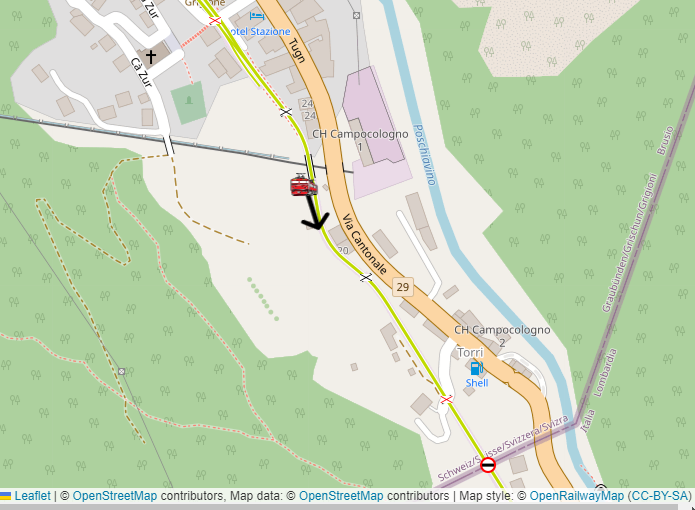

.. _software-platform:

****************************
Open Rails Software Platform
****************************

Architecture
============

To better understand how the Open Rails game operates, performs, and functions, 
the architecture diagram below lays out how the software code is organized. The 
architecture of the Open Rails software allows for modular extension and 
development, while providing standardized methods to customize the simulation 
experience.

.. note:: Please note that this diagram includes many capabilities and 
          functions that are yet to be implemented.

.. image:: images/software-platform.png

Open Rails Game Engine
======================

The Open Rails software is built on the MonoGame platform. 
MonoGame is an open source implementation of the Microsoft XNA 4 Framework and provides:

  - Game framework
  - 2D and 3D rendering
  - Sound effect and music playback
  - Keyboard, mouse, touch, and controller inputs
  - Content building and optimization
  - Math library optimized for games

Frames per Second (FPS) Performance
===================================

FPS rate is as default not linked to the sync rate of the monitor. 
However, with :ref:`this option <options-vsync>` FPS rate may be set at the value of the monitor refresh rate.

Game Clock and Internal Clock
=============================

Like other simulation software, Open Rails software uses two internal 
*clocks*; a game clock and an internal clock. The game clock is required to 
synchronize the movement of trains, signal status, and present the correct 
game environment. The internal clock is used synchronize the software process 
for optimal efficiency and correct display of the game environment.

The Open Rails team is dedicated to ensuring the game clock properly manages 
time in the simulation, so that a train will cover the proper distance in the 
correct time. The development team considers this vital aspect for an 
accurate simulation by ensuring activities run consistently across community 
members' computer systems.

Resource Utilization
====================

Because Open Rails software is designed for the MonoGame framework, 
it natively exploits today's graphics cards' ability to offload much of the 
display rendering workload from the computer's CPU.

Multi-Threaded Coding
=====================

The Open Rails software is designed from the ground up to support up to 4 
CPUs, either as virtual or physical units. Instead of a single thread looping 
and updating all the elements of the simulation, the software uses four 
threads for the main functions of the software.

- Thread 1 -- Main Render Loop (RenderProcess) 
- Thread 2 -- Physics and Animation (UpdaterProcess)
- Thread 3 -- Shape and Texture Loading/Unloading (LoaderProcess) 
- Thread 4 -- Sound

There are other threads used by the multiplayer code as each opened 
communication is handled by a thread.

The RenderProcess runs in the main game thread. During its initialization, it 
starts two subsidiary threads, one of which runs the UpdaterProcess and the 
other the LoaderProcess. It is important that the UpdaterProcess stays a 
frame ahead of RenderProcess, preparing any updates to camera, sky, terrain, 
trains, etc. required before the scene can be properly rendered. If there are 
not sufficient compute resources for the UpdaterProcess to prepare the next 
frame for the RenderProcess, the software reduces the frame rate until it can 
*catch up*.

.. index::
   single: tile

Initial testing indicates that *stutters* are significantly reduced because 
the process (LoaderProcess) associated with loading shapes and textures when 
crossing tile boundaries do not compete with the main rendering loop 
(RenderProcess) for the same CPU cycles. Thread safety issues are handled 
primarily through data partitioning rather than locks or semaphores to 
maximise performance.

Ongoing testing by the Open Rails team and the community will determine what 
and where the practical limits of the software lie. As the development team 
receives feedback from the community, improvements and better optimization of 
the software will contribute to better overall performance -- potentially 
allowing high polygon models with densely populated routes at acceptable 
frame rates.

.. _web-server:

Web Server
==========

.. _sample-web-pages:

The game uses a built-in web-server to deliver standard and custom web-pages
to any browser. This can be running on the same PC as Open Rails or another PC 
or other device which is connected to your local network.

The simplest way to access these samples is to start the game and then launch
a browser on the same PC. Then enter "localhost:2150" into your browser address bar. 
(2150 is the default port number set in :ref:`Menu > Options > General <options-web-server-port>`)

Sample Web Pages
----------------

A number of web-pages are included in the Open Rails installation as examples of 
what can be done with the APIs.

Some of these sample pages repeat data from the in-game panels to provide a more convenient display.
The sample pages can be found in the ``Content\Web`` subfolder of the OR
program folder and the web server defaults to ``Content\Web\index.html``.

If you choose to develop your own pages, please consider sharing them with the Open Rails community.

- The Cab Controls web page shows the controls from the cab and lets you use them to drive the player loco.

- The HUD web page repeats the F5 overlay.
 
.. image:: images/web-page-hud.png

- The Track Monitor page repeats the F4 panel and is also available with a dark background for night-time use.
- The Train Driving page offers a panel which is not yet available in the official version of Open Rails.
- Another page offers both of these and the panels can be dragged around for the best arrangement.
  
.. image:: images/web-page-both.png

- The Time page shows the simulation time as a digital clock and links to 3 versions of an analogue clock.

.. image:: images/web-page-clock.png

- The Map page shows the position and direction of the train in the real world on the OpenRailwayMap https://www.openrailwaymap.org. Different OpenRailwayMap layers are available. Usability depends on the route, position of the train is not always 100% correct.

- | The Switch Panel page shows a html panel with a selection of 40 buttons. Buttons which can be used to issue Open Rails commands, normally entered via the keyboard.
  | This panel is most usefull when used on a touch enabled device, such as a tablet.
  | The address of the panel is "<OR host>:2150/SwitchPanel/index.html", where <OR host> must be replaced with the hostname or IP address of the host where Open Rails is running. 
  | Not all buttons are yet filled. Depends also on the type of locomotive.

- The Train Car Operations page has the same functionality as the :ref:`F9 Train Operations Monitor <train-operations-monitor>`.
  Advantage of having this windows as a web page is that it can be shown outside the Open Rails main window.
  Even on another display like for instance a tablet. It has more or less the same functionality, more details
  to be found :ref:`here <train-operations-monitor>`.

- When running an activity the Activity Events page shows the briefing of the activity and the event messages one by one on this page. 
  If this web page is not open, event messages will pop up in the OR window, which halts the game until the message is dismissed by a mouse click. Use the web page to avoid this intrusive behavior.

.. _web-server-api:

Application Programming Interfaces (APIs)
-----------------------------------------

The web server features a simple API to obtain data from the simulator.
Responses are OR data structures
`serialized <https://www.newtonsoft.com/json/help/html/T_Newtonsoft_Json_JsonConvert.htm>`_
in JSON format.

You can see the JSON data just by browsing. E.g.: for APISample, browse to ``http://localhost:2150/API/APISAMPLE``

.. image:: images/web-page-json.png

Note: The API portion of this address is case-sensitive.

Note: To avoid overloading the simulator, please keep API calls to once or twice a second.

.. list-table::
   :widths: 10 20 35 35
   :header-rows: 1

   * - Method
     - API call
     - Description
     - Response type
   * - | GET
     - | ``/API/HUD/<n>``
     - | Retrieves the information rendered on the ``<F5>`` HUD, row by row,
       | page by page, where ``<n>`` is the HUD page number 0 to 7.
     - | ``Orts.Viewer3D.WebServices .WebServer.ORTSApiController .HudApiArray``
   * - | GET
     - | ``/API/TRAINMONITOR``
       | or ``/API/TRAININFO``
     - | Retrieves information rendered on the Track Monitor, such as speed,
       | acceleration, grade, and upcoming hazards.
     - | ``Orts.Simulation.Physics .Train.TrainInfo``
   * - | GET
     - | ``/API/TIME``
     - | Retrieves the simulation time in seconds since midnight.
     - | ``Orts.Viewer3D. WebServices.WebServer .ORTSApiController System.Double``
   * - | GET
     - | ``/API/MAP``
     - | Retrieves the postion and direction of the train.
       | Next to various Open Rails route data.
     - | ``Orts.Common .LatLonDirection``
   * - | GET
     - | ``/API/CABCONTROLS``
     - | Retrieves an array of the cab controls for the player loco
       | TypeName, MinValue, MaxValue, RangeFraction.
     - | ``Orts.Viewer3D. WebServices.WebServer .ORTSApiController List<ControlValue>``
   * - | POST
     - | ``/API/CABCONTROLS``
     - | Sets value of a cab control for the player loco such as
       | Throttle/Regulator, Train Brake, Direction/Reverser.
     - | ``Orts.Viewer3D .WebServices.WebServer .ORTSApiController void``
   * - | GET
     - | ``/API/APISAMPLE``
     - | A test object that demonstrates the JSON serialization of various
       | data types.
     - | ``Orts.Viewer3D.WebServices .WebServer.ORTSApiController .ApiSampleData``

.. _dds-and-ace:

DDS and ACE Texture Files
=========================

Open Rails prefers DDS over ACE texture files, but is tolerant where these don't match references in other files.

If a texture file is referenced with no extension, then ``.dds`` is added, searched for and loaded.
If not found, then ``.ace`` is added, searched for and loaded.

If a texture file is referenced with either a ``dds`` or ``ace`` extension, then that is searched for and loaded
but, if not found, then the other extension is substituted, searched for and loaded.

