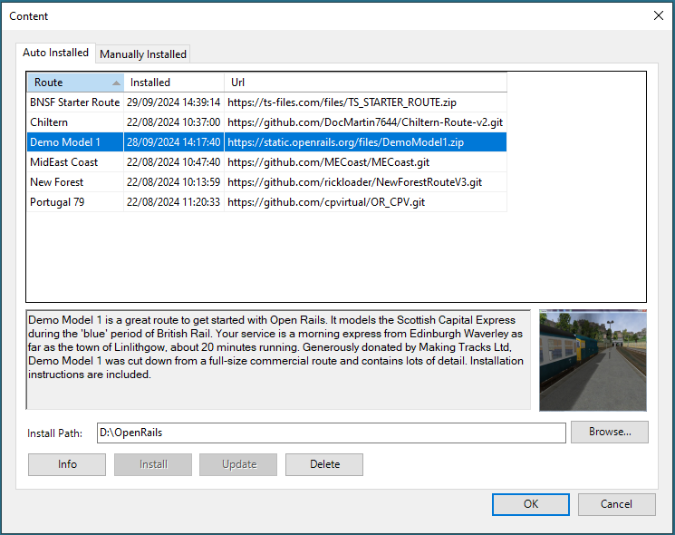
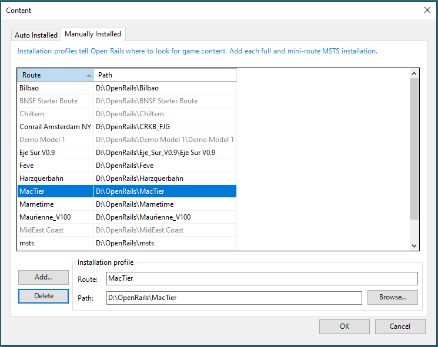
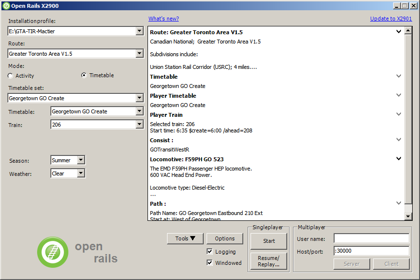
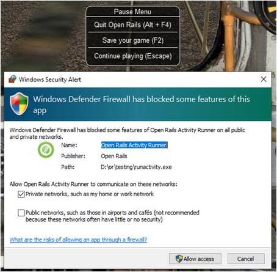

.. _start:

***************
Getting Started
***************

After having successfully installed Open Rails (see the Installation 
Manual), to run the game you must double-click on the Open Rails icon on 
the desktop, or on the OpenRails.exe file.

The OpenRails main window will appear. 
If you have an MSTS installation in place, this will be displayed as your available 
installation profile.

.. _start-picture:

.. image:: images/start-activity.png

If not, then the next ``Content`` form is shown where you can download content. This form is described in the next `Content` chapter.

Content
=======

Clicking on the ``Content`` button makes the ``Content`` form popup with the tab ``Auto Installed`` open:

Select the route to be installed. This list will be enlarged by the OR team when suitable routes become available.
However it is still possible to install routes manually as described in the next chapter.

* ``Install path`` and ``Browse``: Fill in or Browse to the path where the route is to be installed. Each route will be installed in its own subdirectory.
* ``Info``: Gives more information of the selected route. The default web browser will be started with the information page.
* ``Install``: Installs the selected route. A popup mentions the directory where the route is to be installed before starting the actual install. Installation profile gets added also.
* ``Delete``: Delete route with this button. Take care: whole directory including any added and changed files gets deleted.
* ``Update``: GitHub-based routes can get updated after the install by means of this button. A check for updates is made when clicking this button and updates may be reported at the end of the information webpage. Also GitHub has a watch feature which notifies you of changes by email.

Installation Profiles
=====================

Each profile may be a folder containing one or more routes, or an optional MSTS
installation.

In the case where you already have an MSTS installation (see 
paragraph :ref:`Does Open Rails need MSTS to run? <intro-MSTSneeded>` for a precise definition of 
a MSTS installation) OR should already correctly point to that 
installation. To check this, you should initially see under ``Installation 
Profile`` the string ``- Default -``. Under ``Route`` you should see the 
name of one of the MSTS routes in your MSTS installation.

You can easily add, remove or move other content profiles and select 
among them (e.g. if you have any so-called ``mini-routes`` installed.). 

For this select the ``Manually Installed`` tab on the ``Content`` form:

This window allows you to add, remove or modify access to content.
Each profile may be a folder containing one or more routes, or an MSTS
installation. 
Profiles located on other drives, or on a USB key, can be added even if they are
not always available.

Click on the *Add* button, and locate the desired installation. ORTS will
automatically enter a proposed name in the *Route:* window that will
appear in the *Installation set:* window on the main menu form. Modify
the name if desired, then click *OK* to add the new path and name to
Open Rails.

Please do not store content or any files within the folder containing the Open Rails software.
This is because the Updater operates by wiping out the contents of that folder before replacing it
with a new updated version. 
It would be unfriendly for users to lose content that they have stored there, so
attempts to add a profile folder stored there are blocked and lead to an error message. 

To remove an entry (note that this does not remove the installation
itself!) select the entry in the window, and click *Delete*, then *OK*
to close the window. 

To modify an entry, select the route to be changed. Make the necessary changes in the ``Route`` and/or ``Path`` fields.
The *Browse...* button can be used to chnage the Path by browsing. Click *OK*
to close the window and save the changes to OR. 

.. _updating-or:

Updating OR
===========

When a new release of OR is available and your computer is online, a link 
``Update to xnnnn`` appears in the upper right corner. The string ``xnnnn`` is 
the release number of the newest release that matches your selected level 
of update. Various level of updates called Update Channels are available. 
You may choose the desired level in the ``Options-Update`` window, described 
:ref:`below <options-updater-options>`.

When you click on the update link OR will download and install the new 
release. In this way your version of Open Rails is always up to date. 
Note, however, that previously saved games may not be compatible with 
newer versions, as described :ref:`here <driving-saveresume>`.

Clicking the link ``What's new?`` in the upper centre part of the main menu 
window will connect to a website that summarizes the most recent changes 
to the OR program.

Further General Buttons
=======================

Tools
-----

By clicking this button you get access to the ancillary tools (see :ref:`here 
<intro-reality>`).

Documents
---------

This button becomes selectable only if you have at least once updated to a 
testing version or to a stable version greater than 1.0. By clicking this 
button you get immediate access to the OR documentation.

Preliminary Selections
----------------------

Firstly, under ``Route:`` select the route on which you wish to run.

If you check the ``Logging`` checkbox, Open Rails will generate a log file 
named ``OpenRailsLog.txt`` that resides on your desktop. This log file is very 
useful to document and investigate malfunctions.

At every restart of the game (that is, after clicking ``Start`` or ``Server`` 
or ``Client``) the log file is cleared and a new one is generated.

If you wish to fine-tune Open Rails for your system, click on the 
``Options`` button. See the Chapter: :ref:`Open Rails Options <options>` which describes 
the extensive set of OR options. It is recommended that you read this 
chapter.

Gaming Modes
============

One of the plus points of Open Rails is the variety of gaming modes you 
can select.

Activity, Explore and Explore with activity modes
-------------------------------------------------

As a default you will find the radio button ``Activity`` selected in the 
start window, as :ref:`above <start-picture>`.

This will allow you to run an activity or run on of two types of explore mode.

If you select ``- Explore Route -`` (first entry under ``Activity:``), you will 
also have to select the consist, the path, the starting time, the season 
and the weather with the relevant buttons.

If you select ``+ Explore in activity mode +`` (second entry under 
``Activity:``, you will have to select same items as with Explore route, but 
in this case the game will automatically generate an activity (with the 
player train only) and will execute it. By exploring the route in this mode 
you will able to switch to autopilot mode if you like ( see :ref:`here 
<driving-autopilot>` ) and you will have access to some other activity features 
like :ref:`randomized weather <options-actweather-randomization>` if selected.

To select the consist you have two possibilities: either you click under 
``Consist:``, and the whole list of available consists will appear, or you 
first click under ``Locomotive:``, where you can select the desired 
locomotive, and then click under ``Consist:``, where only the consists led 
by that locomotive will appear.

If you instead select a specific activity, you won't have to perform any 
further selections.

Activity Evaluation
'''''''''''''''''''

During the activity session, data about performance is stored and may be viewed as the activity progresses.
At the end of the activity a report file is generated which provides a summary of 
the player's skills as a train driver.

Activity evaluation is described :ref:`here <debriefeval>`.

If you have selected the related Experimental Option, at runtime you can 
switch :ref:`Autopilot mode <driving-autopilot>` on or off, which allows you
to watch OR driving your 
train, as if you were a trainspotter or a visitor in the cab. 
Autopilot mode is not available in Explore mode.

.. _start-timetable:

Timetable Mode
--------------

If you select the radio button ``Timetable``, the main menu window will 
change as follows:

Timetable mode is unique to Open Rails, and is based on a ``timetable`` that 
is created in a spreadsheet formatted in a predefined way, defining trains 
and their timetables, their paths, their consists, some operations to be 
done at the end of the train run, and some train synchronization rules.

Timetable mode significantly reduces development time with respect to 
activities in cases where no specific shunting or train operation is 
foreseen. The complete description of the timetable mode can be found 
:ref:`here. <timetable>`

The spreadsheet has a .csv format, but it must be saved in Unicode format 
with the extension ``.timetable_or`` in a subdirectory named ``Openrails`` 
that must be created in the route's ``ACTIVITIES`` directory. 

A specific tool (Timetable editor) is available under the "Tools" button to ease
generation of timetables.

For the game player, one of the most interesting features of timetable 
mode is that any one of the trains defined in the timetable can be 
selected as the player train.

The drop-down window ``Timetable set:`` allows you to select a timetable 
file from among those found in the route's ``Activities/Openrails/`` folder.

Now you can select in the drop-down window ``Train:`` from all of the trains 
of the timetable the train you desire to run as the Player train. Season 
and weather can also be selected.

Run
---

Now, click on ``Start``, and OR will start loading the data needed for your 
game. When loading completes you will be within the cab of your 
locomotive! You can read further in the chapter :ref:`Driving a Train <driving>`.

Firewall
========

The game uses a built-in web-server to deliver standard and custom  web-pages
to any browser - see :ref:`Web Server <web-server>`.

When the game runs for the first time, the web-server will try to use a
port on your PC to serve any browser that you might want to run. 
The Windows OS will detect this and pop up a prompt to ask permission for this.

We recommend that you grant permission as a private network even if you
don't plan to use a browser straight away.

Multiplayer Mode
----------------

Open Rails also features this exciting game mode: several players, each 
one on a different computer in a local network or through the Internet, 
can play together, each driving a train and seeing the trains of the other 
players, even interacting with them by exchanging wagons, under the 
supervision of a player that acts as dispatcher. The multiplayer mode is 
described in detail :ref:`here. <multiplayer>`

Replay
------

This is not a real gaming mode, but it is nevertheless another way to 
experience OR. After having run a game you can save it and replay it: OR 
will save all the commands that you gave, and will automatically execute 
the  commands during replay: it's like you are seeing a video on how you 
played the game. Replay is described :ref:`later <driving-save-and-replay>`
together with the save and 
resume functions.

