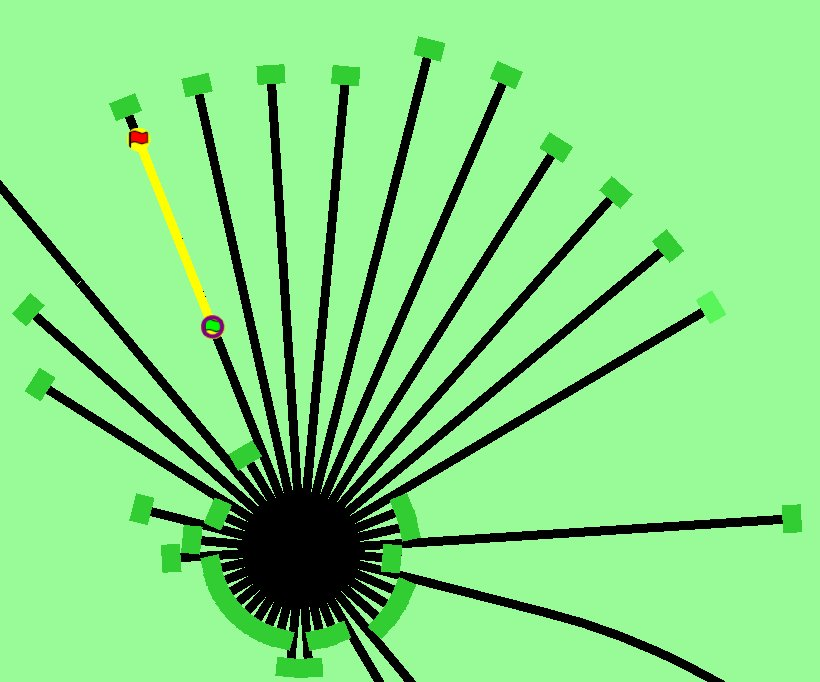
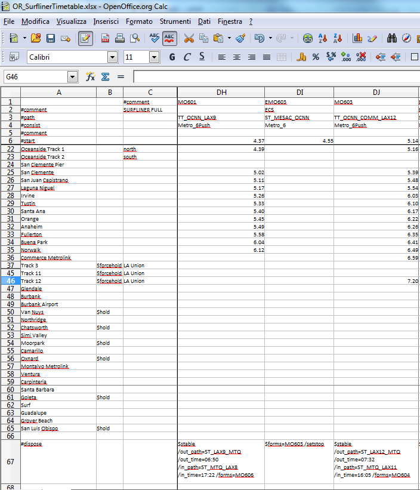

.. _timetable:

**************
Timetable Mode
**************

Introduction
============

The timetable concept is not a replacement for the activity definition, but is 
an alternative way of defining both player and computer-controlled (AI and 
Static) trains.

In an activity, the player train is defined explicitly, and all AI trains are 
defined in a traffic definition. Static trains are defined separately.

In a timetable all trains are defined in a similar way. On starting a timetable 
run, the required player train is selected from the list of available trains. In 
the timetable definition itself, no distinction is made between running trains -- 
any of the running trains can be selected as player train, and if not selected 
as such they will be run as AI trains. Static trains are also defined in the 
same way but cannot be selected as the player train.

As a result, the number of different 'activities' that can be played using the 
same timetable file is equal to the number of trains which are defined in the 
timetable, less static trains.

**Important aspects where the use of specific OR or MSTS items for timetables
differs significantly from its use in an activity are shown in bold**.

The development of the timetable concept is still very much a work in progress. 
As work continues, all items are still subject to change.

General
=======

Data definition
---------------

The timetable data is defined in a Spreadsheet, and saved as a \*.csv file 
(character separated file) in Unicode format. As the separation character, 
either ',' (comma), ';' (semi-colon) or the tab character must be used.

Do not select space as the separation character.

As ';', ',', or tab are possible separation characters, these symbols must not 
be used anywhere within the actual data. Enclosure of text by quotes (either 
single or double) has no effect. Also, the character '#' should not be used in 
train names, since it is the prefix for reserved words in the Timetable.

File structure
--------------

The saved ``*.csv`` files must be renamed with the extension ``*.timetable-or``. 
The timetable files must be placed in a subdirectory named ``OpenRails`` created 
in the route's ``Activities`` directory.

Timetable groups
----------------

Multiple timetables can be loaded simultaneously using timetable group files. 
A group file is a plain text file that has the extension ``.*.timetablelist-or``, 
that is also located in the ``OpenRails`` subdirectory of the route's 
``Activities`` directory, and that contains the filenames of one or more 
timetable files listed on each line. The first line may also start with a ``#`` 
symbol, in which case the text that follows will be used as the timetable 
group's display name in the Open Rails menu.

Here is an example of a timetable group file::

    #All Northeast Corridor Services - Fri Aug 2018
    Amtrak - Fri Aug 2018.timetable-or
    MARC Camden Line - Fri Aug 2018.timetable-or
    MARC Penn Line - Fri Aug 2018.timetable-or
    SEPTA Wilmington-Newark - Fri Aug 2018.timetable-or

Pool files
----------

:ref:`Pools <pool-general>` can be used to store out-of-service trains on a 
first-come, first-serve basis, without the need to manually program paths into 
and out of storage tracks. Pool files are located in the same ``OpenRails`` 
directory as other timetable files. They have the extension ``.pool-or`` or 
``.turntable-or``.

Weather files
-------------

:ref:`Weather files <weather-general>`, a feature exclusive to timetable mode, 
orchestrate changes in the cloud cover, precipitation, and visibility factors 
over the course of the timetable day. They are located in a special 
``WeatherFiles`` subdirectory of the route's folder and they have the 
``*.weather-or`` file extension. The player activates a weather file by 
selecting it from the timetable mode section of the main menu; this overrides 
the static weather condition.

File and train selection
------------------------

When starting a timetable run, the mode *Timetable* is selected in the menu. The 
desired timetable file or timetable group file must then be selected in the 
*Timetable set* display.

After selecting the required timetable, a list of all trains contained in that 
timetable is displayed and the required train can be selected.

Season and weather (static or file-defined) can also be selected; these are not 
preset within the timetable definition.

Timetable Definition
====================

General
-------

A timetable consists of a list of trains, and, per train, the required timing of 
these trains. The timing can be limited to just the start time, or it can 
include intermediate times as well.

At present, intermediate timings are limited to 'platform' locations as created 
using the MSTS Route Editor.

Each column in the spreadsheet contains data for a train and each row represents 
a location. A cell at the intersection of a train and location contains the 
timing data for that particular train at that location.

Special rows and columns can be defined for general information or control 
commands.

The first row for each column contains the train definition.

The first column for each row contains the location definition.

The cell at the intersection of the first row and first column **must be empty**.

This paragraph only lists the main outline, a fuller detailed description will 
follow in the next paragraphs.

Column definitions
------------------

A column is defined by the contents of the first row.

Default, the first row defines the train name.

Special columns can be defined using the following syntax :

    - ``#comment``: column contains comment only and is ignored when reading the 
      timetable.
    - <blank>: column is extension of preceding column.

Row definitions
---------------

A row is defined by the contents of the first column.

Default, the first column defines the stop location.

Special columns can be defined using the following syntax :

    - ``#comment``: row contains comment only and is ignored when reading the 
      timetable
    - <blank>:      row is extension of row above
    - ``#path``:    defines train path
    - ``#consist``: defines train consist
    - ``#start``:   defines time when train is started
    - ``#note``:    defines general notes and starting control commands for this train
    - ``#dispose``: defines how train is handled after it has terminated
    - ``#speed``, ``#speedmph``, or ``#speedkph``: defines train speed behavior 
      in meters per second, miles per hour, or kilometers per hour, respectively; 
      only one kind of speed row can be used in a single timetable file
    - ``#restartdelay``: defines randomized delays for a train
    - ``#briefing``: row contains briefing text for each train and is ignored when reading the timetable

Timing details
--------------

Each cell which is at an intersection of a train column and a location row, can 
contain timing details for that train at that location. :ref:`Timing commands 
<timetable-timing>` can be set at locations where the train stops, but can also 
be set for locations where no timing is inserted as the train passes through 
that location without stopping.

Timetable Data Details
======================

Timetable Description
---------------------

Although ``#comment`` rows and columns are generally ignored, the contents of 
the cell at the intersection of the first ``#comment`` row and first ``#comment`` 
column is used as the timetable description. This appears as the timetable's 
name in the Open Rails menu and is used to reference trains from other 
timetables.

Train Details
-------------

The train name as defined in the first row must be unique for each train in a 
timetable file. This name is also used when referencing this train in a train 
command; see details below.

The sequence of trains is not important.

Location Details
----------------

At present, the possible locations are restricted to 'platforms' as defined in 
the MSTS Route Editor.

Each location must be set to the 'Station Name' as defined in the platform 
definitions.

The name used in the timetable must exactly match the name as used in the route 
definition (\*.tdb file), otherwise the location cannot be found and therefore 
cannot be processed.

Also, each location name must be unique, as otherwise its position in the train 
path could be ambiguous.

The sequence of the locations is not important, as the order in which the 
stations are passed by a train is defined in that train's path. For the same 
reason, a train's path can be set to just run in between some of the locations, 
or be set to bypass certain stations.

Timing Details
--------------

Each cell at an intersection of train and location can contain the timing 
details of that train at that location.

Times are defined as HH:mm, and the 24-hour clock must be used.

If a single time is inserted it is taken as the departure time (except at the 
final location).

If both arrival and departure time are to be defined, these must be separated by 
'-'.

A request stop is set in a timetable by placing a 'x' between hours and minutes, e.g. 13x21, or by just
setting an 'x' in the station departure field.
For a request stop to work properly, details for this stop must be specified using :ref:`the '$req' command <timetable-cmd-request-stop>`.

In a timetable, it is indicated that a :ref:`train is allowed to depart early <timetable-depart-early>` by placing a '*'' between hours and
minutes, e.g. 17*23, or by setting just a '*' in the station departure field.

A :ref:`passing time <timetable-passing-time>` can be defined by placing a 'P' between hours and minutes, e.g. 14P53

Additional :ref:`timing commands <timetable-timing>` can be included. Such 
commands can also be set for locations where the train does not stop and 
therefore has no timing details, but the train must pass through that location 
for the commands to be effective.

Although a location itself can be defined more than once in a timetable, it is 
not possible to define timing details for trains for a location more than once. 
If a train follows a route which takes it through the same location more than 
once, the train must be 'split' into separate train entries.

Special Columns
---------------

- ``#comment`` column. 
  
  A column with the #comment definition in the first row is a comment column and 
  is ignored when reading the timetable, except for the cell at the intersection 
  of the first comment column and the first comment row.

- <Blank> column. 
  
  A column with a blank (empty) cell in the first row is taken as a continuation 
  of the preceding column. It can be used to insert control commands which apply 
  to the details in the preceding column. This can be useful when timings are 
  derived automatically through formulas in the spreadsheet as inserting 
  commands in the timing cell itself would exclude the use of such formulas.

Special Rows
------------

- ``#comment`` row. 
  
  A row with the #comment definition in the first column is a comment row and is 
  ignored when reading the timetable, except for the cell at the intersection of 
  the first comment column and the first comment row.

- <Blank> row. 
  
  A row with a blank (empty) cell in the first column is taken as a continuation 
  of the preceding row.
  
- ``#path`` row. 
  
  The #path row defines the path of that train. The path must be a \*.pat file as 
  defined by the MSTS Activity Editor or by Trackviewer, and must be located
  in the route's Path 
  directory. This field is compulsory.
  
  The timetable uses the same paths as those defined for activities.

  **However, waiting points must not be defined in paths for use in timetables as 
  the processing of waiting points is not supported in the timetable concept. 
  Waiting points within a timetable must be defined using the specific control 
  commands.**
  
  The ``#path`` statement can take a qualifier: ``/binary``.
  
  Large timetables can require many paths, and loading those paths can take 
  considerable time (several minutes). To reduce this loading time, the paths 
  can be stored in files in a processed, binary format. When 
  ``/binary`` is set, the program will check if a binary path file exists. 
  If so, it will read that path. If not, it will read the 'normal' path, and will then 
  store this as a binary path file for future use.

  Note: If a path or the route is edited, then the binary data will be out of date.
  If so, it is deleted and re-created automatically when the user starts the route.
  These files are stored in the same 
  folder as Saves - see :ref:`Folders used by Open Rails <appendices-folders_used>`.

- ``#consist`` row 
  
  The ``#consist`` row defines the consist used for that train. This field is 
  compulsory.
  
  However, if the train is run as an AI train and it is 'formed' out of another 
  train (see below), the consist information is ignored and the train uses the 
  consist of the train out of which it was formed.

  For the player train, the consist is always used even if the train is formed 
  out of another train. The consist definition must be a \*.con file as defined 
  by the MSTS Activity Editor or by the TSRE5 consist editor,
  and must be stored in the defined consist 
  directory.

  Also a more complex syntax of the consist definition is possible, as described 
  below.

  This allows a consist definition to be not just a single string directly 
  referring to a file, but a combination of strings, with the possibility to use 
  (part of) the consist in reverse.

  The general syntax is::

    consist [$reverse] [+ consists [$reverse] [+ ...] ]
  
  Example: a loco-hauled train, using the same set of coaches, running in both 
  directions. Two consists are defined: ``c_loco`` and ``c_wagons``. The consist 
  definitions which can now be used are:
  
    ``c_loco + c_wagons``, and for reverse:
    
    ``c_loco $reverse + c_wagons $reverse``

  Please note that ``$reverse`` always applies only to the sub-consist with 
  which it is defined, not for the complete combined consist.

  If this train sometimes has some additional wagons, e.g. during rush hours, 
  the consists can be defined as follows (with ``c_add`` the definition of the 
  additional wagons):
  
    ``c_loco + c_wagons + c_add``, and for reverse: 
    
    ``c_loco $reverse + c_add $reverse + c_wagons $reverse``

  Clearly, this can save on the definition of the total required consists, and 
  in particular saves the tedious task of having to define 'reverse' consists. 
  When using multiple units, this is even more useful.

  Suppose there are two sets of multiple units, running either as single trains 
  or combined. Normally, six different consists would be required to cover all 
  trains, but now only two will suffice : ``set_a`` and ``set_b``. The various 
  combinations are:

    ``set_a``, reverse ``set_a $reverse``.

    ``set_b``, reverse ``set_b $reverse``.

    ``set_a + set_b``, reverse ``set_b $reverse + set_a $reverse``.

  Consist strings which contain  '+'  or  '$'  can be used in timetables but 
  must be enclosed by <  >. For instance :

  ``<loco+wagon>+<$loco+wagon>$reverse``

- ``#start`` row

  The ``#start`` row defines the time at which the train is started. It must be 
  defined as HH:mm, and the 24 hour clock must be used. This field is compulsory.

  Use of start time for AI trains :
  
    - When a train is formed out of another train and this other train is included to run in the timetable, the time defined in #start is only used to define when the train becomes active.

  Use of start time for player train :
    
    - The time as defined in ``#start`` is normally used as the start time of the 
      timetable 'activity'.

  If a train is formed out of another train and this train is included in the 
  timetable, then if this train is delayed and has not arrived before the 
  defined start time, the starting of this train is also delayed until the train 
  out of which it is formed has arrived. This applies to both AI and player 
  train. This means that the start of the player activity can be delayed.

  The ``#start`` field also accepts a number of :ref:`start commands 
  <timetable-start>`.

  For details on starting and running of trains around midnight see the 
  paragraph :ref:`below <timetable-midnight>`.
  
- ``#note`` row

  The ``#note`` row can be used to define :ref:`note commands <timetable-note>` 
  which are not location related but apply to the full run of the train. It can 
  also be used to set commands for trains which do not stop at or pass through 
  any defined location. This row is optional.
  
- ``#dispose`` row

  The ``#dispose`` row defines what happens to an AI train when it has reached 
  the end of its run, i.e. it has reached the end of the defined path. The 
  information in the ``#dispose`` row can detail if the train is to be formed 
  into another train, and, if so, how and where. For details see the 
  :ref:`dispose commands <timetable-dispose>` as described further down.

  This row is optional and if included, the use per train is also optional. If 
  the row is not included or the field is not set for a particular train, the 
  train is removed from the activity after it has terminated.

  The #dispose row presently does not affect the end of the run for the player 
  train.
  
.. _timetable-train-speed:

- ``#speed`` row

  This optional field defines maximum speed for trains, which may restrict the 
  train to lower speed as would otherwise be allowed. Note that any value 
  defined here will never be applied if it exceeds the maximum speed as set 
  through speedposts or signals, or as set in the consist file.
  
  If specified, only one ``#speed`` (m/s), ``#speedkph``, or ``#speedmph`` row 
  can be present in a single timetable file.
  
  This row also accepts a number of :ref:`speed commands <timetable-cmd-speed>`.
  
- ``#restartdelay`` row

  Delays are applied when restarting a train from a stop, e.g. at a station or 
  a signal. Default random delays are set for each train. The default values may 
  optionally be overruled using :ref:`delay commands <timetable-delay>` in the 
  ``#restartdelay`` field.
  
  The random delay is calculated as 
  :math:`\mbox{fixed part} + Random(\mbox{variable part})`,
  where all values are in seconds.

- ``#briefing`` row

  The ``#briefing`` row is optional and contains text which describes the train
  operation for the user. This text appears in the Open Rails main window along
  with description of the route and the loco.

  The user can also see it in-game in the Briefing tab of the Help Window (F1).

  A similar entry in the ``#comment`` column provides text which describes the entire timetable.

  The timetable-or file does not allow the fields to contain line-breaks
  but if HTML breaks " " are inserted into the ``#briefing`` field, these will be converted to line-breaks.
   

Control Commands
----------------

General
'''''''

Control commands can be set to control train and signaling behaviour and 
actions.

Command Syntax
''''''''''''''

All commands have the same basic syntax. A command consists of:

- Syntax name : defines the control command.
- Syntax value : set the value related to the command. Not all commands take a 
  value.
- Syntax qualifiers : adds additional information to the command. Not all 
  commands have qualifiers. Some qualifiers may be optional but others may be 
  compulsory, or compulsory only in combination with other qualifiers.
- Syntax qualifier values : a qualifier may require a value

Command syntax::

    $name = value /qualifier=value 

Multiple values may be set, separated by '+'. Note that any qualifiers always 
apply to all values.

Train Reference
'''''''''''''''

Many commands require a reference to another train. This reference is the other 
train's name as defined in the first row.

If the target train is in a separate timetable of the same timetable group, the 
reference is in the form of ``train name:timetable description``, where the 
description is the text at the intersection of the first ``#comment`` row and 
``#comment`` column in the other timetable file.

Train Commands
''''''''''''''

Gradient
    To provide a realistic behaviour on gradients, the gradient command has been introduced.

    Syntax    
        ``$gradient /perc=n /speed=s``
        
        The gradient command must be set in the ``#speed`` :ref:`field of a train <timetable-train-speed>`.        

    Functionality    
        When gradient is set, forced acceleration is turned off if the leading engine of the train is on a 
        rising gradient which exceeds n percent.
        However, forced acceleration is turned on if the speed of the train drops below speed s. 
        This is to ensure the train will not stall, and also that the train will restart if it has come to a stop on a 
        gradient, e.g. due to a signal. 
        The dimension of the speed value depends on the definition of the speed field (see manual for details of speed fields).

Station Commands
''''''''''''''''

Station commands apply to all stops for a given station row. They are inserted 
directly after the station name in the first column.

.. _timetable-cmd-hold:

``$hold, $nohold and $forcehold``

    If ``$hold`` is set, it defines that the exit signal for that location must 
    be held at danger up to 2 minutes before train departure.

    An exit signal is allocated to a platform if this signal is beyond the end platform marker (in the direction of travel), but is still within the same track node - so there must not be any points etc. between the platform marker and the signal.

    **By default, the signal will not be held.**

    ``$forcehold`` will set the first signal beyond the platform as the 'hold' signal, even if this signal is not allocated to the platform as exit signal. This can be useful at locations with complex layout where signals are not directly at the platform ends, but not holding the signals could lead to delay to other trains.

.. _timetable-cmd-forcewait:

``$forcewait``

    Force the train to wait if the next signal is at danger even if this signal 
    is not recognized as the exit signal for that platform.

.. _timetable-cmd-nowaitsignal:

``$nowaitsignal``

    Normally, if a train is stopped at a station and the next signal ahead is 
    still at danger, the train will not depart. But, there are situations where 
    this should be overruled.

    Some stations are 'free line' stations - that is, they are not controlled by 
    signals (usually small halts, without any switches). The next signal 
    probably is a 'normal' block signal and may be some distance from the 
    station. In that situation, the train does not have to wait for that signal 
    to clear in order to depart.

    Other situation are for freight trains, light engines and empty stock, which 
    also usually do not wait for the signal to clear but draw up to the signal 
    so as to take as little as time as possible to exit the station.

``$terminal``

    The ``$terminal`` command changes the calculation of the stop position, and 
    makes the train stop at the terminating end of the platform. Whether the 
    platform is really a terminating platform, and at which end it terminates, 
    is determined by a check of the train's path.

    If the platform is in the first section of a train's path, or there are no 
    junctions in the path leading up to the section which holds the platform, it 
    is assumed the train starts at a terminal platform and the end of the train 
    is placed close to the start of the platform.

    If the platform is in the last section if the path or there are no junctions 
    beyond the section which holds the platform, it is assumed the platform is 
    at the end of the train's path and the train will run up to near the end of 
    the platform in its direction of travel.

    If neither condition is met, it is assumed it is not a terminal platform 
    after all, and the normal stop position is calculated.

    The ``$terminal`` option can be set for a station, or for individual trains. 
    If set for a station it cannot be overruled by a train.

    However, because of the logic as described above, if set for a station which 
    has both terminal platforms as well as through platforms, trains with paths 
    continuing through those platforms will have the normal stop positions.

``$closeupsignal``

    Sets a reduced clearance on approach to signal to maximize use of available 
    platform length.

``$extendplatformtosignal``

    Sometimes the platform marker is placed some distance from the actual end of 
    the platform where the signal is located, e.g. in case of switches along the 
    platform. Normally this would cause trains to stop far from the end of the 
    platform and then block the switches to the rear. This parameter will place 
    the ‘end of platform’ position not at the position of the platform marker 
    but just ahead of the signal position.

``$restrictplatformtosignal``

    Sometimes the platform marker is placed beyond the exit signal for that 
    platform. If the signal is at danger, the train will stop at the signal and 
    if this is a long train, this stop will not be seen as the station stop as 
    the train has not reached the required platform stop position. This 
    parameter will place the ‘end of platform’ position not at the position of 
    the platform marker but just ahead of the signal position.

``$stoptime``

    Syntax : ``$stoptime=n`` (n is time in seconds)
    
    Sets the required default stop time at this platform, overriding the 
    stoptime definition set in the track database.

``$closeup``

    The train will stop close to another train already in the platform. Can only 
    be used if the ``$callon`` timing command is also set for that train.

``$keepclear``

    Defines that the stop position must be such that the length of platform as 
    indicated in the command must be kept clear ahead of or behind the train. 
    This may be essential if another train is to be attached or if another train 
    is to be taken into the same platform.
    
    Parameters :
    
        ``rear = <n>`` (n in meter)
        
            The stop location must be such that he minimal distance behind the 
            train is n meter. If the platform has an exit signal, the train will 
            stop in front of the signal even if this means that less than n 
            meter is clear, unless the ``/force`` parameter is set as well. In 
            this situation, the path of the train must continue beyond the exit 
            signal.
            
            Note that the train will never proceed beyond the end of its path.
            
        ``front = <n>`` (n in meter)
        
            The stop location must be such that the minimal platform length 
            available ahead of the train is not less than n meter. If the rear 
            of the train would be outside the platform, the location is 
            calculated such that the rear of the train is at the platform end 
            even if this means that less than n meter is clear, except when the  
            ``/force`` parameter is set as well.
            
        ``force``
        
            Forces front or rear section to be kept clear even if train must 
            pass exit signal (for ``rear`` parameter), or rear of train does not 
            fit into platform (for ``front`` parameter).

``$endstop``

    When the path of the train continues beyond the station position (e.g. when 
    setting ``$keepclear /rear /force``), the stop is considered to be the end 
    of the path even if the train has not reached the actual final position.

.. _timetable-timing:

Timing Commands
'''''''''''''''

These commands can be set for each timing cell, i.e. at each intersection of 
train column and location row, or in the ``#note`` row. The commands will apply 
at and from the location onward (if applicable).

For instance, a ``$wait`` command can be set for a station without a stop. The 
actual wait location can be that station itself, but it could also be a loop or 
junction somewhere beyond that station.

``$wait``

    Syntax : ``$wait=<train> /maxdelay=n /notstarted /atstart /owndelay=n``

    Defines that a train is to wait for the referenced train to allow this train 
    to proceed first. The referenced train can be routed in the same or the 
    opposite direction as this train itself. A search is done for the first 
    track section which is common to both trains, starting at the location where 
    the ``$wait`` is defined, or at the start of the path if defined in the 
    ``#note`` row.

    If the start location is already common for both trains, then first a search 
    is done for the first section which is not common to both trains, and the 
    wait is applied to the next first common section beyond that.

    If the wait is set, the section will not be cleared for this train until the 
    referenced train has passed this section. This will force the train to wait. 
    The referenced train must exist for the wait to be valid.

    However, if /notstarted is set, the wait will also be set even if the 
    referenced train has not yet been started. This can be used where the wait 
    position is very close to the start position of the referenced train, and 
    there is a risk that the train may clear the section before the referenced 
    train is started.

    Care should be taken when defining a $wait at a location where the train is 
    to reverse. As the search is performed for the active subpath only, a $wait 
    defined at a location where the train is to reverse will not be effective as 
    the common section will be in the next subpath after the reversal. In such a 
    situation, the train should be 'split' into two separate definitions, one up 
    to the reversal location and another starting at that location.

    Command value : referenced train, this is compulsory.

    Command qualifiers :

        ``/maxdelay=n``: n is the maximum delay (in minutes) of the referenced train for which the wait is still valid.

            This delay is compensated for any delay of the train which is to 
            wait, e.g. if maxdelay is 5 minutes, the referenced train has a 
            delay of 8 minutes but this train itself has a delay of 4 minutes, 
            the compensated delay is 4 minutes and so the wait is still valid.

            This parameter is optional, if not set a maxdelay of 0 minutes is 
            set as default.

        ``/notstarted``: the wait will also be applied if the referenced train has not yet started.
        
        ``/atstart``: the wait is activated at the present position rather than the first non-common 
        position.
        
            May be used where a train in opposite direction is to terminate in the same location as 
            this train is started and there may not be any possible passing locations between this 
            starting position and the present position of the other train.

        ``/owndelay=n`` (n is delay in minutes); the owndelay qualifier command makes the command valid only if the train in question is delayed by at least the total minutes as set for the owndelay qualifier.

            This can be used to hold a late-running train such that is does not 
            cause additional delays to other trains, in particular on single 
            track sections.
        
        ``/trigger=HH:MM``
        
            Experimental option: Restricts this command to trigger only after 
            the specified time.
        
        ``/endtrigger=HH:MM``
        
            Experimental option: Restricts this command to trigger only before 
            the specified time.

``$follow``

    Syntax : ``$follow=<train> /maxdelay=n /notstarted /owndelay=n``

    This command is very similar to the $wait command, but in this case it is 
    applied to each common section of both trains beyond a part of the route 
    which was not common. The train is controlled such that at each section 
    where the paths of the trains re-join after a section which was not common, 
    the train will only proceed if the referenced train has passed that 
    position. The command therefore works as a $wait which is repeated for each 
    such section.

    The command can only be set for trains routed in the same direction. When a 
    wait location is found and the train is due to be held, a special check is 
    performed to ensure the rear of the train is not in the path of the 
    referenced train or, if it is, the referenced train has already cleared that 
    position. Otherwise, a deadlock would result, with the referenced train not 
    being able to pass the train which is waiting for it.

    Command value: referenced train, this is compulsory.

    Command qualifiers:
    
        ``/maxdelay=n``: n is the maximum delay (in minutes) of the referenced train for which the wait is still valid. This delay is compensated by any delay of the train which is to wait, e.g. if maxdelay is 5 minutes, the referenced train has a delay of 8 minutes but this train itself has a delay of 4 minutes, the compensated delay is 4 minutes and thus the wait is still valid.

            This parameter is optional, if not set a maxdelay of 0 minutes is 
            set as default.

        ``/notstarted``: the follow will also be applied if the referenced train has not yet started.
        
        ``/owndelay=n`` (n is delay in minutes): the owndelay qualifier  command makes the command valid only if the train in question is delayed by at least the total minutes as set for the owndelay qualifier.

            This can be used to hold a late-running train such that is does not 
            cause additional delays to other trains, in particular on single 
            track sections.
        
        ``/trigger=HH:MM``
        
            Experimental option: Restricts this command to trigger only after 
            the specified time.
        
        ``/endtrigger=HH:MM``
        
            Experimental option: Restricts this command to trigger only before 
            the specified time.

``$connect``

    Syntax : ``$connect=<train> /maxdelay=n /hold=h``
    
    Defines that a train is to wait at a station until another train has 
    arrived, so as to let passengers make the connection between the trains.

    The train will be timetabled to allow this connection, and the ``$connect`` 
    command is set to maintain this connection if the arriving train is running 
    late.

    Note that the ``$connect`` command will not lock the signal. If the paths of 
    this train and the arriving train conflict before the arriving train reaches 
    the station, additional ``$wait`` or ``$hold`` commands must be set to avoid 
    deadlock.

    Command value: reference to train which is to be waited for, this is 
    compulsory.

    Command qualifiers :

        ``/maxdelay=n`` : n is the maximum delay (in minutes) of the arriving train for which this train is held.

            If the delay of the arriving train exceeds this value the train will 
            not wait. The maximum delay is independent from this train's own 
            delay.

            This qualifier and its  value are compulsory.

        ``/hold=n`` : n is the time (in minutes) the train is still held after the other train has arrived, and relates to the time required by the passengers to make the connection.

            This qualifier and its value are compulsory.

``$waitany``

    Syntax : ``$waitany=<path> /both /opposite``

    This command will set a wait for any train which is on the path section as 
    defined.

    If the qualifier /both is set, the wait will be applied for any train 
    regardless of its direction, otherwise the wait is set only for trains 
    heading in the same direction as the definition of the path.

    The path defined in the waitany command must have a common section with the 
    path of the train itself, otherwise no waiting position can be found.

    This command can be set to control trains to wait beyond the normal signal 
    or deadlock rules. For instance, it can be used to perform a check for a 
    train which is to leave a siding or yard, checking the line the train is to 
    join for any trains approaching on that line, for a distance further back 
    than signalling would normally clear, so as to ensure it does not get into 
    the path of any train approaching on that line.

    With the /both qualifier set, it can be used at the terminating end of 
    single track lines to ensure a train does not enter that section beyond the 
    last passing loop if there is another train already in that section as this 
    could lead to irrecoverable deadlocks.
    
    With the /opposite qualifier set, the command searches only for trains in 
    the opposite direction of the defined path.

``$callon``

    This will allow a train to 'call on' into a platform occupied by another 
    train.

    For full details, see the :ref:`discussion above <timetable-callon>` on 
    the relationship between signalling and timetable.

``$hold, $nohold and $forcehold``

    These commands are functionally identical to (and take precedence over) 
    their respective station :ref:`commands <timetable-cmd-hold>`, but apply 
    only to the current train.

``$forcewait``

    Identical to the station :ref:`command <timetable-cmd-forcewait>`, but 
    applies only to the current train.

``$nowaitsignal``

    Identical to the station :ref:`command <timetable-cmd-nowaitsignal>`, but 
    applies only to the current train.

``$waitsignal``

    Can be used to override and negate a ``$nowaitsignal`` station 
    :ref:`command <timetable-cmd-nowaitsignal>` for the current train.

``$noclaim``

    Experimental option: The ``$noclaim`` command inhibits the train from 
    claiming track circuit sections if the train is held at a signal. A train 
    with the $noclaim command would always be last in the queue at busy 
    junctions, always giving priority to any other train.

.. _timetable-cmd-detach:

``$detach``

    Syntax : ``$detach <detach parameters> <forms parameters>``
    
    Set details for train to detach a portion of that train.
    
    Parameters to define the portion to be detached :
    
        ``/power``
        
            Will detach the power unit. The system will check for power unit at 
            front or rear, if both are found, front will prevail. If there is no 
            power unit at either end, nothing is detached.
        
        ``/leadingpower``
        
            Will detach the front power unit only. If there is no power unit at 
            the front, nothing is detached.
        
        ``/allleadingpower``
        
            Will detach all power units at the front of the train. If there are 
            no power units at the front, nothing is detached.
        
        ``/trailingpower``
        
            Will detach the power unit which is the rearmost unit on the train. 
            If the rear unit is not a power unit, nothing is detached.
        
        ``/alltrailingpower``
        
            Will detach all power units from the rear of the train. If there are 
            no power units at the rear of the train, nothing is detached.
        
        ``/nonpower``
        
            All units which are not power units will be detached from the train. 
            The system will determine at which end of the train power units are 
            located, and will then detach all non power units from the other end 
            of the train.
            
            If neither end has power units, units will be detached from the rear. 
            If both ends are power units, nothing is detached.
        
        ``/units=n`` (n may be <0 or >0 but n=0 is not allowed)
        
            Number of units to be detached.
            
            If n>0, the units will be detached at the front of the train. If n<0, 
            the units will be detached at the rear of the train. If n exceeds the 
            actual length of the train, n is reduced such that one unit remains 
            on the train.
        
        ``/consist=<consist>[+<consist>[+...]]``
        
            Name of consist(s) to be detached. For use of consist names in detach 
            command, see :ref:`note on consist names <timetable-shunting>` below.
            
            The consist to be detached must be at either end of the train, i.e. 
            it must be the front portion or the rear portion of the train.
            
            If a list of consists is defined, it must be in the sequence of the 
            consists to be detached, from the outside looking inward, i.e. if the 
            units are to be detached at the front, the first consist in the list 
            must be the front portion, but if the units are to be detached at the 
            rear the first consist in the list must be the rear portion.
            
            If neither front nor rear portion matches the consist or first 
            consist as defined, nothing is detached.
    
    Parameters for formed train :
    
        ``/forms=<train>``
        
            Detached portion will form train as indicated.
        
        ``/static``
        
            Detached portion will form a static consist.

.. _timetable-cmd-attach:

``$attach``

    Syntax : ``$attach=<train>``

    This train will attach to train as indicated, and will therefore cease to 
    exist.
    
    If used at station stop, there is no use to define anything beyond this stop, 
    and nothing can be defined in the ``#dispose`` field either.
    
    If the other train to which this train must attach is not at the location 
    where the attach is to take place, this train will terminate without the 
    attach taking place. It is therefore advisable to use a ``$wait`` command to 
    ensure the other train is in the location as required.
    
    If the ``/firstin`` or ``/setback`` parameter is set, it should be the other 
    way round, in that case a ``$wait`` command should be set for the other train 
    to ensure this train is indeed first in.
    
    Parameters (only valid at station stop) :
    
        ``/firstin``
        
            This train is in first, and will wait for arrival of the second train 
            to perform the attach. The other train may come in ahead of this 
            train through a switch or from the opposite direction.
        
        ``/setback``
        
            This train is in first, and will wait for the other train to come in 
            behind. When the other train has arrived, this train will set back 
            to perform the attach.
            
            This should not be used if an engine is to be detached from the 
            other train as this train will not wait for the engine to clear 
            before performing the attach.

.. _timetable-cmd-pickup:

``$pickup``

    Syntax : ``$pickup=<train> /static``
    
    This train will pick up the train as defined in the command, or will pick up 
    the static consist which is on the location where the pickup is defined.
    
    The train which is picked up will cease to exist. The full train is picked  
    up, no changes are made to the consists of either trains (except if combined 
    with $triggers command in #dispose field).
    
    If there is no train to pick up at the required location, the train will 
    continue as defined.

.. _timetable-cmd-transfer:

``$transfer``

    Syntax : ``$transfer=<train> /static <transfer parameters>``
    
    This train (the "active" train) will transfer units with the train as 
    indicated, or with a static consist placed at the location where the 
    transfer is defined (the "passive" train).
    
    With a transfer, units will be transferred from one train to another, but 
    both trains will continue to exist. At least one power unit must remain on 
    the "active" train, this power unit must not be part of the portion to be 
    transferred. The "passive" train need not have power units, or all power 
    units may be detached as part of the transfer.
    
    Parameters defining the type of transfer :
    
        ``/give``
        
            This train is to give the defined units to the other train, that is 
            units as defined for the "active" train will be moved to the 
            "passive" train.
        
        ``/take``
        
            This train is to take the defined units from the other train, that 
            is units as defined for the "passive" train will be moved to the 
            "active" train.
        
        ``/keep``
        
            All units except the units as defined for the "active" train will be 
            transferred to the "passive" train.
        
        ``/leave``
        
            All units except the units as defined for the "passive" train will 
            be transferred to the "active" train.
    
    Parameters defining the units to transfer or to keep on the train :
    
        ``/onepower`` : One power unit only.
        
        ``/allpower`` : All power units.
        
        ``/nonpower`` : All units which are not power units.
        
        ``/units=<n>``
        
            If the portion is defined for the "active" train, and <n> exceeds 
            the length of that train, the number is reduced such that one unit 
            will remain on the train.
        
        ``/consist=<consist>[+consist[+...]]``
        
            Consists names of portions to keep or to transfer. The consist names 
            must be in sequence, and the first (or only) consist name must match 
            the portion at the applicable end of the train.

.. _timetable-cmd-activate:

``$activate``

    Syntax : ``$activate=<train>``
    
    Will activate the train as indicated, either when the train starts, when the 
    train is at the indicated stop or when it is terminated.

.. _timetable-cmd-request-stop:

``$req`` 

    A request stop is set in a timetable by placing an 'x' between hours and minutes, e.g. 13x21, or by just
    setting an 'x' in the station departure field.
    For a request stop to work properly, details for this stop must be specified using the ``$req`` command.
    This command can be set as command for the station, or as command for each individual train. If set
    for both station and train, the setting for the train will overrule the setting for the station for that
    particular train.
    Also, a special signal is required to set further required details, and also to visualize the requirement
    to stop to pick up passengers for the player train.

    Definition for ``$req`` command : $req /pu=n /pd=n [/laststop | /approach] [/message | /sound]

    Details
        ``/pu=n`` : probability that stop is required to pick up passengers, n is percentage, 0 <= n <= 99.

        ``/pd=n`` : probability that stop is required to set down passengers, n is percentage, 0 <= n <= 99.

        ``/laststop`` : message is displayed at last fixed stop, indicating if stop at request stop is required
        to set down passengers. Note that message is always displayed, indicating that stop is required, or not.

        ``/approach`` : message is displayed, or sound is played, at preset fixed distance from stop if
        request stop is required to set down passengers. Note that no indication if given if stop is not required.

        ``/message`` : message is displayed on approach if stop is required. Only valid if ``/approach`` is set.

        ``/sound`` : sound is played on approach if stop is required. Only valid if ``/approach`` is set.

    Definition for special signal
        Signals must be placed next to the platform. This signal may be any type of signal except NORMAL.
        At least one signal is required for each direction.

        A special function must be used for this signal in the related script : TRAIN_HAS_REQUEST_STOP()

        This function will return 'true' if approaching train is to stop at the request stop in order to set down
        passengers, otherwise it returns 'false'.
        Using this function, the state of the signal can be set as required. The signal can be visualized as an
        actual signal, but also, for instance, a passenger figure can be animated to be visual on the plaƞorm
        if the train is to stop, and otherwise not be visual.

        Apart from this function, the signal must set two variables :

            ``ORTSReqStopVisDistance`` : distance from station at which AI train is assumed to be able to
            'see' if stop is required to pick up passengers.

            ``ORTSReqStopAnnDistance`` : distance from station at which message is displayed or sound is
            played if ``/approach`` is set in ``$req`` command. 

        Functionality
            Based on the values of ``/pu`` and ``/pd``, it is determined if a request stop is required, either to set down
            or to pick up passengers.

            If the train is stopped and a departure time is set, the train will depart at the defined departure time
            or after the defined station dwell time has passed, whichever is the latest time.

            If the train is stopped and no departure time is set, the train will depart after the station dwell time
            has passed.

            Note that if a stop is not required, the train may pass through the station without stopping even if it
            passes before the defined departure time.

            Player train
                Set down
                    If ``/laststop`` is set, a message is shown at the moment of departure from the last fixed stop before
                    one or more request stops, which indicate, per stop, if the stop is required to set down passengers.
                    Note that the message is always shown.

                    If ``/approach`` is set, a message is shown or a sound is played when the train has reached the distance
                    from the request stop as defined in the signal definition using the ``ORTSReqStopAnnDistance``
                    variable. Note that in this situation, the message is displayed or the sound is played only if the
                    request stop is required.

                Pick Up
                    If a stop is required to pick up, this is visualized by the state of the special signal. It is up to the player
                    to approach the station at such a speed that a proper stop can be made in time if required. There is
                    no other indication of the state of this signal than the visualization, the state is not shown if the Track
                    Monitor window or otherwise.

                    Display in Next Station Window
                    A request stop will be shown in the next station window with an 'x' displayed in the arrival and
                    departure times. When the stop was required, normal arrival and departure times are shown for
                    previous stop. If the stop was not required and the train passed through the station, then when the
                    train has indeed cleared the station, that station is shown as previous stop but no arrival time is
                    shown, and the departure time is set to 'skipped'.

                Spoiler
                    A 'spoiler' indication which shows if the stop is required to set down or pick up, can be shown if the
                    Next Station Window is displayed (normally using key F10), by pressing keys ALT+F10.

                    When ALT+F10 is pressed, and the next station is a request stop, a line is displayed at the boƩom of
                    the window showing if stop is required or not.

                    NOTE : this spoiler function is not yet available and will be included later.

                Sound
                    When a sound is to be played on approach, as defined in the ``$req`` command, the definition for this
                    sound must be included in the .sms sound file for the cab for the locomotive on the player train.

                    The trigger for this sound is trigger 270.

            AI Train
                An AI train will approach the station as any normal station. When the stop is required, the train will 
                stop as normal. When no stop is required at all, the train will cease to slow down for the approach
                when it has reached the distance from the station as defined in the signal variable
                ``ORTSReqStopVisDistance``, and will then start to accelerate again to regain to normal speed.

.. _timetable-depart-early: 

    Allow Depart Early
        In a timetable, it is indicated that a train is allowed to depart early by placing a '*' between hours and
        minutes, e.g. 17*23, or by setting just a '*' in the station departure field.

    Functionality
        Player Train
            When a player train is allowed to depart early, the normal departure indication is given as soon as
            the train has been stopped at the station for the normal required stop time as set for that station,
            and the route ahead is clear.

        Display in Next Station Window
            When “allow depart early” has been set for a station, a '*' is shown in the departure time. When the
            train has departed, the '*' is also shown in the departure time for previous station stop.

        AI Train
            When an AI train is allowed to depart early, the train will depart as soon as the train has been
            stopped at the station for the normal required stop time as set for that station, and the route ahead
            is clear.

.. _timetable-passing-time:

Passing Time
    Passing time can be defined by placing a 'P' between hours and minutes, e.g. 14P53.

    Functionality
        Player Train
            When a passing time is set, the station will be shown in the NextStationWindow as a normal stop,
            but showing a departure time only. When the station is passed, the actual passing time is also shown
            as normal, but also a departure time only.

        AI Train
            There is no processing of passing time for AI trains. 

.. _timetable-start:

Start Commands
''''''''''''''

``$create``

    Syntax : ``$create[=<time>] [/ahead=<train>]``

    The ``$create`` command will create that train at the time as indicated. If 
    no time is set, the train will be created before the start of the first 
    train. The train will be 'static' until the time as set as start time. The 
    normal rules for train placement still apply, so a train cannot be placed 
    onto a section of track already occupied by another train.

    However, storage sidings often hold multiple trains. To allow for this, and 
    to ensure the trains are stored in proper order (first one out up front), the 
    parameter ``[/ahead=<train>]`` must be used.

    The train will now be placed ahead of the referenced train, in the direction 
    of the train's path. Multiple trains can be stored on a single siding, but 
    care must be taken to set the proper references. The reference must always be 
    to the previous train - two trains cannot reference the same train in the 
    ``/ahead`` parameter as that would cause conflict.

    If the total length of all trains exceeds the length of the sidings, the 
    trains will 'spill out' onto whatever lies beyond.

    Note that a train referenced in an ``/ahead`` parameter must be created 
    before or at the same time as the train which uses that reference.

``$pool``

    Syntax : ``$pool=<poolname> [/direction=forward|backward]``
    
    Train originates from the defined pool.
    
    For trains starting from a pool, the path must start at or near the end of 
    one of the access paths as defined for that pool. If the path starts earlier 
    than the last track section defined for the access path, it must not deviate 
    from that path.
    
    For turntable pools, the direction in which the train exits from the 
    turntable can be set using the direction qualifier. If not set, the train 
    will reverse.

.. _timetable-cmd-next:

``$next``

    Start time is after 00:00 at the end of the timetable. May be used to start 
    train running after midnight.

``$static``

    Syntax : ``$static [/pool=<pool>] [/ahead=<train>]``

    This train will spawn as a static train.
    
    ``/pool=<pool>``
    
        Train is created in referenced pool. For a pool to have trains, these 
        must be defined using this command.
        
        The path must be a storage path as defined for that pool. Note that the 
        train may be placed on one of the other storage paths as defined for 
        that pool, this is defined through the pool logic.
        
        If more trains are created in a pool than the pool can hold, a warning 
        is issued.
    
    ``/ahead=<train>``
    
        As above for the ``$create`` command.

``$activated``

    The train is activated through the ``$activate`` command from another train. 
    The ``$activate`` command may be sent before or after the defined start time 
    of this train.
    
    A train can be activated by only one other train.

.. _timetable-note:

Note Commands
'''''''''''''

The note row defines commands applicable to when the train is started. In 
addition to the exclusive ``#note`` commands listed below, this row also accepts 
all :ref:`timing commands <timetable-timing>`.

The program uses average acceleration and deceleration values for all trains 
(different values for freight, passenger and high speed trains). But these 
values are not always adequate, especially for modern trains. This can lead to 
delays when trying to run to a real life timetable.

Using the ``$acc`` and ``$dec`` commands, the values used can be modified. 
Note that these commands do not define an actual value, but define a factor; 
the default value will be multiplied by this factor. However, setting a higher 
value for acceleration and deceleration does not mean that the trains will 
always accelerate and decelerate faster according to the set value. **Most of 
the time, the train behaviour is controlled through the physics.** But 
especially the ``$dec`` factor does have an important side effect. The 
deceleration value is also used to calculate the expected required braking 
distance. Setting a higher deceleration will reduce the required braking 
distance, allowing the train to continue to run at maximum allowed speed for 
longer distances. This can have a significant effect on the timing. Take care, 
though, not to set the value too high - the calculated braking distance must 
of course be sufficient to allow for proper braking, otherwise the train 
cannot stop in time resulting in SPADs etc.

A typical value for modern stock for the ``$dec`` command is 2 or 3.

``$acc``

    Syntax : ``$acc=<value>``
    
    Sets the required acceleration for this train. <value> is a multiplier for 
    the default acceleration.

``$dec``

    Syntax : ``$dec=<value>``
    
    Sets the required deceleration for this train. <value> is a multiplier for 
    the default deceleration.

``$doo``

    Defines the train as "Driver Only Operated". If set, there will be no 
    departure sound (whistle, bell or whatever) on departure from a station.

``$forcereversal``

    Normally, when a reversal is made and there is a signal in the train’s path 
    as leading from the reversal point, the actual reversal position is placed 
    such that the train will be fully passed that signal before reversing, and 
    the reverse move is therefor controlled by that signal.
    
    Setting ``$forcereversal`` will allow the train to reverse as soon at it is 
    clear of the reverse position. This is useful when shunting in yards when 
    there is no need to fully exit the yard to reverse and the entry signal.

.. _timetable-cmd-speed:

Speed Commands
''''''''''''''

``$max``

    Syntax : ``$max=<value>``
    
    Overall maximum speed for this train.

``$cruise``

    Syntax : ``$cruise=<value>``
    
    Maximum speed at which train will normally operate when it is running on 
    time.
    
    When the actual delay exceeds the defined maximum delay (as set in 
    ``$maxdelay``), the train will accelerate to maximum speed.

``$maxdelay``

    Syntax : ``$maxdelay=<m>``

    Maximum delay (in minutes) for cruise control. When this delay is exceeded, 
    the train will accelerate to maximum speed.

``$creep``

    Syntax : ``$creep=<value>``

    Creep speed is the minimum speed on the final approach to a signal at danger 
    or station stop location.

``$attach``

    Syntax : ``$attach=<value>``
    
    Speed at which the train will attach to another train.

``$detach``

    Syntax : ``$detach=<value>``
    
    Speed at which the train will detach from another train.

``$movingtable``

    Syntax : ``$movingtable=<value>``
    
    Speed at which the train will navigate turntables.

.. _timetable-delay:

Delay Commands
''''''''''''''

All delay commands, except for the ``$reverse`` 
:ref:`command <timetable-cmd-reverse>`, are in the form of 
``$command [/fix=<f>] [/var=<v>]``, where <f> represents the fixed component of 
the time delay and <v> represents the variable component of the time delay, both 
in seconds.

``$new``

    Set the train's delay after spawning into the simulator.
    
    The fixed delay defaults to 0 seconds, while the variable delay defaults to 
    10 seconds.

``$path``

    Set the train's delay after stopping for an obstacle along its path, such as 
    a stop signal or a reversed switch.
    
    The fixed delay defaults to 1 second, while the variable delay defaults to 
    10 seconds.

``$station``

    Set the train's delay after making a station stop.
    
    The fixed delay defaults to 0 seconds, while the variable delay defaults to
    15 seconds.

``$follow``

    Set the train's delay when following another train.
    
    The fixed delay defaults to 15 seconds, while the variable delay defaults to
    10 seconds.

``$attach``

    Set the train's delay after attaching to another train.
    
    The fixed delay defaults to 30 seconds, while the variable delay defaults to
    30 seconds.

``$detach``

    Set the train's delay after detaching one of its portions.
    
    The fixed delay defaults to 5 seconds, while the variable delay defaults to
    20 seconds.

``$movingtable``

    Set the train's delay after using a turntable.
    
    The fixed delay defaults to 1 second, while the variable delay defaults to
    10 seconds.

.. _timetable-cmd-reverse:

``$reverse``

    Syntax : ``$reverse /additional=<value>``

    When reversing, an additional delay is added to reflect the time required 
    for the driver to walk through or along the train to the other end. This 
    delay defaults to 0.5 seconds per meter of train, a value that can be 
    overridden with this command.
    
    For trains which are pushed on reversal, e.g. for shunt moves of freight 
    trains, it is advisable to set the reversing delay to 0.

.. _timetable-dispose:

Dispose Commands
''''''''''''''''

Dispose commands can be set in the ``#dispose`` row to define what is to be done 
with the train after it has terminated. See special notes below on the behaviour 
of the player train when it is formed out of another train by a dispose command, 
or when the player train itself has a dispose command.

``$forms``

    Syntax : ``$forms=<train> <qualifiers>``

    ``$forms`` defines which new train is to be formed out of this train when 
    the train terminates. The consist of the new train is formed out of the 
    consist of the terminating train and any consist definition for the new 
    train is ignored. The new train will be 'static' until the time as defined 
    in #start row for that train. This means that the new train will not try to 
    clear its path, signals etc., and will not move even if it is not in a 
    station. 
    
    If the incoming train is running late, and its arrival time is later as the 
    start time of the new train, the start of the new train is also delayed but 
    the new train will immediately become active as soon as it is formed.

    For locomotive-hauled trains, it can be defined that the engine(s) must run 
    round the train in order for the train to move in the opposite direction. 
    The runround qualifier needs a path which defines the path the engine(s) is 
    to take when performing the runround. If the train has more than one leading 
    engine, all engines will be run round. Any other power units within the 
    train will not be moved.

    For specific rules and conditions for runround to work, see 
    :ref:`discussion <timetable-signalling>` on the relationship between 
    signalling and the timetable concept.

    If runround is defined, the time at which the runround is to take place can 
    be defined. If this time is not set, the runround will take place 
    immediately on termination of the incoming train.

    Command value : referenced train, this is compulsory.

    Command qualifiers:
    
        ``/runround=<path>``: <path> is the path to be used by the engine to perform the runround.

            This qualifier is optional; if set, the value is compulsory.
            
            For finer control over the runround maneuver, it is suggested to
            use the ``$detach`` and ``$attach`` commands instead.
        
        ``/rrtime=time``: time is the definition of the time at which the runround is to take place. The time must be defined in HH:mm and must use the 24 hour clock.

            This qualifier is only valid in combination with the /runround 
            qualifier, is optional but if set, the value is compulsory.

        ``/setstop``: if this train itself has no station stops defined but the train it is to form starts at a station, this command will copy the details of the first station stop of the formed train, to ensure this train will stop at the correct location.

            For this qualifier to work correctly, the path of the incoming train 
            must terminate in the platform area of the departing train.
            
            This qualifier is optional and takes no values.
        
        ``/atstation``: The final position of the train is calculated as if the 
        train is stopping at the station where the new train starts, even if no 
        station stop is defined for this train.
        
        ``/closeup``: Final position of train will be close up to end of track 
        or other train.
        
        ``/speed=<v>``: This qualifier can only be used with the ``$runround`` 
        parameter. It defines the maximum speed for the runround move in m/s.

``$triggers``

    Syntax : ``$triggers=<train> <qualifiers>``

    ``$triggers`` also defines which new train is to be formed out of this train 
    when the train terminates.

    However, when this command is used, the new train will be formed using the 
    consist definition of the new train and the existing consist is removed.

    Command value : referenced train, this is compulsory.

    Command qualifiers:
    
        ``/runround=<path>``: <path> is the path to be used by the engine to perform the runround.

            This qualifier is optional; if set, the value is compulsory.
        
        ``/rrtime=time``: time is the definition of the time at which the runround is to take place. The time must be defined in HH:mm and must use the 24 hour clock.

            This qualifier is only valid in combination with the /runround 
            qualifier, is optional but if set, the value is compulsory.

        ``/setstop``: if this train itself has no station stops defined but the train it is to form starts at a station, this command will copy the details of the first station stop of the formed train, to ensure this train will stop at the correct location.

            For this qualifier to work correctly, the path of the incoming train 
            must terminate in the platform area of the departing train.
            
            This qualifier is optional and takes no values.
        
        ``/atstation``: The final position of the train is calculated as if the 
        train is stopping at the station where the new train starts, even if no 
        station stop is defined for this train.
        
        ``/closeup``: Final position of train will be close up to end of track 
        or other train.
        
        ``/speed=<v>``: This qualifier can only be used with the ``$runround`` 
        parameter. It defines the maximum speed for the runround move in m/s.

``$static``

    Syntax : ``$static /closeup``

    The train will become a 'static' train after it has terminated.
    
    Command value : none.

    Command qualifiers:
    
        ``/closeup``: Final position of train will be close up to end of track 
        or other train.

``$stable``

    Syntax: 
        ``$stable /out_path=<path> /out_time=time /in_path=<path> /in_time=time 
        /static /runround=<path> /rrtime= time /rrpos=<runround position> 
        /forms=<train> /triggers=<train> /speed=<v> /name=<name>``

    ``$stable`` is an extended form of either $forms, $triggers or $static, 
    where the train is moved to another location before the related command is 
    performed. In case of /forms or /triggers, the train can move back to the 
    same or to another location where the new train actually starts. Note that 
    in these cases, the train has to make two moves, outward and inward.

    A runround can be performed in case /forms  is defined.

    If ``/triggers`` is defined, the change of consist will take place at the 
    'stable' position. Any reversal(s) in the inward path, or at the final 
    inward position, are taken into account when the new train is build, such 
    that the consist is facing the correct direction when the new train is 
    formed at the final inward position.

    The ``$stable`` can be used where a train forms another train but when the 
    train must clear the platform before the new train can be formed to allow 
    other trains to use that platform. It can also be used to move a train to a 
    siding after completing its last duty, and be 'stabled' there as static train.

    Separate timings can be defined for each move; if such a time is not 
    defined, the move will take place immediately when the previous move is 
    completed.

    If timings are defined, the train will be 'static' after completion of the 
    previous move until that required time.

    If the formed train has a valid station stop and the return path of the 
    stable command (in_path) terminates in the area of the platform of the first 
    station stop of the formed train, the 'setstop' check (see setstop qualifier 
    in ``$forms`` command) will automatically be added

    Command value : none.

    Command qualifiers :

        ``/out_path=<path>``: <path> is the path to be used by the train to move out to the 'stable' position. The start of the path must match the end of the path of the incoming train.

        ``/out_time = time``: time definition when the outward run must be started. Time is defined as HH:mm and must use the 24 hour clock.

        ``/in_path=<path>``: <path> is the path to be used by the train for the inward run from the 'stable' position to the start of the new train. The start of the path must match the end of the out_path, the end of the path must match the start of the path for the new train.

        ``/in_time = time``: time definition when the inward run must be started. Time is defined as HH:mm and must use the 24 hour clock.

        ``/closeup``: Final position of train will be close up to end of track 
        or other train.
        
        ``/callon``: This train is allowed to proceed into the platform even if 
        that platform is occupied.
        
            This option requires the TrainHasCallOn or TrainHasCallOn_Restricted 
            function to be implemented for the signal which protects the platform.

        ``/runround=<path>``: <path> is the path to be used by the engine to perform the runround. For details, see the $forms command definition of the time at which the runround is to take place. The time must be defined in HH:mm and must use the 24 hour clock.

        ``/rrtime=time``: time is the definition of the time at which the runaround is to take place. The time must be defined in HH:mm and must use the 24 hour clock.

        ``/rrpos = <runround position>``: the position within the 'stable' move at which the runround is to take place.

            Possible values:

                - out: the runround will take place before the outward move is 
                  started.
                - stable: the runround will take place at the 'stable' position.
                - in: the runround will take place after completion of the 
                  inward move.
        
        ``/speed=<v>``: This qualifier can only be used with the ``$runround`` 
        parameter. It defines the maximum speed for the runround move in m/s.
        
        ``/name=<name>``: This qualifier can only be used with the ``$runround`` 
        parameter. It defines the name the train will carry during the stable 
        move. This is the name shown in F7 info, in the dispatcher hud info and 
        in the dispatcher window.

        ``/static``: train will become a 'static' train after completing the outward move.

        ``/forms=<train>``: train will form the new train after completion of the inward move. See the $forms command for details.

        ``/triggers=<train>``: train will trigger the new train after completion of the inward move. The train will change to the consist of the new train at the 'stable' position. See the $triggers command for details.

    Use of command qualifiers :

    In combination with /static:
    
        - /out_path: compulsory
        - /out_time: optional

    In combination with /forms:
    
        - /out_path: compulsory
        - /out_time: optional
        - /in_path: compulsory
        - /in_time: optional
        - /runround: optional
        - /rrtime: optional, only valid if /runround is set
        - /rrpos: compulsory if /runround is set, otherwise not valid

    In combination with /triggers :

        - /out_path: compulsory
        - /out_time: optional
        - /in_path: compulsory
        - /in_time: optional

``$pool``

    Syntax : ``$pool=<poolname> [/direction=forward|backward]``
    
    Train enters the defined pool when it terminates.
    
    For turntable pools, the direction in which the train enters from the 
    turntable can be set using the direction qualifier. If not set, the train 
    will reverse.

``$attach``

    Equivalent to the :ref:`timing command <timetable-cmd-attach>` of the same 
    name.

``$detach``

    Equivalent to the :ref:`timing command <timetable-cmd-detach>` of the same 
    name.

``$pickup``

    Equivalent to the :ref:`timing command <timetable-cmd-pickup>` of the same 
    name.

``$transfer``

    Equivalent to the :ref:`timing command <timetable-cmd-transfer>` of the same 
    name.

``$activate``

    Equivalent to the :ref:`timing command <timetable-cmd-activate>` of the same 
    name.

Additional Notes on Timetables
==============================

Static Trains
-------------

A static train can be defined by setting ``$static`` in the top row (e.g. as the 
'name' of that train). Consist and path are still required - the path is used to 
determine where the consist is placed (rear end of train at start of path). No 
start-time is required. The train will be created from the start of the 
timetable - but it cannot be used for anything within a timetable. It cannot be 
referenced in any command etc., as it has no name. At present, it is also not 
possible to couple to a static train - see below for details.

Note that there are some differences between timetable and activity mode in the 
way that static trains are generated. In activity mode, the train is an instance 
of the Train class, with type STATIC.

In timetable mode, the train is an instance of the TTTrain class (as are all 
trains in timetable mode), with type AI, movement AI_STATIC. This difference may 
lead to different behaviour with respect to sound, smoke and lights.

Processing of #dispose Command For Player Train
-----------------------------------------------

When the player train terminates and a #dispose command is set for that train to 
form another train (either $form, $trigger or $stable), the train will indeed 
form the next train as detailed, and that next train will now be the new player 
train. So the player can continue with that train, for instance on a return 
journey.

On forming the new train, the train will become 'Inactive'. This is a new state, 
in which the train is not authorized to move.

Note that the :ref:`F4 Track Monitor <driving-track-monitor>` information is 
not updated when the train is 'Inactive'. The *Next Station* display in the 
:ref:`F10 Activity Monitor <driving-activity>` will show details on when the 
train is due to start. The train will become 'active' at the start-time as 
defined for the formed train. For information, the Activity Monitor window 
shows the name of the train which the player is running.

Termination of a Timetable Run
------------------------------

On reaching the end of a timetable run, the program will not be terminated 
automatically but has to be terminated by the player.

Calculation of Running Delay
----------------------------

An approximate value of the delay is continuously updated. This approximation 
is derived from the booked arrival time at the next station. If the present 
time is later as the booked arrival, and that difference exceeds the present 
delay, the delay is set to that difference. The time required to reach that 
station is not taken into account.

This approximation will result in better regulation where /maxdelay or 
/owndelay parameters are used.

No Automatic Coupling
---------------------

There is logic within the program which for any stopped train checks if it is 
close enough to another train to couple to this train. It is this logic which 
allows the player train to couple to any static train.

However, this logic contains some actions which do not match the processing of 
timetable trains. Therefore, coupling of trains is not possible in timetable 
mode except for maneuvers specified explicitly with commands, such as 
``$attach`` and ``$detach``.

.. _timetable-shunting:

Use of Consists in Shunting Commands
------------------------------------

Any wagon on the simulation must have been placed somewhere as a ‘new’ train. 
When a ‘new’ train is placed, it is formed as defined in the consist definition 
for that train.

Each wagon will remember this ‘original consist’ throughout its entire life on 
the simulation.

This ‘original consist’ name can be used in any $detach or $transfer command, 
even if the portion involved has changed trains.

So, for instance, if a freight train is placed which consists of multiple 
portions, each with their own consist name (using the multiple consist 
definition), each wagon in that train will always remember its original consist. 
When this train is taken apart, portions are taken into other trains etc., the 
original consist name can still be used.

When using this facility it is important to keep track of where and in which 
train the various portions are moved. As a list of consists must be defined in 
the correct sequence, it is also important to keep track of the configuration of 
the formed trains. The advantage of this method is that one does not need to 
keep count of the number of units in each train and each portion. 

Note that the consist information can not be used if the unit is started at a 
pool, if that pool can hold different consists. In that situation, it is not 
defined which consist will form the actual train.

.. _timetable-signalling:

Signalling Requirements and Timetable Concept
---------------------------------------------

General
'''''''

The timetable concept is more demanding of the performance of the signalling 
system than 'normal' activities. The main reason for this is that the timetable 
will often have AI trains running in both directions, including trains running 
ahead of the player train in the same direction as the player train. There are 
very few activities with such situations as no effort would of course be made 
to define trains in an activity which would never be seen, but also because 
MSTS could not always properly handle such a situation.

Any flaws in signalling, e.g. signals clearing the path of a train too far 
ahead, will immediately have an effect on the running of a timetable.

If signals clear too far ahead on a single track line, for instance, it means 
trains will clear through passing loops too early, which leads to very long 
waits for trains in the opposite direction. This, in turn, can lead to lock-ups 
as multiple trains start to converge on a single set of passing loops.

Similar situations can occur at large, busy stations - if trains clear their 
path through such a station too early, it will lead to other trains being kept 
waiting to enter or exit the station.

If ``$forms`` or ``$triggers`` commands are used to link reversing trains, the 
problem is exacerbated as any delays for the incoming train will work through 
on the return working.

.. _timetable-callon:

Call On Signal Aspect
'''''''''''''''''''''

Signalling systems may allow a train to 'call on', i.e. allow a train onto a 
section of track already occupied by another train (also known as permissive 
working).

The difference between 'call on' and 'permissive signals' (STOP and PROCEED 
aspects) is that the latter is also allowed if the train in the section is 
moving (in the same direction), but 'call on' generally is only allowed if the 
train in the section is at a standstill.

When a signal allows 'call on', AI trains will always pass this signal and run 
up to a pre-defined distance behind the train in the section.

In station areas, this can lead to real chaos as trains may run into platforms 
occupied by other trains such that the total length of both trains far exceeds 
the platform length, so the second train will block the 'station throat' 
stopping all other trains. This can easily lead to a complete lock-up of all 
traffic in and around the station.

To prevent this, calling on should be blocked in station areas even if the 
signalling would allow it. To allow a train to 'call on' when this is required 
in the timetable, the ``$callon`` command must be set which overrules the overall 
block. This applies to both AI and player train

In case the train is to attach to another train in the platform, calling on is 
automatically set.

Because of the inability of AI trains in MSTS to stop properly behind another 
train if 'called on' onto an occupied track, most signalling systems do not 
support 'call on' aspects but instead rely on the use of 'permission requests'. 
AI trains cannot issue such a request, therefore in such systems ``$callon`` 
will not work.

In this situation, attach commands can also not work in station areas.

Note that the 'runround' command also requires 'call on' ability for the final 
move of the engine back to the train to attach to it. Therefore, when performed 
in station areas, also the runround can only work if the signalling supports 
'call on'.

Special signalling functions are available to adapt signals to function as 
described above, which can be used in the scripts for relevant signals in the 
sigscr file.

The function "TRAINHASCALLON()" will return 'true' if the section beyond the 
signal up to the next signal includes a platform where the train is booked to 
stop, and the train has the 'callon' flag set. This function will also return 
'true' if  there is no platform in the section beyond the signal.

The function "TRAINHASCALLON_RESTRICTED" returns 'true' in similar conditions, 
except that it always returns 'false' if there is no platform in the section 
beyond the signal.

Both functions must be used in combination with BLOCK_STATE = BLOCK_OCCUPIED.

Wait Commands and Passing Paths
'''''''''''''''''''''''''''''''

From the location where the 'wait' or 'follow' is defined, a search is made for 
the first common section for both trains, following on from a section where the 
paths are not common.

However, on single track routes with passing loops where 'passing paths' are 
defined for both trains, the main path of the trains will run over the same 
tracks in the passing loops and therefore no not-common sections will be found. 
As a result, the waiting point cannot find a location for the train to wait and 
therefore the procedure will not work.

If waiting points are used on single track lines, the trains must have their 
paths running over different tracks through the passing loop in order for the 
waiting points to work properly.

It is a matter of choice by the timetable creator to either pre-set passing 
locations using the wait commands, or let the system work out the passing 
locations using the passing paths.

Wait Commands and Permissive Signals
''''''''''''''''''''''''''''''''''''

The 'wait' and 'follow' commands are processed through the 'blockstate' of the 
signal control. If at the location where the train is to wait permissive 
signals are used, and these signals allow a 'proceed' aspect on blockstate 
JN_OBSTRUCTED, the 'wait' or 'follow' command will not work as the train will 
not be stopped.

.. _timetable-midnight:

Running Trains Around Midnight
''''''''''''''''''''''''''''''

A timetable can be defined for a full 24 hour day, and  so would include trains 
running around midnight.

The following rules apply for the player train:

- Train booked to start before midnight will be started at the end of the day, 
  but will continue to run if terminating after midnight.
- Trains formed out of other trains starting before midnight will NOT be 
  started if the incoming train is delayed and as a result the start time is 
  moved after midnight. In this situation, the activity is aborted.
- Trains booked to start after midnight will instead be started at the 
  beginning of the day, unless the ``$next`` :ref:`command <timetable-cmd-next>` 
  is used.

The following rules apply for AI trains:

- Trains booked to start before midnight will be started at the end of the day, 
  but will continue to run if terminating after midnight.
- Trains formed out of other trains starting before midnight will still be 
  started if the incoming train is delayed and as a result the start time is 
  moved after midnight.
- Trains booked to start after midnight will instead be started at the 
  beginning of the day, unless the ``$next`` :ref:`command <timetable-cmd-next>` 
  is used.

Viewing the Other Active Trains in the Timetable
''''''''''''''''''''''''''''''''''''''''''''''''

To change the train that is shown in the external views, click ``<Alt+F9>`` 
to display the :ref:`Train List <driving-trainlist>` and select the desired 
train from the list of active trains, or click ``<Alt+9>`` as described in 
:ref:`Changing the View <driving-changing-view>` to cycle through the active 
trains.

Known Problems
--------------

- If a #dispose command is processed for the player train , and the new train 
  runs in the opposite direction, the reverser will 'jump' to the reverse state 
  on forming that new train.
- A run-round command defined in a #dispose command cannot yet be processed. It 
  will be necessary to switch to Manual to perform that run-round.
- If two trains are to be placed on a single siding using $create with /ahead 
  qualifier, but the trains have paths in opposite directions, the trains may be 
  placed in incorrect positions.
- If the /binary qualifier is set for #path, but the OpenRails subdirectory in 
  the Paths directory does not exist, the program will not be able to load any 
  paths.

.. _pool-general:

Storing Trains with Pools
=========================

Pools can be used to store trains before or in between active duties, or when 
all duties have been performed. Trains can be defined to be placed in a pool at 
the start of the timetable. When required, the train can be extracted from the 
pool. When the duty has terminated, the train can be returned to the pool.
There is no need to define the exact storage of the train, nor is there need to 
sort out the various duties so as to avoid trains being locked in by other 
trains which are only required at a later time. When using pools, the system 
will take care of actual storage location and will select the first available 
train when a train is required.

A pool will consist of one or more tracks which are used to stable the trains. 
Access tracks must also be defined. (For details, see below.) A special type of 
pool is the turntable pool. In a turntable pool, all storage tracks are 
connected to a turntable. The access paths are also connected to the turntable. 
When extracting or storing a train, the train will run unto the turntable and 
the turntable, with the train on it, will be turned to the required position.

Pools can be used for both AI and player trains. When a train which is extracted 
from a pool is selected as the player train, the first available train will be 
selected and set as player train. When a train which is the player train is send 
to a pool, the train will terminate in the pool. The player can remain with the 
train until its next duty, but there is no way to tell what or when that duty 
will be, as that depends on other actions set up for that pool.

Additional Notes
----------------

A pool can only contain trains which are equivalent in usage. The trains need 
not all be same type, but their use must be exchangeable. It is not possible to 
select a specific type of train from a pool.

Attach, detach or transfer is not possible for trains stored in a pool. Only 
fixed formations (single or multiple engines, or MU’s) can be extracted from or 
send to a pool. If multiple units are required, these must be extracted 
separately and coupled together after exiting from the pool. If multiple units 
are to be sent to a pool these must be detached before send to the pool. As 
attach, detach or transfers are not possible, pools can only be used by engines 
and MU’s, i.e. for units which can move on their own. Pools can not be used for 
coaches and wagons or trains without power.

Pool "overflow" can occur when a train is send to a pool but the storage area is 
full to capacity. In this situation, the train will terminate at the access 
point to the pool, and will be removed.

.. _pool-underflow:

Pool "underflow" can occur when a train is requested from a pool but the storage 
area is empty and no units are available. In this situation, if the flag "force 
creation" is set for this pool, the train will be created and will start at the 
access point. If this flag is not set, the train is cancelled. A warning is 
issued to the logfile in case of pool underflow.

Pool Definition
===============

Pools are defined in a file similar to a timetable file, i.e. a csv spreadsheet 
saved as a unicode text file. The files must be stored in the same directory as 
the timetable files (``<route>\Activities\OpenRails``).

The layout of a pool file is considerably different compared to that of a 
timetable file. All parameters are located in the first column, and only one 
value may be defined per row. The very first row is ignored.

The file extension for normal pools is ``.pool-or``; for turntable pools it is 
``.turntable-or``.

A file can repeat parameters to define multiple pools, which need not be related 
in any way.

Note that there are some key differences between non-turntable pools and 
turntable pools:

* For non-turntable pools, each storage path must have at least one access 
  path; for turntable pools, access paths are independent of the storage paths.

* For non-turntable pools, storage paths are defined in the outbound direction; 
  for turntable pools, storage paths are defined as leading away from the 
  turntable, i.e. in the inbound direction.

Non-Turntable Pools
-------------------

Parameters for non-turntable pools:

``#comment``

    Comment only, value is ignored.

``#name``

    Name of the pool. This is the name which must be used in the timetable 
    ``$pool`` commands for creating, extracting or storing trains for this pool. 
    This field is compulsory, and *must precede all other parameters*.

``#storage``

    A path that defines a storage track. At least one storage track must be 
    defined for a pool.
    
    The path must be defined in the *outbound* direction, that is, the direction 
    of the train when it leaves the pool.
    
    A storage path can only be a single section; it cannot pass over switches 
    or crossings.

``#access``

    A path that defines access to a storage track. Each storage track 
    definition must be followed by one or more access path definitions.
    
    The path must be defined in the *outbound direction*, that is, the 
    direction of the train when it leaves the pool.
    
    An access path can pass over switches or crossings but can not contain any 
    reversal points.

``#maxunits``

    For each storage track, the maximum number of units which can be stored on 
    that track can be defined. This field is optional.
    
    Note that this defines only the maximum number of units. The effective 
    number may be less if the length of the storage track is not sufficient to 
    hold this number of units.

.. _pool-cmd-settings:

``#settings``

    Contains special flags for pool usage. Currently, only one value is 
    allowed: ``force creation``, which forces trains to spawn on the access 
    point if the pool is :ref:`underflowing <pool-underflow>`.

Additional Notes
''''''''''''''''

It is not possible to define "run-through" storage areas. Access paths to 
storage tracks can only be defined at one end of the storage track, and trains 
will always enter and exit the pool at the same end.

Although each storage path has its own access path(s), it is advisable that all 
access paths end at the same point, such that all storage tracks are accessible 
from that location. It is possible to have multiple access points but then it 
is still advisable that all storage paths can be reached from all points.

If only part of the storage paths can be accessed from an access point, there 
is a risk that the trains can not be spread adequately over the full storage 
area. Worst case, if all trains are always send to one access point and always 
extracted from another access point and these points do not access all storage 
tracks, there may be a continuous series of pool "overflow" and "underflow" as 
the engines send to the pool can not be extracted.

Turntable Pools
---------------

Parameters for turntable pools:

``#comment``

    Comment only, value is ignored.

``#name``

    Name of the pool. This is the name which must be used in the timetable 
    ``$pool`` commands for creating, extracting or storing trains for this pool. 
    This field is compulsory, and *must precede all other parameters*.

``#worldfile``

    The filename of the world file in which the turntable is located.

``#uid``

    The uid of the turntable in the worldfile. Together with #worldfile, this 
    defines the turntable on which the pool is based.
    
    The ``#worldfile`` and ``#uid`` values must be the same as the related 
    values in the turntable.dat file which defines the working timetables.

``#storage``

    A path that defines a storage track. This path must be defined in the 
    direction *leading away from the turntable*. At least one storage track 
    must be defined.
    
    The start position of the path must be outside the turntable area. A 
    storage path can only be a single section; it cannot pass over switches or 
    crossings.

``#access``

    A path that defines access to a storage track. This path must be defined 
    in the direction *leading away from the turntable*. At least one access 
    path must be defined. The access path is not linked to a specific storage 
    track but applies to all storage tracks as these are always accessed via 
    the turntable.
    
    The start position of the path must be outside the turntable area. The path 
    can pass over switches or crossings but can not contain any reversal points.

``#maxunits``

    For each storage track, the maximum number of units which can be stored on 
    that track can be defined. This field is optional.
    
    Note that this defines only the maximum number of units. The effective 
    number may be less if the length of the storage track is not sufficient to 
    hold this number of units.

``#speedmph`` and ``#speedkph``

    These parameters define the maximum speed of train when accessing the 
    turntable, in mph or kph. This speed will also apply to the storage tracks.
    
    On exiting on the turntable on access paths, the train will automatically 
    revert to the maximum speed which applied on the approach to the turntable.
    
    With these commands, there is no need to place speedposts in the route to 
    limit the speed on the turntable.

``#framerate``

    This parameter defines the frame rate for turning the turntable. See 
    :ref:`pool-turntable-framerate` for details.

``#approachclearance``

    This parameter sets the distance, in meters, at which the engine will stop 
    in front of the turntable when it approaches the turntable but has to wait 
    for turntable to align. It is also the distance at which the restricted 
    turntable speed is applied.

``#releaseclearance``

    This parameter sets the distance, in meters, at which the turntable will be 
    released after the engine has moved off of the turntable. This is also the 
    distance at which the turntable speed restriction will be lifted if the 
    engine is leaving the pool.

``#settings``

    Equivalent to the non-turntable pool :ref:`command <pool-cmd-settings>` of 
    the same name.

Using the Turntable
'''''''''''''''''''

**Do not at any time move the turntable using manual controls.**

When the player train is extracted from the pool, the turntable will turn to 
the required position. The player train can either wait or move slowly toward 
the turntable. When the player train approaches the turntable on an access path 
and the turntable is not in the required position, stop just short of the 
turntable and wait until the table is in position. There will be a screen 
notification when the turntable is ready.

When moving onto the turntable, proceed until the engine is fully positioned on 
the turntable. There will be a screen notification when the engine is correctly 
positioned.

When the engine is positioned, set the throttle to 0% and set the reverser to 
neutral (or 0% for steam engines). The turntable will start to move when both 
conditions are met. Do not move the engine while the table is turning.

When the turntable is in the required position, the train can be moved off the 
table.

AI Turntable Behavior
'''''''''''''''''''''

The turntable will always move to the required position over the shortest angle.

When a train requests the turntable but the turntable is already activated or 
occupied by another train, the request is queued. The turntable is released when 
the occupying engine moves off the turntable and is a short distance clear of 
it. If no other requests are queued, the turntable will remain in that position 
until the next request.

When an AI train approaches the turntable on an access path and the turntable 
is not in the required position, the train will stop just short of the 
turntable and will request the turntable to move to that position.

When an AI train is requested to exit from a storage track and the turntable is 
not in that position, it will request the turntable to move but will not start 
to move toward the turntable until the turntable is in position.

Turntable Paths
'''''''''''''''

The Track Viewer will show paths leading through the turntable. Turntable paths, 
however, must not pass through the actual turntable itself, but rather start 
outside the turntable area, as shown in this image:

It is advisable to have separate access paths for extracting trains from the 
pool and sending trains to the pool, especially if the turntable is shared by 
multiple pools. Otherwise, if a train is send to the turntable at approximately 
the same time as another is extracted, there is a risk of a deadlock situation. 
The program cannot resolve this, as it cannot see that both trains are bound to 
proceed onto the same track while the train that is being extracted is still 
waiting for the turntable or is being turned.

.. _pool-turntable-framerate:

Turntables and Frame Rate
'''''''''''''''''''''''''

Normally, the turntable frame rate (speed at which the table rotates) is taken 
from the shape file of the turntable.

However, as AI trains can use a turntable anywhere on a route, it may be that 
the shape file of a particular turntable which is not in view has not been 
loaded, and therefor the frame rate can not be derived in that way. The value 
as defined for the pool is used as substitute.

If at any time the turntable is used when its shape file is loaded, this 
substitute value is replaced by the value as defined in the shape file. 
One frame per second relates to a rotation speed of 0.1 degrees per second. 
This parameter is optional. If not defined, a default value of 30 frames per 
second is used, which gives a default rotation speed of 3 degrees per second.

.. _weather-general:

Changing Weather
================

The current cloud cover, precipitation, and visibility can be varied over the 
course of the timetable day with weather files. Weather files reside within a 
special ``WeatherFiles`` subdirectory of the route's folder and they have the 
file extension ``*.weather-or``. They are selected by the player from the 
timetable mode menu.

A weather file is a JSON file that consists of a single array, named "Changes", 
each item of which represents a weather event that activates at a specific time. 
Each event is a JSON object whose "Type" property identifies the kind of weather 
event. Concretely, a weather file follows the format:

.. code-block:: json

    {
        "Changes": [
            {
                "Type": "<type>",
                "<property>": "<value>"
            }
        ]
    }

There are three types of events: ``Clear``, ``Precipitation``, and ``Fog``, 
each with their own individual sets of properties.

"Clear" event
-------------

A Clear event removes any precipitation or fog while also setting the prevailing 
overcast conditions. Clear events contain the following JSON properties:

==================== ====== ===========
Property             Type   Description
==================== ====== ===========
Time                 string The 24-hour time this event activates.
Overcast             number The overcast intensity as a percentage from 0 to 100.
OvercastVariation    number The variation in overcast intensity as a percentage from 0 to 100.
OvercastRateOfChange number The rate of change of overcast intensity as a scaling factor from 0 to 1.
OvercastVisibility   number The resulting visibility, in meters. The value must be in the range from 10000 to 60000. (For lower values, use a Fog event.)
==================== ====== ===========

"Precipitation" event
---------------------

A Precipitation event represents a rain spell followed by a clear spell, with 
smooth transitions into, out of, and between both phases.

=================================== ====== ===========
Property                            Type   Description
=================================== ====== ===========
Time                                string The 24-hour time this event activates.
----------------------------------- ------ -----------
Phase 1: Build up to precipitation
------------------------------------------------------
OvercastPrecipitationStart          number The overcast intensity during the build up to the precipitation spell as a percentage from 0 to 100.
OvercastBuildUp                     number The rate of change of overcast intensity in advance of the precipitation spell as a scaling factor from 0 to 1.
PrecipitationStartPhase             number The duration of the precipitation build up phase, in seconds. Must be in the range from 30 to 240.
----------------------------------- ------ -----------
Phase 2: Precipitation spell
------------------------------------------------------
PrecipitationType                   string The type of precipitation. Must be one of ``Snow`` or ``Rain``.
PrecipitationDensity                number The precipitation intensity as a scaling factor from 0 to 1.
PrecipitationVariation              number The variability of the precipitation intensity as a scaling factor from 0 to 1.
PrecipitationProbability            number The probability of the precipitation event as a percentage from 0 to 100.
PrecipitationSpread                 number The number of distinct periods of showers during the spell. Must be in the range from 1 to 1000.
PrecipitationVisibilityAtMinDensity number The visibility at minimum precipitation density.
PrecipitationVisibilityAtMaxDensity number The visibility at maximum precipitation density.
----------------------------------- ------ -----------
Phase 3: Dispersion after precipitation
------------------------------------------------------
OvercastDispersion                  number The rate of change of overcast intensity after the precipitation spell as a scaling factor from 0 to 1.
PrecipitationEndPhase               number The duration of the precipitation dispersion phase, in seconds. Must be in the range from 30 to 360.
----------------------------------- ------ -----------
Phase 4: Clear spell
------------------------------------------------------
Overcast                            number The overcast intensity as a percentage from 0 to 100.
OvercastVariation                   number The variation in overcast intensity as a percentage from 0 to 100.
OvercastRateOfChange                number The rate of change of overcast intensity as a scaling factor from 0 to 1.
OvercastVisibility                  number The resulting visibility, in meters. The value must be in the range from 10000 to 60000.
=================================== ====== ===========

"Fog" event
-----------

A Fog event greatly reduces the prevailing visibility. It features smooth 
transitions into and out of the fog, from the previous weather event and to the 
next weather event.

============= ====== ===========
Property      Type   Description
============= ====== ===========
Time          string The 24-hour time this event activates.
FogVisibility number The resulting visibility, in meters. Maximum value 1000. (For higher values, use a Clear event.)
FogSetTime    number The transition time for fog to set in, in seconds. The value must be in the range from 300 to 3600.
FogLiftTime   number The transition time for fog to lift, in seconds. The value must be in the range from 360 to 3600.
FogOvercast   number The resulting overcast intensity after the fog lifts as a percentage from 0 to 100.
============= ====== ===========

Example of a Timetable File
===========================

Here is an excerpt of a timetable file (shown in Excel):

What tools are available to develop a Timetable?
================================================

It is recommended to use a powerful stand-alone program (Excel is not required), 
called Timetable Editor. It is included in the OR pack, and accessed from the 
*Tools* button on the OR menu.
